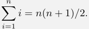
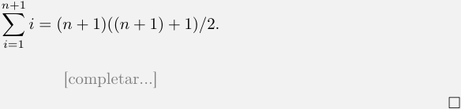
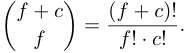

Técnicas de Diseño de Algoritmos / 

Compilado 11/08/2026 

Algoritmos y Estructuras de Datos III 

# **Práctica 1 – Demostraciones** 

Los objetivos de esta práctica son: 

Recordar cómo era una demostración. 

- Repasar conceptos de complejidad asintótica. 

- Pasar un enunciado de lenguaje natural a uno sobre fórmulas matemáticas, o a uno sobre conjuntos, o listas, u otros objetos matemáticos. 

- Recordar cómo programar una función recursiva y cómo hacer casos de test. 

- Mostrar los errores más comunes en las demostraciones. 

Los ejercicios marcados con el símbolo ⋆ constituyen un subconjunto mínimo de ejercitación. Sin embargo, aconsejamos fuertemente hacer todos los ejercicios. 

Los ejercicios marcados con el símbolo � tienen una ayuda al final de la guía. 

## **Ejercicio 1** 

Dados predicados _A_ , _B_ y _C_ , decidir cuáles de las siguientes fórmulas son verdaderas y cuáles son falsas. En caso de ser falsas, dar un contraejemplo. 

a) _A ∧ B ⇒ A_ . d) [( _A ⇒ B_ ) _∧_ ( _B ⇒ C_ )] _⇒_ ( _A ⇒ C_ ). 

b) _A ∨ B ⇒ A_ . 

e) ( _¬A ∧ B_ ) _⇔¬_ ( _A ∨¬B_ ). 

- c) ( _A ⇒ B_ ) _⇒_ ( _A ⇒ C_ ). 

## **Ejercicio 2** 

Se quiere demostrar la siguiente afirmación: 

“Si _n_ es un número entero impar, entonces _n_2 es impar.” 

A continuación se presentan distintos intentos de demostración. Indicar si son o no correctos. Justificar: 

- a) “Si _n_ = 3, entonces _n_2 = 9, que es impar. Por lo tanto, vale para todo _n_ .” 

- b) “Sea _n_ un número impar. Entonces _n_2 es impar porque los impares al cuadrado son impares.” 

- c) “Sea _n_ un número impar. Entonces _n_ = 2 _k_ +1 para algún entero _k_ . Luego _n_2 = (2 _k_ +1)2 = 4 _k_2 +4 _k_ +1 = 2(2 _k_2 + 2 _k_ ) + 1, que es impar.” 

## **Ejercicio 3** 

Queremos demostrar que el producto de un número par y un número impar es par. A continuación se presenta una demostración de esta afirmación. Encontrar el error en la demostración y reescribirla correctamente. 

Consideremos _m_ y _n_ dos enteros cualesquiera tales que _m_ es par y _n_ es impar. 

Como _m_ es par, existe un número entero _k_ tal que _m_ = 2 _k_ . Como _n_ es impar, existe un número entero _k_ tal que _n_ = 2 _k_ + 1. Multiplicando, obtenemos que _mn_ = 2 _k_ (2 _k_ + 1) = 4 _k_2 + 2 _k_ = 2(2 _k_2 + _k_ ). Es decir, existe un entero _s_ (específicamente 2 _k_2 + _k_ ) tal que _mn_ = 2 _s_ . Por lo tanto, _mn_ es un número entero par, que es lo que queríamos demostrar. 

Página 1 de 5 

Técnicas de Diseño de Algoritmos / Algoritmos y Estructuras de Datos III 

Compilado 11/08/2026 

## **Ejercicio 4** 

Encontrar un contraejemplo que muestre que la siguiente afirmación es falsa: “Para todo _n ∈_ N, _n_2 es menor o igual a 3 _n_ .” 

## **Ejercicio 5** 

Demostrar que para todo _n ∈_ N impar, existen enteros _r_ y _s_ tales que _r_ + _s_ = _n_ y _r − s_ = 1. 

## **Ejercicio 6** 

Demostrar que elevar un número al cubo mantiene su paridad. Asegurarse de usar las definiciones formales correspondientes. 

## **Ejercicio 7** 

Demostrar por contradicción que para toda distribución de 20 pelotas de tenis en 3 cajas, hay alguna caja que tiene una cantidad par de pelotas. 

## **Ejercicio 8** 

Completar la siguiente demostración: 

Queremos probar que para todo _n ≥_ 1 se cumple _P_ ( _n_ ) := [�_n_ _i_ =1_i_=_n_(_n_+ 1)_/_2].Lodemostramospor inducción en _n_ . **Caso base (** _P_ (1) **):** Vemos que�_n_ _i_ =1_i_= 1 = 1(1 + 1)_/_2_._ **Paso inductivo (** _∀n ∈_ N : _P_ ( _n_ ) _⇒ P_ ( _n_ + 1) **):** Sea _n ∈_ N un natural cualquiera. Queremos ver que _P_ ( _n_ ) implica _P_ ( _n_ + 1). Para probar la implicación, asumimos _P_ ( _n_ ), es decir, asumimos que 

Queremos ver que se cumple _P_ ( _n_ + 1), es decir, que 

## **Ejercicio 9** ⋆ 

¿Cuál es el error en la siguiente demostración? 

Se quiere probar que para todo _a̸_ = 0 vale que _a__n_ = 1. **Caso base (** _n_ = 0 **):** _a__n_ = 1 para todo _a_ . **Paso inductivo:** Supongamos que _a__n−_1 = 1. Entonces _a__n_ = ( _a__n−_1 _· a__n−_1 ) _/a__n−_2 = (1 _·_ 1) _/_ 1 = 1. □ 

## **Ejercicio 10** ⋆ 

¿Cuál es el error en la siguiente demostración? 

Página 2 de 5 

Técnicas de Diseño de Algoritmos / Algoritmos y Estructuras de Datos III 

Compilado 11/08/2026 

Se quiere probar que para todo conjunto _X_ := _{x_ 1 _, x_ 2 _, . . . , xn}_ , los elementos son todos iguales entre sí. **Caso base (** _n_ = 1 **):** El conjunto tiene un solo elemento _x_ 1 que es igual a sí mismo. 

**Paso inductivo:** Supongamos que _x_ 1 = _x_ 2 = _x_ 3 = _. . ._ = _xn−_ 1. Como también vale la hipótesis inductiva para un conjunto de dos elementos, tenemos que _xn−_ 1 = _xn_ y, por tanto, que _x_ 1 = _x_ 2 = _x_ 3 = _. . ._ = _xn−_ 1 = _xn_ . □ 

## **Ejercicio 11** ⋆ 

¿Cuál es el error en la siguiente demostración? ¿Hay más de uno? Reescribirla para que sea correcta. 

Queremos ver que si un conjunto compuesto por números enteros no negativos tiene por lo menos un número positivo, entonces la suma de todos los elementos del conjunto es positiva. Hacemos inducción en el tamaño _n_ del conjunto. 

- **Caso base (** _n_ = 1 **):** Si el conjunto tiene un solo número _a_ y este es positivo, la suma de todos los elementos es _a_ , lo cual es positivo. 

**Paso inductivo:** Saquemos un elemento cualquiera _k_ del conjunto, quedándonos con un subconjunto _C_ de _n −_ 1 elementos. Por hipótesis inductiva, la suma de los elementos de _C_ es positiva, y por lo tanto agregarle _k_ de nuevo, que es un número no negativo, no puede hacer que la suma sea no positiva. □ 

## **Ejercicio 12** 

Probar por inducción que 1 + 3 + 5 + _. . ._ + (2 _n_ + 1) = ( _n_ + 1)2 para todo _n ≥_ 0. 

## **Ejercicio 13** 

Encontrar una fórmula para la siguiente suma y demostrarla por inducción: 1 + 2 + 22 + 23 + _. . ._ + 2_n_ . 

## **Ejercicio 14** 

La población de una colonia de hormigas se duplica todos los años. Si se establece una colonia inicial de 10 hormigas, ¿cuántas hormigas habrá después de _n_ años? Pasar el enunciado a un enunciado en fórmulas matemáticas y demostrarlo por inducción. 

## **Ejercicio 15** 

Probar por inducción que para _n ≥_ 5 se verifica que 2_n_ _> n_2 . ¿Qué pasa para _n <_ 5? 

## **Ejercicio 16** _(Triángulo de Pascal)_ ⋆ 

Pascalito tiene una matriz infinita de naturales que está vacía y que va a rellenar de la siguiente manera. Primero, pone un 1 en todas las posiciones de la fila 0 (la de arriba de todo) y de la columna 0 (la de más a la izquierda). Luego, para el resto de las posiciones, pone la suma del número que tiene arriba y el número que tiene a la izquierda. Si _f_ es la fila y _c_ es la columna, él dice que, después de este procedimiento, en la celda ( _f, c_ ) va a tener escrito el número 

Demostrar por inducción en la tupla ( _f, c_ ) que Pascalito no se equivoca. Definir claramente cuándo un par ( _f, c_ ) es menor que otro ( _f__′_ _, c__′_ ) para hacer la inducción. 

Página 3 de 5 

Técnicas de Diseño de Algoritmos / Algoritmos y Estructuras de Datos III 

Compilado 11/08/2026 

## **Ejercicio 17** ⋆ 

Programar de manera recursiva (en su lenguaje favorito) la función que devuelve el valor de la celda ( _f, c_ ) del punto anterior correspondiente al proceso que realizó Pascalito. Escribir casos de test para la función, utilizando la fórmula cerrada demostrada en el punto anterior. 

## **Ejercicio 18** _(Cambio de fase)_ ⋆ 

Sea _C_ un conjunto, y _A_ y _B_ dos subconjuntos de _C_ tal que _A ∪ B_ = _C_ . Supongamos que _S_ := ( _s_ 1 _, . . . , sn_ ) es una secuencia de _n ≥_ 2 elementos de _C_ donde _s_ 1 _∈ A_ y _sn ∈ B_ . Queremos ver que existe un índice _i ∈{_ 1 _, . . . , n −_ 1 _}_ tal que _si ∈ A_ y _si_ +1 _∈ B_ . 

- a) Demostrar lo pedido por inducción en _n_ . 

## � 

- b) Demostrarlo de forma directa considerando el primer elemento _sj_ de _S_ que pertenezca a _B_ , con _j >_ 1. Recordar demostrar que este elemento efectivamente existe, es decir, que el conjunto _{sj | sj ∈ B ∧ j >_ 1 _}_ no es vacío. 

## **Ejercicio 19** _(Principio del palomar)_ ⋆ 

Demostrar que si tengo _n >_ 0 cajas y _m_ objetos repartidos entre las _n_ cajas, entonces existe una caja con por lo menos _⌊__<u>m</u>_ _n__−_<u>1</u>_⌋_+ 1objetos. 

## **Ejercicio 20** _(Complejidad asintótica)_ 

Recordemos las definiciones de los conjuntos de funciones _O_ ( _f_ ( _n_ )), Ω( _f_ ( _n_ )) y Θ( _f_ ( _n_ )). 

- a) Una función _g_ ( _n_ ) pertenece a _O_ ( _f_ ( _n_ )) si existen constantes positivas _c_ y _n_ 0 tales que para todo _n ≥ n_ 0, se cumple que _g_ ( _n_ ) _≤ c · f_ ( _n_ ). Decidir si _g_ ( _n_ ) _∈ O_ ( _f_ ( _n_ )) y si _f_ ( _n_ ) _∈ O_ ( _g_ ( _n_ )) para las siguientes definiciones de _f_ y _g_ . Dar unas constantes _c_ y _n_ 0 (no necesariamente ajustadas) que sirvan para cada caso. 

i) _g_ ( _n_ ) := _f_ ( _n_ ) := _n_ . 

ii) _g_ ( _n_ ) := 5 _n_ + 2 _, f_ ( _n_ ) :=<u>1</u> 2_n −_20. 

iii) _g_ ( _n_ ) := 2 _n_2 _−_ 50 _n −_ 4 _, f_ ( _n_ ) := _n_ . 

iv) _g_ ( _n_ ) := 2_n_ _, f_ ( _n_ ) := _n_ !. 

- b) Una función _g_ ( _n_ ) pertenece a Ω( _f_ ( _n_ )) si existen constantes positivas _c_ y _n_ 0 tales que para todo _n ≥ n_ 0, se cumple que _g_ ( _n_ ) _≥ c · f_ ( _n_ ). Decidir si _g_ ( _n_ ) _∈_ Ω( _f_ ( _n_ )) y si _f_ ( _n_ ) _∈_ Ω( _g_ ( _n_ )) para las funciones del inciso a). 

- c) Una función _g_ ( _n_ ) pertenece a Θ( _f_ ( _n_ )) si _g_ ( _n_ ) _∈ O_ ( _f_ ( _n_ )) y _g_ ( _n_ ) _∈_ Ω( _f_ ( _n_ )). Decidir si _g_ ( _n_ ) _∈_ Θ( _f_ ( _n_ )) y si _f_ ( _n_ ) _∈_ Θ( _g_ ( _n_ )) para las funciones del inciso a). 

Página 4 de 5 

Técnicas de Diseño de Algoritmos / Algoritmos y Estructuras de Datos III 

Compilado 11/08/2026 

# **Ayudas** 

Página 5 de 5 

