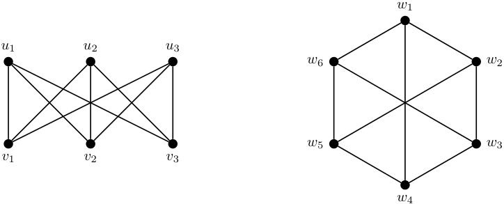
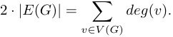
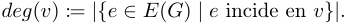
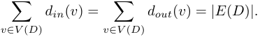
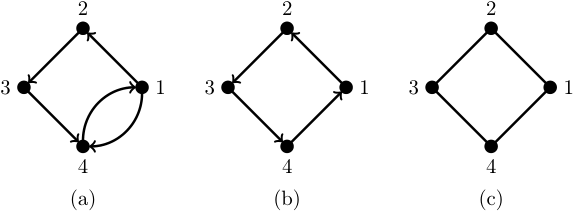
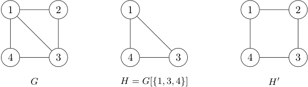
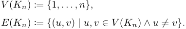

Técnicas de Diseño de Algoritmos / Algoritmos y Estructuras de Datos III 

Compilado 19/08/2026 

# **Práctica 2 – Introducción a grafos** 

El objetivo de esta práctica es introducir a definiciones y demostraciones sobre grafos y digrafos. 

Los ejercicios marcados con el símbolo ⋆ constituyen un subconjunto mínimo de ejercitación. Sin embargo, aconsejamos fuertemente hacer todos los ejercicios. 

Los ejercicios marcados con el símbolo � tienen una ayuda al final de la guía. 

Un _grafo G_ es un objeto con un conjunto de vértices _V_ ( _G_ ) y un conjunto de aristas _E_ ( _G_ ), donde cada arista es un par no ordenado de vértices. 

## **Ejercicio 1** _(Isomorfismo)_ ⋆ 

Dos grafos _G_ y _H_ son _isomorfos_ si existe una biyección _f_ : _V_ ( _G_ ) _→ V_ ( _H_ ), llamada _isomorfismo_ , tal que para todo _u, v ∈ V_ ( _G_ ) tenemos que ( _u, v_ ) _∈ E_ ( _G_ ) si y sólo si ( _f_ ( _u_ ) _, f_ ( _v_ )) _∈ E_ ( _H_ ). En otras palabras, _G_ e _H_ son isomorfos si se pueden renombrar los vértices de _G_ para obtener _H_ . 

Decidir si los siguientes grafos son isomorfos entre sí. Si lo son, dar un isomorfismo entre ellos. 

<!-- Start of picture text -->
w 1 u 1 u 2 u 3 w 6 w 2 w 5 w 3 v 1 v 2 v 3 w 4 <!-- End of picture text -->

## **Ejercicio 2** _(Estamos todos conectados)_ ⋆ 

Recordemos que un grafo _G_ es _conexo_ si para todo par de vértices _u, v ∈ V_ ( _G_ ) existe un camino entre _u_ y _v_ formado por aristas de _G_ . 

Federico dice que todos los grafos de _n ≥_ 2 vértices cuyos grados sean todos por lo menos 1 son conexos. Da la siguiente demostración por inducción en la cantidad de vértices _n_ del grafo. 

**Caso base (** _n_ = 2 **):** El único grafo de dos vértices cuyos grados son todos por lo menos 1 es el _K_ 2 (el grafo de dos vértices con una arista entre ellos), que es claramente conexo. 

**Paso inductivo (** _n ≥_ 3 **):** Veamos que agregar un vértice a un grafo _G_ de _n −_ 1 vértices no desconecta el grafo. Al agregar el vértice _v_ , necesariamente tenemos que agregar también por lo menos una arista que haga que _v_ tenga grado por lo menos 1. Por lo tanto _v_ está conectado al resto del grafo, y entonces el nuevo grafo de _n_ vértices es conexo. □ 

Daiana dice que tiene un grafo que es un contraejemplo de lo que dice Fede. 

> a) Mostrar un contraejemplo que podría tener Dai. 

> b) ¿Qué error tuvo Fede? 

Página 1 de 6 

Técnicas de Diseño de Algoritmos / Algoritmos y Estructuras de Datos III 

Compilado 19/08/2026 

- c) Considerar esta versión más rigurosa de la demostración de Fede: 

Vamos a demostrar por inducción en la cantidad de vértices _n_ el siguiente predicado: 

_P_ ( _n_ ) := “Todo grafo de _n ≥_ 2 vértices cuyos grados sean todos por lo menos 1 es conexo” _._ 

**Caso base (** _P_ (2) **):** El único grafo de dos vértices cuyos grados son todos por lo menos 1 es el _K_ 2 (el grafo de dos vértices _u_ y _v_ con una arista entre ellos). Como _u, v_ es un camino entre los únicos dos vértices del grafo, _K_ 2 es conexo. Por lo tanto, _P_ (2) es verdadero. 

**Paso inductivo (** _∀n ∈_ N _≥_ 2 : ( _P_ ( _n_ ) _⇒ P_ ( _n_ + 1)) **):** Sea _n ∈_ N _≥_ 2. Asumimos que vale _P_ ( _n_ ) y queremos ver que vale _P_ ( _n_ + 1). 

Sea _G_ un grafo de _n_ vértices cuyos grados son todos por lo menos 1. Por hipótesis inductiva, _G_ es conexo. Agreguemos un vértice _v_ a _G_ y una arista que conecte _v_ con un vértice de _G_ . El nuevo grafo _G__′_ tiene _n_ + 1 vértices y los grados de todos sus vértices son por lo menos 1. Como _v_ está conectado a un vértice de _G_ , y _G_ es conexo, existe un camino entre _v_ y cualquier otro vértice de _G_ . Por lo tanto, para todo par de vértices de _G__′_ , existe un camino entre ellos, y por lo tanto _G__′_ es conexo. Luego, _P_ ( _n_ + 1) es verdadero. □ 

   - ¿Se arregló el error de Fede, o sigue siendo falsa su demostración? ¿Por qué? 

- d) Fede está segurísimo de que lo que dice es correcto, y para mostrárselo a Dai, reemplaza el paso inductivo de la demostración rigurosa por el siguiente, empezando con un grafo de _n_ +1 vértices y sacando un vértice en vez de agregando uno: 

      - [...] **Paso inductivo (** _∀n ∈_ N _≥_ 2 : ( _P_ ( _n_ ) _⇒ P_ ( _n_ + 1)) **):** Sea _G_ un grafo de _n_ + 1 vértices cuyos grados son todos por lo menos 1. Saquemos un vértice arbitrario _v_ de _G_ . El grafo _G − v_ tiene _n_ vértices y los grados de todos sus vértices son por lo menos 1, así que podemos aplicar la hipótesis inductiva a _G − v_ . Por lo tanto, _G − v_ es conexo. Como _v_ tenía grado por lo menos 1, tiene por lo menos un vecino _w_ en _G − v_ . Como _G − v_ es conexo, existe un camino entre _w_ y cualquier otro vértice de _G − v_ . Adjuntamos _v_ a cada camino para crear caminos de _v_ a todos los otros vértices en _G_ . Como todos los pares de vértices tienen caminos entre sí, _G_ es conexo. □ 

   - ¿Ahora cuál fue su error? ¿Es el mismo de antes? ¿En qué frase exactamente dijo algo falso? 

## **Ejercicio 3** _(Árboles)_ ⋆ 

Un _árbol_ es un grafo conexo sin ciclos. Dado un grafo _G_ de _n ≥_ 2 nodos sin nodos de grado 0, ¿cuáles de los siguientes ítems garantizan que _G_ es un árbol? Para los ítems que no garanticen que _G_ sea un árbol, dar un contraejemplo. 

- a) _G_ tiene _n −_ 1 aristas. 

- b) _G_ tiene exactamente 2 nodos de grado 1. 

- c) _G_ tiene exactamente 2 nodos de grado 1 y _n −_ 1 aristas. 

- d) _G_ tiene exactamente 2 nodos de grado 1 y no tiene ciclos. 

- e) _G_ tiene exactamente 2 nodos de grado 1 y es conexo. 

- f) _G_ tiene exactamente 2 nodos de grado 1 y todos los demás nodos tienen grado 2. 

## **Ejercicio 4** _(Suma de grados)_ ⋆ 

Página 2 de 6 

Técnicas de Diseño de Algoritmos / Algoritmos y Estructuras de Datos III 

Compilado 19/08/2026 

Demostrar por inducción en la cantidad de aristas _|E_ ( _G_ ) _|_ que para todo grafo _G_ se cumple que 

Recordar que para un vértice _v_ de un grafo _G_ , 

## **Ejercicio 5** _(Equilibrio digrafo)_ ⋆ 

Demostrar, usando inducción en la cantidad de aristas, que todo digrafo _D_ satisface 

## **Ejercicio 6** _(Doble grado)_ ⋆ 

Demostrar, usando la técnica de reducción al absurdo, que todo grafo no trivial tiene al menos dos vértices del mismo grado. � 

## **Ejercicio 7** _(Muchas aristas implica conexo)_ ⋆ 

Demostrar, usando inducción en la cantidad de vértices, que todo grafo de _n_ vértices que tiene más de ( _n −_ 1)( _n −_ 2) _/_ 2 aristas es conexo. Opcionalmente, puede demostrar la misma propiedad usando otras técnicas de demostración. 

## **Ejercicio 8** _(Unicidad digrafo)_ ⋆ 

Un _grafo orientado_ es un digrafo _D_ tal que al menos uno de _v → w_ y _w → v_ no es una arista de _D_ , para todo _v, w ∈ V_ ( _D_ ) (ver Figura 2). En otras palabras, un grafo orientado se obtiene a partir de un grafo no dirigido dando una dirección a cada arista. Demostrar que para cada _n_ existe un único grafo orientado cuyos vértices tienen todos grados de salida distintos. � 

<!-- Start of picture text -->
2 2 2 3 1 3 1 3 1 4 4 4 (a) (b) (c) <!-- End of picture text -->

Figura 2: (a) Un digrafo que no es grafo orientado porque tanto 1 _→_ 4 como 4 _→_ 1 son aristas; (b) un grafo orientado que se puede obtener dando orientaciones a las aristas del grafo (c). 

## **Ejercicio 9** _(Dos caminos implican ciclo)_ ⋆ 

Sean _P_ y _Q_ dos caminos distintos (no necesariamente disjuntos en vértices) de un grafo _G_ que unen un vértice _v_ con otro _w_ . Demostrar en forma directa que _G_ tiene un ciclo donde cada arista pertenece a _P_ o a _Q_ . � 

## **Ejercicio 10** _(Subgrafos)_ ⋆ 

Página 3 de 6 

Técnicas de Diseño de Algoritmos / Algoritmos y Estructuras de Datos III 

Compilado 19/08/2026 

Un grafo _H_ es un _subgrafo_ de un grafo _G_ si resulta de eliminar algunos (puede ser cero) vértices y aristas arbitrarios de _G_ , y posiblemente renombrar vértices. Un _subgrafo inducido_ de un grafo _G_ es un subgrafo de _G_ que resulta de solamente eliminar vértices de _G_ , eliminando solo las aristas adyacentes a vértices eliminados. El _subgrafo de G inducido por los vértices W ⊆ V_ ( _G_ ) es el subgrafo inducido _G_ [ _W_ ] de _G_ resultado de eliminar todos los vértices de _V_ ( _G_ ) _\ W_ , es decir, resultado de quedarse solo con los vértices de _W_ , y todas las aristas entre vértices de _W_ . La Figura 3 tiene unos ejemplos. 

<!-- Start of picture text -->
1 2 1 1 2 4 3 4 3 4 3 G H =  G [ { 1 ,  3 ,  4 } ] H ′ <!-- End of picture text -->

Figura 3: Un grafo _G_ y dos subgrafos _H_ y _H__′_ . El subgrafo _H_ es inducido, mientras que el subgrafo _H__′_ no lo es, porque le falta la arista (1 _,_ 3). 

Considerar el grafo completo _Kn_ de _n_ vértices que tiene todas las posibles aristas entre cada par de vértices. Es decir, 

- a) Notar que todos los grafos de hasta _n_ vértices son subgrafos de _Kn_ . 

- b) Demostrar que **no todos** los grafos de hasta _n_ vértices son subgrafos inducidos de _Kn_ . c) Determinar cuáles son los grafos que sí son subgrafos inducidos de _Kn_ . 

## **Ejercicio 11** _(Particiones conexas)_ ⋆ 

Sea _C_ un conjunto. Una familia de _k_ conjuntos _{S_ 1 _, . . . , Sk}_ es una _partición_ de _C_ si resulta de repartir todos los elementos de _C_ en _k_ cajas, sin dejar ninguna vacía. Más formalmente, _{S_ 1 _, . . . , Sk}_ es una partición de _C_ si se cumplen todas las siguientes condiciones: 

1. _Si̸_ = ∅ para todo _i ∈{_ 1 _, . . . , k}_ ; 

2. _Si ⊆ C_ para todo _i ∈{_ 1 _, . . . , k}_ ; 3.�_k_ _i_ =1_Si_=_C_;y 

4. _Si ∩ Sj_ = ∅ para todos _i̸_ = _j ∈{_ 1 _, . . . , k}_ . 

- a) Mostrar un grafo conexo _G_ y una partición de sus vértices _V_ ( _G_ ) en dos conjuntos _A_ y _B_ tal que ni _G_ [ _A_ ] ni _G_ [ _B_ ] son conexos. ¿Para todo grafo existe esta partición? 

- b) Demostrar que un grafo es conexo si y sólo si para toda partición en dos conjuntos _A_ y _B_ de _V_ ( _G_ ) existe una arista en _E_ ( _G_ ) con un extremo en _A_ y otro en _B_ . Usar la definición de grafo conexo y de camino, no sólo la intuición. � 

## **Ejercicio 12** _(Muchas aristas implica biconexo)_ 

Un vértice _v_ de un grafo _G_ es un _punto de articulación_ si _G − v_ tiene más componentes conexas que _G_ . Por otro lado, un grafo es _biconexo_ si es conexo y no tiene puntos de articulación. 

Página 4 de 6 

Técnicas de Diseño de Algoritmos / Algoritmos y Estructuras de Datos III 

Compilado 19/08/2026 

- a) Demostrar por medio de una reducción al absurdo que todo grafo de _n_ vértices que tenga al menos 2 + ( _n −_ 1)( _n −_ 2) _/_ 2 aristas es biconexo. � 

- b) Considerando la cota del ejercicio Ejercicio 7 y la cota del item anterior ¿Se pueden dar cotas mejores que funcionen a partir de algún _n_ 0? Es decir, ¿existe una función _c_ : N _→_ R con _c_ ( _n_ ) _<_ 1 + ( _n −_ 1)( _n −_ 2) _/_ 2 (resp. _c_ ( _n_ ) _<_ 2 + ( _n −_ 1)( _n −_ 2) _/_ 2) tal que todo grafo de _n ≥ n_ 0 vértices que tenga al menos _c_ ( _n_ ) aristas es conexo (resp. biconexo)? 

## **Ejercicio 13** _(Conexo tiene dos vértices que no son articulación)_ 

Demostrar por inducción que todo _G_ = ( _V, E_ ) conexo con _|V | ≥_ 2 tiene al menos dos vértices distintos _v_ 1, _v_ 2 tal que _G \ {v_ 1 _}_ y _G \ {v_ 2 _}_ son conexos. 

## **Ejercicio 14** _(Caminos cruzados)_ 

Sea _G_ un grafo conexo. Demostrar por el contrarrecíproco que todo par de caminos de longitud máxima de _G_ tienen un vértice en común. � 

## **Ejercicio 15** _(Unión vs junta)_ 

Algunas definiciones: 

- El _complemento G_ de un grafo _G_ es el grafo resultado de sacar todas las aristas que están en _E_ ( _G_ ), y meter todas las que **no** están en _E_ ( _G_ ). 

- La _unión disjunta G∪H_ de dos grafos _G_ y _H_ con _V_ ( _G_ ) _∩V_ ( _H_ ) = ∅ es el grafo con _V_ ( _G∪H_ ) = _V_ ( _G_ ) _∪V_ ( _H_ ) y _E_ ( _G ∪ H_ ) = _E_ ( _G_ ) _∪ E_ ( _H_ ). Es decir, _G ∪ H_ se obtiene de dos grafos disjuntos uniendo _G_ con _H_ sin agregar aristas. 

- La _junta G_ + _H_ de _G_ y _H_ es el grafo que se obtiene de _G ∪ H_ agregando todas las aristas ( _v, w_ ) posibles entre los vértices _v ∈ V_ ( _G_ ) y vértices _w ∈ V_ ( _H_ ). 

Decimos que _G_ es un _grafo unión_ (resp. _junta_ ) si existen _G_ 1 y _G_ 2 con _V_ ( _G_ 1) _∩V_ ( _G_ 2) = ∅ tales que _G_ = _G_ 1 _∪G_ 2 (resp. _G_ = _G_ 1 + _G_ 2). 

- a) Demostrar en forma directa que _G_ es un grafo unión si y sólo si _G_ es disconexo. 

- b) Demostrar en forma directa que _G_ es un grafo junta si y sólo si _G_ es un grafo unión. 

- c) Concluir que _G_ es un grafo junta si y sólo si _G_ es disconexo. 

## **Ejercicio 16** _(Unicidad de grados)_ 

Sean _G_ 2 = _K_ 2 y _Gn_ +1 = _Gn ∪ K_ 1 para todo _n ≥_ 2. Demostrar por inducción que _Gn_ tiene un único par de vértices de igual grado. 

## **Ejercicio 17** _(Triángulo inductivo)_ 

Demostrar por inducción que todo grafo de 2 _n_ vértices con más de _n_2 aristas tiene algún triángulo como subgrafo inducido. ¿Se puede dar una cota mejor que funcione a partir de algún _n_ 0? Es decir, ¿existe _c_ ( _n_ ) _< n_2 tal que todo grafo de 2 _n ≥ n_ 0 vértices con más de _c_ ( _n_ ) aristas tiene algún triángulo? 

## **Ejercicio 18** _(Bipartito o ciclo)_ 

Sea _G_ un grafo de _n_ vértices. Demostrar que _G − v_ es bipartito para todo _v ∈ V_ ( _G_ ) si y solo si _G_ es bipartito o un ciclo impar. Demostrar la ida por el contrarrecíproco y la vuelta en forma directa. 

Página 5 de 6 

Técnicas de Diseño de Algoritmos / Algoritmos y Estructuras de Datos III 

Compilado 19/08/2026 

# **Ayudas** 

Página 6 de 6 

