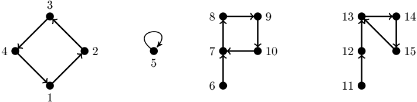
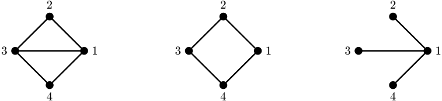
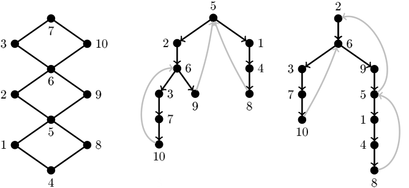
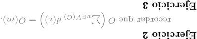

Técnicas de Diseño de Algoritmos / Algoritmos y Estructuras de Datos III 

Compilado 26/08/2026 

# Práctica 3 Algoritmos sobre grafos 

Los objetivos de esta práctica son: 

practicar resolver problemas sobre grafos con algoritmos, y 

familiarizarse con algoritmos de búsqueda comunes sobre grafos (BFS y DFS). 

Los ejercicios marcados con el símbolo ⋆ constituyen un subconjunto mínimo de ejercitación. Sin embargo, aconsejamos fuertemente hacer todos los ejercicios. 

Los ejercicios marcados con el símbolo � tienen una ayuda al nal de la guía. 

### Ejercicio 1 (Representación de grafos) ⋆ 

Para un grafo _G_ , el conjunto de vecindarios (o conjunto de adyacencias) es un par ( _V, N_ ) donde _N_ es una función que asigna a cada vértice _v ∈ V_ ( _G_ ) su correspondiente conjunto de vértices adyacentes _N_ ( _v_ ) , es decir, su vecindario. 

En todos los grafos _G_ que tengamos como entrada los vértices van a ser el conjunto _{_ 0 _, . . . , |V_ ( _G_ ) _| −_ 1 _}_ . 

Discutir (brevemente) las ventajas y desventajas en cuanto a la complejidad temporal y espacial de las siguientes implementaciones de un conjunto de vecindarios para un grafo _G_ , de acuerdo a las siguientes operaciones: 

### Operaciones 

1. Inicializar la estructura a partir de una secuencia de vértices y una secuencia de aristas de _G_ . 

2. Determinar si dos vértices _v_ y _w_ son adyacentes. 

3. Recorrer y/o procesar el vecindario _N_ ( _v_ ) de un vértice _v_ dado. 

4. Insertar un vértice _v_ con su conjunto de vecinos _N_ ( _v_ ) . 

5. Insertar una arista ( _v, w_ ) . 

6. Remover un vértice _v_ con todas sus adyacencias. 

7. Remover una arista ( _v, w_ ) . 

8. Mantener un orden de _N_ ( _v_ ) de acuerdo a algún invariante que permita recorrer cada vecindario en un orden dado. 

### Estructuras de datos 

1. La función _N_ se representa con una secuencia (arreglo dinámico o lista enlazada) que en cada posición _v_ tiene el conjunto _N_ ( _v_ ) implementado a su vez sobre una secuencia (arreglo dinámico o lista enlazada). Cada vértice es una estructura que tiene un índice para acceder en _O_ (1) a _N_ ( _v_ ) . Esta representación se conoce comúnmente como lista de adyacencias. 

2. Ídem anterior, pero cada _w ∈ N_ ( _v_ ) se almacena junto con un índice a la posición que ocupa _v_ en _N_ ( _w_ ) . Esta representación también se conoce como lista de adyacencias, pero tiene información para implementar operaciones dinámicas. 

3. _N_ ( _v_ ) se representa con un arreglo dinámico que en cada posición _i_ tiene un arreglo dinámico de booleanos _Ai_ con _|V_ ( _G_ ) _|_ posiciones tal que _Ai_ [ _j_ ] es verdadero si y solo si _i_ es adyacente a _j_ . Esta representación se conoce comúnmente como matriz de adyacencias. 

Página 1 de 8 

Técnicas de Diseño de Algoritmos / Algoritmos y Estructuras de Datos III 

Compilado 26/08/2026 

4. _N_ ( _v_ ) se representa con un arreglo dinámico que en cada posición tiene el conjunto _N_ ( _v_ ) implementado con una tabla de hash. Esta representación es un mix entre las representaciones clásicas de matriz de adyacencias y lista de adyacencias. 

### Ejercicio 2 (Triángulos) ⋆ 

Un triángulo de un grafo _G_ es una tripla _{v, w, z}_ que induce un subgrafo completo (de tamaño 3 ; ver Figura 2). Considerar los siguientes algoritmos para decidir si un grafo _G_ de _n_ vértices y _m > n_ aristas tiene un triángulo. 

### Algoritmo cúbico 

Computar la matriz de adyacencias _A_ de _G_ . 

Retornar verdadero si existen _v, w, z ∈ V_ ( _G_ ) tales que _AvwAwzAvz_ = 1 . 

### Algoritmo cuadrático 

Computar las listas de adyacencias _N_ de _G_ . 

Para cada _v ∈ V_ ( _G_ ) : 

Marcar cada _w ∈ N_ ( _v_ ) . 

Retornar verdadero si existe _wz ∈ E_ ( _G_ ) tal que _w_ y _z_ están marcados. Desmarcar cada _w ∈ N_ ( _v_ ) . 

- a) Argumentar por qué cada algoritmo es correcto. 

- b) Demostrar que el algoritmo cúbico requiere tiempo Θ( _n_3 ) y el algoritmo cuadrático requiere tiempo Θ( _nm_ ) = _O_ ( _m_2 ) . � 

- c) Determinar un mejor y un peor caso para cada uno de los algoritmos. 

- d) Implementar los dos algoritmos en su lenguaje de programación favorito, y probarlos con muchos grafos de diferentes tamaños y densidades. Consideren hacer que los grafos se generen automáticamente, para poder comparar elmente los algoritmos. Comparar los tiempos de ejecución con las complejidades teóricas. 

### Ejercicio 3 (Orden topológico) ⋆ 

Dado un grafo dirigido _D_ , un orden topológico de _D_ es un orden parcial _<_ de los vértices _V_ ( _D_ ) tal que si _v → w ∈ E_ ( _D_ ) entonces _v < w_ . 

- a) Demostrar que si un digrafo no tiene ciclos, entonces tiene por lo menos un vértice con grado de entrada igual a 0. 

- b) Usando el Item a), describir un algoritmo para construir un orden topológico en un digrafo sin ciclos. Demostrar su correctitud y determinar su complejidad temporal y espacial. No vale usar DFS. 

- c) Demostrar que un digrafo admite un orden topológico si y solo si no tiene ciclos, es decir, es un DAG (digrafo acíclico). Demostrar la ida por contrarrecíproco. 

- d) Si no lo hicieron todavía, mejorar el algoritmo del Item b) para que corra en tiempo _O_ ( _|V_ ( _D_ ) _|_ + _|E_ ( _D_ ) _|_ ) . � 

### Ejercicio 4 (Ciclos rho) ⋆ 

Decimos que un digrafo (con loops) tiene forma de _ρ_ cuando todos sus vértices tienen grado de salida igual a 1 (Figura 1). 

- a) Demostrar en forma constructiva que si un digrafo es conexo y tiene forma de _ρ_ entonces tiene un único ciclo dirigido. Notar que si _v → v_ es un loop, entonces _v, v_ es un ciclo. Recordar que un digrafo es conexo cuando su grafo subyacente es conexo. � 

Página 2 de 8 

Técnicas de Diseño de Algoritmos / Algoritmos y Estructuras de Datos III 

Compilado 26/08/2026 

- b) Diseñar un algoritmo para encontrar todos los ciclos de un digrafo con forma de _ρ_ (no necesariamente conexo). 

<!-- Start of picture text -->
3 8 9 13 14 4 2 7 10 12 15 5 6 11 1 <!-- End of picture text -->

Figura 1: Un digrafo disconexo con forma de _ρ_ ; cada componente conexa tiene forma de _ρ_ . 

### Ejercicio 5 (Gemelos y mellizos) 

Recordar que el vecindario de un vértice _v_ es el conjunto _N_ ( _v_ ) que contiene a todos los vértices adyacentes a _v_ . El vecindario cerrado es _N_ [ _v_ ] = _N_ ( _v_ ) _∪{v}_ . Dos vértices _u_ y _v_ son mellizos cuando _N_ ( _u_ ) = _N_ ( _v_ ) , mientras que son gemelos cuando _N_ [ _u_ ] = _N_ [ _v_ ] (Figura 2). 

<!-- Start of picture text -->
2 2 2 3 1 3 1 3 1 4 4 4 <!-- End of picture text -->

Figura 2: El grafo diamante (izquierda), el grafo _C_ 4 (centro) y el grafo garra (derecha). Los vértices 1 y 3 son gemelos en el diamante porque _N_ [1] = _N_ [3] = _{_ 1 _,_ 2 _,_ 3 _,_ 4 _}_ mientras que 2 y 4 son mellizos porque _N_ (2) = _N_ (4) = _{_ 1 _,_ 3 _}_ . En la garra, _N_ (2) = _N_ (3) = _N_ (4) = _{_ 1 _}_ y, por lo tanto, 2 , 3 y 4 son mellizos, mientras que en _C_ 4 la partición en mellizos es _{_ 2 _,_ 4 _}_ y _{_ 1 _,_ 3 _}_ . El diamante tiene 2 triángulos _{_ 1 _,_ 2 _,_ 3 _}_ y _{_ 1 _,_ 3 _,_ 4 _}_ mientras que _C_ 4 y la garra no tienen triángulos. Notar que el diamante es threshold porque _N_ (2) = _N_ (4) y _N_ [2] _⊆ N_ [1] = _N_ [3] ; ciertamente (2 _,_ 4 _,_ 1 _,_ 3) es una descomposición threshold del diamante. En cambio, _C_ 4 no es threshold porque tanto _N_ (1) y _N_ (2) como _N_ [1] y _N_ [2] son incomparables por inclusión. Finalmente, la garra es threshold (por qué?). 

- a) Observar que las relaciones de mellizos y gemelos son relaciones de equivalencia (i.e., son reexivas, transitivas y simétricas)1 . 

- b) Probar que el Algoritmo 1 encuentra la partición de _V_ ( _G_ ) en vértices gemelos. 

### � 

- c) Describir la implementación del algoritmo, especicando las estructuras de datos utilizadas. La mejor implementación que conocemos tiene complejidad temporal _O_ ( _n_ + _m_ ) . 

- d) ¾Qué debería modicarse para que el algoritmo encuentre la partición en vértices mellizos? 

- 1Por si no recuerdan las deniciones de estas propiedades: https://es.wikipedia.org/wiki/Relaci%C3%B3n_de_equivalencia. 

Página 3 de 8 

Técnicas de Diseño de Algoritmos / Algoritmos y Estructuras de Datos III 

Compilado 26/08/2026 

### Algoritmo 1 Partición en vértices <u>gemelos</u> 

_P ←{V_ ( _G_ ) _}_ 

Sea _v_ 1 _, . . . , vn_ un ordenamiento cualquiera de _V_ ( _G_ ) for _i ←_ 1 to _n_ do _P__′_ _←∅_ for _W ∈P_ do if _W ∩ N_ [ _vi_ ] _̸_ = _∅_ then _P__′_ _←P__′_ _∪{W ∩ N_ [ _vi_ ] _}_ if _W \ N_ [ _vi_ ] _̸_ = _∅_ then _P__′_ _←P__′_ _∪{W \ N_ [ _vi_ ] _} P ←P__′_ return _P_ 

### Ejercicio 6 (Grafos threshold Caracterización) 

Un grafo _G_ es threshold si para cada par de vértices _u, v ∈ V_ ( _G_ ) tales que _d_ ( _u_ ) _≤ d_ ( _v_ ) ocurre que _N_ ( _u_ ) _⊆ N_ ( _v_ ) o _N_ [ _u_ ] _⊆ N_ [ _v_ ] (ver Figura 2). 

- a) Demostrar que si _G_ es un grafo threshold, entonces los vértices de grado _k_ son todos mellizos entre sí, o todos gemelos entre sí, para todo 0 _≤ k ≤ n −_ 1 . 

- b) Demostrar que si _G_ es un grafo threshold, entonces tiene algún vértice de grado 0 o alguno de grado _n −_ 1 . 

- c) Demostrar que si _G_ es un grafo threshold, entonces _G \ {v}_ es un grafo threshold para todo _v ∈ V_ ( _G_ ) . 

- d) Decimos que un grafo _H_ tiene una descomposición threshold si _V_ ( _H_ ) admite un ordenamiento _v_ 1 _, . . . , vn_ tal que _vi_ es un vértice de grado 0 o de grado _i −_ 1 en el subgrafo de _H_ inducido por _{v_ 1 _, . . . , vi}_ . Usando los Items b) y c), demostrar que _G_ es un grafo threshold si y sólo si admite una descomposición threshold. 

- e) Sea _v_ 1 _, . . . , vn_ una descomposición threshold de _G_ y _w_ 1 _, . . . , wn_ una descomposición threshold de _H_ . Demuestre que _G_ es isomorfo a _H_ si y solo si _f_ ( _vi_ ) = _wi_ es un isomorsmo (es una función biyectiva y mantiene las adyacencias). � 

### Ejercicio 7 (Grafos threshold Algoritmo) 

- a) Proponer una estructura de datos para un grafo threshold _G_ basado en el Item d) del Ejercicio 6. La estructura de datos debe ocupar _O_ ( _n_ ) bits. Indicar cómo se determina si dos vértices son adyacentes. 

- b) Diseñar un algoritmo que, dado un grafo _G_ cualquiera, determine si _G_ es o no threshold. En caso armativo, el algoritmo debe devolver la representación del Item a) de este ejercicio. 

### Ejercicio 8 (Aristas únicas) 

Dado un multigrafo _D_ donde _V_ ( _D_ ) = _{_ 1 _, . . . , n}_ , queremos determinar aquellas aristas _v → w_ de _D_ tales que _w → v_ no es arista de _D_ . 

- a) Describir un algoritmo de complejidad lineal que, dado un multigrafo _G_ representado con un multiconjunto de aristas, determine las aristas ( _v, w_ ) que no están repetidas en _G_ . 

- b) Describir un algoritmo lineal que, dado un multigrafo _D_ representado con un multiconjunto de aristas, determine las aristas _v → w_ tales que _w → v_ no es arista de _D_ . 

### Ejercicio 9 (GeoCuadrados) 

Un camino _P_ de _v_ a _w_ en un grafo _G_ es geodésico cuando la cantidad de aristas de _P_ es la mínima entre todos los caminos que unen a _v_ con _w_ (i.e., _P_ es un camino mínimo entre _v_ y _w_ ). El cuadrado de un grafo _G_ es el 

Página 4 de 8 

Técnicas de Diseño de Algoritmos / Algoritmos y Estructuras de Datos III 

Compilado 26/08/2026 

grafo _G_2 que tiene los mismos vértices que _G_ y donde _vw_ son adyacentes si y solo si sus vecindarios cerrados tienen algún vértice en común. 

- a) (Difícil) Demostrar que si _G_ tiene un camino geodésico con al menos 4 aristas, entonces _G_ ~~2~~ es un grafo completo. � 

- b) Demostrar, usando el inciso anterior y la técnica de reducción al absurdo, que si _G_ tiene un camino geodésico con al menos 3 aristas, entonces _G_ no tiene caminos geodésicos con más de 3 aristas. 

## Recorrido en profundidad (DFS) 

### Ejercicio 10 (Grafos bipartitos) ⋆ 

Sea _T_ un árbol generador de un grafo (conexo) _G_ con raíz _r_ , y sean _V_ y _W_ los conjuntos de vértices que están a distancia par e impar de _r_ , respectivamente. 

- a) Demostrar que si existe una arista ( _v, w_ ) _∈ E_ ( _G_ ) _\ E_ ( _T_ ) tal que _v, w ∈ V_ o _v, w ∈ W_ , entonces el único ciclo de _T ∪{_ ( _v, w_ ) _}_ tiene longitud impar. 

- b) Demostrar también que si toda arista de _E_ ( _G_ ) _\ E_ ( _T_ ) une un vértice de _V_ con otro de _W_ , entonces ( _V, W_ ) es una bipartición de _G_ y, por lo tanto, _G_ es bipartito. 

- c) A partir de las observaciones anteriores, diseñar un algoritmo lineal para determinar si un grafo conexo _G_ es bipartito. En caso armativo, el algoritmo debe retornar una bipartición de _G_ . En caso negativo, el algoritmo debe retornar un ciclo impar de _G_ . Explicitar cómo es la implementación del algoritmo; no es necesario incluir el código. 

- d) Generalizar el algoritmo del inciso anterior a grafos no necesariamente conexos observando que un grafo _G_ es bipartito si y solo si sus componentes conexas son bipartitas. 

- e) Implementar el algoritmo del inciso anterior en su lenguaje de programación favorito y probarlo con un par de grafos. 

### Ejercicio 11 (Puentes vs. puntos de corte) 

Sea _G_ un grafo con al menos tres vértices. Un vértice _v ∈ V_ ( _G_ ) es un punto de corte si _G \ v_ tiene más componentes conexas que _G_ . Una arista ( _v, w_ ) _∈ E_ ( _G_ ) es un puente si _G \_ ( _v, w_ ) tiene más componentes conexas que _G_ . 

Decidir si cada una de las siguientes armaciones es verdadera o falsa. Para las verdaderas, dar una demostración. Para las falsas, dar un contraejemplo. 

- a) Si _G_ es conexo y no tiene puentes, entonces _G_ tiene exactamente un ciclo. 

- b) Si _G_ es conexo y tiene exactamente un ciclo, entonces _G_ no tiene puentes. 

- c) Si _G_ es conexo y no tiene puntos de corte, entonces _G_ no tiene puentes. 

- d) Si _G_ es conexo y no tiene puentes, entonces _G_ no tiene puntos de corte. 

### Ejercicio 12 (Puentes) ⋆ 

Una arista de un grafo _G_ es puente si su remoción aumenta la cantidad de componentes conexas de _G_ . Sea _T_ un árbol DFS de un grafo conexo _G_ . 

- a) Demostrar que ( _v, w_ ) es un puente de _G_ si y solo si ( _v, w_ ) no pertenece a ningún ciclo de _G_ . 

- b) Demostrar que si ( _v, w_ ) _∈ E_ ( _G_ ) _\ E_ ( _T_ ) , entonces _v_ es un ancestro de _w_ en _T_ o viceversa. 

Página 5 de 8 

Técnicas de Diseño de Algoritmos / Algoritmos y Estructuras de Datos III 

Compilado 26/08/2026 

<!-- Start of picture text -->
5 2 7 3 10 2 1 6 6 4 3 9 6 2 9 3 7 5 9 8 7 1 5 10 1 8 4 10 4 8 8 <!-- End of picture text -->

Figura 3: En el centro y la derecha se ven dos árboles DFS _T_ 1 y _T_ 2 del grafo _G_ de la izquierda marcados en negro, junto con las aristas grises que completan _D_ ( _T_ 1) y _D_ ( _T_ 2) . 

- c) Sea ( _v, w_ ) _∈ E_ ( _G_ ) una arista tal que el nivel de _v_ en _T_ es menor o igual al nivel de _w_ en _T_ . Demostrar que ( _v, w_ ) es puente si y solo si _v_ es el padre de _w_ en _T_ y ninguna arista de _G \ {_ ( _v, w_ ) _}_ une a un descendiente de _w_ (o a _w_ ) con un ancestro de _v_ (o con _v_ ). 

- d) Dar un algoritmo lineal basado en DFS para encontrar todas las aristas puente de _G_ . 

### � 

### Ejercicio 13 (Orientaciones fuertes) ⋆ 

Una orientación de un grafo _G_ es un grafo orientado _D_ cuyo grafo subyacente es _G_ . Para todo árbol DFS _T_ de un grafo conexo _G_ se dene _D_ ( _T_ ) como la orientación de _G_ tal que _v → w_ es una arista de _D_ ( _T_ ) cuando _v_ es el padre de _w_ en _T_ o _w_ es un ancestro no padre de _v_ en _T_ (Figura 3). 

- a) Observar que _D_ ( _T_ ) está bien denido por el Ejercicio 12b). 

- b) Demostrar que las siguientes armaciones son equivalentes: 

   - _I_ ) _G_ admite una orientación que es fuertemente conexa. 

   - _II_ ) _G_ no tiene puentes. 

_III_ ) Para todo árbol DFS _T_ ocurre que _D_ ( _T_ ) es fuertemente conexo. 

- _IV_ ) Existe un árbol DFS _T_ tal que _D_ ( _T_ ) es fuertemente conexo. 

### � 

- c) Dar un algoritmo lineal para encontrar una orientación fuertemente conexa de un grafo _G_ cuando dicha orientación exista. 

### Ejercicio 14 (Orientación de calles) 

La intendencia de una ciudad quiere orientar la mayor cantidad de calles posibles a n de evitar accidentes. Actualmente, todas las calles son bidireccionales y unen un par de esquinas. Además, se puede alcanzar cualquier esquina de cualquier otra, y esto se desea mantener así. Modelar el problema de decidir qué calles se deben orientar y en qué sentido a n de minimizar la cantidad de calles bidireccionales que quedan. Proponer un algoritmo de tiempo _O_ ( _n_ + _m_ ) para resolver el problema. 

## Recorrido en anchura (BFS) 

### Ejercicio 15 (Componentes conexas) ⋆ 

Página 6 de 8 

Técnicas de Diseño de Algoritmos / Algoritmos y Estructuras de Datos III 

Compilado 26/08/2026 

Escribir un programa en su lenguaje favorito que, dado un grafo _G_ , determine en tiempo lineal la cantidad y el tamaño de sus componentes conexas. ¾Se puede hacer lo mismo con DFS? � 

### Ejercicio 16 (Árboles geodésicos) ⋆ 

Un árbol generador _T_ de un grafo _G_ es _v_ -geodésico si la distancia entre _v_ y _w_ en _T_ es igual a la distancia entre _v_ y _w_ en _G_ para todo _w ∈ V_ ( _G_ ) . Demostrar que todo árbol BFS de _G_ enraizado en _v_ es _v_ -geodésico. Dar un contraejemplo para la vuelta, i.e., mostrar un árbol generador _v_ -geodésico de un grafo _G_ que no pueda ser obtenido cuando BFS se ejecuta en _G_ desde _v_ . 

### Ejercicio 17 (Ciclo mínimo par) 

Tenemos un grafo _G_ cuyo ciclo más chico ya sabemos que es de tamaño par. Queremos determinar el tamaño del ciclo más chico de _G_ . 

- a) Supongamos que un vértice _v ∈ V_ ( _G_ ) pertenece a un ciclo mínimo de _G_ de tamaño 2 _k_ . Demostrar que después de correr BFS desde el vértice _v_ , existirá un vértice _u_ visitado al menos dos veces que pertenecerá al nivel _k_ del árbol BFS. 

- b) Suponer que se corre BFS desde un vértice _v ∈ V_ ( _G_ ) . Demostrar que si no existe ningún ciclo de tamaño menor o igual a 2 _k_ en el grafo, entonces en los niveles menores o iguales a _k_ no existe ningún vértice _u_ que sea visitado dos veces. 

- c) Concluir que _G_ tiene un ciclo mínimo de tamaño 2 _k_ si y solo si existe un vértice _v ∈ V_ ( _G_ ) tal que al correr BFS desde _v_ , existe un vértice _u_ en el nivel _k_ que es visitado más de una vez. 

- d) Diseñar un algoritmo de complejidad temporal _O_ ( _n · m_ ) que determine el tamaño del ciclo más chico de _G_ , usando la caracterización del Item c). 

- e) (Difícil) Mejorar el algoritmo a _O_ ( _n_2 ) . 

### Ejercicio 18 (Árbol geodésico de peso mínimo) 

Diseñar un algoritmo de tiempo _O_ ( _n_ + _m_ ) que, dado un grafo conexo _G_ con pesos en sus aristas y un vértice _v_ , determine el árbol de menor peso de entre todos los árboles _v_ -geodésicos de _G_ , es decir de los árboles _v_ - geodésicos considerando el grafo sin pesos. El peso _w_ ( _T_ ) de un árbol _T_ es igual a la suma de los pesos de las aristas que pertenecen al árbol. 

Demostrar que el algoritmo propuesto es correcto. � 

Página 7 de 8 

Técnicas de Diseño de Algoritmos / Algoritmos y Estructuras de Datos III 

Compilado 26/08/2026 

# Ayudas 

Página 8 de 8 

