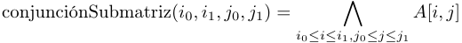
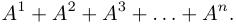
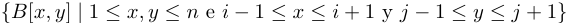
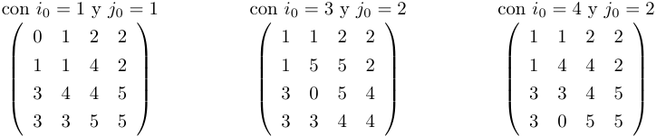

Técnicas de Diseño de Algoritmos / Algoritmos y Estructuras de Datos III 

Compilado 02/09/2026 

# **Práctica 4 – Dividir y conquistar** 

Los objetivos de esta práctica son: 

Introducir la técnica de Dividir y conquistar. 

- Identificar los pasos requeridos para resolver problemas con dicha técnica. 

- Desarrollar optimizaciones para alcanzar una mayor eficiencia de los algoritmos. Aprender a calcular la complejidad de algoritmos recursivos. 

Los ejercicios marcados con el símbolo ⋆ constituyen un subconjunto mínimo de ejercitación. Sin embargo, aconsejamos fuertemente hacer todos los ejercicios. 

Los ejercicios marcados con el símbolo � tienen una ayuda al final de la guía. 

## **Ejercicio 1** _(MergeSort)_ ⋆ 

Dado el algoritmo de _mergesort_ , implementado en el siguiente código Python: 

- 1 `def merge_sort(arr):` 2 `if len (arr) <= 1:` 3 `return arr` 

- 4 

- 5 `medio = len (arr) // 2` 

- 6 `mitad_izq = merge_sort(arr[: medio ])` 7 `mitad_der = merge_sort(arr[medio :])` 

- 8 

- 9 `return merge(mitad_izq , mitad_der)` 

- 1 `def merge(izq , der ):` 2 `mergeados = []` 3 `i = j = 0` 4 5 `while i < len (izq) and j < len (der ):` 6 `if izq[i] < der[j]:` 7 `mergeados.append(izq[i])` 8 `i += 1` 9 `else :` 

- 10 `mergeados.append(der[j])` 11 `j += 1` 

12 

13 `mergeados.extend(izq[i:])` 14 `mergeados.extend(der[j:])` 15 `return mergeados` 

1. Identificar qué lineas son el _divide_ , cuáles son el _conquer_ y cuáles el _combine_ . 

2. ¿En cuántos subproblemas se divide? 

3. ¿De qué tamaño son estos subproblemas? 

4. ¿Cuál es el costo de combinar los resultados de los subproblemas? 

5. Escribir la función _T_ ( _n_ ) de manera recursiva. 

6. Determinar la complejidad del algoritmo utilizando el Teorema Maestro. 

## **Ejercicio 2** _(Búsqueda binaria)_ ⋆ 

Dado el algoritmo de _búsqueda binaria_ , implementado en el siguiente código Python: 

- 1 `def busqueda_binaria (arr , objetivo , izq=0, der= len (arr ) -1):` 

- 2 `if izq > der:` 

- 3 `return False # Elemento no encontrado` 

4 

- 5 `medio = (izq + der) // 2` 

- 6 `if arr[medio] == objetivo:` 

- 7 `return medio` 

- 8 `elif arr[medio] > objetivo:` 

Página 1 de 6 

Técnicas de Diseño de Algoritmos / Algoritmos y Estructuras de Datos III 

Compilado 02/09/2026 

- 9 `return busqueda_binaria (arr , objetivo , izq , medio - 1)` 

- 10 `else :` 

- 11 `return busqueda_binaria (arr , objetivo , medio + 1, der)` 

   1. Identificar qué lineas son el _divide_ , cuáles son el _conquer_ y cuáles el _combine_ . 

   2. ¿En cuántos subproblemas se divide? 

   3. ¿De qué tamaño son estos subproblemas? 

   4. ¿Cuál es el costo de combinar los resultados de los subproblemas? 

   5. Escribir la función _T_ ( _n_ ) de manera recursiva. 

   6. Determinar la complejidad del algoritmo utilizando el Teorema Maestro. 

## **Ejercicio 3** _(Complexity quest)_ ⋆ 

Calcule la complejidad de un algoritmo que utiliza _T_ ( _n_ ) pasos para una entrada de tamaño _n_ , donde _T_ cumple: 

- 1) _T_ ( _n_ ) = _T_ ( _n −_ 2) + 5 5) _T_ ( _n_ ) = 2 _T_ ( _n −_ 1) 9) _T_ ( _n_ ) = 2 _T_ ( _n −_ 4) 

- 2) _T_ ( _n_ ) = _T_ ( _n −_ 1) + _n_ 6) _T_ ( _n_ ) = _T_ ( _n/_ 2) + _n_ 

- 3) _T_ ( _n_ ) = _T_ ( _n −_ 1) +_√_ _<u>n</u>_ 7) _T_ ( _n_ ) = _T_ ( _n/_ 2) +_√_ _<u>n</u>_ 

   - 10) _T_ ( _n_ ) = 2 _T_ ( _n/_ 2) + log _n_ 

   - 11) _T_ ( _n_ ) = 3 _T_ ( _n/_ 4) 

- 4) _T_ ( _n_ ) = _T_ ( _n −_ 1) + _n_2 8) _T_ ( _n_ ) = _T_ ( _n/_ 2) + _n_2 12) _T_ ( _n_ ) = 3 _T_ ( _n/_ 4) + _n_ 

Intentar estimar la complejidad para cada ítem directamente y luego calcularla utilizando el teorema maestro de ser posible. Para simplificar los cálculos se puede asumir que _n_ es potencia o múltiplo de 2 o de 4 según sea conveniente. 

## **Ejercicio 4** _(Izquierda dominante)_ ⋆ 

Escribir un algoritmo con dividir y conquistar que determine si un arreglo de tamaño potencia de 2 es _más a la izquierda_ , donde “más a la izquierda” significa que: 

La suma de los elementos de la mitad izquierda superan los de la mitad derecha. 

Cada una de las mitades es a su vez “más a la izquierda”. 

Por ejemplo, el arreglo [8, 6, 7, 4, 5, 1, 3, 2] es “más a la izquierda”, pero [8, 4, 7, 6, 5, 1, 3, 2] no lo es. 

Intentar que su solución aproveche la técnica de modo que la complejidad del algoritmo sea estrictamente menor a _O_ ( _n_2 ). 

Implementar el algoritmo en su lenguaje de programación favorito. 

## **Ejercicio 5** _(Índice espejo)_ ⋆ 

Tenemos un arreglo _a_ = [ _a_ 1 _, a_ 2 _, . . . , an_ ] de _n_ enteros distintos (positivos y negativos) _en orden estrictamente creciente_ . Queremos determinar si existe una posición _i_ tal que _ai_ = _i_ . Por ejemplo, dado el arreglo _a_ = [ _−_ 4 _, −_ 1 _,_ 2 _,_ 4 _,_ 7], _i_ = 4 es esa posición. 

Diseñar un algoritmo de dividir y conquistar eficiente (cuya complejidad sea de un orden estrictamente menor que lineal) que resuelva el problema. Calcule y justifique la complejidad del algoritmo dado. 

## **Ejercicio 6** _(Potencia logarítmica)_ ⋆ 

Página 2 de 6 

Técnicas de Diseño de Algoritmos / Algoritmos y Estructuras de Datos III 

Compilado 02/09/2026 

Encuentre un algoritmo para calcular _a__b_ en tiempo logarítmico en _b_ . Piense cómo reutilizar los resultados ya calculados. Justifique la complejidad del algoritmo dado. Nótese que _b_ puede **no ser** una potencia de 2. 

## **Ejercicio 7** _(Distancia máxima)_ ⋆ 

Dado un árbol binario cualquiera, diseñar un algoritmo de dividir y conquistar que devuelva el tamaño del camino más largo. El algoritmo no debe hacer recorridos innecesarios sobre el árbol. � 

## **Ejercicio 8** _(Cazador de falsos)_ ⋆ 

Se tiene una matriz booleana _A_ de _n × n_ y una operación _conjunciónSubmatriz_ que toma _O_ (1) tiempo y que dados 4 enteros _i_ 0 _, i_ 1 _, j_ 0 _, j_ 1 devuelve la conjunción de todos los elementos en la submatriz que toma las filas _i_ 0 hasta _i_ 1 y las columnas _j_ 0 hasta _j_ 1. Formalmente: 

1. Dar un algoritmo de complejidad temporal estrictamente menor que _O_ ( _n_2 ) que calcule la posición de algún _false_ , asumiendo que hay al menos uno. Calcular y justificar la complejidad del algoritmo. Notar que _n_ es el ancho de la matriz, no la cantidad de celdas. 

2. Modificar el algoritmo anterior para que cuente cuántos _false_ hay en la matriz. Asumiendo que hay a lo sumo 5 elementos _false_ en toda la matriz, calcular y justificar la complejidad del algoritmo. Esto se puede lograr con complejidad menor a _O_ ( _n_2 ). 

## **Ejercicio 9** _(Máxima subsecuencia)_ 

Dada una secuencia de _n_ enteros, se desea encontrar el máximo valor que se puede obtener sumando elementos contiguos. Diseñar un algoritmo basado en la técnica de dividir y conquistar que resuelva el problema en _O_ ( _n_ log _n_ ). Por ejemplo, para la secuencia [3 _, −_ 1 _,_ 4 _,_ 8 _, −_ 2 _,_ 2 _, −_ 7 _,_ 5], este valor es 14, que se obtiene de la subsecuencia [3 _, −_ 1 _,_ 4 _,_ 8]. 

El algoritmo más rápido que conocemos para resolver el problema tiene complejidad temporal _O_ ( _n_ ). 

## **Ejercicio 10** _(Suma de potencias)_ 

Suponga que se tiene un método _potencia_ que, dada un matriz cuadrada _A_ de orden 4 _×_ 4 y un número _n_ , computa la matriz _A__n_ . Dada una matriz cuadrada _A_ de orden 4 _×_ 4 y un número natural _n_ que es potencia de 2 (i.e., _n_ = 2_k_ para algun _k ≥_ 1), desarrollar, utilizando la técnica de dividir y conquistar y el método _potencia_ , un algoritmo que permita calcular 

Procure que el algoritmo propuesto aplique el método _potencia_ , sume y haga productos de matrices una cantidad estrictamente menor que _O_ ( _n_ ) veces. 

## **Ejercicio 11** _(Contar inversiones)_ 

Se define una inversión dentro de un arreglo _A_ de largo _n_ como un par de índices _i, j ∈_ N tal que 0 _≤ i < j < n_ y _A_ [ _i_ ] _> A_ [ _j_ ]. El problema de contar inversiones consiste en contar la cantidad de pares ( _i, j_ ) que sean inversión. 

- a) Implementar la función _contarInversiones_ que dado el arreglo _A_ , resuelva el problema planteado. 

- b) Calcular y justificar la complejidad del algoritmo propuesto. La complejidad temporal debe ser Θ( _n_ log _n_ ), donde _n_ = tam( _A_ ). � 

Página 3 de 6 

Técnicas de Diseño de Algoritmos / Algoritmos y Estructuras de Datos III 

Compilado 02/09/2026 

## **Ejercicio 12** _(Merge selectivo)_ 

Dados dos arreglos de naturales, ambos ordenados de manera creciente, se desea buscar, dada una posición _i_ , el _i_ -ésimo elemento de la unión de ambos. Dicho de otra forma, el _i_ -ésimo del resultado de hacer merge ordenado entre ambos arreglos. Notar que no es necesario hacer el merge completo. Se puede asumir que cada natural aparece a lo sumo en uno de los arreglos, y a lo sumo una vez. 

- a) Implementar la función _iésimoMerge_ que dados los arreglos _A_ y _B_ , y un valor _i_ natural, resuelva el problema planteado. 

- b) Calcular y justificar la complejidad del algoritmo propuesto. La complejidad temporal debe ser _O_ (log2 _n_ ), dónde _n_ = tam( _A_ ) = tam( _B_ ). � 

- c) **Desafío adicional:** Intente resolver el mismo problema en tiempo _O_ (log _n_ ) (este ítem es bastante más difícil). 

## **Ejercicio 13** _(Diferencia mínima)_ 

Se tienen dos arreglos de _n_ naturales _A_ y _B_ . _A_ está ordenado de manera creciente y _B_ está ordenado de manera decreciente. Ningún valor aparece más de una vez en el mismo arreglo. Para cada posición _i_ consideramos la diferencia absoluta entre los valores de ambos arreglos _|A_ [ _i_ ] _− B_ [ _i_ ] _|_ . Se desea buscar el mínimo valor posible de dicha cuenta. Por ejemplo, si los arreglos son _A_ = [1 _,_ 2 _,_ 3 _,_ 4] y _B_ = [6 _,_ 4 _,_ 2 _,_ 1] los valores de las diferencias son 5 _,_ 2 _,_ 1 _,_ 3 y el resultado es 1. 

- a) Implementar la función _minDif_ , que tome a _A_ y _B_ y resuelva el problema planteado. 

- b) Calcular y justificar la complejidad del algoritmo propuesto. La solución debe ser de tiempo _O_ (log _n_ ), donde _n_ = tam( _A_ ) = tam( _B_ ). 

## **Ejercicio 14** _(SubBúsqueda)_ 

Se tiene un arreglo _A_ de _n_ números naturales. Además se cuenta con estructuras adicionales sobre el arreglo que proveen la función _aparece?_ que dado _A_ , dos índices _i_ , _j_ y un valor natural _e_ , devuelve _true_ si y solo si _e_ = _A_ [ _k_ ] para algún _k_ tal que _i ≤ k ≤ j_ . Además se sabe que _aparece?_ toma tiempo _O_ (_√_ _j − i_ + 1), es decir, la raiz cuadrada del tamaño del intervalo de búsqueda. Se desea encontrar un algoritmo sublineal que encuentra el índice de un elemento _e_ en el arreglo _A_ , asumiendo que tal elemento existe en el arreglo. El resultado de la función es justamente el índice _i_ tal que _A_ [ _i_ ] = _e_ . 

- a) Implementar la función _ubicar_ que dado un arreglo de naturales _A_ de tamaño _n_ y un valor natural _e_ , resuelva el problema planteado. 

- b) Calcular y justificar la complejidad del algoritmo propuesto. La solución debe ser de tiempo estrictamente menor a _O_ ( _n_ ). 

## **Ejercicio 15** _(Encuentro mínimo_1 _)_ 

Se encuentran _n_ amigos parados en distintos puntos _xi_ (1 _≤ i ≤ n_ ) de una calle recta. Estos amigos quieren encontrarse en algún punto común de la calle, lo más rápido posible. Sin embargo, algunos caminan más rápido que otros: para cada amigo, conocemos su velocidad máxima _vi_ . Tu objetivo es encontrar el tiempo mínimo _t ∈_ N tal que todos los amigos se puedan encontrar en un punto común. 

- a) Implementar la función _encuentroMinimo_ que dado los arreglos de naturales _x_ y _v_ de tamaño _n_ resuelva el problema planteado. 

> 1Ejercicio basado en “The Meeting Place Cannot Be Changed” de codeforces. 

Página 4 de 6 

Técnicas de Diseño de Algoritmos / Algoritmos y Estructuras de Datos III 

Compilado 02/09/2026 

b) Calcular y justificar la complejidad del algoritmo propuesto. La complejidad puede depender de los valores de _x_ y _v_ , además del tamaño _n_ . 

## **Ejercicio 16** _(L-Tetris)_ 

Se tiene un tablero rectangular de _n × n_ posiciones, con _n_ potencia de 2, donde una de las posiciones se encuentra inicialmente ocupada. Diseñar un algoritmo con la técnica de dividir y conquistar para rellenar todas las posiciones del tablero con figuras que ocupan 3 posiciones y tienen forma de _L_ . Formalmente, podemos definir el problema de la siguiente forma: dado un valor _n_ y un par de valores _i_ 0 _, j_ 0 (1 _≤ i_ 0 _, j_ 0 _≤ n_ ), se quiere encontrar una matriz _B_ de tamaño _n × n_ tal que: 

_B_ [ _i_ 0 _, j_ 0] = 0, 

Todos los valores entre 1 y ( _n_2 _−_ 1) _/_ 3 aparecen exactamente tres veces en _B_ , y 

Para todo 1 _≤ i, j ≤ n_ tal que ( _i, j_ ) _̸_ = ( _i_ 0 _, j_ 0), ocurre que el conjunto 

contiene exactamente tres elementos con el valor _B_ [ _i, j_ ] (uno de los cuales es _B_ [ _i, j_ ]). 

Ningun entero aparece más de dos veces en la misma fila o columna. 

Por ejemplo, si _n_ = 4, entonces la matriz _B_ podría ser 

## � 

Página 5 de 6 

Técnicas de Diseño de Algoritmos / Algoritmos y Estructuras de Datos III 

Compilado 02/09/2026 

# **Ayudas** 

|posición en el merge. **Ejercicio 16** Para poder particionar el tablero y obtener instancias más pequeñas del problema, considere posicionar alguna figura de manera estratégica.|
|---|
|_O_(log_n_) entre qué par de posiciones consecutivas del otro arreglo quedaría, y de allí deducir cuál sería su|
|indicarnos que la complejidad sea Θ(_n_log_n_). **Ejercicio 12** Observar que, dado el valor de un elemento de alguno de los dos arreglos, se puede averiguar en tiempo|
|largos de sus subárboles. **Ejercicio 11** Observar que tener la cantidad de inversiones de dos mitades del arreglo no alcanza. Pensar qué puede|
|**Ejercicio 7** Para saber el camino más largo de un árbol, posiblemente necesite conocer más que solo los caminos más|

Página 6 de 6 

