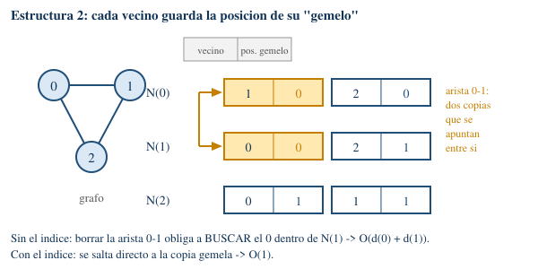
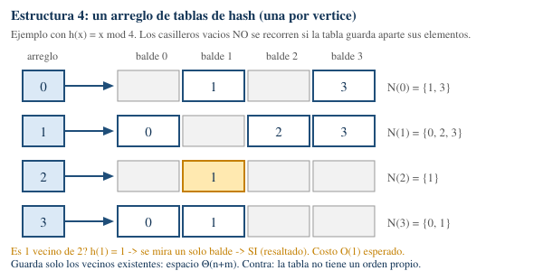
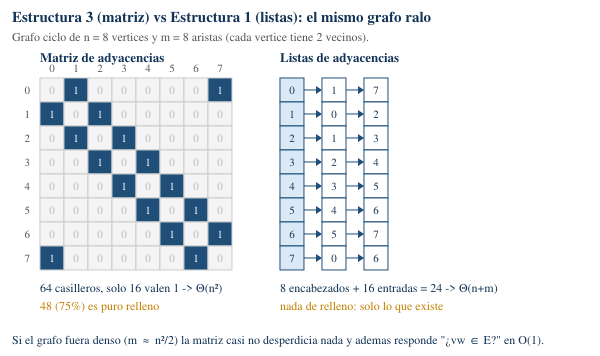

# Ejercicios — Práctica 3

---

## Ejercicio 1 (Representación de grafos) ⋆

### Qué pide

Comparar **4 formas distintas de guardar un grafo en la computadora**, mirando cuánto tardan (complejidad temporal) y cuánta memoria ocupan (complejidad espacial) al hacer 8 operaciones típicas.

La idea de fondo, que es la que hay que llevarse:

> El grafo (el dibujo con puntos y líneas) y su representación (cómo lo guardo en memoria) **son dos cosas distintas**. Elegir una representación no cambia el grafo: cambia **el precio de cada operación**.
>
> `../../teoria/grafos-algoritmos/temas/02-el-grafo-y-su-representaci-n-son-objetos.md` — El grafo y su representación son objetos diferentes
> `../../teoria/grafos-algoritmos/temas/04-un-mismo-grafo-admite-distintas-represen.md` — "La elección no cambia el grafo; cambia cómo accedemos a su información."

### Vocabulario mínimo

| Símbolo / palabra | Qué significa |
|---|---|
| **n** | cantidad de vértices (los puntos del grafo), o sea `\|V(G)\|` |
| **m** | cantidad de aristas (las líneas que unen puntos), o sea `\|E(G)\|` |
| **N(v)** | *vecindario* de v: la lista de todos los vértices pegados a v |
| **d(v)** | *grado* de v: cuántos vecinos tiene v, o sea el tamaño de N(v) |
| **O(f)** | "no tarda más que f" (cota superior) |
| **Θ(f)** | "tarda exactamente del orden de f" (cota justa, arriba y abajo) |
| **amortizado** | el costo *promedio* por operación si hago muchas seguidas (aunque alguna suelta salga cara) |
| **esperado** | el costo *en promedio* según el azar del hash, no garantizado siempre |
| **grafo ralo (sparse)** | tiene pocas aristas, m parecido a n |
| **grafo denso (dense)** | tiene muchísimas aristas, m parecido a n²/2 (casi todos con todos) |

Un detalle del enunciado que simplifica todo: **los vértices son siempre 0, 1, ..., n−1**. Como son números consecutivos, puedo usarlos directamente como posición dentro de un arreglo y llegar a N(v) en O(1) sin buscar nada.

> `../../teoria/grafos-algoritmos/temas/03-representamos-el-grafo-mediante-sus-veci.md` — "En la práctica suponemos V = {0, ..., n−1}."

---

### Las 4 estructuras, en criollo

#### Estructura 1 — Lista de adyacencias simple

Un arreglo con n casilleros (uno por vértice). En el casillero v guardo **una lista con los vecinos de v**, y nada más.

Cada lista puede ser un **arreglo dinámico** (memoria contigua, se agranda sola al llenarse) o una **lista enlazada** (cadena de nodos, cada uno con un puntero al siguiente):

Dos observaciones importantes:

- En un grafo **no dirigido** cada arista `vw` aparece **dos veces**: una en la lista de v y otra en la lista de w. En un **digrafo** (grafo dirigido, las aristas tienen flecha) aparece una sola vez, en la lista del origen.
- El **orden de los vecinos dentro de cada lista lo elijo yo**: el grafo no lo impone.

> `../../teoria/grafos-algoritmos/temas/05-las-listas-almacenan-solamente-los-vecin.md` — "El orden de los vecinos no está determinado por el grafo."
> `../../teoria/grafos-algoritmos/temas/06-el-espacio-de-las-listas-es-lineal-en-el.md` — "Espacio total: Θ(n + m)."

#### Estructura 2 — Lista de adyacencias con índice cruzado

Igual que la anterior, pero **cada copia de una arista sabe dónde está su copia gemela**. Si guardo w dentro de N(v), guardo además "y yo, v, estoy en la posición k de N(w)".

Cuesta un número entero más por entrada (el doble de memoria por arista, pero sigue siendo Θ(n+m)) y a cambio permite **borrar aristas y vértices sin salir a buscar nada**. Por eso el enunciado dice que "tiene información para implementar operaciones dinámicas" (operaciones que agregan y sacan cosas todo el tiempo).

#### Estructura 3 — Matriz de adyacencias

Una tabla de n × n casilleros de verdadero/falso. `A[v][w]` es verdadero si y solo si v y w son vecinos. **La fila v es exactamente N(v)**, escrita como un vector de "sí/no" para todos los vértices del grafo, existan o no esas aristas.

> `../../teoria/grafos-algoritmos/temas/08-la-matriz-reserva-una-posici-n-para-cada.md` — "Espacio: Θ(n²). Consultar vw ∈ E: O(1). Recorrer N(v): O(n). La fila v codifica N(v)."

Si el grafo es no dirigido la matriz es **simétrica** (`A = Aᵀ`, o sea `A[v][w] = A[w][v]`), así que la mitad de la tabla es información repetida.

#### Estructura 4 — Arreglo de tablas de hash

Un arreglo de n casilleros, pero en cada uno hay una **tabla de hash** (estructura que guarda un conjunto y responde "¿está este elemento?" en tiempo constante en promedio, aplicando una función que convierte el elemento en una posición del arreglo interno).

Es un híbrido: guarda **solo los vecinos que existen** (como las listas) pero responde adyacencia **de un saque** (como la matriz).

---

### La comparación de un vistazo

| Operación | 1. Listas simples | 2. Listas con índice cruzado | 3. Matriz | 4. Arreglo de hash |
|---|---|---|---|---|
| **Espacio** | Θ(n + m) | Θ(n + m) (≈ el doble de constante) | **Θ(n²)** | Θ(n + m) esperado |
| **1.** Inicializar | Θ(n + m) ✅ óptimo | Θ(n + m) ✅ | Θ(n²) ❌ | Θ(n + m) esperado ✅ |
| **2.** ¿v y w vecinos? | O(mín(d(v), d(w))) ❌ | O(mín(d(v), d(w))) ❌ | **O(1) siempre** ✅ | O(1) esperado ✅ |
| **3.** Recorrer N(v) | Θ(d(v)) ✅ óptimo | Θ(d(v)) ✅ | Θ(n) ❌ | Θ(d(v)) esperado ✅ |
| **4.** Insertar vértice v con N(v) | Θ(d(v)) amortizado ✅ | Θ(d(v)) amortizado ✅ | Θ(n) amortizado ❌ | Θ(d(v)) esperado ✅ |
| **5.** Insertar arista (v,w) | O(1) sin control de repetidas | O(1) | O(1) ✅ | O(1) esperado, sin repetidas ✅ |
| **6.** Remover vértice v | **O(n + m)** ❌ | O(d(v) + d(u)) ✅ | Θ(n) | O(d(v) + d(u)) esperado ✅ |
| **7.** Remover arista (v,w) | O(d(v) + d(w)) ❌ | O(d(v)) para ubicarla, O(1) el borrado | O(1) ✅ | O(1) esperado ✅ |
| **8.** Mantener N(v) ordenado | fácil y barato ✅ | caro: mover rompe los índices ❌ | gratis, pero **solo** el orden 0..n−1 | **imposible** sin estructura extra ❌ |
| **Recorrer todas las aristas** | Θ(n + m) ✅ | Θ(n + m) ✅ | Θ(n²) ❌ | Θ(n + m) esperado ✅ |

(*u = n−1, el último vértice, por el truco de renumerado que explico en la operación 6.*)

> `../../teoria/grafos-algoritmos/temas/09-la-operaci-n-dominante-orienta-la-elecci.md` — tabla Espacio / Consultar vw ∈ E / Recorrer N(v) / Recorrer todas las aristas, para Listas y Matriz.

---

### Operación por operación

#### 1. Inicializar a partir de la secuencia de vértices y de aristas

**Piso teórico:** solo *leer* la entrada ya cuesta Ω(n + m), porque hay que mirar cada vértice y cada arista al menos una vez. Ninguna estructura puede ser más rápida que eso.

- **Listas (1 y 2):** creo n listas vacías y, por cada arista (v,w), agrego w al final de N(v) y v al final de N(w). Cada agregado es O(1) amortizado → **Θ(n + m), que es lo óptimo.** En la estructura 2, en el mismo momento en que agrego las dos copias ya sé en qué posición quedó cada una, así que anotar los índices cruzados **sale gratis**.
- **Matriz (3):** antes de mirar una sola arista ya tengo que reservar y poner en falso n² casilleros → **Θ(n²)**. Con un grafo ralo esto es absurdo: para un grafo de 100.000 vértices y 200.000 aristas, la matriz pide 10.000.000.000 casilleros.
- **Hash (4):** Θ(n + m) esperado, con constantes peores que las listas (calcular el hash de cada vecino, resolver colisiones, agrandar las tablas cuando se llenan).

#### 2. Determinar si v y w son adyacentes

- **Listas (1 y 2):** no hay atajo, hay que **recorrer N(v) buscando w** → O(d(v)). Truco barato: si guardo el tamaño de cada lista, comparo y recorro **la más corta de las dos** → O(mín(d(v), d(w))). En el peor caso (un vértice conectado a todos) esto es O(n).
  > `../../teoria/grafos-algoritmos/temas/07-los-costos-dependen-de-c-mo-implementamo.md` — "decidir si vw ∈ E: O(d(v)). Para decidir adyacencia debemos buscar w dentro de la lista de v."
  Si además mantengo las listas ordenadas (operación 8) y son arreglos dinámicos, puedo hacer **búsqueda binaria** y bajar a O(log d(v)). Con listas enlazadas no, porque no puedo saltar al elemento del medio.
- **Matriz (3):** miro `A[v][w]` y listo → **O(1) garantizado**. Es su gran ventaja y la razón por la que aparece en algoritmos como el cúbico de triángulos (Ejercicio 2).
- **Hash (4):** O(1) **esperado**. Ojo con la diferencia: la matriz da O(1) *siempre*; el hash da O(1) *en promedio*, y si todos los vecinos caen en el mismo balde degenera a O(d(v)).

#### 3. Recorrer / procesar N(v)

- **Listas (1 y 2):** Θ(d(v)) → **óptimo**, porque toco exactamente los vecinos que existen y ni uno más. Con arreglo dinámico además es memoria contigua (rápido en caché); con lista enlazada cada nodo puede estar en cualquier lado de la memoria y es más lento en la práctica, aunque la complejidad sea la misma.
- **Matriz (3):** tengo que recorrer **toda la fila v**, los n casilleros, aunque v tenga 2 vecinos → **Θ(n) siempre**. Esta es la desventaja más pesada, porque casi todos los algoritmos sobre grafos hacen justo esto: para cada vértice, mirar sus vecinos. Recorrer todas las aristas cuesta Θ(n²) en vez de Θ(n + m). Ejemplo concreto: **BFS** (*Breadth-First Search*, búsqueda a lo ancho, explora por capas de distancia creciente) y **DFS** (*Depth-First Search*, búsqueda en profundidad, se mete lo más hondo posible antes de retroceder) corren en Θ(n + m) con listas y se degradan a Θ(n²) con matriz.
- **Hash (4):** Θ(d(v)) esperado **si la tabla guarda aparte una lista compacta de sus elementos**. Si en cambio recorro balde por balde, pago Θ(capacidad de la tabla), que es Θ(d(v)) mientras la tabla esté bien dimensionada, pero puede quedar mucho más grande que d(v) si borré muchos vecinos y nunca la achiqué.

#### 4. Insertar un vértice v con su conjunto de vecinos N(v)

Como los vértices son 0..n−1, el vértice nuevo es el número n y va al final del arreglo.

- **Listas (1 y 2):** agrego un casillero al final del arreglo de vértices (O(1) amortizado) y después, por cada w ∈ N(v), agrego v a N(w) → **Θ(d(v)) amortizado**. En la estructura 2 anoto de paso los índices cruzados, gratis.
- **Matriz (3):** la tabla tiene que pasar de n×n a (n+1)×(n+1). Eso significa agregarle **una columna a cada una de las n filas** (n agregados, O(1) amortizado cada uno) **más una fila nueva de n+1 casilleros** → **Θ(n) amortizado**. Y si justo todas las filas necesitan duplicar su capacidad en el mismo momento, esa inserción puntual cuesta Θ(n²).
- **Hash (4):** creo la tabla de v e inserto sus vecinos, y me anoto en la tabla de cada uno → **Θ(d(v)) esperado**.

#### 5. Insertar una arista (v, w)

- **Listas (1):** agrego w al final de N(v) y v al final de N(w) → **O(1) amortizado**. Pero *si quiero garantizar que no haya aristas repetidas*, primero tengo que verificar que w no esté ya en N(v) → sube a **O(d(v))**.
  > `../../teoria/grafos-algoritmos/temas/07-los-costos-dependen-de-c-mo-implementamo.md` — "insertar vw: O(1)."
  Detalle fino: con arreglo dinámico el O(1) es **insertando al final**; insertar adelante costaría O(d(v)) por el corrimiento. Con lista enlazada insertar adelante es O(1).
- **Listas con índice cruzado (2):** O(1) igual, y aprovecho que sé las dos posiciones recién creadas para escribir los dos índices. **Importante: hay que insertar al final**, porque insertar en el medio de un arreglo corre elementos y **deja desactualizados los índices cruzados que apuntaban a ellos**.
- **Matriz (3):** `A[v][w] = A[w][v] = verdadero` → **O(1) garantizado**, y las repetidas se evitan solas (un casillero booleano no se puede poner en verdadero "dos veces").
- **Hash (4):** O(1) esperado, y **el control de repetidas viene gratis** porque un conjunto de hash no admite duplicados.

#### 6. Remover un vértice v con todas sus adyacencias

Acá se ve la diferencia más grande entre las cuatro. El problema tiene dos partes: (a) sacar a v de la lista de cada uno de sus vecinos y (b) mantener la numeración 0..n−1 sin agujeros.

Para (b) el truco estándar es **no compactar**: intercambio v con el último vértice u = n−1 y después borro el último. Así solo hay que renombrar a **un** vértice en vez de correr todos.

- **Listas simples (1):** para cada w ∈ N(v) tengo que **buscar** v adentro de N(w) para poder sacarlo → O(d(w)) cada uno. Sumando sobre todos los vecinos, en el peor caso recorro medio grafo → **O(n + m)**. Además el renombrado de u obliga a otra ronda de búsquedas.
  > `../../teoria/grafos-algoritmos/temas/07-los-costos-dependen-de-c-mo-implementamo.md` — "remover v: O(n + m) (peor caso)."
- **Listas con índice cruzado (2):** para cada w ∈ N(v) **salto directo** a la copia de v dentro de N(w) en O(1) y la borro en O(1) (la piso con el último elemento de N(w) y corrijo el índice de ese elemento movido, al que también llego en O(1)) → **O(d(v))**. El renombrado de u cuesta O(d(u)) por el mismo mecanismo. Total **O(d(v) + d(u))**: esta estructura existe justamente para esto.
  ⚠️ El precio: borrar pisando con el último elemento **desordena** la lista, así que es incompatible con la operación 8.
- **Matriz (3):** pongo en falso la fila v y la columna v → Θ(n); con el intercambio con la última fila/columna y el achique, sigue siendo **Θ(n)**. Si en cambio quisiera compactar corriendo todas las filas y columnas, sería Θ(n²). Nota: el espacio **no baja** salvo que realmente achique la tabla.
- **Hash (4):** para cada w ∈ N(v) borro v de su tabla en O(1) esperado → **O(d(v) + d(u)) esperado**, tan bueno como la estructura 2 y **sin necesidad de guardar índices cruzados**.

#### 7. Remover una arista (v, w)

- **Listas simples (1):** busco w en N(v) y v en N(w) → **O(d(v) + d(w))**.
  > `../../teoria/grafos-algoritmos/temas/07-los-costos-dependen-de-c-mo-implementamo.md` — "remover vw: O(d(v) + d(w))."
- **Listas con índice cruzado (2):** si me dan solo los números v y w, igual tengo que **encontrar** la entrada dentro de N(v) → O(d(v)); pero una vez encontrada, borrar **las dos copias** es O(1). Si el algoritmo ya viene con la referencia a la arista en la mano (que es lo normal cuando la está recorriendo), es **O(1) completo**. Con listas enlazadas y punteros al nodo gemelo en vez de índices, el borrado es O(1) y además no hay corrimientos.
- **Matriz (3):** dos asignaciones → **O(1) garantizado**.
- **Hash (4):** dos borrados → **O(1) esperado**, y a diferencia de la estructura 2, **sin necesitar la referencia previa**: alcanza con los números v y w. Es la mejor para borrado dinámico de aristas.

#### 8. Mantener N(v) en un orden dado

Esto sirve, por ejemplo, para que BFS y DFS visiten los vecinos siempre en el mismo orden y los resultados sean reproducibles, o para poder hacer búsqueda binaria, o para intersecar dos vecindarios recorriéndolos en paralelo.

- **Listas simples (1):** es la que mejor se banca esto. Insertar manteniendo el orden cuesta O(d(v)) (buscar el lugar, y correr si es arreglo). Y hay un truco muy lindo: **si construyo todas las listas recorriendo los vértices w de 0 a n−1 y agregando w al final de N(v) para cada vecino v de w, todas las listas quedan ordenadas de menor a mayor y el costo total sigue siendo Θ(n + m)** — sin ordenar nada.
- **Listas con índice cruzado (2):** es la peor combinación. Mantener el orden obliga a **mover elementos dentro de la lista**, y cada elemento movido cambia de posición, así que **todos los índices cruzados que lo apuntaban quedan mal** y hay que corregirlos. Se puede (llego a cada gemelo en O(1), así que corregir k elementos movidos cuesta O(k)), pero las constantes empeoran y el código se vuelve delicado. La salida elegante es **usar listas enlazadas con punteros al nodo gemelo** en lugar de índices posicionales: ahí mover un nodo no invalida nada.
- **Matriz (3):** el orden **ya viene dado y es gratis**: recorrer la fila v de izquierda a derecha entrega los vecinos ordenados por número de vértice. Pero es lo único que puedo hacer: **cualquier otro orden es imposible** sin agregar otra estructura, y el recorrido igual cuesta Θ(n).
- **Hash (4):** es su punto flojo. Una tabla de hash **no tiene orden**: el recorrido sale en el orden arbitrario de los baldes, que depende de la función de hash y del historial de inserciones. Para tener orden hay que combinarla con otra cosa (una lista doblemente enlazada en paralelo — el clásico *linked hash set* —, o directamente cambiar la tabla por un árbol balanceado, que da orden y O(log d(v)) en vez de O(1)).

---

### Comparación de espacio, en imagen

El punto de quiebre está en **la densidad**: la matriz paga n² pase lo que pase, mientras que las listas pagan n + m. Con m ≈ n (grafo ralo) las listas ganan por lejos; con m ≈ n²/2 (grafo denso) los dos ocupan lo mismo del orden y la matriz encima responde adyacencia en O(1).

> `../../teoria/grafos-algoritmos/temas/09-la-operaci-n-dominante-orienta-la-elecci.md` — "Grafo con pocas aristas: suelen convenir las listas porque n + m ≪ n² si m ∼ n. Grafo denso: puede convenir la matriz."

---

### Conclusión: cuál usar

**No hay una ganadora universal.** La estructura se elige mirando cuál es la operación que el algoritmo hace más veces.

> `../../teoria/grafos-algoritmos/temas/02-el-grafo-y-su-representaci-n-son-objetos.md` — "No hay una representación universalmente mejor."
> `../../teoria/grafos-algoritmos/temas/09-la-operaci-n-dominante-orienta-la-elecci.md` — "La operación dominante orienta la elección."

| Situación | Elegir | Por qué |
|---|---|---|
| Grafo **ralo** y estático; el algoritmo recorre vecindarios (BFS, DFS, orden topológico, componentes conexas) | **1. Listas simples** | Θ(n+m) en espacio y en recorrido, que es el óptimo; simple de programar |
| Grafo **denso**, o el algoritmo pregunta "¿vw ∈ E?" todo el tiempo (triángulos, clique, complemento) | **3. Matriz** | O(1) garantizado en la consulta; con m ≈ n² el n² de espacio deja de ser un derroche |
| El grafo **cambia mucho**: se agregan y borran vértices y aristas constantemente | **2. Índice cruzado** o **4. Hash** | Borrar un vértice pasa de O(n+m) a O(d(v)) |
| Se necesita borrado dinámico **y** consulta de adyacencia rápida, y **no** importa el orden | **4. Hash** | Único que da O(1) esperado en consultar, insertar y borrar aristas con espacio Θ(n+m) |
| Hace falta recorrer los vecindarios en un **orden fijo** | **1. Listas simples** (ordenadas) | Las otras tres o rompen el orden, o no lo tienen, o solo permiten el orden 0..n−1 |

Y la observación práctica que conviene tener a mano: la estructura 2 y la estructura 4 resuelven **el mismo problema** (las operaciones dinámicas) por caminos opuestos. La 2 lo hace con **memoria extra determinística** (un entero por entrada, garantías en el peor caso, pero pelea con el orden); la 4 lo hace con **azar** (más simple de programar y sin índices que mantener, pero garantías solo en promedio y sin orden posible).

---

### Fuentes citadas

- `../../teoria/grafos-algoritmos/temas/02-el-grafo-y-su-representaci-n-son-objetos.md` — El grafo y su representación son objetos diferentes
- `../../teoria/grafos-algoritmos/temas/03-representamos-el-grafo-mediante-sus-veci.md` — Representamos el grafo mediante sus vecindarios
- `../../teoria/grafos-algoritmos/temas/04-un-mismo-grafo-admite-distintas-represen.md` — Un mismo grafo admite distintas representaciones
- `../../teoria/grafos-algoritmos/temas/05-las-listas-almacenan-solamente-los-vecin.md` — Las listas almacenan solamente los vecinos existentes
- `../../teoria/grafos-algoritmos/temas/06-el-espacio-de-las-listas-es-lineal-en-el.md` — El espacio de las listas es lineal en el tamaño del grafo
- `../../teoria/grafos-algoritmos/temas/07-los-costos-dependen-de-c-mo-implementamo.md` — Los costos dependen de cómo implementamos cada lista
- `../../teoria/grafos-algoritmos/temas/08-la-matriz-reserva-una-posici-n-para-cada.md` — La matriz reserva una posición para cada par de vértices
- `../../teoria/grafos-algoritmos/temas/09-la-operaci-n-dominante-orienta-la-elecci.md` — La operación dominante orienta la elección
- `practica_3.md` — Ejercicio 1 (Representación de grafos)

**Imágenes propias** (creadas para este ejercicio): `../../../imagenes/ej1-indice-cruzado.png`, `../../../imagenes/ej1-hash.png`, `../../../imagenes/ej1-espacio-matriz-vs-listas.png`
