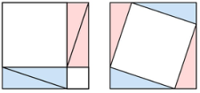
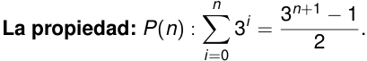
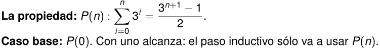

¿Qué es una demostración? 

¿Cómo demostramos? 

Complejidad asintótica 

Otras herramientas 

Para Cerrar 

Inducción 

Algoritmos recursivos 

Repaso de demostraciones Inducción, correctitud y complejidad asintótica 

Departamento de Computación Facultad de Ciencias Exactas y Naturales Universidad de Buenos Aires 

2_do_ Cuatrimestre de 2026 

2_do_ Cuatrimestre de 2026 1 / 36 

(DC, FCEyN, UBA) 

DC - FCEyN - UBA 

¿Qué es una demostración? 

¿Cómo demostramos? 

Complejidad asintótica 

Otras herramientas 

Para Cerrar 

Inducción 

Algoritmos recursivos 

# Agenda de hoy 

> 1 ¿Qué es una demostración? 

> 2 ¿Cómo demostramos? 

> 3 Repaso de complejidad asintótica. 

> 4 Inducción. 

- 5 Correctitud de algoritmos recursivos. 

> 6 Otras herramientas: contrarrecíproco, contradicción, palomar, mínimo elemento. 

> 7 Tips + Conclusiones. 

2_do_ Cuatrimestre de 2026 2 / 36 

(DC, FCEyN, UBA) 

DC - FCEyN - UBA 

¿Qué es una demostración? 

¿Cómo demostramos? 

Complejidad asintótica 

Otras herramientas 

Para Cerrar 

Inducción 

Algoritmos recursivos 

# ¿Qué es una demostración? 

Una **demostración matemática** es un argumento convincente sobre la veracidad de una proposición matemática. 

2_do_ Cuatrimestre de 2026 

(DC, FCEyN, UBA) 

DC - FCEyN - UBA 

3 / 36 

¿Qué es una demostración? 

¿Cómo demostramos? 

Complejidad asintótica 

Otras herramientas 

Para Cerrar 

Inducción 

Algoritmos recursivos 

# ¿Qué es una demostración? 

Una **demostración matemática** es un argumento convincente sobre la veracidad de una proposición matemática. 

Inmediatamente tenemos la pregunta: ¿convence _a quién_ ? 

2_do_ Cuatrimestre de 2026 

(DC, FCEyN, UBA) 

DC - FCEyN - UBA 

3 / 36 

Complejidad asintótica 

Otras herramientas 

Para Cerrar 

Inducción 

Algoritmos recursivos 

¿Qué es una demostración? 

¿Cómo demostramos? 

# ¿Qué es una demostración? 

Una **demostración matemática** es un argumento convincente sobre la veracidad de una proposición matemática. 

Inmediatamente tenemos la pregunta: ¿convence _a quién_ ? Teorema (Pitágoras) Dado un triángulo rectángulo, la suma de los cuadrados de los catetos es igual al cuadrado de la hipotenusa. <mark>ee</mark> 

<!-- Start of picture text -->
ae <!-- End of picture text -->

2_do_ Cuatrimestre de 2026 

(DC, FCEyN, UBA) 

DC - FCEyN - UBA 

3 / 36 

¿Qué es una demostración? 

¿Cómo demostramos? 

Complejidad asintótica 

Otras herramientas 

Para Cerrar 

Inducción 

Algoritmos recursivos 

# ¿Qué es una demostración? 

Una **demostración matemática** es un argumento convincente sobre la veracidad de una proposición matemática. 

Inmediatamente tenemos la pregunta: ¿convence _a quién_ ? Teorema (Pitágoras) Dado un triángulo rectángulo, la suma de los cuadrados de los catetos es igual al cuadrado de la hipotenusa. <mark>ee</mark> ae ¿Esto es siquiera una demostración? ¿Los convence? ¿Cómo saben, o definen, si «está bien»? 

2_do_ Cuatrimestre de 2026 

(DC, FCEyN, UBA) 

DC - FCEyN - UBA 

3 / 36 

¿Qué es una demostración? 

¿Cómo demostramos? 

Complejidad asintótica 

Otras herramientas 

Para Cerrar 

Inducción 

Algoritmos recursivos 

# ¿A quién queremos convencer? 

Una demostración _heurística_ (« _n_ ! + 1 no es divisible por nadie debajo de _n_ , luego es primo») puede convencer a un apurado... y ser falsa: 4! + 1 = 25 = 52 . 

2_do_ Cuatrimestre de 2026 

(DC, FCEyN, UBA) 

DC - FCEyN - UBA 

4 / 36 

- ¿Qué es una demostración? ¿Cómo demostramos? Complejidad asintótica Inducción Algoritmos recursivos Otras herramientas Para Cerrar ¿A quién queremos convencer? Una demostración _heurística_ (« _n_ ! + 1 no es divisible por nadie debajo de _n_ , luego es primo») puede convencer a un apurado... y ser falsa: 4! + 1 = 25 = 52 . Una demostración totalmente formal (por ejemplo, escrita en el lenguaje de programación Lean 4) convence a una computadora, pero es ilegible para un par humano. 

- ~~<mark>a</mark>~~ (DC, FCEyN, UBA) DC - FCEyN - UBA 2_do_ Cuatrimestre de 2026 4 / 36 

¿Qué es una demostración? 

¿Cómo demostramos? 

Complejidad asintótica 

Otras herramientas 

Para Cerrar 

Inducción 

Algoritmos recursivos 

# ¿A quién queremos convencer? 

Una demostración _heurística_ (« _n_ ! + 1 no es divisible por nadie debajo de _n_ , luego es primo») puede convencer a un apurado... y ser falsa: 4! + 1 = 25 = 52 . Una demostración totalmente formal (por ejemplo, escrita en el lenguaje de programación Lean 4) convence a una computadora, pero es ilegible para un par humano. 

Lo que se considera una demostración correcta depende del **contexto** : qué podemos asumir del lector, y para qué estamos demostrando. 

2_do_ Cuatrimestre de 2026 

(DC, FCEyN, UBA) 

DC - FCEyN - UBA 

4 / 36 

¿Qué es una demostración? 

¿Cómo demostramos? 

Complejidad asintótica 

Otras herramientas 

Para Cerrar 

Inducción 

Algoritmos recursivos 

# ¿A quién queremos convencer? 

Una demostración _heurística_ (« _n_ ! + 1 no es divisible por nadie debajo de _n_ , luego es primo») puede convencer a un apurado... y ser falsa: 4! + 1 = 25 = 52 . Una demostración totalmente formal (por ejemplo, escrita en el lenguaje de programación Lean 4) convence a una computadora, pero es ilegible para un par humano. 

Lo que se considera una demostración correcta depende del **contexto** : qué podemos asumir del lector, y para qué estamos demostrando. 

## Definición 

Una **demostración** es un argumento formal sobre la veracidad de una proposición, que puede convencer a cualquier _par_ de la comunidad científica. 

2_do_ Cuatrimestre de 2026 

4 / 36 

(DC, FCEyN, UBA) 

DC - FCEyN - UBA 

¿Qué es una demostración? 

Complejidad asintótica 

Otras herramientas 

Para Cerrar 

Inducción 

Algoritmos recursivos 

¿Cómo demostramos? 

# El doble propósito de sus demostraciones 

En el contexto de la materia, sus demostraciones tienen que: 

2_do_ Cuatrimestre de 2026 

(DC, FCEyN, UBA) 

DC - FCEyN - UBA 

5 / 36 

Complejidad asintótica 

Otras herramientas 

Para Cerrar 

Inducción 

Algoritmos recursivos 

¿Qué es una demostración? 

¿Cómo demostramos? 

# El doble propósito de sus demostraciones 

En el contexto de la materia, sus demostraciones tienen que: 

> 1 **Convencer al lector** de la veracidad de la proposición. Esto es común a todas las demostraciones matemáticas. 

2_do_ Cuatrimestre de 2026 

(DC, FCEyN, UBA) 

DC - FCEyN - UBA 

5 / 36 

¿Qué es una demostración? ¿Cómo demostramos? Complejidad asintótica Inducción Algoritmos recursivos Otras herramientas Para Cerrar El doble propósito de sus demostraciones En el contexto de la materia, sus demostraciones tienen que: 1 **Convencer al lector** de la veracidad de la proposición. Esto es común a todas las demostraciones matemáticas. 2 **Convencer al docente de que entienden cómo convencer a cualquiera.** El docente ya sabe que la proposición es cierta. Va a evaluar si sus argumentos convencerían a _cualquier_ par. ~~<mark>oe</mark>~~ (DC, FCEyN, UBA) DC - FCEyN - UBA 2_do_ Cuatrimestre de 2026 5 / 36 

DC - FCEyN - UBA 2_do_ Cuatrimestre de 2026 5 / 36 

Complejidad asintótica 

Otras herramientas 

Para Cerrar 

Inducción 

Algoritmos recursivos 

¿Qué es una demostración? 

¿Cómo demostramos? 

# El doble propósito de sus demostraciones 

En el contexto de la materia, sus demostraciones tienen que: 

> 1 **Convencer al lector** de la veracidad de la proposición. Esto es común a todas las demostraciones matemáticas. 

> 2 **Convencer al docente de que entienden cómo convencer a cualquiera.** El docente ya sabe que la proposición es cierta. Va a evaluar si sus argumentos convencerían a _cualquier_ par. 

Hay que ser un poco _paranoicos_ : que no quede ninguna duda en la mente de ningún par que nos lea. 

2_do_ Cuatrimestre de 2026 5 / 36 

(DC, FCEyN, UBA) 

DC - FCEyN - UBA 

Complejidad asintótica 

Otras herramientas 

Para Cerrar 

Inducción 

Algoritmos recursivos 

¿Qué es una demostración? 

¿Cómo demostramos? 

# El doble propósito de sus demostraciones 

En el contexto de la materia, sus demostraciones tienen que: 

> 1 **Convencer al lector** de la veracidad de la proposición. Esto es común a todas las demostraciones matemáticas. 

> 2 **Convencer al docente de que entienden cómo convencer a cualquiera.** El docente ya sabe que la proposición es cierta. Va a evaluar si sus argumentos convencerían a _cualquier_ par. 

Hay que ser un poco _paranoicos_ : que no quede ninguna duda en la mente de ningún par que nos lea. 

Desarrollar un pensamiento crítico-adversarial. 

2_do_ Cuatrimestre de 2026 5 / 36 

(DC, FCEyN, UBA) 

DC - FCEyN - UBA 

¿Qué es una demostración? 

¿Cómo demostramos? 

Complejidad asintótica 

Otras herramientas 

Para Cerrar 

Inducción 

Algoritmos recursivos 

# Formalidad y rigor 

La **formalidad** se refiere a la _forma_ en la que escribimos. Las demostraciones existen en un continuo de formalismo: desde argumentos heurísticos hasta demostraciones verificables por computadora. 

2_do_ Cuatrimestre de 2026 

(DC, FCEyN, UBA) 

DC - FCEyN - UBA 

6 / 36 

¿Qué es una demostración? 

¿Cómo demostramos? 

Complejidad asintótica 

Otras herramientas 

Para Cerrar 

Inducción 

Algoritmos recursivos 

# Formalidad y rigor 

La **formalidad** se refiere a la _forma_ en la que escribimos. Las demostraciones existen en un continuo de formalismo: desde argumentos heurísticos hasta demostraciones verificables por computadora. 

El **rigor** se refiere a la _implicación lógica_ de nuestras oraciones: el lector debería poder seguir la demostración paso a paso, sin preguntarse «¿y esto por qué vale?» a cada momento. 

2_do_ Cuatrimestre de 2026 

(DC, FCEyN, UBA) 

DC - FCEyN - UBA 

6 / 36 

¿Qué es una demostración? ¿Cómo demostramos? Complejidad asintótica Inducción Algoritmos recursivos Otras herramientas Para Cerrar Formalidad y rigor La **formalidad** se refiere a la _forma_ en la que escribimos. Las demostraciones existen en un continuo de formalismo: desde argumentos heurísticos hasta demostraciones verificables por computadora. El **rigor** se refiere a la _implicación lógica_ de nuestras oraciones: el lector debería poder seguir la demostración paso a paso, sin preguntarse «¿y esto por qué vale?» a cada momento. Importante Se espera que puedan escribir y leer demostraciones entre los niveles _«razonablemente formal»_ y _«obviamente formal»_ . La formalidad se usa para no cometer errores mientras aprenden. Debería ayudarlos a identificar lagunas en sus razonamientos. ~~<mark>—</mark>~~ (DC, FCEyN, UBA) DC - FCEyN - UBA 2_do_ Cuatrimestre de 2026 6 / 36 

¿Qué es una demostración? 

¿Cómo demostramos? 

Complejidad asintótica 

Otras herramientas 

Para Cerrar 

Inducción 

Algoritmos recursivos 

<!-- Start of picture text -->
A 2 <!-- End of picture text -->

# Niveles de formalismo: un ejemplo 

**Proposición:** un conjunto de _n_ elementos tiene exactamente 2_n_ subconjuntos. 

2_do_ Cuatrimestre de 2026 7 / 36 

(DC, FCEyN, UBA) 

DC - FCEyN - UBA 

¿Qué es una demostración? 

¿Cómo demostramos? 

Complejidad asintótica 

Otras herramientas 

Para Cerrar 

Inducción 

Algoritmos recursivos 

# Niveles de formalismo: un ejemplo 

**Proposición:** un conjunto de _n_ elementos tiene exactamente 2_n_ subconjuntos. Heurístico 

Cada cosa puede o estar o no estar, así que hay 2 _·_ 2 _· · ·_ 2 = 2_n_ subconjuntos. 

2_do_ Cuatrimestre de 2026 

(DC, FCEyN, UBA) 

DC - FCEyN - UBA 

7 / 36 

Complejidad asintótica 

Otras herramientas 

Para Cerrar 

Inducción 

Algoritmos recursivos 

¿Qué es una demostración? 

¿Cómo demostramos? 

# Niveles de formalismo: un ejemplo 

**Proposición:** un conjunto de _n_ elementos tiene exactamente 2_n_ subconjuntos. Heurístico 

Cada cosa puede o estar o no estar, así que hay 2 _·_ 2 _· · ·_ 2 = 2_n_ subconjuntos. 

## Razonablemente formal 

Sea _X_ un conjunto con _|X |_ = _n_ . Todo subconjunto _A ⊆ X_ queda determinado por su función indicadora _fA_ : _X →{_ 0 _,_ 1 _}_ , donde _fA_ ( _x_ ) = 1 si y sólo si _x ∈ A_ . La correspondencia _A ↦→ fA_ es una biyección entre _P_ ( _X_ ) y las funciones de _X_ en _{_ 0 _,_ 1 _}_ , y hay exactamente 2_|X|_ = 2_n_ de tales funciones. Luego _|P_ ( _X_ ) _|_ = 2_n_ . 

2_do_ Cuatrimestre de 2026 7 / 36 

(DC, FCEyN, UBA) 

DC - FCEyN - UBA 

¿Qué es una demostración? 

Complejidad asintótica 

Otras herramientas 

Para Cerrar 

Inducción 

Algoritmos recursivos 

¿Cómo demostramos? 

# Niveles de formalismo: un ejemplo 

**Proposición:** un conjunto de _n_ elementos tiene exactamente 2_n_ subconjuntos. 

## Heurístico 

Cada cosa puede o estar o no estar, así que hay 2 _·_ 2 _· · ·_ 2 = 2_n_ subconjuntos. 

## Razonablemente formal 

Sea _X_ un conjunto con _|X |_ = _n_ . Todo subconjunto _A ⊆ X_ queda determinado por su función indicadora _fA_ : _X →{_ 0 _,_ 1 _}_ , donde _fA_ ( _x_ ) = 1 si y sólo si _x ∈ A_ . La correspondencia _A ↦→ fA_ es una biyección entre _P_ ( _X_ ) y las funciones de _X_ en _{_ 0 _,_ 1 _}_ , y hay exactamente 2_|X|_ = 2_n_ de tales funciones. Luego _|P_ ( _X_ ) _|_ = 2_n_ . 

La segunda nombra los objetos, explicita las relaciones, y cada oración se sigue de la anterior. 

2_do_ Cuatrimestre de 2026 

7 / 36 

(DC, FCEyN, UBA) 

DC - FCEyN - UBA 

¿Cómo demostramos? Complejidad asintótica Inducción 

Otras herramientas 

Para Cerrar 

Algoritmos recursivos 

¿Qué es una demostración? 

# ¿Los convence esta demostración? 

**Ejercicio:** calcular la complejidad de un algoritmo que utiliza _T_ ( _n_ ) pasos para una entrada de tamaño _n_ , donde _T_ ( _n_ ) = 2 _T_ ( _n −_ 4). 

## Demostración de un alumno (verbatim) 

_T_ ( _n_ ) = 2 _T_ ( _n −_ 4) = 2(2 _T_ ( _n −_ 4 _−_ 4)) = _· · ·_ = 2_i_ _T_ ( _n −_ 4 _i_ ) Como _n −_ 4 _i_ = 1 _⇔ i_ =_n−_ 41. Luego, 

2_do_ Cuatrimestre de 2026 8 / 36 

(DC, FCEyN, UBA) 

DC - FCEyN - UBA 

Complejidad asintótica Inducción 

Otras herramientas 

Para Cerrar 

Algoritmos recursivos 

¿Qué es una demostración? 

¿Cómo demostramos? 

# ¿Los convence esta demostración? 

**Ejercicio:** calcular la complejidad de un algoritmo que utiliza _T_ ( _n_ ) pasos para una entrada de tamaño _n_ , donde _T_ ( _n_ ) = 2 _T_ ( _n −_ 4). 

## Demostración de un alumno (verbatim) 

_T_ ( _n_ ) = 2 _T_ ( _n −_ 4) = 2(2 _T_ ( _n −_ 4 _−_ 4)) = _· · ·_ = 2_i_ _T_ ( _n −_ 4 _i_ ) Como _n −_ 4 _i_ = 1 _⇔ i_ =_n−_ 41. Luego, 

_n−_ 1 1 1 = 2 4 _T_ (1) = (2 4 )_n_ 2_−_ 41 = _O_ ((2 4 )_n_ ) □ 

¿Los convence? 

2_do_ Cuatrimestre de 2026 8 / 36 

(DC, FCEyN, UBA) 

DC - FCEyN - UBA 

¿Cómo demostramos? Complejidad asintótica Inducción Algoritmos recursivos 

Otras herramientas 

Para Cerrar 

¿Qué es una demostración? 

# ¿Los convence esta demostración? 

**Ejercicio:** calcular la complejidad de un algoritmo que utiliza _T_ ( _n_ ) pasos para una entrada de tamaño _n_ , donde _T_ ( _n_ ) = 2 _T_ ( _n −_ 4). 

## Demostración de un alumno (verbatim) 

_T_ ( _n_ ) = 2 _T_ ( _n −_ 4) = 2(2 _T_ ( _n −_ 4 _−_ 4)) = _· · ·_ = 2_i_ _T_ ( _n −_ 4 _i_ ) Como _n −_ 4 _i_ = 1 _⇔ i_ =_n−_ 41. Luego, _n−_ 1 1 1 = 2 4 _T_ (1) = (2 4 )_n_ 2_−_ 41 = _O_ ((2 4 )_n_ ) □ 

¿Los convence? ¿Y si _n_ no es congruente con 1 módulo 4? 

2_do_ Cuatrimestre de 2026 8 / 36 

(DC, FCEyN, UBA) 

DC - FCEyN - UBA 

¿Cómo demostramos? Complejidad asintótica 

Otras herramientas 

Para Cerrar 

Inducción 

Algoritmos recursivos 

¿Qué es una demostración? 

# ¿Los convence esta demostración? 

**Ejercicio:** calcular la complejidad de un algoritmo que utiliza _T_ ( _n_ ) pasos para una entrada de tamaño _n_ , donde _T_ ( _n_ ) = 2 _T_ ( _n −_ 4). 

## Demostración de un alumno (verbatim) 

_T_ ( _n_ ) = 2 _T_ ( _n −_ 4) = 2(2 _T_ ( _n −_ 4 _−_ 4)) = _· · ·_ = 2_i_ _T_ ( _n −_ 4 _i_ ) Como _n −_ 4 _i_ = 1 _⇔ i_ =_n−_ 41. Luego, _n−_ 1 1 1 = 2 4 _T_ (1) = (2 4 )_n_ 2_−_ 41 = _O_ ((2 4 )_n_ ) □ 

¿Los convence? ¿Y si _n_ no es congruente con 1 módulo 4? ¿Cómo sabemos que _T_ (1) = 1? 

2_do_ Cuatrimestre de 2026 8 / 36 

(DC, FCEyN, UBA) 

DC - FCEyN - UBA 

¿Cómo demostramos? Complejidad asintótica Inducción 

Otras herramientas 

Para Cerrar 

Algoritmos recursivos 

¿Qué es una demostración? 

# ¿Los convence esta demostración? 

**Ejercicio:** calcular la complejidad de un algoritmo que utiliza _T_ ( _n_ ) pasos para una entrada de tamaño _n_ , donde _T_ ( _n_ ) = 2 _T_ ( _n −_ 4). 

## Demostración de un alumno (verbatim) 

_T_ ( _n_ ) = 2 _T_ ( _n −_ 4) = 2(2 _T_ ( _n −_ 4 _−_ 4)) = _· · ·_ = 2_i_ _T_ ( _n −_ 4 _i_ ) Como _n −_ 4 _i_ = 1 _⇔ i_ =_n−_ 41. Luego, 

_n−_ 1 1 1 = 2 4 _T_ (1) = (2 4 )_n_ 2_−_ 41 = _O_ ((2 4 )_n_ ) □ 

¿Los convence? ¿Y si _n_ no es congruente con 1 módulo 4? ¿Cómo sabemos que _T_ (1) = 1? 

El resultado es _cierto_ , pero la demostración no muestra que el alumno entiende inducción, funciones recursivas ni comportamiento asintótico. **Hoy vamos a ver cómo hacerla bien.** 

(DC, FCEyN, UBA) DC - FCEyN - UBA 2_do_ Cuatrimestre de 2026 8 / 36 

¿Qué es una demostración? 

Complejidad asintótica 

Otras herramientas 

Para Cerrar 

Inducción 

Algoritmos recursivos 

¿Cómo demostramos? 

# ¿Cómo demostramos? 

Al escribir una demostración, en general vamos a seguir estos pasos: 

2_do_ Cuatrimestre de 2026 

(DC, FCEyN, UBA) 

DC - FCEyN - UBA 

9 / 36 

¿Qué es una demostración? 

¿Cómo demostramos? 

Complejidad asintótica 

Otras herramientas 

Para Cerrar 

Inducción 

Algoritmos recursivos 

# ¿Cómo demostramos? 

Al escribir una demostración, en general vamos a seguir estos pasos: 1 **Formalizar la consigna.** Traducir el enunciado a objetos matemáticos. 

2_do_ Cuatrimestre de 2026 

(DC, FCEyN, UBA) 

DC - FCEyN - UBA 

9 / 36 

¿Qué es una demostración? 

¿Cómo demostramos? 

Complejidad asintótica 

Otras herramientas 

Para Cerrar 

Inducción 

Algoritmos recursivos 

# ¿Cómo demostramos? 

Al escribir una demostración, en general vamos a seguir estos pasos: 1 **Formalizar la consigna.** Traducir el enunciado a objetos matemáticos. 2 **Comprender qué se nos pide.** ¿Qué asumimos? ¿Qué hay que probar? 

2_do_ Cuatrimestre de 2026 

(DC, FCEyN, UBA) 

DC - FCEyN - UBA 

9 / 36 

¿Qué es una demostración? 

¿Cómo demostramos? 

Complejidad asintótica 

Otras herramientas 

Para Cerrar 

Inducción 

Algoritmos recursivos 

# ¿Cómo demostramos? 

Al escribir una demostración, en general vamos a seguir estos pasos: 1 **Formalizar la consigna.** Traducir el enunciado a objetos matemáticos. 2 **Comprender qué se nos pide.** ¿Qué asumimos? ¿Qué hay que probar? 3 **Considerar ejemplos.** Jugar con casos chicos, buscar contraejemplos. 

2_do_ Cuatrimestre de 2026 

(DC, FCEyN, UBA) 

DC - FCEyN - UBA 

9 / 36 

¿Qué es una demostración? 

¿Cómo demostramos? 

Complejidad asintótica 

Otras herramientas 

Para Cerrar 

Inducción 

Algoritmos recursivos 

# ¿Cómo demostramos? 

Al escribir una demostración, en general vamos a seguir estos pasos: 1 **Formalizar la consigna.** Traducir el enunciado a objetos matemáticos. 2 **Comprender qué se nos pide.** ¿Qué asumimos? ¿Qué hay que probar? 3 **Considerar ejemplos.** Jugar con casos chicos, buscar contraejemplos. 4 **Encontrar un argumento intuitivo.** ¿Por qué el resultado es cierto? 

2_do_ Cuatrimestre de 2026 9 / 36 

(DC, FCEyN, UBA) 

DC - FCEyN - UBA 

¿Qué es una demostración? 

¿Cómo demostramos? 

Complejidad asintótica 

Otras herramientas 

Para Cerrar 

Inducción 

Algoritmos recursivos 

# ¿Cómo demostramos? 

Al escribir una demostración, en general vamos a seguir estos pasos: 1 **Formalizar la consigna.** Traducir el enunciado a objetos matemáticos. 2 **Comprender qué se nos pide.** ¿Qué asumimos? ¿Qué hay que probar? 3 **Considerar ejemplos.** Jugar con casos chicos, buscar contraejemplos. 4 **Encontrar un argumento intuitivo.** ¿Por qué el resultado es cierto? 5 **Elegir una estrategia.** Inducción, contradicción, reducción al absurdo, partir en casos, combinación de estrategias, etc. 

2_do_ Cuatrimestre de 2026 9 / 36 

(DC, FCEyN, UBA) 

DC - FCEyN - UBA 

¿Qué es una demostración? 

¿Cómo demostramos? 

Complejidad asintótica 

Otras herramientas 

Para Cerrar 

Inducción 

Algoritmos recursivos 

# ¿Cómo demostramos? 

Al escribir una demostración, en general vamos a seguir estos pasos: 1 **Formalizar la consigna.** Traducir el enunciado a objetos matemáticos. 2 **Comprender qué se nos pide.** ¿Qué asumimos? ¿Qué hay que probar? 3 **Considerar ejemplos.** Jugar con casos chicos, buscar contraejemplos. 4 **Encontrar un argumento intuitivo.** ¿Por qué el resultado es cierto? 5 **Elegir una estrategia.** Inducción, contradicción, reducción al absurdo, partir en casos, combinación de estrategias, etc. 6 **Pasar en limpio.** Que el lector pueda seguir cada paso. 

2_do_ Cuatrimestre de 2026 9 / 36 

(DC, FCEyN, UBA) 

DC - FCEyN - UBA 

¿Qué es una demostración? 

¿Cómo demostramos? 

Complejidad asintótica 

Otras herramientas 

Para Cerrar 

Inducción 

Algoritmos recursivos 

# Formalizar la consigna 

Rara vez nos dan el problema pre-formalizado. **Si formalizamos mal, todo lo que hagamos después es irrelevante.** 

2_do_ Cuatrimestre de 2026 10 / 36 

(DC, FCEyN, UBA) 

DC - FCEyN - UBA 

¿Qué es una demostración? ¿Cómo demostramos? Complejidad asintótica Inducción Algoritmos recursivos Otras herramientas Para Cerrar Formalizar la consigna Rara vez nos dan el problema pre-formalizado. **Si formalizamos mal, todo lo que hagamos después es irrelevante.** Ejercicio Una colonia de bacterias se triplica cada hora. Si al comenzar hay 5 bacterias, ¿cuántas hay después de _n_ horas? Probar la respuesta. ~~<mark>—</mark>~~ (DC, FCEyN, UBA) DC - FCEyN - UBA 2_do_ Cuatrimestre de 2026 10 / 36 

(DC, FCEyN, UBA) DC - FCEyN - UBA 2_do_ Cuatrimestre de 2026 10 / 36 

¿Qué es una demostración? ¿Cómo demostramos? Complejidad asintótica Inducción Algoritmos recursivos Otras herramientas Para Cerrar Formalizar la consigna Rara vez nos dan el problema pre-formalizado. **Si formalizamos mal, todo lo que hagamos después es irrelevante.** Ejercicio Una colonia de bacterias se triplica cada hora. Si al comenzar hay 5 bacterias, ¿cuántas hay después de _n_ horas? Probar la respuesta. Habla de un proceso que se repite: una **sucesión definida por recurrencia** parece un buen modelo. ~~<mark>=—</mark>~~ (DC, FCEyN, UBA) DC - FCEyN - UBA 2_do_ Cuatrimestre de 2026 10 / 36 

(DC, FCEyN, UBA) DC - FCEyN - UBA 2_do_ Cuatrimestre de 2026 10 / 36 

¿Qué es una demostración? 

¿Cómo demostramos? 

Complejidad asintótica 

Otras herramientas 

Para Cerrar 

Inducción 

Algoritmos recursivos 

# Formalizar la consigna 

Rara vez nos dan el problema pre-formalizado. **Si formalizamos mal, todo lo que hagamos después es irrelevante.** 

## Ejercicio 

Una colonia de bacterias se triplica cada hora. Si al comenzar hay 5 bacterias, ¿cuántas hay después de _n_ horas? Probar la respuesta. 

Habla de un proceso que se repite: una **sucesión definida por recurrencia** parece un buen modelo. 

¿Se triplica _exactamente_ ? ¿Ninguna muere? ¿«Después de _n_ horas» cuenta desde la hora 0 o desde la 1? Si el enunciado no lo aclara, ¡preguntar! 

2_do_ Cuatrimestre de 2026 10 / 36 

(DC, FCEyN, UBA) 

DC - FCEyN - UBA 

¿Qué es una demostración? 

¿Cómo demostramos? 

Complejidad asintótica 

Otras herramientas 

Para Cerrar 

Inducción 

Algoritmos recursivos 

# Formalizar la consigna 

Rara vez nos dan el problema pre-formalizado. **Si formalizamos mal, todo lo que hagamos después es irrelevante.** 

## Ejercicio 

Una colonia de bacterias se triplica cada hora. Si al comenzar hay 5 bacterias, ¿cuántas hay después de _n_ horas? Probar la respuesta. 

Habla de un proceso que se repite: una **sucesión definida por recurrencia** parece un buen modelo. 

¿Se triplica _exactamente_ ? ¿Ninguna muere? ¿«Después de _n_ horas» cuenta desde la hora 0 o desde la 1? Si el enunciado no lo aclara, ¡preguntar! 

## Versión formalizada 

Sea _b_ 0 = 5, y _bn_ +1 = 3 _· bn_ para todo _n ∈_ N. Probar que: _∀n ∈_ N, _bn_ = 5 _·_ 3_n_ . 

2_do_ Cuatrimestre de 2026 

(DC, FCEyN, UBA) 

DC - FCEyN - UBA 

10 / 36 

¿Qué es una demostración? 

¿Cómo demostramos? 

Complejidad asintótica 

Otras herramientas 

Para Cerrar 

Inducción 

Algoritmos recursivos 

# ¿Qué ganamos al formalizar? 

### La versión formal: 

2_do_ Cuatrimestre de 2026 11 / 36 

(DC, FCEyN, UBA) 

DC - FCEyN - UBA 

Complejidad asintótica 

Otras herramientas 

Para Cerrar 

Inducción 

Algoritmos recursivos 

¿Qué es una demostración? 

¿Cómo demostramos? 

# ¿Qué ganamos al formalizar? 

La versión formal: 

**Nombra** los objetos de los que habla (la sucesión _b_ , la cantidad _bn_ , la hora _n_ ). 

2_do_ Cuatrimestre de 2026 11 / 36 

(DC, FCEyN, UBA) 

DC - FCEyN - UBA 

¿Qué es una demostración? 

¿Cómo demostramos? 

Complejidad asintótica 

Otras herramientas 

Para Cerrar 

Inducción 

Algoritmos recursivos 

# ¿Qué ganamos al formalizar? 

### La versión formal: 

**Nombra** los objetos de los que habla (la sucesión _b_ , la cantidad _bn_ , la hora _n_ ). **Explicita relaciones** formalmente sobre los mismos ( _b_ 0 = 5, _bn_ +1 = 3 _· bn_ , _bn_ = 5 _·_ 3_n_ _∀n ∈_ N). 

2_do_ Cuatrimestre de 2026 

(DC, FCEyN, UBA) 

DC - FCEyN - UBA 

11 / 36 

Complejidad asintótica 

Otras herramientas 

Para Cerrar 

Inducción 

Algoritmos recursivos 

¿Qué es una demostración? 

¿Cómo demostramos? 

# ¿Qué ganamos al formalizar? 

La versión formal: 

**Nombra** los objetos de los que habla (la sucesión _b_ , la cantidad _bn_ , la hora _n_ ). **Explicita relaciones** formalmente sobre los mismos ( _b_ 0 = 5, _bn_ +1 = 3 _· bn_ , _bn_ = 5 _·_ 3_n_ _∀n ∈_ N). 

**Cuantifica** las variables usadas («sea», «para todo», «existe»). 

2_do_ Cuatrimestre de 2026 

(DC, FCEyN, UBA) 

DC - FCEyN - UBA 

11 / 36 

Complejidad asintótica 

Otras herramientas 

Para Cerrar 

Inducción 

Algoritmos recursivos 

¿Qué es una demostración? 

¿Cómo demostramos? 

# ¿Qué ganamos al formalizar? 

### La versión formal: 

**Nombra** los objetos de los que habla (la sucesión _b_ , la cantidad _bn_ , la hora _n_ ). **Explicita relaciones** formalmente sobre los mismos ( _b_ 0 = 5, _bn_ +1 = 3 _· bn_ , _bn_ = 5 _·_ 3_n_ _∀n ∈_ N). 

**Cuantifica** las variables usadas («sea», «para todo», «existe»). Usa **conectores lógicos** («si», «entonces», «luego», «porque»). 

2_do_ Cuatrimestre de 2026 

(DC, FCEyN, UBA) 

DC - FCEyN - UBA 

11 / 36 

Complejidad asintótica 

Otras herramientas 

Para Cerrar 

Inducción 

Algoritmos recursivos 

¿Qué es una demostración? 

¿Cómo demostramos? 

# ¿Qué ganamos al formalizar? 

### La versión formal: 

**Nombra** los objetos de los que habla (la sucesión _b_ , la cantidad _bn_ , la hora _n_ ). **Explicita relaciones** formalmente sobre los mismos ( _b_ 0 = 5, _bn_ +1 = 3 _· bn_ , _bn_ = 5 _·_ 3_n_ _∀n ∈_ N). 

**Cuantifica** las variables usadas («sea», «para todo», «existe»). Usa **conectores lógicos** («si», «entonces», «luego», «porque»). 

Comparar con: _«después de un rato hay el triple del triple del triple. . . de 5»_ . ¿Cuántas veces «el triple»? ¿ _n_ o _n_ + 1? Distintas personas lo interpretan de distintas maneras. 

2_do_ Cuatrimestre de 2026 11 / 36 

(DC, FCEyN, UBA) 

DC - FCEyN - UBA 

¿Qué es una demostración? 

¿Cómo demostramos? 

Complejidad asintótica 

Otras herramientas 

Para Cerrar 

Inducción 

Algoritmos recursivos 

# Comprender qué se nos pide: la conversación 

Una herramienta útil: pensar la demostración como una **conversación** entre quien demuestra (Alicia) y un escéptico (Beto). 

2_do_ Cuatrimestre de 2026 12 / 36 

(DC, FCEyN, UBA) 

DC - FCEyN - UBA 

¿Qué es una demostración? 

¿Cómo demostramos? 

Complejidad asintótica 

Otras herramientas 

Para Cerrar 

Inducción 

Algoritmos recursivos 

# Comprender qué se nos pide: la conversación 

Una herramienta útil: pensar la demostración como una **conversación** entre quien demuestra (Alicia) y un escéptico (Beto). 

Probar _∀x.P_ ( _x_ ): Beto elige el _x_ que quiere, Alicia tiene que responder para _ese x_ . No podemos elegir nosotros el caso cómodo. 

2_do_ Cuatrimestre de 2026 12 / 36 

(DC, FCEyN, UBA) 

DC - FCEyN - UBA 

¿Qué es una demostración? 

Complejidad asintótica 

Otras herramientas 

Para Cerrar 

Inducción 

Algoritmos recursivos 

¿Cómo demostramos? 

# Comprender qué se nos pide: la conversación 

Una herramienta útil: pensar la demostración como una **conversación** entre quien demuestra (Alicia) y un escéptico (Beto). 

Probar _∀x.P_ ( _x_ ): Beto elige el _x_ que quiere, Alicia tiene que responder para _ese x_ . No podemos elegir nosotros el caso cómodo. Probar _∃x.P_ ( _x_ ): Alicia da un _x_ concreto, y muestra que cumple _P_ . 

2_do_ Cuatrimestre de 2026 12 / 36 

(DC, FCEyN, UBA) 

DC - FCEyN - UBA 

Complejidad asintótica 

Otras herramientas 

Para Cerrar 

Inducción 

Algoritmos recursivos 

¿Qué es una demostración? 

¿Cómo demostramos? 

# Comprender qué se nos pide: la conversación 

Una herramienta útil: pensar la demostración como una **conversación** entre quien demuestra (Alicia) y un escéptico (Beto). 

Probar _∀x.P_ ( _x_ ): Beto elige el _x_ que quiere, Alicia tiene que responder para _ese x_ . No podemos elegir nosotros el caso cómodo. Probar _∃x.P_ ( _x_ ): Alicia da un _x_ concreto, y muestra que cumple _P_ . Probar _P ⇒ Q_ : asumimos _P_ (¡y lo decimos!), y deducimos _Q_ . 

2_do_ Cuatrimestre de 2026 12 / 36 

(DC, FCEyN, UBA) 

DC - FCEyN - UBA 

Complejidad asintótica 

Otras herramientas 

Para Cerrar 

Inducción 

Algoritmos recursivos 

¿Qué es una demostración? 

¿Cómo demostramos? 

# Comprender qué se nos pide: la conversación 

Una herramienta útil: pensar la demostración como una **conversación** entre quien demuestra (Alicia) y un escéptico (Beto). 

Probar _∀x.P_ ( _x_ ): Beto elige el _x_ que quiere, Alicia tiene que responder para _ese x_ . No podemos elegir nosotros el caso cómodo. 

Probar _∃x.P_ ( _x_ ): Alicia da un _x_ concreto, y muestra que cumple _P_ . Probar _P ⇒ Q_ : asumimos _P_ (¡y lo decimos!), y deducimos _Q_ . En _∀x.∃y .P_ ( _x, y_ ): el _y_ puede depender del _x_ . En _∃y .∀x.P_ ( _x, y_ ), no. Son proposiciones completamente distintas. 

2_do_ Cuatrimestre de 2026 12 / 36 

(DC, FCEyN, UBA) 

DC - FCEyN - UBA 

¿Cómo demostramos? 

Complejidad asintótica 

Otras herramientas 

Para Cerrar 

Inducción 

Algoritmos recursivos 

¿Qué es una demostración? 

# Comprender qué se nos pide: la conversación 

Una herramienta útil: pensar la demostración como una **conversación** entre quien demuestra (Alicia) y un escéptico (Beto). 

Probar _∀x.P_ ( _x_ ): Beto elige el _x_ que quiere, Alicia tiene que responder para _ese x_ . No podemos elegir nosotros el caso cómodo. 

Probar _∃x.P_ ( _x_ ): Alicia da un _x_ concreto, y muestra que cumple _P_ . Probar _P ⇒ Q_ : asumimos _P_ (¡y lo decimos!), y deducimos _Q_ . En _∀x.∃y .P_ ( _x, y_ ): el _y_ puede depender del _x_ . En _∃y .∀x.P_ ( _x, y_ ), no. Son proposiciones completamente distintas. 

## Ejemplo 

«Para todo _ε >_ 0 existe _δ >_ 0 tal que. . . »: Beto da _ε_ = 0 _,_ 2 y desafía; Alicia responde _δ_ = 0 _,_ 4 y justifica. Nuestra demostración tiene que ganar esa conversación _para cualquier jugada de Beto_ . 

2_do_ Cuatrimestre de 2026 

(DC, FCEyN, UBA) 

DC - FCEyN - UBA 

12 / 36 

¿Cómo demostramos? Complejidad asintótica 

Algoritmos recursivos Otras herramientas 

Para Cerrar 

Inducción 

Considerar ejemplos (pero no confundirlos con demostraciones) 

Probar casos chicos nos ayuda a **entender** el problema, conjeturar la respuesta, y detectar errores en la consigna o en nuestra intuición. 

¿Qué es una demostración? ~~<u><mark>a</mark></u>~~ (DC, FCEyN, UBA) 

2_do_ Cuatrimestre de 2026 13 / 36 

DC - FCEyN - UBA 

¿Qué es una demostración? 

¿Cómo demostramos? 

Complejidad asintótica 

Algoritmos recursivos Otras herramientas 

Para Cerrar 

Inducción 

Considerar ejemplos (pero no confundirlos con demostraciones) 

Probar casos chicos nos ayuda a **entender** el problema, conjeturar la respuesta, y detectar errores en la consigna o en nuestra intuición. Buscar **contraejemplos** nos dice qué hipótesis son necesarias. 

2_do_ Cuatrimestre de 2026 13 / 36 

(DC, FCEyN, UBA) 

DC - FCEyN - UBA 

¿Qué es una demostración? ¿Cómo demostramos? Complejidad asintótica Inducción Algoritmos recursivos Otras herramientas Para Cerrar Considerar ejemplos (pero no confundirlos con demostraciones) Probar casos chicos nos ayuda a **entender** el problema, conjeturar la respuesta, y detectar errores en la consigna o en nuestra intuición. Buscar **contraejemplos** nos dice qué hipótesis son necesarias. Pero los ejemplos no demuestran **Conjetura (Goldbach).** Para todo _n ∈_ N par, _n >_ 2, existen primos _p, q_ tales que _n_ = _p_ + _q_ . Todos los _n_ pares mayores que 2 que se verificaron hasta el momento cumplen la afirmación... y jamás fue demostrada, después de cientos de años de intentos. ~~<mark>—,</mark>~~ (DC, FCEyN, UBA) DC - FCEyN - UBA 2_do_ Cuatrimestre de 2026 13 / 36 

¿Qué es una demostración? ¿Cómo demostramos? Complejidad asintótica Inducción Algoritmos recursivos Otras herramientas Para Cerrar Considerar ejemplos (pero no confundirlos con demostraciones) Probar casos chicos nos ayuda a **entender** el problema, conjeturar la respuesta, y detectar errores en la consigna o en nuestra intuición. Buscar **contraejemplos** nos dice qué hipótesis son necesarias. Pero los ejemplos no demuestran **Conjetura (Goldbach).** Para todo _n ∈_ N par, _n >_ 2, existen primos _p, q_ tales que _n_ = _p_ + _q_ . Todos los _n_ pares mayores que 2 que se verificaron hasta el momento cumplen la afirmación... y jamás fue demostrada, después de cientos de años de intentos. «Verificar que es cierto para todos los casos que se me ocurren» no es una demostración. ~~<mark>—,</mark>~~ (DC, FCEyN, UBA) DC - FCEyN - UBA 2_do_ Cuatrimestre de 2026 13 / 36 

¿Qué es una demostración? 

¿Cómo demostramos? 

Complejidad asintótica 

Otras herramientas 

Para Cerrar 

Inducción 

Algoritmos recursivos 

<!-- Start of picture text -->
g g <!-- End of picture text -->

# Repaso: complejidad asintótica 

Comparamos funciones _f , g_ : N _→_ R _≥_ 0 «para _n_ grande, salvo constantes». 

2_do_ Cuatrimestre de 2026 14 / 36 

(DC, FCEyN, UBA) 

DC - FCEyN - UBA 

Complejidad asintótica 

Otras herramientas 

Para Cerrar 

Inducción 

Algoritmos recursivos 

<!-- Start of picture text -->
g <!-- End of picture text -->

¿Qué es una demostración? 

¿Cómo demostramos? 

# Repaso: complejidad asintótica 

Comparamos funciones _f , g_ : N _→_ R _≥_ 0 «para _n_ grande, salvo constantes». Cota superior 

_g_ ( _n_ ) _∈ O_ ( _f_ ( _n_ )) si existe una constante positiva _c_ y entero no negativo _n_ 0 tales que _g_ ( _n_ ) _≤ c · f_ ( _n_ ) para todo _n ≥ n_ 0 _._ 

2_do_ Cuatrimestre de 2026 14 / 36 

(DC, FCEyN, UBA) 

DC - FCEyN - UBA 

¿Qué es una demostración? ¿Cómo demostramos? Complejidad asintótica Inducción Algoritmos recursivos Otras herramientas Para Cerrar Repaso: complejidad asintótica Comparamos funciones _f , g_ : N _→_ R _≥_ 0 «para _n_ grande, salvo constantes». Cota superior _g_ ( _n_ ) _∈ O_ ( _f_ ( _n_ )) si existe una constante positiva _c_ y entero no negativo _n_ 0 tales que _g_ ( _n_ ) _≤ c · f_ ( _n_ ) para todo _n ≥ n_ 0 _._ Cota inferior _g_ ( _n_ ) _∈_ Ω( _f_ ( _n_ )) si existe una constante positiva _c_ y entero no negativo _n_ 0 tales que _g_ ( _n_ ) _≥ c · f_ ( _n_ ) para todo _n ≥ n_ 0 _._ ~~<mark>—</mark>~~ (DC, FCEyN, UBA) DC - FCEyN - UBA 2_do_ Cuatrimestre de 2026 14 / 36 

Complejidad asintótica 

Otras herramientas 

Para Cerrar 

Inducción 

Algoritmos recursivos 

¿Qué es una demostración? 

¿Cómo demostramos? 

# Repaso: complejidad asintótica 

Comparamos funciones _f , g_ : N _→_ R _≥_ 0 «para _n_ grande, salvo constantes». 

## Cota superior 

_g_ ( _n_ ) _∈ O_ ( _f_ ( _n_ )) si existe una constante positiva _c_ y entero no negativo _n_ 0 tales que _g_ ( _n_ ) _≤ c · f_ ( _n_ ) para todo _n ≥ n_ 0 _._ 

## Cota inferior 

_g_ ( _n_ ) _∈_ Ω( _f_ ( _n_ )) si existe una constante positiva _c_ y entero no negativo _n_ 0 tales que _g_ ( _n_ ) _≥ c · f_ ( _n_ ) para todo _n ≥ n_ 0 _._ 

## Orden exacto 

_g_ ( _n_ ) _∈_ Θ( _f_ ( _n_ )) si _g_ ( _n_ ) _∈ O_ ( _f_ ( _n_ )) y _g_ ( _n_ ) _∈_ Ω( _f_ ( _n_ )). 

2_do_ Cuatrimestre de 2026 14 / 36 

(DC, FCEyN, UBA) 

DC - FCEyN - UBA 

¿Qué es una demostración? 

¿Cómo demostramos? 

Complejidad asintótica 

Otras herramientas 

Para Cerrar 

Inducción 

Algoritmos recursivos 

# ¿Cómo se demuestra una pertenencia a _O_ ? 

Para probar _g_ ( _n_ ) _∈ O_ ( _f_ ( _n_ )) hay que **exhibir** las constantes _c_ y _n_ 0, y probar la desigualdad para todo _n ≥ n_ 0. Es un _∃_ : nosotros elegimos. 

2_do_ Cuatrimestre de 2026 15 / 36 

(DC, FCEyN, UBA) 

DC - FCEyN - UBA 

¿Qué es una demostración? 

Complejidad asintótica 

Otras herramientas 

Para Cerrar 

Inducción 

Algoritmos recursivos 

¿Cómo demostramos? 

# ¿Cómo se demuestra una pertenencia a _O_ ? 

Para probar _g_ ( _n_ ) _∈ O_ ( _f_ ( _n_ )) hay que **exhibir** las constantes _c_ y _n_ 0, y probar la desigualdad para todo _n ≥ n_ 0. Es un _∃_ : nosotros elegimos. Ejemplo 

Probar que 3 _n_2 + 10 _n ∈ O_ ( _n_2 ). 

2_do_ Cuatrimestre de 2026 15 / 36 

(DC, FCEyN, UBA) 

DC - FCEyN - UBA 

Complejidad asintótica 

Otras herramientas 

Para Cerrar 

Inducción 

Algoritmos recursivos 

¿Qué es una demostración? 

¿Cómo demostramos? 

¿Cómo se demuestra una pertenencia a _O_ ? 

Para probar _g_ ( _n_ ) _∈ O_ ( _f_ ( _n_ )) hay que **exhibir** las constantes _c_ y _n_ 0, y probar la desigualdad para todo _n ≥ n_ 0. Es un _∃_ : nosotros elegimos. Ejemplo 

Probar que 3 _n_2 + 10 _n ∈ O_ ( _n_2 ). **Demostración.** Elegimos _c_ = 13 y _n_ 0 = 1. Sea _n ≥_ 1. Como _n ≥_ 1, vale _n ≤ n_2 , entonces 3 _n_2 + 10 _n ≤_ 3 _n_2 + 10 _n_2 = 13 _n_2 = _c · n_2 _._ 

Luego, para todo _n ≥ n_ 0, 3 _n_2 + 10 _n ≤ c · n_2 , que es lo que queríamos demostrar. □ 

2_do_ Cuatrimestre de 2026 15 / 36 

(DC, FCEyN, UBA) 

DC - FCEyN - UBA 

Otras herramientas 

Para Cerrar 

Inducción 

Algoritmos recursivos 

¿Qué es una demostración? ¿Cómo demostramos? Complejidad asintótica 

# ¿Cómo se demuestra una pertenencia a _O_ ? 

Para probar _g_ ( _n_ ) _∈ O_ ( _f_ ( _n_ )) hay que **exhibir** las constantes _c_ y _n_ 0, y probar la desigualdad para todo _n ≥ n_ 0. Es un _∃_ : nosotros elegimos. 

## Ejemplo 

Probar que 3 _n_2 + 10 _n ∈ O_ ( _n_2 ). 

**Demostración.** Elegimos _c_ = 13 y _n_ 0 = 1. Sea _n ≥_ 1. Como _n ≥_ 1, vale _n ≤ n_2 , entonces 3 _n_2 + 10 _n ≤_ 3 _n_2 + 10 _n_2 = 13 _n_2 = _c · n_2 _._ 

Luego, para todo _n ≥ n_ 0, 3 _n_2 + 10 _n ≤ c · n_2 , que es lo que queríamos demostrar. □ 

Las constantes no tienen que ser ajustadas: _c_ = 1000, _n_ 0 = 40 también sirven. 

(DC, FCEyN, UBA) 

2_do_ Cuatrimestre de 2026 

15 / 36 

DC - FCEyN - UBA 

¿Cómo demostramos? Complejidad asintótica 

Otras herramientas 

Para Cerrar 

Inducción 

Algoritmos recursivos 

¿Qué es una demostración? 

# ¿Cómo se demuestra una pertenencia a _O_ ? 

Para probar _g_ ( _n_ ) _∈ O_ ( _f_ ( _n_ )) hay que **exhibir** las constantes _c_ y _n_ 0, y probar la desigualdad para todo _n ≥ n_ 0. Es un _∃_ : nosotros elegimos. 

## Ejemplo 

Probar que 3 _n_2 + 10 _n ∈ O_ ( _n_2 ). 

**Demostración.** Elegimos _c_ = 13 y _n_ 0 = 1. Sea _n ≥_ 1. Como _n ≥_ 1, vale _n ≤ n_2 , entonces 3 _n_2 + 10 _n ≤_ 3 _n_2 + 10 _n_2 = 13 _n_2 = _c · n_2 _._ 

Luego, para todo _n ≥ n_ 0, 3 _n_2 + 10 _n ≤ c · n_2 , que es lo que queríamos demostrar. □ Las constantes no tienen que ser ajustadas: _c_ = 1000, _n_ 0 = 40 también sirven. Noten que _dijimos_ dónde usamos _n ≥_ 1. 

2_do_ Cuatrimestre de 2026 15 / 36 

(DC, FCEyN, UBA) 

DC - FCEyN - UBA 

¿Qué es una demostración? 

Complejidad asintótica 

Otras herramientas 

Para Cerrar 

Inducción 

Algoritmos recursivos 

<!-- Start of picture text -->
n n <!-- End of picture text -->

¿Cómo demostramos? 

# ¿Y para probar que _no_ pertenece? 

Para probar _g_ ( _n_ ) _∈/ O_ ( _f_ ( _n_ )) tenemos que **negar** un _∃_ : para _toda_ elección de _c_ y _n_ 0, existe un _n ≥ n_ 0 que rompe la desigualdad. 

2_do_ Cuatrimestre de 2026 16 / 36 

(DC, FCEyN, UBA) 

DC - FCEyN - UBA 

¿Qué es una demostración? 

¿Cómo demostramos? 

Complejidad asintótica 

Otras herramientas 

Para Cerrar 

Inducción 

Algoritmos recursivos 

# ¿Y para probar que _no_ pertenece? 

Para probar _g_ ( _n_ ) _∈/ O_ ( _f_ ( _n_ )) tenemos que **negar** un _∃_ : para _toda_ elección de _c_ y _n_ 0, existe un _n ≥ n_ 0 que rompe la desigualdad. Ejemplo 

Probar que _n_2 _∈/ O_ ( _n_ ). 

2_do_ Cuatrimestre de 2026 16 / 36 

(DC, FCEyN, UBA) 

DC - FCEyN - UBA 

Complejidad asintótica 

Otras herramientas 

Para Cerrar 

Inducción 

Algoritmos recursivos 

¿Qué es una demostración? 

¿Cómo demostramos? 

# ¿Y para probar que _no_ pertenece? 

Para probar _g_ ( _n_ ) _∈/ O_ ( _f_ ( _n_ )) tenemos que **negar** un _∃_ : para _toda_ elección de _c_ y _n_ 0, existe un _n ≥ n_ 0 que rompe la desigualdad. 

## Ejemplo 

Probar que _n_2 _∈/ O_ ( _n_ ). 

**Demostración.** Sean _c_ y _n_ 0 constantes positivas cualesquiera. Tomemos _n_ = m´ax( _n_ 0 _, ⌈c⌉_ + 1). Entonces _n ≥ n_ 0, y como _n > c_ , multiplicando por _n >_ 0 a ambos lados obtenemos _n_2 _> c · n_ . Luego no se cumple _n_2 _≤ c · n_ para todo _n ≥ n_ 0. Como _c_ y _n_ 0 eran arbitrarias, ninguna elección de constantes sirve, y _n_2 _∈/ O_ ( _n_ ). □ 

2_do_ Cuatrimestre de 2026 16 / 36 

(DC, FCEyN, UBA) 

DC - FCEyN - UBA 

¿Cómo demostramos? Complejidad asintótica 

Otras herramientas 

Para Cerrar 

Inducción 

Algoritmos recursivos 

¿Qué es una demostración? 

# ¿Y para probar que _no_ pertenece? 

Para probar _g_ ( _n_ ) _∈/ O_ ( _f_ ( _n_ )) tenemos que **negar** un _∃_ : para _toda_ elección de _c_ y _n_ 0, existe un _n ≥ n_ 0 que rompe la desigualdad. 

## Ejemplo 

Probar que _n_2 _∈/ O_ ( _n_ ). 

**Demostración.** Sean _c_ y _n_ 0 constantes positivas cualesquiera. Tomemos _n_ = m´ax( _n_ 0 _, ⌈c⌉_ + 1). Entonces _n ≥ n_ 0, y como _n > c_ , multiplicando por _n >_ 0 a ambos lados obtenemos _n_2 _> c · n_ . Luego no se cumple _n_2 _≤ c · n_ para todo _n ≥ n_ 0. Como _c_ y _n_ 0 eran arbitrarias, ninguna elección de constantes sirve, y _n_2 _∈/ O_ ( _n_ ). 

□ 

Otra vez la conversación: Beto nos da _c_ y _n_ 0, y nosotros respondemos con un _n_ que depende de ellas. 

2_do_ Cuatrimestre de 2026 16 / 36 

(DC, FCEyN, UBA) 

DC - FCEyN - UBA 

¿Qué es una demostración? 

Complejidad asintótica 

Otras herramientas 

Para Cerrar 

Inducción 

Algoritmos recursivos 

¿Cómo demostramos? 

# Propiedades útiles (para no sufrir) 

### **Transitividad:** si _f ∈ O_ ( _g_ ) y _g ∈ O_ ( _h_ ), entonces _f ∈ O_ ( _h_ ). 

2_do_ Cuatrimestre de 2026 17 / 36 

(DC, FCEyN, UBA) 

DC - FCEyN - UBA 

¿Qué es una demostración? 

Complejidad asintótica 

Otras herramientas 

Para Cerrar 

Inducción 

Algoritmos recursivos 

¿Cómo demostramos? 

# Propiedades útiles (para no sufrir) 

**Transitividad:** si _f ∈ O_ ( _g_ ) y _g ∈ O_ ( _h_ ), entonces _f ∈ O_ ( _h_ ). **Suma:** si _f_ 1 _∈ O_ ( _g_ ) y _f_ 2 _∈ O_ ( _g_ ), entonces _f_ 1 + _f_ 2 _∈ O_ ( _g_ ). 

2_do_ Cuatrimestre de 2026 17 / 36 

(DC, FCEyN, UBA) 

DC - FCEyN - UBA 

¿Qué es una demostración? 

Complejidad asintótica 

Otras herramientas 

Para Cerrar 

Inducción 

Algoritmos recursivos 

¿Cómo demostramos? 

# Propiedades útiles (para no sufrir) 

**Transitividad:** si _f ∈ O_ ( _g_ ) y _g ∈ O_ ( _h_ ), entonces _f ∈ O_ ( _h_ ). **Suma:** si _f_ 1 _∈ O_ ( _g_ ) y _f_ 2 _∈ O_ ( _g_ ), entonces _f_ 1 + _f_ 2 _∈ O_ ( _g_ ). **Simetría:** _g ∈ O_ ( _f_ ) _⇐⇒ f ∈_ Ω( _g_ ). (¡Sale directo de las definiciones!) 

2_do_ Cuatrimestre de 2026 17 / 36 

(DC, FCEyN, UBA) 

DC - FCEyN - UBA 

Complejidad asintótica 

Otras herramientas 

Para Cerrar 

Inducción 

Algoritmos recursivos 

¿Qué es una demostración? 

¿Cómo demostramos? 

# Propiedades útiles (para no sufrir) 

**Transitividad:** si _f ∈ O_ ( _g_ ) y _g ∈ O_ ( _h_ ), entonces _f ∈ O_ ( _h_ ). **Suma:** si _f_ 1 _∈ O_ ( _g_ ) y _f_ 2 _∈ O_ ( _g_ ), entonces _f_ 1 + _f_ 2 _∈ O_ ( _g_ ). **Simetría:** _g ∈ O_ ( _f_ ) _⇐⇒ f ∈_ Ω( _g_ ). (¡Sale directo de las definiciones!) Los polinomios están dominados por su término de mayor grado, y 2_n_ crece más que cualquier polinomio ( _n_ ! crece más que 2_n_ ). 

2_do_ Cuatrimestre de 2026 17 / 36 

(DC, FCEyN, UBA) 

DC - FCEyN - UBA 

¿Qué es una demostración? 

¿Cómo demostramos? 

Complejidad asintótica 

Otras herramientas 

Para Cerrar 

Inducción 

Algoritmos recursivos 

<!-- Start of picture text -->
P (0) P (1) P (2) P (3) P (4) P Como el dominó: si cae la primera ficha, y cada ficha tira la siguiente, caen todas. <!-- End of picture text -->

# El principio de inducción 

Sea _P_ ( _n_ ) una proposición sobre los números naturales. Si probamos: 

2_do_ Cuatrimestre de 2026 18 / 36 

(DC, FCEyN, UBA) 

DC - FCEyN - UBA 

¿Qué es una demostración? 

¿Cómo demostramos? 

Complejidad asintótica 

Otras herramientas 

Para Cerrar 

Inducción 

Algoritmos recursivos 

<!-- Start of picture text -->
P (0) P (1) P (2) P (3) P (4) P Como el dominó: si cae la primera ficha, y cada ficha tira la siguiente, caen todas. <!-- End of picture text -->

# El principio de inducción 

Sea _P_ ( _n_ ) una proposición sobre los números naturales. Si probamos: 1 **Caso base:** _P_ (0) es cierta (podría ser otro). 

2_do_ Cuatrimestre de 2026 18 / 36 

(DC, FCEyN, UBA) 

DC - FCEyN - UBA 

¿Qué es una demostración? 

Complejidad asintótica 

Otras herramientas 

Para Cerrar 

Inducción 

Algoritmos recursivos 

<!-- Start of picture text -->
P (0) P (1) P (2) P (3) P (4) P Como el dominó: si cae la primera ficha, y cada ficha tira la siguiente, caen todas. <!-- End of picture text -->

¿Cómo demostramos? 

# El principio de inducción 

Sea _P_ ( _n_ ) una proposición sobre los números naturales. Si probamos: 1 **Caso base:** _P_ (0) es cierta (podría ser otro). 2 **Paso inductivo:** para todo _n ∈_ N, _P_ ( _n_ ) _⇒ P_ ( _n_ + 1). 

2_do_ Cuatrimestre de 2026 18 / 36 

(DC, FCEyN, UBA) 

DC - FCEyN - UBA 

¿Qué es una demostración? 

Complejidad asintótica 

Otras herramientas 

Para Cerrar 

Inducción 

Algoritmos recursivos 

<!-- Start of picture text -->
P (0) P (1) P (2) P (3) P (4) P Como el dominó: si cae la primera ficha, y cada ficha tira la siguiente, caen todas. <!-- End of picture text -->

¿Cómo demostramos? 

# El principio de inducción 

Sea _P_ ( _n_ ) una proposición sobre los números naturales. Si probamos: 1 **Caso base:** _P_ (0) es cierta (podría ser otro). 2 **Paso inductivo:** para todo _n ∈_ N, _P_ ( _n_ ) _⇒ P_ ( _n_ + 1). entonces _P_ ( _n_ ) es cierta **para todo** _n ∈_ N. 

2_do_ Cuatrimestre de 2026 18 / 36 

(DC, FCEyN, UBA) 

DC - FCEyN - UBA 

¿Qué es una demostración? 

Complejidad asintótica 

Otras herramientas 

Para Cerrar 

Inducción 

Algoritmos recursivos 

¿Cómo demostramos? 

# El principio de inducción 

Sea _P_ ( _n_ ) una proposición sobre los números naturales. Si probamos: 1 **Caso base:** _P_ (0) es cierta (podría ser otro). 2 **Paso inductivo:** para todo _n ∈_ N, _P_ ( _n_ ) _⇒ P_ ( _n_ + 1). entonces _P_ ( _n_ ) es cierta **para todo** _n ∈_ N. 

_· · ·_ 

_P_ (0) _P_ (1) _P_ (2) _P_ (3) _P_ (4) _P_ (5) 

2_do_ Cuatrimestre de 2026 18 / 36 

(DC, FCEyN, UBA) 

DC - FCEyN - UBA 

¿Qué es una demostración? 

Complejidad asintótica 

Otras herramientas 

Para Cerrar 

Inducción 

Algoritmos recursivos 

¿Cómo demostramos? 

# El principio de inducción 

Sea _P_ ( _n_ ) una proposición sobre los números naturales. Si probamos: 1 **Caso base:** _P_ (0) es cierta (podría ser otro). 2 **Paso inductivo:** para todo _n ∈_ N, _P_ ( _n_ ) _⇒ P_ ( _n_ + 1). entonces _P_ ( _n_ ) es cierta **para todo** _n ∈_ N. 

_· · ·_ 

_P_ (0) _P_ (1) _P_ (2) _P_ (3) _P_ (4) _P_ (5) 

Como el dominó: si cae la primera ficha, y cada ficha tira la siguiente, caen todas. 

2_do_ Cuatrimestre de 2026 18 / 36 

(DC, FCEyN, UBA) 

DC - FCEyN - UBA 

¿Qué es una demostración? 

¿Cómo demostramos? 

Complejidad asintótica 

Otras herramientas 

Para Cerrar 

Inducción 

Algoritmos recursivos 

# Cómo se escribe una demostración por inducción 

> 1 **Definir explícitamente** _P_ ( _n_ ), la proposición sobre los naturales, con sus cuantificadores. Este es el paso que más se saltean... y donde nacen casi todos los errores. 

2_do_ Cuatrimestre de 2026 19 / 36 

(DC, FCEyN, UBA) 

DC - FCEyN - UBA 

Complejidad asintótica 

Otras herramientas 

Para Cerrar 

Inducción 

Algoritmos recursivos 

¿Qué es una demostración? 

¿Cómo demostramos? 

# Cómo se escribe una demostración por inducción 

> 1 **Definir explícitamente** _P_ ( _n_ ), la proposición sobre los naturales, con sus cuantificadores. Este es el paso que más se saltean... y donde nacen casi todos los errores. 

> 2 **Probar el caso base** (¡o los casos base, ya vamos a ver!). 

2_do_ Cuatrimestre de 2026 19 / 36 

(DC, FCEyN, UBA) 

DC - FCEyN - UBA 

Complejidad asintótica 

Otras herramientas 

Para Cerrar 

Inducción 

Algoritmos recursivos 

¿Qué es una demostración? 

¿Cómo demostramos? 

# Cómo se escribe una demostración por inducción 

> 1 **Definir explícitamente** _P_ ( _n_ ), la proposición sobre los naturales, con sus cuantificadores. Este es el paso que más se saltean... y donde nacen casi todos los errores. 

> 2 **Probar el caso base** (¡o los casos base, ya vamos a ver!). 

> 3 **Probar el paso inductivo:** asumir la hipótesis inductiva (HI), _decir que la asumimos_ , y deducir _P_ ( _n_ + 1), marcando _dónde_ usamos la HI. 

2_do_ Cuatrimestre de 2026 19 / 36 

(DC, FCEyN, UBA) 

DC - FCEyN - UBA 

Complejidad asintótica 

Otras herramientas 

Para Cerrar 

Inducción 

Algoritmos recursivos 

¿Qué es una demostración? 

¿Cómo demostramos? 

# Cómo se escribe una demostración por inducción 

> 1 **Definir explícitamente** _P_ ( _n_ ), la proposición sobre los naturales, con sus cuantificadores. Este es el paso que más se saltean... y donde nacen casi todos los errores. 

> 2 **Probar el caso base** (¡o los casos base, ya vamos a ver!). 

> 3 **Probar el paso inductivo:** asumir la hipótesis inductiva (HI), _decir que la asumimos_ , y deducir _P_ ( _n_ + 1), marcando _dónde_ usamos la HI. 

> 4 **Concluir:** «por inducción, _P_ ( _n_ ) vale para todo _n ∈_ N». 

2_do_ Cuatrimestre de 2026 19 / 36 

(DC, FCEyN, UBA) 

DC - FCEyN - UBA 

Complejidad asintótica 

Algoritmos recursivos Otras herramientas 

Para Cerrar 

Inducción 

¿Qué es una demostración? 

¿Cómo demostramos? 

# Cómo se escribe una demostración por inducción 

> 1 **Definir explícitamente** _P_ ( _n_ ), la proposición sobre los naturales, con sus cuantificadores. Este es el paso que más se saltean... y donde nacen casi todos los errores. 

> 2 **Probar el caso base** (¡o los casos base, ya vamos a ver!). 

> 3 **Probar el paso inductivo:** asumir la hipótesis inductiva (HI), _decir que la asumimos_ , y deducir _P_ ( _n_ + 1), marcando _dónde_ usamos la HI. 

> 4 **Concluir:** «por inducción, _P_ ( _n_ ) vale para todo _n ∈_ N». 

## Advertencia 

La inducción es **sobre naturales** . No es «sobre conjuntos», ni «sobre secuencias». Si quieren hacer inducción sobre otra estructura, la propiedad _P_ tiene que hablar de un _tamaño_ natural de esa estructura. 

2_do_ Cuatrimestre de 2026 19 / 36 

(DC, FCEyN, UBA) 

DC - FCEyN - UBA 

¿Qué es una demostración? 

¿Cómo demostramos? 

Complejidad asintótica 

Otras herramientas 

Para Cerrar 

Inducción 

Algoritmos recursivos 

# Ejemplo: una suma geométrica 

## Proposición 

<!-- Start of picture text -->
n Para todo  n ∈ N, ∑︂ 3 i = 3 n +1 2  − 1 . i =0 <!-- End of picture text -->

2_do_ Cuatrimestre de 2026 20 / 36 

(DC, FCEyN, UBA) 

DC - FCEyN - UBA 

¿Qué es una demostración? ¿Cómo demostramos? Complejidad asintótica Inducción Algoritmos recursivos Otras herramientas 

Para Cerrar 

Ejemplo: una suma geométrica Proposición _n_ Para todo _n ∈ ∈_ N,, ∑︂ 3_i_ =3_n_+11 2_−_1 . _i_ =00 El plan, antes de escribir: 

¿Qué es una demostración? ¿Cómo demostramos? Ejemplo: una suma geométrica Proposición Para todo _n ∈ ∈_ N,, ∑︂ _n_ 3_i_ =3_n_+11 2_−_ _i_ =00 El plan, antes de escribir: ~~<u><mark>—</mark></u>~~ (DC, FCEyN, UBA) 

DC - FCEyN - UBA 2_do_ Cuatrimestre de 2026 20 / 36 

Complejidad asintótica 

Otras herramientas 

Para Cerrar 

Inducción 

Algoritmos recursivos 

¿Qué es una demostración? 

¿Cómo demostramos? 

# Ejemplo: una suma geométrica 

## Proposición 

<!-- Start of picture text -->
n Para todo  n ∈ N, ∑︂ 3 i = 3 n +1 2  − 1 . i =0 <!-- End of picture text -->

El plan, antes de escribir: 

<!-- Start of picture text -->
n La propiedad:  P ( n ) : ∑︂ 3 i = 3 n +1 2  − 1 . i =0 <!-- End of picture text -->

2_do_ Cuatrimestre de 2026 20 / 36 

(DC, FCEyN, UBA) 

DC - FCEyN - UBA 

¿Cómo demostramos? 

Complejidad asintótica Inducción 

Otras herramientas 

Para Cerrar 

Algoritmos recursivos 

¿Qué es una demostración? 

# Ejemplo: una suma geométrica 

## Proposición 

<!-- Start of picture text -->
n Para todo  n ∈ N, ∑︂ 3 i = 3 n +1 2  − 1 . i =0 <!-- End of picture text -->

El plan, antes de escribir: 

<!-- Start of picture text -->
n La propiedad:  P ( n ) : ∑︂ 3 i = 3 n +1 2  − 1 . i =0 Caso base:  P (0). Con uno alcanza: el paso inductivo sólo va a usar  P ( n ). <!-- End of picture text -->

2_do_ Cuatrimestre de 2026 20 / 36 

(DC, FCEyN, UBA) 

DC - FCEyN - UBA 

¿Cómo demostramos? 

Complejidad asintótica 

Otras herramientas 

Para Cerrar 

Inducción 

Algoritmos recursivos 

¿Qué es una demostración? 

# Ejemplo: una suma geométrica 

## Proposición 

<!-- Start of picture text -->
n Para todo  n ∈ N, ∑︂ 3 i = 3 n +1 2  − 1 . i =0 <!-- End of picture text -->

El plan, antes de escribir: 

_n_ **La propiedad:** _P_ ( _n_ ) : ∑︂ 3_i_ =3_n_+1 2_−_1 . _i_ =0 **Caso base:** _P_ (0). Con uno alcanza: el paso inductivo sólo va a usar _P_ ( _n_ ). **Paso inductivo:** separar el último término,∑︁_n_ _i_ =+ 013_i_= (︁∑︁ _ni_ =03_i_)︁ + 3_n_+1 : ahí entra la HI. 

2_do_ Cuatrimestre de 2026 20 / 36 

(DC, FCEyN, UBA) 

DC - FCEyN - UBA 

Complejidad asintótica 

Otras herramientas 

Para Cerrar 

Inducción 

Algoritmos recursivos 

¿Qué es una demostración? 

¿Cómo demostramos? 

# Ejemplo: una suma geométrica 

Proposición 

<!-- Start of picture text -->
n Para todo  n ∈ N, ∑︂ 3 i = 3 n +1 2  − 1 . i =0 <!-- End of picture text -->

El plan, antes de escribir: 

_n_ **La propiedad:** _P_ ( _n_ ) : ∑︂ 3_i_ =3_n_+1 2_−_1 . _i_ =0 **Caso base:** _P_ (0). Con uno alcanza: el paso inductivo sólo va a usar _P_ ( _n_ ). **Paso inductivo:** separar el último término,∑︁_n_ _i_ =+ 013_i_= (︁∑︁ _ni_ =03_i_)︁ + 3_n_+1 : ahí entra la HI. 

_−→_ Demostración completa en el pizarrón. 

2_do_ Cuatrimestre de 2026 20 / 36 

(DC, FCEyN, UBA) 

DC - FCEyN - UBA 

Complejidad asintótica 

Otras herramientas 

Para Cerrar 

Inducción 

Algoritmos recursivos 

¿Qué es una demostración? 

¿Cómo demostramos? 

# Ejemplo: una suma geométrica 

Proposición 

_n_ Para todo _n ∈_ N, ∑︂ 3_i_ =3_n_+1 2_−_1 . _i_ =0 

El plan, antes de escribir: 

_n_ **La propiedad:** _P_ ( _n_ ) : ∑︂ 3_i_ =3_n_+1 2_−_1 . _i_ =0 **Caso base:** _P_ (0). Con uno alcanza: el paso inductivo sólo va a usar _P_ ( _n_ ). **Paso inductivo:** separar el último término,∑︁_n_ _i_ =+ 013_i_= (︁∑︁ _ni_ =03_i_)︁ + 3_n_+1 : ahí entra la HI. 

_−→_ Demostración completa en el pizarrón. Revisen si: definimos _P_ , probamos el caso base y _dijimos_ dónde usamos la ~~<u>H</u>~~ I. 

(DC, FCEyN, UBA) 

DC - FCEyN - UBA 2_do_ Cuatrimestre de 2026 20 / 36 

¿Qué es una demostración? 

¿Cómo demostramos? 

Complejidad asintótica 

Otras herramientas 

Para Cerrar 

Inducción 

Algoritmos recursivos 

# El caso base no tiene por qué ser 0 

A veces la propiedad vale recién a partir de un _n_ 0 _>_ 0. La inducción funciona igual, empezando el caso base en _n_ 0. 

2_do_ Cuatrimestre de 2026 21 / 36 

(DC, FCEyN, UBA) 

DC - FCEyN - UBA 

¿Qué es una demostración? 

¿Cómo demostramos? 

Complejidad asintótica 

Otras herramientas 

Para Cerrar 

Inducción 

Algoritmos recursivos 

# El caso base no tiene por qué ser 0 

A veces la propiedad vale recién a partir de un _n_ 0 _>_ 0. La inducción funciona igual, empezando el caso base en _n_ 0. Proposición 

Para todo _n ≥_ 4, _n_ ! _>_ 2_n_ . 

2_do_ Cuatrimestre de 2026 21 / 36 

(DC, FCEyN, UBA) 

DC - FCEyN - UBA 

¿Qué es una demostración? 

¿Cómo demostramos? 

Complejidad asintótica 

Otras herramientas 

Para Cerrar 

Inducción 

Algoritmos recursivos 

# El caso base no tiene por qué ser 0 

A veces la propiedad vale recién a partir de un _n_ 0 _>_ 0. La inducción funciona igual, empezando el caso base en _n_ 0. Proposición 

Para todo _n ≥_ 4, _n_ ! _>_ 2_n_ . 

¿Y para _n <_ 4? 0! = 1 = 20 , 1! = 1 _<_ 2, 2! = 2 _<_ 4, 3! = 6 _<_ 8: la propiedad es **falsa** . El caso base _corrido_ no es un capricho. 

2_do_ Cuatrimestre de 2026 21 / 36 

(DC, FCEyN, UBA) 

DC - FCEyN - UBA 

¿Qué es una demostración? 

¿Cómo demostramos? 

Complejidad asintótica 

Otras herramientas 

Para Cerrar 

Inducción 

Algoritmos recursivos 

# El caso base no tiene por qué ser 0 

A veces la propiedad vale recién a partir de un _n_ 0 _>_ 0. La inducción funciona igual, empezando el caso base en _n_ 0. 

## Proposición 

Para todo _n ≥_ 4, _n_ ! _>_ 2_n_ . 

- ¿Y para _n <_ 4? 0! = 1 = 20 , 1! = 1 _<_ 2, 2! = 2 _<_ 4, 3! = 6 _<_ 8: la propiedad es **falsa** . El caso base _corrido_ no es un capricho. 

El caso base pasa a ser _P_ (4), y en el paso inductivo tomamos _n ≥_ 4: la HI la tenemos sólo a partir de ahí. 

2_do_ Cuatrimestre de 2026 21 / 36 

(DC, FCEyN, UBA) 

DC - FCEyN - UBA 

¿Cómo demostramos? 

Complejidad asintótica 

Otras herramientas 

Para Cerrar 

Inducción 

Algoritmos recursivos 

¿Qué es una demostración? 

# El caso base no tiene por qué ser 0 

A veces la propiedad vale recién a partir de un _n_ 0 _>_ 0. La inducción funciona igual, empezando el caso base en _n_ 0. 

## Proposición 

Para todo _n ≥_ 4, _n_ ! _>_ 2_n_ . 

¿Y para _n <_ 4? 0! = 1 = 20 , 1! = 1 _<_ 2, 2! = 2 _<_ 4, 3! = 6 _<_ 8: la propiedad es **falsa** . El caso base _corrido_ no es un capricho. 

El caso base pasa a ser _P_ (4), y en el paso inductivo tomamos _n ≥_ 4: la HI la tenemos sólo a partir de ahí. 

_−→_ Demostración en el pizarrón. 

2_do_ Cuatrimestre de 2026 21 / 36 

(DC, FCEyN, UBA) 

DC - FCEyN - UBA 

¿Cómo demostramos? 

Complejidad asintótica 

Otras herramientas 

Para Cerrar 

Inducción 

Algoritmos recursivos 

¿Qué es una demostración? 

# El caso base no tiene por qué ser 0 

A veces la propiedad vale recién a partir de un _n_ 0 _>_ 0. La inducción funciona igual, empezando el caso base en _n_ 0. 

## Proposición 

Para todo _n ≥_ 4, _n_ ! _>_ 2_n_ . 

¿Y para _n <_ 4? 0! = 1 = 20 , 1! = 1 _<_ 2, 2! = 2 _<_ 4, 3! = 6 _<_ 8: la propiedad es **falsa** . El caso base _corrido_ no es un capricho. 

El caso base pasa a ser _P_ (4), y en el paso inductivo tomamos _n ≥_ 4: la HI la tenemos sólo a partir de ahí. 

_−→_ Demostración en el pizarrón. 

Pregunta para después del pizarrón: ¿en qué paso exacto se usa que _<u>n ≥</u>_ ~~<u>4?</u>~~ 

2_do_ Cuatrimestre de 2026 

21 / 36 

(DC, FCEyN, UBA) 

DC - FCEyN - UBA 

¿Qué es una demostración? 

¿Cómo demostramos? 

Complejidad asintótica 

Otras herramientas 

Para Cerrar 

Inducción 

Algoritmos recursivos 

# Inducción fuerte (o global, o completa) 

A veces para probar _P_ ( _n_ ) no nos alcanza con _P_ ( _n −_ 1): necesitamos la propiedad para _varios_ (o todos los) valores anteriores. 

2_do_ Cuatrimestre de 2026 22 / 36 

(DC, FCEyN, UBA) 

DC - FCEyN - UBA 

¿Cómo demostramos? Complejidad asintótica Inducción Algoritmos recursivos 

Otras herramientas 

Para Cerrar 

¿Qué es una demostración? 

# Inducción fuerte (o global, o completa) 

A veces para probar _P_ ( _n_ ) no nos alcanza con _P_ ( _n −_ 1): necesitamos la propiedad para _varios_ (o todos los) valores anteriores. 

## Principio de inducción fuerte 

Si para todo _n ∈_ N vale _∀k ∈_ N _. k < n ⇒ P_ ( _k_ ) _⇒ P_ ( _n_ ) _,_ (︂ )︂ entonces _P_ ( _n_ ) es cierta para todo _n ∈_ N. 

2_do_ Cuatrimestre de 2026 22 / 36 

(DC, FCEyN, UBA) 

DC - FCEyN - UBA 

¿Cómo demostramos? Complejidad asintótica Inducción 

Otras herramientas 

Para Cerrar 

Algoritmos recursivos 

¿Qué es una demostración? 

# Inducción fuerte (o global, o completa) 

A veces para probar _P_ ( _n_ ) no nos alcanza con _P_ ( _n −_ 1): necesitamos la propiedad para _varios_ (o todos los) valores anteriores. 

## Principio de inducción fuerte 

Si para todo _n ∈_ N vale _∀kk ∈_ N _. k k < n ⇒_ (︂ entonces _P_ ( _n_ ) es cierta para todo _n ∈_ N. 

_∀kk ∈_ N _. k k < n ⇒ P_ ( _k_ ) _⇒ P_ ( _n_ ) _,_ (︂ )︂ 

La hipótesis inductiva ahora es: « _P_ vale para **todos** los _k < n_ ». 

2_do_ Cuatrimestre de 2026 22 / 36 

(DC, FCEyN, UBA) 

DC - FCEyN - UBA 

¿Cómo demostramos? Complejidad asintótica 

Otras herramientas 

Para Cerrar 

Inducción 

Algoritmos recursivos 

¿Qué es una demostración? 

# Inducción fuerte (o global, o completa) 

A veces para probar _P_ ( _n_ ) no nos alcanza con _P_ ( _n −_ 1): necesitamos la propiedad para _varios_ (o todos los) valores anteriores. 

## Principio de inducción fuerte 

Si para todo _n ∈_ N vale _∀kk ∈_ N _. k k < n ⇒_ (︂ entonces _P_ ( _n_ ) es cierta para todo _n ∈_ N. 

_∀kk ∈_ N _. k k < n ⇒ P_ ( _k_ ) _⇒ P_ ( _n_ ) _,_ (︂ )︂ 

La hipótesis inductiva ahora es: « _P_ vale para **todos** los _k < n_ ». Es la herramienta natural cuando la recursión «salta»: _T_ ( _n_ ) definido con _T_ ( _n −_ 4), _an_ definido con _an−_ 1 y _an−_ 2, Exp( _a, n_ ) que llama a Exp( _a, ⌊n/_ 2 _⌋_ ), . . . 

2_do_ Cuatrimestre de 2026 22 / 36 

(DC, FCEyN, UBA) 

DC - FCEyN - UBA 

¿Cómo demostramos? Complejidad asintótica 

Otras herramientas 

Para Cerrar 

Inducción 

Algoritmos recursivos 

¿Qué es una demostración? 

# Inducción fuerte (o global, o completa) 

A veces para probar _P_ ( _n_ ) no nos alcanza con _P_ ( _n −_ 1): necesitamos la propiedad para _varios_ (o todos los) valores anteriores. 

## Principio de inducción fuerte 

Si para todo _n ∈_ N vale _∀k ∈_ N _. k < n ⇒ P_ ( _k_ ) _⇒ P_ ( _n_ ) _,_ (︂ )︂ entonces _P_ ( _n_ ) es cierta para todo _n ∈_ N. 

La hipótesis inductiva ahora es: « _P_ vale para **todos** los _k < n_ ». 

Es la herramienta natural cuando la recursión «salta»: _T_ ( _n_ ) definido con _T_ ( _n −_ 4), _an_ definido con _an−_ 1 y _an−_ 2, Exp( _a, n_ ) que llama a Exp( _a, ⌊n/_ 2 _⌋_ ), . . . Equivalente a la inducción común, pero mucho más cómoda para recursiones. 

2_do_ Cuatrimestre de 2026 22 / 36 

(DC, FCEyN, UBA) 

DC - FCEyN - UBA 

¿Qué es una demostración? 

Complejidad asintótica 

Otras herramientas 

Para Cerrar 

Inducción 

Algoritmos recursivos 

¿Cómo demostramos? 

# ¡Cuidado con cuántos casos base necesitamos! 

## Advertencia 

Si nuestra demostración de _P_ ( _n_ ) usa _P_ ( _n −_ 1) _, P_ ( _n −_ 2) _, . . . , P_ ( _n − k_ ) para un _k ≥_ 1 fijo, entonces necesitamos _k_ **casos base** . Para _n < k_ , « _P_ ( _n − k_ )» no tiene sentido: nos caemos de N. 

2_do_ Cuatrimestre de 2026 23 / 36 

(DC, FCEyN, UBA) 

DC - FCEyN - UBA 

¿Qué es una demostración? 

Complejidad asintótica 

Otras herramientas 

Para Cerrar 

Inducción 

Algoritmos recursivos 

¿Cómo demostramos? 

¡Cuidado con cuántos casos base necesitamos! 

## Advertencia 

Si nuestra demostración de _P_ ( _n_ ) usa _P_ ( _n −_ 1) _, P_ ( _n −_ 2) _, . . . , P_ ( _n − k_ ) para un _k ≥_ 1 fijo, entonces necesitamos _k_ **casos base** . Para _n < k_ , « _P_ ( _n − k_ )» no tiene sentido: nos caemos de N. 

Si uso _P_ ( _n −_ 1) y _P_ ( _n −_ 2): pruebo a mano _P_ (0) y _P_ (1). 

2_do_ Cuatrimestre de 2026 

(DC, FCEyN, UBA) 

DC - FCEyN - UBA 

23 / 36 

¿Qué es una demostración? 

Complejidad asintótica 

Otras herramientas 

Para Cerrar 

Inducción 

Algoritmos recursivos 

¿Cómo demostramos? 

¡Cuidado con cuántos casos base necesitamos! 

## Advertencia 

Si nuestra demostración de _P_ ( _n_ ) usa _P_ ( _n −_ 1) _, P_ ( _n −_ 2) _, . . . , P_ ( _n − k_ ) para un _k ≥_ 1 fijo, entonces necesitamos _k_ **casos base** . Para _n < k_ , « _P_ ( _n − k_ )» no tiene sentido: nos caemos de N. 

Si uso _P_ ( _n −_ 1) y _P_ ( _n −_ 2): pruebo a mano _P_ (0) y _P_ (1). Si uso _P_ ( _n −_ 4): pruebo a mano _P_ (0) _, P_ (1) _, P_ (2) _, P_ (3). 

2_do_ Cuatrimestre de 2026 23 / 36 

(DC, FCEyN, UBA) 

DC - FCEyN - UBA 

¿Qué es una demostración? 

Complejidad asintótica 

Otras herramientas 

Para Cerrar 

Inducción 

Algoritmos recursivos 

¿Cómo demostramos? 

¡Cuidado con cuántos casos base necesitamos! 

## Advertencia 

Si nuestra demostración de _P_ ( _n_ ) usa _P_ ( _n −_ 1) _, P_ ( _n −_ 2) _, . . . , P_ ( _n − k_ ) para un _k ≥_ 1 fijo, entonces necesitamos _k_ **casos base** . Para _n < k_ , « _P_ ( _n − k_ )» no tiene sentido: nos caemos de N. 

Si uso _P_ ( _n −_ 1) y _P_ ( _n −_ 2): pruebo a mano _P_ (0) y _P_ (1). Si uso _P_ ( _n −_ 4): pruebo a mano _P_ (0) _, P_ (1) _, P_ (2) _, P_ (3). Si uso _P_ ( _⌊n/_ 2 _⌋_ ) con inducción fuerte: alcanza un solo caso base, _P_ (0), porque _⌊n/_ 2 _⌋ < n_ para todo _n ≥_ 1 y nunca nos caemos de N. 

2_do_ Cuatrimestre de 2026 

(DC, FCEyN, UBA) 

DC - FCEyN - UBA 

23 / 36 

Complejidad asintótica 

Otras herramientas 

Para Cerrar 

Inducción 

Algoritmos recursivos 

¿Qué es una demostración? 

¿Cómo demostramos? 

# ¡Cuidado con cuántos casos base necesitamos! 

## Advertencia 

Si nuestra demostración de _P_ ( _n_ ) usa _P_ ( _n −_ 1) _, P_ ( _n −_ 2) _, . . . , P_ ( _n − k_ ) para un _k ≥_ 1 fijo, entonces necesitamos _k_ **casos base** . Para _n < k_ , « _P_ ( _n − k_ )» no tiene sentido: nos caemos de N. 

Si uso _P_ ( _n −_ 1) y _P_ ( _n −_ 2): pruebo a mano _P_ (0) y _P_ (1). Si uso _P_ ( _n −_ 4): pruebo a mano _P_ (0) _, P_ (1) _, P_ (2) _, P_ (3). Si uso _P_ ( _⌊n/_ 2 _⌋_ ) con inducción fuerte: alcanza un solo caso base, _P_ (0), porque _⌊n/_ 2 _⌋ < n_ para todo _n ≥_ 1 y nunca nos caemos de N. 

Veamos el ejemplo del principio: la recurrencia _T_ ( _n_ ) = 2 _T_ ( _n −_ 4), ahora con rigor. 

(DC, FCEyN, UBA) 

2_do_ Cuatrimestre de 2026 

23 / 36 

DC - FCEyN - UBA 

¿Qué es una demostración? 

¿Cómo demostramos? 

Complejidad asintótica 

Otras herramientas 

Para Cerrar 

Inducción 

Algoritmos recursivos 

# Ahora sí: _T_ ( _n_ ) = 2 _T_ ( _n −_ 4), con rigor 

### El plan para hacerla bien: 

2_do_ Cuatrimestre de 2026 24 / 36 

(DC, FCEyN, UBA) 

DC - FCEyN - UBA 

¿Qué es una demostración? 

Complejidad asintótica 

Otras herramientas 

Para Cerrar 

Inducción 

Algoritmos recursivos 

¿Cómo demostramos? 

# Ahora sí: _T_ ( _n_ ) = 2 _T_ ( _n −_ 4), con rigor 

El plan para hacerla bien: 

> 1 **Definir** _T_ **con su dominio:** sea _T_ : N _→_ N tal que _T_ ( _n_ ) = 2 _T_ ( _n −_ 4) para todo _n ≥_ 4. De _T_ (0) _, . . . , T_ (3) no sabemos nada: sea _a_ = m´ax( _T_ (0) _, T_ (1) _, T_ (2) _, T_ (3)). 

2_do_ Cuatrimestre de 2026 24 / 36 

(DC, FCEyN, UBA) 

DC - FCEyN - UBA 

¿Qué es una demostración? 

Complejidad asintótica 

Otras herramientas 

Para Cerrar 

Inducción 

Algoritmos recursivos 

¿Cómo demostramos? 

Ahora sí: _T_ ( _n_ ) = 2 _T_ ( _n −_ 4), con rigor 

El plan para hacerla bien: 

> 1 **Definir** _T_ **con su dominio:** sea _T_ : N _→_ N tal que _T_ ( _n_ ) = 2 _T_ ( _n −_ 4) para todo _n ≥_ 4. De _T_ (0) _, . . . , T_ (3) no sabemos nada: sea _a_ = m´ax( _T_ (0) _, T_ (1) _, T_ (2) _, T_ (3)). _<u>n</u>_ 

> 2 **Definir la propiedad:** _P_ ( _n_ ) : _T_ ( _n_ ) _≤ a ·_ 2 4 . 

2_do_ Cuatrimestre de 2026 24 / 36 

(DC, FCEyN, UBA) 

DC - FCEyN - UBA 

¿Qué es una demostración? 

Complejidad asintótica 

Otras herramientas 

Para Cerrar 

Inducción 

Algoritmos recursivos 

¿Cómo demostramos? 

# Ahora sí: _T_ ( _n_ ) = 2 _T_ ( _n −_ 4), con rigor 

El plan para hacerla bien: 

> 1 **Definir** _T_ **con su dominio:** sea _T_ : N _→_ N tal que _T_ ( _n_ ) = 2 _T_ ( _n −_ 4) para todo _n ≥_ 4. De _T_ (0) _, . . . , T_ (3) no sabemos nada: sea _a_ = m´ax( _T_ (0) _, T_ (1) _, T_ (2) _, T_ (3)). _<u>n</u>_ 

> 2 **Definir la propiedad:** _P_ ( _n_ ) : _T_ ( _n_ ) _≤ a ·_ 2 4 . 

> 3 **Cuatro casos base** (0 _≤ n ≤_ 3): la recursión resta 4. 

2_do_ Cuatrimestre de 2026 24 / 36 

(DC, FCEyN, UBA) 

DC - FCEyN - UBA 

¿Qué es una demostración? 

Complejidad asintótica 

Otras herramientas 

Para Cerrar 

Inducción 

Algoritmos recursivos 

¿Cómo demostramos? 

# Ahora sí: _T_ ( _n_ ) = 2 _T_ ( _n −_ 4), con rigor 

El plan para hacerla bien: 

> 1 **Definir** _T_ **con su dominio:** sea _T_ : N _→_ N tal que _T_ ( _n_ ) = 2 _T_ ( _n −_ 4) para todo _n ≥_ 4. De _T_ (0) _, . . . , T_ (3) no sabemos nada: sea _a_ = m´ax( _T_ (0) _, T_ (1) _, T_ (2) _, T_ (3)). _<u>n</u>_ 

> 2 **Definir la propiedad:** _P_ ( _n_ ) : _T_ ( _n_ ) _≤ a ·_ 2 4 . 

> 3 **Cuatro casos base** (0 _≤ n ≤_ 3): la recursión resta 4. 

> 4 **Paso inductivo** (inducción fuerte): para _n ≥_ 4, 0 _≤ n −_ 4 _< n_ legitima usar _P_ ( _n −_ 4). 

2_do_ Cuatrimestre de 2026 24 / 36 

(DC, FCEyN, UBA) 

DC - FCEyN - UBA 

Complejidad asintótica 

Otras herramientas 

Para Cerrar 

Inducción 

Algoritmos recursivos 

¿Qué es una demostración? 

¿Cómo demostramos? 

# Ahora sí: _T_ ( _n_ ) = 2 _T_ ( _n −_ 4), con rigor 

El plan para hacerla bien: 

> 1 **Definir** _T_ **con su dominio:** sea _T_ : N _→_ N tal que _T_ ( _n_ ) = 2 _T_ ( _n −_ 4) para todo _n ≥_ 4. De _T_ (0) _, . . . , T_ (3) no sabemos nada: sea _a_ = m´ax( _T_ (0) _, T_ (1) _, T_ (2) _, T_ (3)). _<u>n</u>_ 

> 2 **Definir la propiedad:** _P_ ( _n_ ) : _T_ ( _n_ ) _≤ a ·_ 2 4 . 

> 3 **Cuatro casos base** (0 _≤ n ≤_ 3): la recursión resta 4. 

> 4 **Paso inductivo** (inducción fuerte): para _n ≥_ 4, 0 _≤ n −_ 4 _< n_ legitima usar _P_ ( _n −_ 4). 

> 5 **Concluir con la definición de** _O_ **:** exhibir constantes concretas _c_ y _n_ 0. 

2_do_ Cuatrimestre de 2026 24 / 36 

(DC, FCEyN, UBA) 

DC - FCEyN - UBA 

Complejidad asintótica 

Otras herramientas 

Para Cerrar 

Inducción 

Algoritmos recursivos 

¿Qué es una demostración? 

¿Cómo demostramos? 

# Ahora sí: _T_ ( _n_ ) = 2 _T_ ( _n −_ 4), con rigor 

El plan para hacerla bien: 

> 1 **Definir** _T_ **con su dominio:** sea _T_ : N _→_ N tal que _T_ ( _n_ ) = 2 _T_ ( _n −_ 4) para todo _n ≥_ 4. De _T_ (0) _, . . . , T_ (3) no sabemos nada: sea _a_ = m´ax( _T_ (0) _, T_ (1) _, T_ (2) _, T_ (3)). _<u>n</u>_ 

> 2 **Definir la propiedad:** _P_ ( _n_ ) : _T_ ( _n_ ) _≤ a ·_ 2 4 . 

> 3 **Cuatro casos base** (0 _≤ n ≤_ 3): la recursión resta 4. 

> 4 **Paso inductivo** (inducción fuerte): para _n ≥_ 4, 0 _≤ n −_ 4 _< n_ legitima usar _P_ ( _n −_ 4). 

> 5 **Concluir con la definición de** _O_ **:** exhibir constantes concretas _c_ y _n_ 0. 

_−→_ Demostración completa en el pizarrón. 

2_do_ Cuatrimestre de 2026 24 / 36 

(DC, FCEyN, UBA) 

DC - FCEyN - UBA 

Complejidad asintótica 

Otras herramientas 

Para Cerrar 

Inducción 

Algoritmos recursivos 

¿Qué es una demostración? 

¿Cómo demostramos? 

# Ahora sí: _T_ ( _n_ ) = 2 _T_ ( _n −_ 4), con rigor 

El plan para hacerla bien: 

> 1 **Definir** _T_ **con su dominio:** sea _T_ : N _→_ N tal que _T_ ( _n_ ) = 2 _T_ ( _n −_ 4) para todo _n ≥_ 4. De _T_ (0) _, . . . , T_ (3) no sabemos nada: sea _a_ = m´ax( _T_ (0) _, T_ (1) _, T_ (2) _, T_ (3)). _<u>n</u>_ 

> 2 **Definir la propiedad:** _P_ ( _n_ ) : _T_ ( _n_ ) _≤ a ·_ 2 4 . 

> 3 **Cuatro casos base** (0 _≤ n ≤_ 3): la recursión resta 4. 

> 4 **Paso inductivo** (inducción fuerte): para _n ≥_ 4, 0 _≤ n −_ 4 _< n_ legitima usar _P_ ( _n −_ 4). 

> 5 **Concluir con la definición de** _O_ **:** exhibir constantes concretas _c_ y _n_ 0. 

_−→_ Demostración completa en el pizarrón. 

Mismo resultado que el alumno del principio, pero ahora **sin baches** : dominio claro, cuatro casos base, HI explícita, y la definición de _O_ aplicada con constantes concretas. 

2_do_ Cuatrimestre de 2026 24 / 36 

(DC, FCEyN, UBA) 

DC - FCEyN - UBA 

¿Qué es una demostración? 

¿Cómo demostramos? 

Complejidad asintótica 

Otras herramientas 

Para Cerrar 

Inducción 

Algoritmos recursivos 

¿Y si mi objeto tiene dos «tamaños»? Inducción en tuplas 

A veces el estado natural del problema es un **par** ( _a, b_ ): una celda de una matriz, dos índices de una recursión, . . . ¿En qué hacemos inducción? 

2_do_ Cuatrimestre de 2026 25 / 36 

(DC, FCEyN, UBA) 

DC - FCEyN - UBA 

Complejidad asintótica 

Otras herramientas 

Para Cerrar 

Inducción 

Algoritmos recursivos 

¿Qué es una demostración? 

¿Cómo demostramos? 

# ¿Y si mi objeto tiene dos «tamaños»? Inducción en tuplas 

A veces el estado natural del problema es un **par** ( _a, b_ ): una celda de una matriz, dos índices de una recursión, . . . ¿En qué hacemos inducción? 

Necesitamos un orden bien fundado 

Un orden _≺_ sobre los pares tal que **no haya cadenas infinitas decrecientes** . Entonces podemos usar inducción fuerte: para probar _P_ ( _a, b_ ) podemos asumir _P_ ( _a__′_ _, b__′_ ) para todo ( _a__′_ _, b__′_ ) _≺_ ( _a, b_ ). 

2_do_ Cuatrimestre de 2026 

(DC, FCEyN, UBA) 

DC - FCEyN - UBA 

25 / 36 

Complejidad asintótica 

Otras herramientas 

Para Cerrar 

Inducción 

Algoritmos recursivos 

¿Qué es una demostración? 

¿Cómo demostramos? 

# ¿Y si mi objeto tiene dos «tamaños»? Inducción en tuplas 

A veces el estado natural del problema es un **par** ( _a, b_ ): una celda de una matriz, dos índices de una recursión, . . . ¿En qué hacemos inducción? 

Necesitamos un orden bien fundado 

Un orden _≺_ sobre los pares tal que **no haya cadenas infinitas decrecientes** . Entonces podemos usar inducción fuerte: para probar _P_ ( _a, b_ ) podemos asumir _P_ ( _a__′_ _, b__′_ ) para todo ( _a__′_ _, b__′_ ) _≺_ ( _a, b_ ). 

Dos elecciones habituales: 

2_do_ Cuatrimestre de 2026 25 / 36 

(DC, FCEyN, UBA) 

DC - FCEyN - UBA 

Complejidad asintótica 

Otras herramientas 

Para Cerrar 

Inducción 

Algoritmos recursivos 

¿Qué es una demostración? 

¿Cómo demostramos? 

# ¿Y si mi objeto tiene dos «tamaños»? Inducción en tuplas 

A veces el estado natural del problema es un **par** ( _a, b_ ): una celda de una matriz, dos índices de una recursión, . . . ¿En qué hacemos inducción? 

## Necesitamos un orden bien fundado 

Un orden _≺_ sobre los pares tal que **no haya cadenas infinitas decrecientes** . Entonces podemos usar inducción fuerte: para probar _P_ ( _a, b_ ) podemos asumir _P_ ( _a__′_ _, b__′_ ) para todo ( _a__′_ _, b__′_ ) _≺_ ( _a, b_ ). 

Dos elecciones habituales: 

**Por una medida:** ( _a__′_ _, b__′_ ) _≺_ ( _a, b_ ) si _a__′_ + _b__′_ _< a_ + _b_ (o si _b__′_ _< b_ , si la recursión sólo achica la segunda componente). Reduce todo a inducción en un natural. 

2_do_ Cuatrimestre de 2026 25 / 36 

(DC, FCEyN, UBA) 

DC - FCEyN - UBA 

Complejidad asintótica 

Otras herramientas 

Para Cerrar 

Inducción 

Algoritmos recursivos 

¿Qué es una demostración? 

¿Cómo demostramos? 

# ¿Y si mi objeto tiene dos «tamaños»? Inducción en tuplas 

A veces el estado natural del problema es un **par** ( _a, b_ ): una celda de una matriz, dos índices de una recursión, . . . ¿En qué hacemos inducción? 

## Necesitamos un orden bien fundado 

Un orden _≺_ sobre los pares tal que **no haya cadenas infinitas decrecientes** . Entonces podemos usar inducción fuerte: para probar _P_ ( _a, b_ ) podemos asumir _P_ ( _a__′_ _, b__′_ ) para todo ( _a__′_ _, b__′_ ) _≺_ ( _a, b_ ). 

Dos elecciones habituales: 

**Por una medida:** ( _a__′_ _, b__′_ ) _≺_ ( _a, b_ ) si _a__′_ + _b__′_ _< a_ + _b_ (o si _b__′_ _< b_ , si la recursión sólo achica la segunda componente). Reduce todo a inducción en un natural. **Lexicográfico:** ( _a__′_ _, b__′_ ) _≺_ ( _a, b_ ) si _a__′_ _< a_ , o si _a__′_ = _a_ y _b__′_ _< b_ . 

25 / 36 

2_do_ Cuatrimestre de 2026 

(DC, FCEyN, UBA) 

DC - FCEyN - UBA 

Complejidad asintótica 

Otras herramientas 

Para Cerrar 

Inducción 

Algoritmos recursivos 

¿Qué es una demostración? 

¿Cómo demostramos? 

# ¿Y si mi objeto tiene dos «tamaños»? Inducción en tuplas 

A veces el estado natural del problema es un **par** ( _a, b_ ): una celda de una matriz, dos índices de una recursión, . . . ¿En qué hacemos inducción? 

## Necesitamos un orden bien fundado 

Un orden _≺_ sobre los pares tal que **no haya cadenas infinitas decrecientes** . Entonces podemos usar inducción fuerte: para probar _P_ ( _a, b_ ) podemos asumir _P_ ( _a__′_ _, b__′_ ) para todo ( _a__′_ _, b__′_ ) _≺_ ( _a, b_ ). 

Dos elecciones habituales: 

**Por una medida:** ( _a__′_ _, b__′_ ) _≺_ ( _a, b_ ) si _a__′_ + _b__′_ _< a_ + _b_ (o si _b__′_ _< b_ , si la recursión sólo achica la segunda componente). Reduce todo a inducción en un natural. **Lexicográfico:** ( _a__′_ _, b__′_ ) _≺_ ( _a, b_ ) si _a__′_ _< a_ , o si _a__′_ = _a_ y _b__′_ _< b_ . 

Lo importante: **definir el orden explícitamente** antes de largar la inducción. 

2_do_ Cuatrimestre de 2026 

25 / 36 

(DC, FCEyN, UBA) 

DC - FCEyN - UBA 

¿Qué es una demostración? 

Complejidad asintótica 

Otras herramientas 

Para Cerrar 

Inducción 

Algoritmos recursivos 

¿Cómo demostramos? 

# Correctitud de algoritmos recursivos 

Si nuestro algoritmo es recursivo, en general vamos a usar **inducción** para probar su correctitud: 

2_do_ Cuatrimestre de 2026 26 / 36 

(DC, FCEyN, UBA) 

DC - FCEyN - UBA 

¿Qué es una demostración? 

Complejidad asintótica 

Otras herramientas 

Para Cerrar 

Inducción 

Algoritmos recursivos 

¿Cómo demostramos? 

# Correctitud de algoritmos recursivos 

Si nuestro algoritmo es recursivo, en general vamos a usar **inducción** para probar su correctitud: 

> 1 Definir una noción de **tamaño** de la entrada (un natural que decrece en cada llamada recursiva). 

2_do_ Cuatrimestre de 2026 

(DC, FCEyN, UBA) 

DC - FCEyN - UBA 

26 / 36 

¿Qué es una demostración? 

Complejidad asintótica 

Otras herramientas 

Para Cerrar 

Inducción 

Algoritmos recursivos 

¿Cómo demostramos? 

# Correctitud de algoritmos recursivos 

Si nuestro algoritmo es recursivo, en general vamos a usar **inducción** para probar su correctitud: 

> 1 Definir una noción de **tamaño** de la entrada (un natural que decrece en cada llamada recursiva). 

> 2 Definir _P_ ( _n_ ): «para toda entrada de tamaño _n_ , el algoritmo devuelve lo correcto». 

2_do_ Cuatrimestre de 2026 26 / 36 

(DC, FCEyN, UBA) 

DC - FCEyN - UBA 

¿Qué es una demostración? 

¿Cómo demostramos? 

Complejidad asintótica 

Otras herramientas 

Para Cerrar 

Inducción 

Algoritmos recursivos 

# Correctitud de algoritmos recursivos 

Si nuestro algoritmo es recursivo, en general vamos a usar **inducción** para probar su correctitud: 

> 1 Definir una noción de **tamaño** de la entrada (un natural que decrece en cada llamada recursiva). 

> 2 Definir _P_ ( _n_ ): «para toda entrada de tamaño _n_ , el algoritmo devuelve lo correcto». 

> 3 Probar _P_ por inducción (casi siempre fuerte: las llamadas recursivas son a tamaños _menores_ , no necesariamente a _n −_ 1). 

2_do_ Cuatrimestre de 2026 26 / 36 

(DC, FCEyN, UBA) 

DC - FCEyN - UBA 

¿Cómo demostramos? 

Complejidad asintótica 

Otras herramientas 

Para Cerrar 

Inducción 

Algoritmos recursivos 

¿Qué es una demostración? 

# Correctitud de algoritmos recursivos 

Si nuestro algoritmo es recursivo, en general vamos a usar **inducción** para probar su correctitud: 

> 1 Definir una noción de **tamaño** de la entrada (un natural que decrece en cada llamada recursiva). 

> 2 Definir _P_ ( _n_ ): «para toda entrada de tamaño _n_ , el algoritmo devuelve lo correcto». 

> 3 Probar _P_ por inducción (casi siempre fuerte: las llamadas recursivas son a tamaños _menores_ , no necesariamente a _n −_ 1). 

Veamos el ejemplo de exponenciación rápida. 

2_do_ Cuatrimestre de 2026 26 / 36 

(DC, FCEyN, UBA) 

DC - FCEyN - UBA 

¿Qué es una demostración? 

¿Cómo demostramos? 

Complejidad asintótica 

Otras herramientas 

Para Cerrar 

Inducción 

Algoritmos recursivos 

# Exponenciación rápida, recursiva 

### Sean _a ∈_ N y _n ∈_ N. 

2_do_ Cuatrimestre de 2026 27 / 36 

(DC, FCEyN, UBA) 

DC - FCEyN - UBA 

¿Qué es una demostración? 

¿Cómo demostramos? 

Complejidad asintótica 

Otras herramientas 

Para Cerrar 

Inducción 

Algoritmos recursivos 

# Exponenciación rápida, recursiva 

### Sean _a ∈_ N y _n ∈_ N. 

**procedure** Exp( _a, n_ ) **if** _n_ = 0 **then return** 1 _b ←_ Exp( _a, ⌊__<u>n</u>_ 2_⌋_) ; _c ← b_2 ; **if** _n_ m´od 2 = 1 **then** _c ← c × a_ 

**return** _c_ 

2_do_ Cuatrimestre de 2026 27 / 36 

(DC, FCEyN, UBA) 

DC - FCEyN - UBA 

¿Qué es una demostración? 

¿Cómo demostramos? 

Complejidad asintótica 

Otras herramientas 

Para Cerrar 

Inducción 

Algoritmos recursivos 

# Exponenciación rápida, recursiva 

Sean _a ∈_ N y _n ∈_ N. 

**procedure** Exp( _a, n_ ) **if** _n_ = 0 **then return** 1 _b ←_ Exp( _a, ⌊__<u>n</u>_ 2_⌋_) ; _c ← b_2 ; **if** _n_ m´od 2 = 1 **then** _c ← c × a_ **return** _c_ 

¿En qué hacemos inducción? La llamada recursiva es con _⌊__<u>n</u>_ 2_⌋< n_(para_n ≥_1): inducción fuerte en _n_ , el exponente. 

2_do_ Cuatrimestre de 2026 27 / 36 

(DC, FCEyN, UBA) 

DC - FCEyN - UBA 

¿Qué es una demostración? 

Complejidad asintótica 

Otras herramientas 

Para Cerrar 

Inducción 

Algoritmos recursivos 

¿Cómo demostramos? 

# Exponenciación rápida: el plan 

> 1 **La propiedad habla del exponente:** _P_ ( _n_ ): _para todo a ∈_ N, Exp( _a, n_ ) = _a__n_ . El _∀a_ va _adentro_ de _P_ ( _n_ ): la HI sirve para cualquier base. 

2_do_ Cuatrimestre de 2026 28 / 36 

(DC, FCEyN, UBA) 

DC - FCEyN - UBA 

¿Qué es una demostración? 

Complejidad asintótica 

Otras herramientas 

Para Cerrar 

Inducción 

Algoritmos recursivos 

¿Cómo demostramos? 

# Exponenciación rápida: el plan 

> 1 **La propiedad habla del exponente:** _P_ ( _n_ ): _para todo a ∈_ N, Exp( _a, n_ ) = _a__n_ . El _∀a_ va _adentro_ de _P_ ( _n_ ): la HI sirve para cualquier base. 

> 2 **Caso base** _P_ (0) **:** el primer _if_ . 

2_do_ Cuatrimestre de 2026 28 / 36 

(DC, FCEyN, UBA) 

DC - FCEyN - UBA 

¿Qué es una demostración? 

Complejidad asintótica 

Otras herramientas 

Para Cerrar 

Inducción 

Algoritmos recursivos 

¿Cómo demostramos? 

# Exponenciación rápida: el plan 

> 1 **La propiedad habla del exponente:** _P_ ( _n_ ): _para todo a ∈_ N, Exp( _a, n_ ) = _a__n_ . El _∀a_ va _adentro_ de _P_ ( _n_ ): la HI sirve para cualquier base. 

> 2 **Caso base** _P_ (0) **:** el primer _if_ . 

> 3 **Paso inductivo** con inducción fuerte: usamos la HI en _⌊__<u>n</u>_ 2_⌋< n_, no en_n −_1. 

2_do_ Cuatrimestre de 2026 28 / 36 

(DC, FCEyN, UBA) 

DC - FCEyN - UBA 

¿Qué es una demostración? 

Complejidad asintótica 

Otras herramientas 

Para Cerrar 

Inducción 

Algoritmos recursivos 

¿Cómo demostramos? 

# Exponenciación rápida: el plan 

> 1 **La propiedad habla del exponente:** _P_ ( _n_ ): _para todo a ∈_ N, Exp( _a, n_ ) = _a__n_ . El _∀a_ va _adentro_ de _P_ ( _n_ ): la HI sirve para cualquier base. 

> 2 **Caso base** _P_ (0) **:** el primer _if_ . 

> 3 **Paso inductivo** con inducción fuerte: usamos la HI en _⌊__<u>n</u>_ 2_⌋< n_, no en_n −_1. 

> 4 **Partir en casos** según la paridad de _n_ , igual que el algoritmo (el segundo _if_ ). 

2_do_ Cuatrimestre de 2026 28 / 36 

(DC, FCEyN, UBA) 

DC - FCEyN - UBA 

Complejidad asintótica 

Otras herramientas 

Para Cerrar 

Inducción 

Algoritmos recursivos 

¿Qué es una demostración? 

¿Cómo demostramos? 

# Exponenciación rápida: el plan 

> 1 **La propiedad habla del exponente:** _P_ ( _n_ ): _para todo a ∈_ N, Exp( _a, n_ ) = _a__n_ . El _∀a_ va _adentro_ de _P_ ( _n_ ): la HI sirve para cualquier base. 

> 2 **Caso base** _P_ (0) **:** el primer _if_ . 

> 3 **Paso inductivo** con inducción fuerte: usamos la HI en _⌊__<u>n</u>_ 2_⌋< n_, no en_n −_1. 

> 4 **Partir en casos** según la paridad de _n_ , igual que el algoritmo (el segundo _if_ ). 

_−→_ Demostración en el pizarrón. 

2_do_ Cuatrimestre de 2026 28 / 36 

(DC, FCEyN, UBA) 

DC - FCEyN - UBA 

Complejidad asintótica 

Otras herramientas 

Para Cerrar 

Inducción 

Algoritmos recursivos 

¿Qué es una demostración? 

¿Cómo demostramos? 

# Exponenciación rápida: el plan 

> 1 **La propiedad habla del exponente:** _P_ ( _n_ ): _para todo a ∈_ N, Exp( _a, n_ ) = _a__n_ . El _∀a_ va _adentro_ de _P_ ( _n_ ): la HI sirve para cualquier base. 

> 2 **Caso base** _P_ (0) **:** el primer _if_ . 

> 3 **Paso inductivo** con inducción fuerte: usamos la HI en _⌊__<u>n</u>_ 2_⌋< n_, no en_n −_1. 

> 4 **Partir en casos** según la paridad de _n_ , igual que el algoritmo (el segundo _if_ ). 

_−→_ Demostración en el pizarrón. 

Los algoritmos recursivos suelen ser más fáciles de demostrar correctos que los iterativos (que necesitan invariantes): no hay estado que se modifica, sólo llamadas a subproblemas menores. 

2_do_ Cuatrimestre de 2026 28 / 36 

(DC, FCEyN, UBA) 

DC - FCEyN - UBA 

¿Qué es una demostración? ¿Cómo demostramos? Complejidad asintótica 

Otras herramientas 

Para Cerrar 

Inducción 

Algoritmos recursivos 

# De la demostración al código (y a los tests) 

Una fórmula cerrada **demostrada** es un oráculo perfecto para testear la versión recursiva (y viceversa): 

**long long** suma_geom( **int** n) { _// 3^0 + 3^1 + ... + 3^n_ **if** (n == 0) **return** 1; **return** suma_geom(n - 1) + pot3(n); _// pot3(n) = 3^n_ } **void** test() { **for** ( **int** n = 0; n <= 30; ++n) { _// formula cerrada demostrada hoy: (3^(n+1) - 1) / 2_ assert(suma_geom(n) == (pot3(n + 1) - 1) / 2); } } 

2_do_ Cuatrimestre de 2026 29 / 36 

(DC, FCEyN, UBA) 

DC - FCEyN - UBA 

Otras herramientas 

Para Cerrar 

Inducción 

Algoritmos recursivos 

¿Qué es una demostración? ¿Cómo demostramos? Complejidad asintótica 

# De la demostración al código (y a los tests) 

Una fórmula cerrada **demostrada** es un oráculo perfecto para testear la versión recursiva (y viceversa): 

**long long** suma_geom( **int** n) { _// 3^0 + 3^1 + ... + 3^n_ **if** (n == 0) **return** 1; **return** suma_geom(n - 1) + pot3(n); _// pot3(n) = 3^n_ } **void** test() { **for** ( **int** n = 0; n <= 30; ++n) { _// formula cerrada demostrada hoy: (3^(n+1) - 1) / 2_ assert(suma_geom(n) == (pot3(n + 1) - 1) / 2); } } 

El test compara **dos caminos independientes** hacia el mismo valor: si difieren, algo está mal (el código... o la demostración). 

2_do_ Cuatrimestre de 2026 29 / 36 

(DC, FCEyN, UBA) 

DC - FCEyN - UBA 

Otras herramientas 

Para Cerrar 

Inducción 

Algoritmos recursivos 

¿Qué es una demostración? ¿Cómo demostramos? Complejidad asintótica 

# De la demostración al código (y a los tests) 

Una fórmula cerrada **demostrada** es un oráculo perfecto para testear la versión recursiva (y viceversa): 

**long long** suma_geom( **int** n) { _// 3^0 + 3^1 + ... + 3^n_ **if** (n == 0) **return** 1; **return** suma_geom(n - 1) + pot3(n); _// pot3(n) = 3^n_ } **void** test() { **for** ( **int** n = 0; n <= 30; ++n) { _// formula cerrada demostrada hoy: (3^(n+1) - 1) / 2_ assert(suma_geom(n) == (pot3(n + 1) - 1) / 2); } } El test compara **dos caminos independientes** hacia el mismo valor: si difieren, algo está mal (el código... o la demostración). Cuidado con los límites del tipo de dato: 331 no entra en un int. 

2_do_ Cuatrimestre de 2026 29 / 36 

(DC, FCEyN, UBA) 

DC - FCEyN - UBA 

¿Qué es una demostración? 

Complejidad asintótica 

Otras herramientas 

Para Cerrar 

Inducción 

Algoritmos recursivos 

¿Cómo demostramos? 

# Contradicción y contrarrecíproco 

Dos herramientas para cuando el camino directo no sale: Contrarrecíproco Probar _P ⇒ Q_ es equivalente a probar _¬Q ⇒¬P_ . 

2_do_ Cuatrimestre de 2026 30 / 36 

(DC, FCEyN, UBA) 

DC - FCEyN - UBA 

¿Qué es una demostración? 

Complejidad asintótica 

Otras herramientas 

Para Cerrar 

Inducción 

Algoritmos recursivos 

¿Cómo demostramos? 

# Contradicción y contrarrecíproco 

Dos herramientas para cuando el camino directo no sale: 

## Contrarrecíproco 

Probar _P ⇒ Q_ es equivalente a probar _¬Q ⇒¬P_ . Ejemplo 

Si _n_2 es par, entonces _n_ es par. **Demostración.** Por contrarrecíproco: si _n_ es impar, _n_ = 2 _k_ + 1 para algún _k ∈_ N, entonces _n_2 = 4 _k_2 + 4 _k_ + 1 = 2(2 _k_2 + 2 _k_ ) + 1 es impar. 

□ 

2_do_ Cuatrimestre de 2026 30 / 36 

(DC, FCEyN, UBA) 

DC - FCEyN - UBA 

¿Qué es una demostración? 

¿Cómo demostramos? 

Complejidad asintótica 

Otras herramientas 

Para Cerrar 

Inducción 

Algoritmos recursivos 

# Contradicción y contrarrecíproco 

## Contradicción (absurdo) 

Para probar _P_ : asumimos _¬P_ , y derivamos algo falso. **Decir explícitamente** «asumimos por contradicción que. . . », y marcar dónde aparece el absurdo. 

2_do_ Cuatrimestre de 2026 

(DC, FCEyN, UBA) 

DC - FCEyN - UBA 

31 / 36 

¿Qué es una demostración? ¿Cómo demostramos? Complejidad asintótica Inducción Algoritmos recursivos Otras herramientas Para Cerrar Contradicción y contrarrecíproco Contradicción (absurdo) Para probar _P_ : asumimos _¬P_ , y derivamos algo falso. **Decir explícitamente** «asumimos por contradicción que. . . », y marcar dónde aparece el absurdo. Cuidado: en una demostración por contradicción, _todo_ lo que deducimos vive bajo una suposición falsa. Ser ordenados es todavía más importante. ~~<mark>—</mark>~~ (DC, FCEyN, UBA) DC - FCEyN - UBA 2_do_ Cuatrimestre de 2026 31 / 36 

(DC, FCEyN, UBA) DC - FCEyN - UBA 2_do_ Cuatrimestre de 2026 31 / 36 

¿Qué es una demostración? 

¿Cómo demostramos? 

Complejidad asintótica 

Otras herramientas 

Para Cerrar 

Inducción 

Algoritmos recursivos 

# El principio del palomar 

Principio del palomar (versión simple) 

Si repartimos _m_ objetos en _n_ cajas y _m > n_ , entonces alguna caja tiene al menos 2 objetos. 

2_do_ Cuatrimestre de 2026 

(DC, FCEyN, UBA) 

DC - FCEyN - UBA 

32 / 36 

Complejidad asintótica 

Otras herramientas 

Para Cerrar 

Inducción 

Algoritmos recursivos 

¿Qué es una demostración? 

¿Cómo demostramos? 

# El principio del palomar 

## Principio del palomar (versión simple) 

Si repartimos _m_ objetos en _n_ cajas y _m > n_ , entonces alguna caja tiene al menos 2 objetos. 

**Demostración.** Por contradicción: supongamos que toda caja tiene a lo sumo 1 objeto. Sea _ci_ la cantidad de objetos de la caja _i_ . Entonces 

_n n m_ = ∑︂ _ci ≤_ ∑︂ 1 = _n, i_ =1 _i_ =1 

contradiciendo _m > n_ . Luego alguna caja tiene al menos 2 objetos. 

□ 

2_do_ Cuatrimestre de 2026 32 / 36 

(DC, FCEyN, UBA) 

DC - FCEyN - UBA 

Complejidad asintótica 

Otras herramientas 

Para Cerrar 

Inducción 

Algoritmos recursivos 

¿Qué es una demostración? 

¿Cómo demostramos? 

# El principio del palomar 

## Principio del palomar (versión simple) 

Si repartimos _m_ objetos en _n_ cajas y _m > n_ , entonces alguna caja tiene al menos 2 objetos. 

**Demostración.** Por contradicción: supongamos que toda caja tiene a lo sumo 1 objeto. Sea _ci_ la cantidad de objetos de la caja _i_ . Entonces 

_n n m_ = ∑︂ _ci ≤_ ∑︂ 1 = _n, i_ =1 _i_ =1 contradiciendo _m > n_ . Luego alguna caja tiene al menos 2 objetos. La misma idea con promedios: alguna caja tiene al menos _⌈__<u>m</u>_ _n__⌉_objetos («no pueden estar todas por debajo del promedio»). 

□ 

2_do_ Cuatrimestre de 2026 32 / 36 

(DC, FCEyN, UBA) 

DC - FCEyN - UBA 

¿Qué es una demostración? 

¿Cómo demostramos? 

Complejidad asintótica 

Otras herramientas 

Para Cerrar 

Inducción 

Algoritmos recursivos 

# El truco del «primer elemento que cumple» 

N está **bien ordenado** : todo subconjunto no vacío de N tiene mínimo. Esto habilita un truco que muchas veces _reemplaza_ una inducción engorrosa: _«sea i el primer índice tal que. . . »_ , _«sea x el mínimo elemento que. . . »_ . 

2_do_ Cuatrimestre de 2026 33 / 36 

(DC, FCEyN, UBA) 

DC - FCEyN - UBA 

¿Qué es una demostración? 

¿Cómo demostramos? 

Complejidad asintótica 

Otras herramientas 

Para Cerrar 

Inducción 

Algoritmos recursivos 

# El truco del «primer elemento que cumple» 

N está **bien ordenado** : todo subconjunto no vacío de N tiene mínimo. Esto habilita un truco que muchas veces _reemplaza_ una inducción engorrosa: _«sea i el primer índice tal que. . . »_ , _«sea x el mínimo elemento que. . . »_ . 

## Ejemplo 

Todo natural _n ≥_ 2 tiene un divisor primo. 

**Demostración.** Sea _D_ = _{d ∈_ N _| d ≥_ 2 _, d | n}_ . _D̸_ = _∅_ porque _n ∈ D_ . Sea _p_ = m´ın _D_ . Si _p_ no fuera primo, tendría un divisor _d_ con 2 _≤ d < p_ ; pero _d | p_ y _p | n_ implican _d | n_ , entonces _d ∈ D_ y _d < p_ , contradiciendo la minimalidad de _p_ . Luego _p_ es primo. 

□ 

2_do_ Cuatrimestre de 2026 33 / 36 

(DC, FCEyN, UBA) 

DC - FCEyN - UBA 

¿Cómo demostramos? 

Complejidad asintótica 

Otras herramientas 

Para Cerrar 

Inducción 

Algoritmos recursivos 

¿Qué es una demostración? 

# El truco del «primer elemento que cumple» 

N está **bien ordenado** : todo subconjunto no vacío de N tiene mínimo. Esto habilita un truco que muchas veces _reemplaza_ una inducción engorrosa: _«sea i el primer índice tal que. . . »_ , _«sea x el mínimo elemento que. . . »_ . 

## Ejemplo 

Todo natural _n ≥_ 2 tiene un divisor primo. 

**Demostración.** Sea _D_ = _{d ∈_ N _| d ≥_ 2 _, d | n}_ . _D̸_ = _∅_ porque _n ∈ D_ . Sea _p_ = m´ın _D_ . Si _p_ no fuera primo, tendría un divisor _d_ con 2 _≤ d < p_ ; pero _d | p_ y _p | n_ implican _d | n_ , entonces _d ∈ D_ y _d < p_ , contradiciendo la minimalidad de _p_ . Luego _p_ es primo. □ 

¡Hay que justificar que el conjunto es **no vacío** ! Si no, el «mínimo» no existe. 

2_do_ Cuatrimestre de 2026 33 / 36 

(DC, FCEyN, UBA) 

DC - FCEyN - UBA 

¿Cómo demostramos? 

Complejidad asintótica 

Otras herramientas 

Para Cerrar 

Inducción 

Algoritmos recursivos 

¿Qué es una demostración? 

# El truco del «primer elemento que cumple» 

N está **bien ordenado** : todo subconjunto no vacío de N tiene mínimo. Esto habilita un truco que muchas veces _reemplaza_ una inducción engorrosa: _«sea i el primer índice tal que. . . »_ , _«sea x el mínimo elemento que. . . »_ . 

## Ejemplo 

Todo natural _n ≥_ 2 tiene un divisor primo. 

**Demostración.** Sea _D_ = _{d ∈_ N _| d ≥_ 2 _, d | n}_ . _D̸_ = _∅_ porque _n ∈ D_ . Sea _p_ = m´ın _D_ . Si _p_ no fuera primo, tendría un divisor _d_ con 2 _≤ d < p_ ; pero _d | p_ y _p | n_ implican _d | n_ , entonces _d ∈ D_ y _d < p_ , contradiciendo la minimalidad de _p_ . Luego _p_ es primo. □ 

¡Hay que justificar que el conjunto es **no vacío** ! Si no, el «mínimo» no existe. Adelanto: vuelve todo el tiempo en el resto de la materia («la primera iteración en la que. . . », «el primer momento en que. . . »). 

2_do_ Cuatrimestre de 2026 33 / 36 

(DC, FCEyN, UBA) 

DC - FCEyN - UBA 

¿Qué es una demostración? 

Complejidad asintótica 

Otras herramientas 

Para Cerrar 

Inducción 

Algoritmos recursivos 

¿Cómo demostramos? 

# Tips para escribir demostraciones 

> 1 **Definan** _P_ ( _n_ ) **explícitamente** , con todos sus cuantificadores, antes de empezar. 

2_do_ Cuatrimestre de 2026 34 / 36 

(DC, FCEyN, UBA) 

DC - FCEyN - UBA 

Complejidad asintótica 

Otras herramientas 

Para Cerrar 

Inducción 

Algoritmos recursivos 

¿Qué es una demostración? 

¿Cómo demostramos? 

# Tips para escribir demostraciones 

> 1 **Definan** _P_ ( _n_ ) **explícitamente** , con todos sus cuantificadores, antes de empezar. 

> 2 Cuenten **cuántos casos base** necesita su paso inductivo (¿usa _P_ ( _n −_ 1)? ¿ _P_ ( _n −_ 2)? ¿ _P_ ( _n −_ 4)?). 

2_do_ Cuatrimestre de 2026 34 / 36 

(DC, FCEyN, UBA) 

DC - FCEyN - UBA 

¿Qué es una demostración? 

Complejidad asintótica 

Otras herramientas 

Para Cerrar 

Inducción 

Algoritmos recursivos 

¿Cómo demostramos? 

# Tips para escribir demostraciones 

> 1 **Definan** _P_ ( _n_ ) **explícitamente** , con todos sus cuantificadores, antes de empezar. 

> 2 Cuenten **cuántos casos base** necesita su paso inductivo (¿usa _P_ ( _n −_ 1)? ¿ _P_ ( _n −_ 2)? ¿ _P_ ( _n −_ 4)?). 

> 3 **Digan dónde usan la HI** , y verifiquen que el valor donde la usan cae dentro de N (y del rango donde vale). 

2_do_ Cuatrimestre de 2026 34 / 36 

(DC, FCEyN, UBA) 

DC - FCEyN - UBA 

Complejidad asintótica 

Otras herramientas 

Para Cerrar 

Inducción 

Algoritmos recursivos 

¿Qué es una demostración? 

¿Cómo demostramos? 

# Tips para escribir demostraciones 

> 1 **Definan** _P_ ( _n_ ) **explícitamente** , con todos sus cuantificadores, antes de empezar. 

> 2 Cuenten **cuántos casos base** necesita su paso inductivo (¿usa _P_ ( _n −_ 1)? ¿ _P_ ( _n −_ 2)? ¿ _P_ ( _n −_ 4)?). 

> 3 **Digan dónde usan la HI** , y verifiquen que el valor donde la usan cae dentro de N (y del rango donde vale). 

> 4 Pónganle **nombre** a todo, **cuantifiquen** todo, y no reusen nombres. 

2_do_ Cuatrimestre de 2026 

(DC, FCEyN, UBA) 

DC - FCEyN - UBA 

34 / 36 

Complejidad asintótica 

Otras herramientas 

Para Cerrar 

Inducción 

Algoritmos recursivos 

¿Qué es una demostración? ¿Cómo demostramos? 

# Tips para escribir demostraciones 

> 1 **Definan** _P_ ( _n_ ) **explícitamente** , con todos sus cuantificadores, antes de empezar. 

> 2 Cuenten **cuántos casos base** necesita su paso inductivo (¿usa _P_ ( _n −_ 1)? ¿ _P_ ( _n −_ 2)? ¿ _P_ ( _n −_ 4)?). 

> 3 **Digan dónde usan la HI** , y verifiquen que el valor donde la usan cae dentro de N (y del rango donde vale). 

> 4 Pónganle **nombre** a todo, **cuantifiquen** todo, y no reusen nombres. 

> 5 Si «sea _x_ el mínimo tal que. . . »: prueben que el conjunto es no vacío. 

2_do_ Cuatrimestre de 2026 34 / 36 

(DC, FCEyN, UBA) 

DC - FCEyN - UBA 

Complejidad asintótica 

Otras herramientas 

Para Cerrar 

Inducción 

Algoritmos recursivos 

¿Qué es una demostración? ¿Cómo demostramos? 

# Tips para escribir demostraciones 

> 1 **Definan** _P_ ( _n_ ) **explícitamente** , con todos sus cuantificadores, antes de empezar. 

> 2 Cuenten **cuántos casos base** necesita su paso inductivo (¿usa _P_ ( _n −_ 1)? ¿ _P_ ( _n −_ 2)? ¿ _P_ ( _n −_ 4)?). 

> 3 **Digan dónde usan la HI** , y verifiquen que el valor donde la usan cae dentro de N (y del rango donde vale). 

> 4 Pónganle **nombre** a todo, **cuantifiquen** todo, y no reusen nombres. 

> 5 Si «sea _x_ el mínimo tal que. . . »: prueben que el conjunto es no vacío. 

> 6 Relean su demostración como Beto, el escéptico: ¿en qué oración le mentirían? 

2_do_ Cuatrimestre de 2026 34 / 36 

(DC, FCEyN, UBA) 

DC - FCEyN - UBA 

¿Qué es una demostración? 

¿Cómo demostramos? 

Complejidad asintótica 

Otras herramientas 

Para Cerrar 

Inducción 

Algoritmos recursivos 

# Sobre cómo aprender esto 

Nadie aprendió a andar en bicicleta viendo a otros andar. Por cada minuto que pasen leyendo demostraciones, pasen cinco escribiendo las suyas. 

2_do_ Cuatrimestre de 2026 35 / 36 

(DC, FCEyN, UBA) 

DC - FCEyN - UBA 

¿Qué es una demostración? ¿Cómo demostramos? Complejidad asintótica Inducción Algoritmos recursivos Otras herramientas Para Cerrar Sobre cómo aprender esto Nadie aprendió a andar en bicicleta viendo a otros andar. Por cada minuto que pasen leyendo demostraciones, pasen cinco escribiendo las suyas. Les va a tomar tiempo. Es frecuente que un ejercicio lleve horas. No está mal: el aprendizaje sucede cuando piensan, intentan, fallan y reflexionan, no cuando «termina el ejercicio». ~~<mark>a</mark>~~ (DC, FCEyN, UBA) DC - FCEyN - UBA 2_do_ Cuatrimestre de 2026 35 / 36 

¿Qué es una demostración? 

¿Cómo demostramos? 

Complejidad asintótica 

Otras herramientas 

Para Cerrar 

Inducción 

Algoritmos recursivos 

# Sobre cómo aprender esto 

Nadie aprendió a andar en bicicleta viendo a otros andar. Por cada minuto que pasen leyendo demostraciones, pasen cinco escribiendo las suyas. Les va a tomar tiempo. Es frecuente que un ejercicio lleve horas. No está mal: el aprendizaje sucede cuando piensan, intentan, fallan y reflexionan, no cuando «termina el ejercicio». 

Si llegaron de _P_ a _Q_ pero no están seguros de que lo que hicieron está bien, **no terminaron el ejercicio** . Si no los convence a ustedes, no va a convencer a ningún par. 

2_do_ Cuatrimestre de 2026 35 / 36 

(DC, FCEyN, UBA) 

DC - FCEyN - UBA 

¿Qué es una demostración? 

¿Cómo demostramos? 

Complejidad asintótica 

Otras herramientas 

Para Cerrar 

Inducción 

Algoritmos recursivos 

# Sobre cómo aprender esto 

Nadie aprendió a andar en bicicleta viendo a otros andar. Por cada minuto que pasen leyendo demostraciones, pasen cinco escribiendo las suyas. Les va a tomar tiempo. Es frecuente que un ejercicio lleve horas. No está mal: el aprendizaje sucede cuando piensan, intentan, fallan y reflexionan, no cuando «termina el ejercicio». 

Si llegaron de _P_ a _Q_ pero no están seguros de que lo que hicieron está bien, **no terminaron el ejercicio** . Si no los convence a ustedes, no va a convencer a ningún par. 

No acepten algo como cierto sólo porque lo dice un docente (o una IA). Si no lo pueden demostrar, no saben si es cierto. 

2_do_ Cuatrimestre de 2026 35 / 36 

(DC, FCEyN, UBA) 

DC - FCEyN - UBA 

¿Qué es una demostración? 

¿Cómo demostramos? 

Complejidad asintótica 

Otras herramientas 

Para Cerrar 

Inducción 

Algoritmos recursivos 

# Sobre cómo aprender esto 

Nadie aprendió a andar en bicicleta viendo a otros andar. Por cada minuto que pasen leyendo demostraciones, pasen cinco escribiendo las suyas. Les va a tomar tiempo. Es frecuente que un ejercicio lleve horas. No está mal: el aprendizaje sucede cuando piensan, intentan, fallan y reflexionan, no cuando «termina el ejercicio». 

Si llegaron de _P_ a _Q_ pero no están seguros de que lo que hicieron está bien, **no terminaron el ejercicio** . Si no los convence a ustedes, no va a convencer a ningún par. 

No acepten algo como cierto sólo porque lo dice un docente (o una IA). Si no lo pueden demostrar, no saben si es cierto. 

_No hay trucos: sólo sudor y tiza._ 

2_do_ Cuatrimestre de 2026 35 / 36 

(DC, FCEyN, UBA) 

DC - FCEyN - UBA 

¿Qué es una demostración? 

¿Cómo demostramos? 

Complejidad asintótica 

Otras herramientas 

Para Cerrar 

Inducción 

Algoritmos recursivos 

# Bibliografía 

F. Lebrón, _Demostraciones matemáticas_ . 

I. S. Sominskii, _El método de la inducción matemática_ . 

G. Pólya, _How to Solve It_ . 

D. J. Velleman, _How to Prove It_ . 

T. Cormen, C. Leiserson, R. Rivest, C. Stein, _Introduction to Algorithms_ , caps. 2–4 (análisis de algoritmos, notación asintótica, recurrencias). 

J. Kleinberg, É. Tardos, _Algorithm Design_ , cap. 2 (fundamentos de análisis de algoritmos). 

¿Preguntas? 

2_do_ Cuatrimestre de 2026 

(DC, FCEyN, UBA) 

DC - FCEyN - UBA 

36 / 36 

