Divide & Conquer 

Algoritmo de Strassen 

Timba y máximo subarreglo 

Búsqueda y extensiones 

Algoritmo de Karatsuba 

# Divide and Conquer 

TDA - Algo3 

Departamento de Computación Facultad de Ciencias Exactas y Naturales Universidad de Buenos Aires 

2do Cuatrimestre de 2026 

TDA - Algo3 (DC, FCEyN, UBA) 

DC - FCEyN - UBA 

2do Cuatrimestre de 2026 

1 / 55 

Divide & Conquer 

Algoritmo de Strassen 

Timba y máximo subarreglo 

Búsqueda y extensiones 

Algoritmo de Karatsuba 

## Plan 

- 1 Técnica algorítmica: Divide & Conquer. Qué es una técnica algorítmica? El patrón de D&C en el caso de merge sort. Cálculo de la complejidad vía sustitución. 

- 2 Algoritmo de Karatsuba 

El Teorema Maestro para resolver recurrencias 

- 3 Pausa 

- 4 El algoritmo de Strassen. 

- 5 Timba financiera. 

- 6 Búsqueda binaria. 

7 Conclusión 

Basado en el Cormen! Léanlo (o lean, en general). 

TDA - Algo3 (DC, FCEyN, UBA) 

2do Cuatrimestre de 2026 

2 / 55 

DC - FCEyN - UBA 

Divide & Conquer 

Algoritmo de Strassen 

Timba y máximo subarreglo 

Búsqueda y extensiones 

Algoritmo de Karatsuba 

## Técnicas algorítmicas 

A medida que resolvemos problemas, nos vamos dando cuenta de que hay **patrones** o **enfoques** que se repiten una y otra vez. A estos patrones los reificamos como **técnicas algorítmicas** . 

Definición (informal) 

Una técnica algorítmica es un enfoque general para implementar un algoritmo. No son categorías perfectamente definidas. En particular, hay algoritmos que no se pueden pensar como asociados a una técnica específica, o bien pueden ser una mezcla de varias. 

TDA - Algo3 (DC, FCEyN, UBA) 

DC - FCEyN - UBA 

2do Cuatrimestre de 2026 3 / 55 

Divide & Conquer 

Algoritmo de Strassen 

Timba y máximo subarreglo 

Búsqueda y extensiones 

Algoritmo de Karatsuba 

## Técnicas algorítmicas 

En general, vemos técnicas porque: 

Son patrones de solución que han funcionado en otros problemas, por lo que tiene sentido intentar aplicarlos a nuevos. 

En general vienen asociados a conjuntos de herramientas y prácticas para probar correctitud y complejidad. **Ejemplo** : los algoritmos recursivos, cuya correctitud se prueba por inducción y cuya complejidad sale resolviendo alguna relación de recurrencia. 

Facilitan la comunicación y la comprensión de los algoritmos. **Ejemplo** : “Hago recursión en _n_ , fijate que _f_ ( _n_ ) depende de _f_ ( _n −_ 4) y de _f_ ( _n −_ 1), así que es inmediato cómo calcularlo”. 

TDA - Algo3 (DC, FCEyN, UBA) 

DC - FCEyN - UBA 

2do Cuatrimestre de 2026 

4 / 55 

Divide & Conquer 

Algoritmo de Strassen 

Timba y máximo subarreglo 

Búsqueda y extensiones 

Algoritmo de Karatsuba 

## Técnicas algorítmicas 

En general, vemos técnicas porque: 

Son patrones de solución que han funcionado en otros problemas, por lo que tiene sentido intentar aplicarlos a nuevos. 

En general vienen asociados a conjuntos de herramientas y prácticas para probar correctitud y complejidad. **Ejemplo** : los algoritmos recursivos, cuya correctitud se prueba por inducción y cuya complejidad sale resolviendo alguna relación de recurrencia. 

Facilitan la comunicación y la comprensión de los algoritmos. **Ejemplo** : “Hago recursión en _n_ , fijate que _f_ ( _n_ ) depende de _f_ ( _n −_ 4) y de _f_ ( _n −_ 1), así que es inmediato cómo calcularlo”. 

En la clase de hoy vamos a ver Divide&Conquer (D&C): daremos la idea general del patrón, y distintos casos de uso. Aparte, vamos a ver técnicas y teoremas que permiten calcular complejidades de forma sencilla. 

4 / 55 

TDA - Algo3 (DC, FCEyN, UBA) 

DC - FCEyN - UBA 

2do Cuatrimestre de 2026 

Divide & Conquer Algoritmo de Karatsuba Algoritmo de Strassen Timba y máximo subarreglo Búsqueda y extensiones Divide&Conquer Esquemáticamente, un algoritmo de D&C tiene las siguientes partes. 1. Dividir 2. Conquistar 3. Combinar Separar la instancia en Resolverlos recursivamente; Reagrupar las soluciones subproblemas más los casos pequeños se parciales para obtener la pequeños del mismo tipo. resuelven directamente. solución original. En el fondo, es solo recursión, pero vamos a ver que es muy común que los subproblemas tengan todos **el mismo tamaño** , y que la complejidad general suele depender únicamente de (1) la cantidad de subproblemas, (2) su tamaño, y (3) el costo de combinar las soluciones. ~~<mark>—</mark>~~ TDA - Algo3 (DC, FCEyN, UBA) DC - FCEyN - UBA 2do Cuatrimestre de 2026 5 / 55 

2do Cuatrimestre de 2026 5 / 55 

Divide & Conquer 

Algoritmo de Strassen 

Timba y máximo subarreglo 

Búsqueda y extensiones 

Algoritmo de Karatsuba 

## Divide&Conquer 

Los algoritmos de D&C suelen tener esta pinta. 

DIVIDIR-Y-CONQUISTAR( _X_ ) 

**if** _X_ es un caso base **return** RESOLVER( _X_ ) ( _X_ 1 _, . . . , Xa_ ) _←_ DIVIDIR( _X_ ) **para** _i_ = 1 _, . . . , a Yi ←_ DIVIDIR-Y-CONQUISTAR( _Xi_ ) **return** COMBINAR( _Y_ 1 _, . . . , Ya_ ) 

Típicamente, se demuestra **Correctitud** , por inducción, usando la recursión. **Complejidad** : calculando el tamaño de cada _X_ 1 _. . . Xa_ , y el costo de COMBINAR (en general, el caso base suele ser _O_ (1), aunque podría no serlo). 

TDA - Algo3 (DC, FCEyN, UBA) 

DC - FCEyN - UBA 

2do Cuatrimestre de 2026 6 / 55 

Divide & Conquer 

Algoritmo de Strassen 

Timba y máximo subarreglo 

Búsqueda y extensiones 

Algoritmo de Karatsuba 

## Ejemplo de D&C: Merge sort 

Problema: Sorting 

Dado un arreglo de enteros _A_ , nos piden ordenarlo de menor a mayor. 

Ya conocen varias formas de hacer esto. Una de las posibles es la siguiente: 1 **Dividir:** partir el arreglo _A_ de longitud _n_ en dos subarreglos _A_ 1 y _A_ 2 de longitud _n/_ 2. 2 **Conquistar:** ordenar _A_ 1 y _A_ 2. 

3 **Combinar:** combinar los dos arreglos ordenados. 

TDA - Algo3 (DC, FCEyN, UBA) 

DC - FCEyN - UBA 

2do Cuatrimestre de 2026 

7 / 55 

Divide & Conquer 

Algoritmo de Strassen 

Timba y máximo subarreglo 

Búsqueda y extensiones 

Algoritmo de Karatsuba 

## Ejemplo de D&C: Merge sort 

Siendo más precisos, vamos a diseñar un algoritmo MERGESORT( _A, l, r_ ) que recibe un arreglo _A_ y dos índices _l, r_ con _l ≤ r_ que ordena el subarreglo _A_ [ _l_ : _r_ ]. Con esta notación, siguiendo la idea de la slide anterior el algoritmo es 

MERGESORT( _A, l, r_ ) 

**if** _l_ = _r_ 

**return** 

_q ←⌊_ ( _p_ + _r_ ) _/_ 2 _⌋_ MERGESORT( _A, l, q_ ) MERGESORT( _A, l_ + 1 _, r_ ) MERGE( _A, l, q, r_ ) 

**return** 

Cómo se hace el MERGE al en la última línea? 

2do Cuatrimestre de 2026 8 / 55 

TDA - Algo3 (DC, FCEyN, UBA) 

DC - FCEyN - UBA 

Divide & Conquer 

Algoritmo de Strassen 

Timba y máximo subarreglo 

Búsqueda y extensiones 

Algoritmo de Karatsuba 

## Ejemplo de D&C: Merge sort 

Se puede implementar en tiempo lineal: copiamos _A_ [ _l . . . q_ ] en _L_ y _A_ [ _q_ + 1 _. . . r_ ] en _R_ . Luego, recorremos _L_ y _R_ a la vez y vamos eligiendo siempre el elemento más chico. MERGE (idea) 

_k_ = _l_ ; _i, j_ = 0; **while** ( _i < |L| ∧ j < |R|_ ) **if** _L_ [ _i_ ] _≤ R_ [ _j_ ] _A_ [ _k_ ] _← L_ [ _i_ ]; _i ← i_ + 1 **else** _A_ [ _k_ ] _← R_ [ _j_ ]; _j ← j_ + 1 _k ← k_ + 1 Finalmente, copiar lo que queda al final del subarreglo de _A_ . 

Esto cuesta tiempo lineal. 

2do Cuatrimestre de 2026 9 / 55 

TDA - Algo3 (DC, FCEyN, UBA) 

DC - FCEyN - UBA 

Divide & Conquer 

Algoritmo de Strassen 

Timba y máximo subarreglo 

Búsqueda y extensiones 

Algoritmo de Karatsuba 

## Ejemplo de D&C: Merge sort 

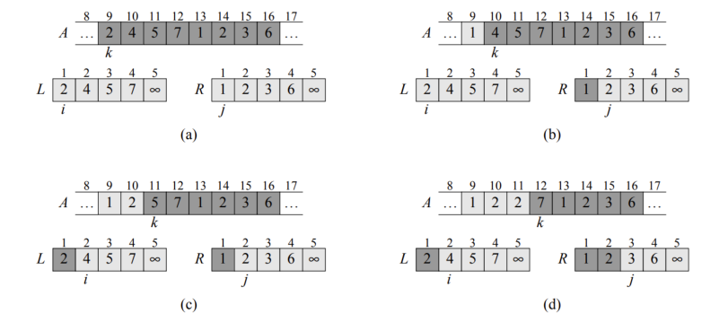

<!-- Start of picture text -->
89 10 1 1213 14 151617 8 9 10 11 12:13 14 15 16 17, k k 1 2°03 44°75 1 203 4° 5 12°03 44) 5 1203 4°65 (PEGI) «CEG = EEG) e MGT) i J i J (a) (b) 8 9 10 11 12:13: 14 15 16 17, 8 9 10 1 12:13: 14 15 16 17 27 knian 20 k na a 1 OBE2 4 1 BEC2 4 1 CECI)2 4 EGC1 2 4 i J a J (©) (@) <!-- End of picture text -->

Figura: Ejemplo de MERGE 

2do Cuatrimestre de 2026 

10 / 55 

TDA - Algo3 (DC, FCEyN, UBA) 

DC - FCEyN - UBA 

Divide & Conquer 

Algoritmo de Strassen 

Timba y máximo subarreglo 

Búsqueda y extensiones 

Algoritmo de Karatsuba 

Ejemplo de D&C: Merge sort 

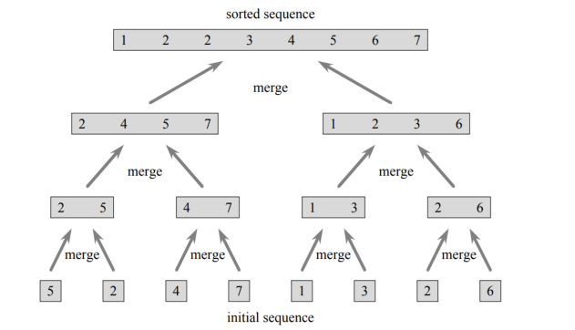

<!-- Start of picture text -->
sorted sequence 12234567 amerge ~_, J we\ J, vow \ Em a H B iG} initial sequence <!-- End of picture text -->

Figura: Ejemplo de MERGESORT 

2do Cuatrimestre de 2026 

11 / 55 

TDA - Algo3 (DC, FCEyN, UBA) 

DC - FCEyN - UBA 

Divide & Conquer 

Algoritmo de Strassen 

Timba y máximo subarreglo 

Búsqueda y extensiones 

Algoritmo de Karatsuba 

## Ejemplo de D&C: Merge sort 

## Teorema 

MERGESORT( _A, l, r_ ) termina y deja ordenados exactamente los elementos que estaban en _A_ [ _p..r_ ]. 

**Prueba por inducción en** _n_ = _r − l_ + 1 **.** 

Si _n ≤_ 1, el segmento ya está ordenado. Si _n >_ 1, ambas llamadas reciben segmentos de tamaño menor. Por hipótesis inductiva terminan, preservan sus elementos y ordenan cada mitad. Finalmente MERGE los une manteniéndolos ordenados, y eso ordena finalmente el segmento _A_ [ _l_ : _r_ ].1 

> 1Para ser correctos, nos faltaría probar que MERGE hace lo que queremos. Eso se podría hacer con un invariante, pero al nivel de la materia vamos a permitirnos decir que “claramente <mark>es</mark> co <mark>rr</mark> ect ~~o”.~~ 

TDA - Algo3 (DC, FCEyN, UBA) 

DC - FCEyN - UBA 2do Cuatrimestre de 2026 12 / 55 

Divide & Conquer 

Algoritmo de Strassen 

Timba y máximo subarreglo 

Búsqueda y extensiones 

Algoritmo de Karatsuba 

## Ejemplo de D&C: Merge sort 

Este algoritmo sigue el **patrón** de D&C. Veamos la cantidad de operaciones que se hace en cada componente del algoritmo. 

## Dividir 

Calcular el punto medio cuesta Θ(1). 

Conquistar Combinar Hay dos llamadas sobre MERGE toma Θ( _n_ ). instancias de tamaño _n/_ 2. 

Luego, la complejidad de MERGESORT satisface la siguiente recurrencia2 

_T_ ( _n_ ) = 2 _T_ ( _n/_ 2) + Θ( _n_ ) _, T_ (1) = Θ(1) _._ 

Cómo encontramos una cota fina a esta complejidad? 

> 2En realidad deberíamos usar _⌊n/_ 2 _⌋_ y _⌈n/_ 2 _⌉_ , pero en este caso (y en la mayoría de los de la materia) es irrelevante en términos de complejidad de peor caso. 

TDA - Algo3 (DC, FCEyN, UBA) 

DC - FCEyN - UBA 

2do Cuatrimestre de 2026 13 / 55 

Divide & Conquer 

Algoritmo de Strassen 

Timba y máximo subarreglo 

Búsqueda y extensiones 

Algoritmo de Karatsuba 

## Ejemplo de D&C: Merge sort 

Podemos pensar en el árbol de recursión, e intentar llevar la cuenta de cuánto se trabaja en cada llamado. Si frente a un arreglo de _n_ números se hacen _cn_ operaciones (ignorando la recursión), entonces tenemos los siguientes costos 

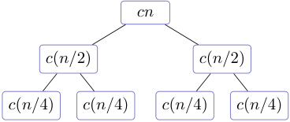

<!-- Start of picture text -->
cn c ( n/ 2) c ( n/ 2) c ( n/ 4) c ( n/ 4) c ( n/ 4) c ( n/ 4) <!-- End of picture text -->

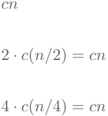

<!-- Start of picture text -->
cn 2  · c ( n/ 2) =  cn 4  · c ( n/ 4) =  cn <!-- End of picture text -->

En cada “piso” se hacen _cn_ operaciones, y hay log _n_ pisos. Luego, la complejidad parecería ser _O_ ( _n_ log _n_ ). Vamos a probarlo rigurosamente 

TDA - Algo3 (DC, FCEyN, UBA) 

DC - FCEyN - UBA 

2do Cuatrimestre de 2026 14 / 55 

Divide & Conquer 

Algoritmo de Strassen 

Timba y máximo subarreglo 

Búsqueda y extensiones 

Algoritmo de Karatsuba 

## Método de sustitución 

Supongamos que tenemos alguna recurrencia, como por ejemplo 

_T_ ( _n_ ) = 2 _T_ ( _n/_ 2) + Θ( _n_ ) _._ 

Si ya tenemos una cota _T_ ( _n_ ) = _O_ ( _f_ ( _n_ )) candidata, podemos intentar probarla directamente por inducción. 

## El método de sustitución 

- 1 Conjeturamos una cota. Es decir, una función _f_ ( _n_ ) y una constante _C_ . 

- 2 La usamos como hipótesis inductiva: para acotar _T_ ( _n_ ) la reescribimos recursivamente y usamos la hipótesis. 

Se llama _sustitución_ porque en el paso inductivo vamos a acotar / sustituir _T_ ( _n/_ 2) por _Cf_ ( _n/_ 2). 

2do Cuatrimestre de 2026 15 / 55 

TDA - Algo3 (DC, FCEyN, UBA) 

DC - FCEyN - UBA 

Divide & Conquer 

Algoritmo de Strassen 

Timba y máximo subarreglo 

Búsqueda y extensiones 

Algoritmo de Karatsuba 

## El método de sustitución 

Sea _d_ = _T_ (2) la cantidad de operaciones en el caso base de merge sort, y recordemos que existe una _c_ tal que 

_T_ ( _n_ ) _≤_ 2 _T_ ( _n/_ 2) + _cn._ 

Luego, tomemos _f_ ( _n_ ) = _n_ log _n_ y _C_ = max _{c, d}_ y probemos que _T_ ( _n_ ) _≤ Cn_ log _n_ , lo cual implicaría que _T_ ( _n_ ) = _O_ ( _n_ log _n_ ). Lo hacemos por inducción (con caso base _n_ = 2, ya que log 1 = 0). 

El caso base _n_ = 2 vale por elección de _d_ . Para el caso inductivo, tenemos que 

Por lo que probamos el caso inductivo. Luego, la complejidad de M <mark>E</mark> R <mark>GE</mark> SO ~~<u>R</u>~~ T e ~~<u>s</u>~~ _<mark>O</mark>_ <mark>(</mark> _<mark>n</mark>_ <mark>log</mark> TDA - Algo3 _<mark>n</mark>_ <mark>).</mark> (DC, FCEyN, UBA) DC - FCEyN - UBA 2do Cuatrimestre de 2026 

2do Cuatrimestre de 2026 16 / 55 

Divide & Conquer 

Algoritmo de Strassen 

Timba y máximo subarreglo 

Búsqueda y extensiones 

Algoritmo de Karatsuba 

## Algoritmo de Karatsuba 

Problema: producto de números 

Sean _x_ e _y_ números naturales de _n_ dígitos. Queremos calcular su producto _xy_ . Ya conocemos un algoritmo para hacer esto: el de la escuela. Qué complejidad tiene?3 

3De paso: qué complejidad tiene sumar, en comparación? 

TDA - Algo3 (DC, FCEyN, UBA) 

DC - FCEyN - UBA 

2do Cuatrimestre de 2026 17 / 55 

Divide & Conquer 

Algoritmo de Strassen 

Timba y máximo subarreglo 

Búsqueda y extensiones 

Algoritmo de Karatsuba 

## Algoritmo de Karatsuba 

Problema: producto de números 

Sean _x_ e _y_ números naturales de _n_ dígitos. Queremos calcular su producto _xy_ . 

Ya conocemos un algoritmo para hacer esto: el de la escuela. Qué complejidad tiene?3 Se puede implementar en tiempo _O_ ( _n_2 ). Ahora, intentemos hacer algo mejor usando D&C. 

3De paso: qué complejidad tiene sumar, en comparación? 

TDA - Algo3 (DC, FCEyN, UBA) 

DC - FCEyN - UBA 

2do Cuatrimestre de 2026 17 / 55 

Divide & Conquer 

Algoritmo de Strassen 

Timba y máximo subarreglo 

Búsqueda y extensiones 

Algoritmo de Karatsuba 

<!-- Start of picture text -->
x 1 y 1,  x 1 y 0,  x 0 y 1 y  x 0 y 0. La cantidad de pasos del algoritmo satisface la recursión resolvemos, solo la acotamos por  O ( n 2 )... <!-- End of picture text -->

## Algoritmo de Karatsuba 

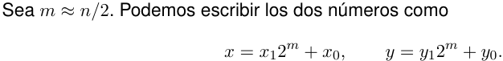

Luego, usando distributiva tenemos que 

_xy_ = _x_ 1 _y_ 122_m_ + ( _x_ 1 _y_ 0 + _x_ 0 _y_ 1)2_m_ + _x_ 0 _y_ 0 _._ 

Esto nos sugiere un algoritmo de D&C: calculamos los 4 productos de números de _n/_ 2 dígitos, y luego mergear las soluciones con la suma y los _shifteos_ . 

TDA - Algo3 (DC, FCEyN, UBA) 

DC - FCEyN - UBA 

2do Cuatrimestre de 2026 18 / 55 

Algoritmo de Strassen 

Timba y máximo subarreglo 

Búsqueda y extensiones 

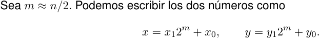

Luego, usando distributiva tenemos que 

_xy_ = _x_ 1 _y_ 122_m_ + ( _x_ 1 _y_ 0 + _x_ 0 _y_ 1)2_m_ + _x_ 0 _y_ 0 _._ 

Esto nos sugiere un algoritmo de D&C: calculamos los 4 productos de números de _n/_ 2 dígitos, y luego mergear las soluciones con la suma y los _shifteos_ . 

Cuatro subproductos Combinar _x_ 1 _y_ 1,, _x_ 1 _y_ 0,, _x_ 0 _y_ 1 y _x_ 0 _y_ 0.. Es Θ( _n_ ). 

La cantidad de pasos del algoritmo satisface la recursión _T_ ( _n_ ) = 4 _T_ ( _n/_ 2) + Θ( _n_ ). Si la resolvemos, solo la acotamos por _O_ ( _n_2 )... 

Divide & Conquer Algoritmo de Karatsuba Algoritmo de Karatsuba Sea _m ≈ n/_ 2 _x_ = _x_ Luego, usando distributiva tenemos que _xy_ = _x_ 1 dígitos, y luego mergear las soluciones con la suma y los Cuatro subproductos _x_ 1 _y_ 1,, _x_ 1 _y_ 0,, _x_ 0 _y_ 1 y _x_ 0 _y_ 0.. La cantidad de pasos del algoritmo satisface la recursión resolvemos, solo la acotamos por ~~<u><mark>_</mark></u>~~ TDA - Algo3 (DC, FCEyN, UBA) 

TDA - Algo3 (DC, FCEyN, UBA) DC - FCEyN - UBA 

2do Cuatrimestre de 2026 18 / 55 

Divide & Conquer 

Algoritmo de Strassen 

Timba y máximo subarreglo 

Búsqueda y extensiones 

Algoritmo de Karatsuba 

## Algoritmo de Karatsuba 

Alternativa: Calculamos recursivamente sólo 

Como 

obtenemos el término de antes como 

O sea: en vez de hacer 4 productos, hacemos unas sumas más y **solo 3 productos** . Notar que combinar se mantiene lineal. 

TDA - Algo3 (DC, FCEyN, UBA) 

DC - FCEyN - UBA 

2do Cuatrimestre de 2026 19 / 55 

Divide & Conquer 

Algoritmo de Strassen 

Timba y máximo subarreglo 

Búsqueda y extensiones 

Algoritmo de Karatsuba 

## Algoritmo de Karatsuba 

La cantidad de operaciones que hace el algoritmo ahora satisface la relación4 _T_ ( _n_ ) = 3 _T_ ( _n/_ 2) + Θ( _n_ ) _._ 

Si analizamos el árbol de recursión podemos encontrar un nuevo candidato para la recursión (en este caso, es Θ( _n_log2 3 )). En vez de hacer eso, vamos a ver una herramienta que automatiza el razonamiento que estábamos haciendo. 

- 4Alguien podría criticar que falta un +1 en la recursión porque los números son un poco más grandes que 

- _n/_ 2, pero podemos absorberlo en el Θ( _n_ ) del final argumentando un poco. 

DC - FCEyN - UBA 2do Cuatrimestre de 2026 20 / 55 

TDA - Algo3 (DC, FCEyN, UBA) 

Divide & Conquer 

Algoritmo de Strassen 

Timba y máximo subarreglo 

Búsqueda y extensiones 

Algoritmo de Karatsuba 

## El Teorema Maestro 

### Consideremos 

_T_ ( _n_ ) = _aT_ ( _n/b_ ) + _f_ ( _n_ ) _,_ 

donde _a ≥_ 1, _b >_ 1, _T_ (1) = Θ(1) y _f_ es eventualmente no negativa. Sea _q_ = log _b a_ . El teorema maestro dice que, dado _ε >_ 0, 

**Caso** Hipótesis Resultado **1** Si _f_ ( _n_ ) = _O_ ( _n__q−ε_ ) _T_ ( _n_ ) = Θ( _n__q_ ) **2** Si _f_ ( _n_ ) = Θ( _n__q_ log_r_ _n_ ) con _r ≥_ 0, _T_ ( _n_ ) = Θ( _n__q_ log_r_+1 _n_ ) **3** Si _f_ ( _n_ ) = Ω( _n__q_+_ε_ ) y _af_ ( _n/b_ ) _≤ cf_ ( _n_ ) para algún _T_ ( _n_ ) = Θ( _f_ ( _n_ )) 0 _< c <_ 1, eventualmente 

TDA - Algo3 (DC, FCEyN, UBA) 

DC - FCEyN - UBA 

2do Cuatrimestre de 2026 

21 / 55 

Divide & Conquer 

Algoritmo de Strassen 

Timba y máximo subarreglo 

Búsqueda y extensiones 

Algoritmo de Karatsuba 

## El Teorema Maestro 

**Caso** Hipótesis 

### Resultado 

**1** Si _f_ ( _n_ ) = _O_ ( _n__q−ε_ ), luego _T_ ( _n_ ) = Θ( _n__q_ ) **2** Si _f_ ( _n_ ) = Θ( _n__q_ log_r_ _n_ ) con _r ≥_ 0, _T_ ( _n_ ) = Θ( _n__q_ log_r_+1 _n_ ) **3** _f_ ( _n_ ) = Ω( _n__q_+_ε_ ) y _af_ ( _n/b_ ) _≤ cf_ ( _n_ ) para al- _T_ ( _n_ ) = Θ( _f_ ( _n_ )) gún 0 _< c <_ 1, eventualmente 

Como vamos a ver más adelante, el caso 1 se corresponde con la situación en la que la mayoría del trabajo se hace en las recursiones. El caso 3 se corresponde con la situación en que la mayoría del trabajo se hace en el primer piso. Finalmente, el caso 2 se cumple cuando ambos costos son similares. 

TDA - Algo3 (DC, FCEyN, UBA) 

DC - FCEyN - UBA 

2do Cuatrimestre de 2026 22 / 55 

Divide & Conquer 

Algoritmo de Strassen 

Timba y máximo subarreglo 

Búsqueda y extensiones 

Algoritmo de Karatsuba 

## El Teorema Maestro 

Supongamos que _n_ es potencia de _b_ (y entonces siempre se parte bien5 ). Tras _j_ niveles, 

_j−_ 1 _T_ ( _n_ ) = _a__j_ _T_ ( _n/b__j_ ) + ∑︂ _a__i_ _f_ ( _n/b__i_ ) _. i_ =0 

Sea _L_ = log _b n_ . Al llegar a los casos base: 

#### Como 

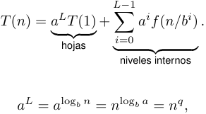

<!-- Start of picture text -->
L− 1 T ( n ) =  a ⏞ L ⏟⏟ T (1)⏞ + ∑ i =0 a i f ( n/b i ) . hojas ⏞ ⏟⏟ ⏞ niveles internos a L =  a log b n =  n log b a =  n q , <!-- End of picture text -->

<u>las hojas cuestan Θ(</u> _<u>n</u>__q_ <u>), y el nivel</u> _<u>i</u>_ <u>cuesta</u> _a__i_ _f_ ( _n/b__i_ ). 

5El caso más general es similar, y se puede reducir a este ya que las diferencias se las come la complejidad asintótica) 

TDA - Algo3 (DC, FCEyN, UBA) 

DC - FCEyN - UBA 

2do Cuatrimestre de 2026 23 / 55 

Divide & Conquer 

Algoritmo de Strassen 

Timba y máximo subarreglo 

Búsqueda y extensiones 

Algoritmo de Karatsuba 

## El Teorema Maestro 

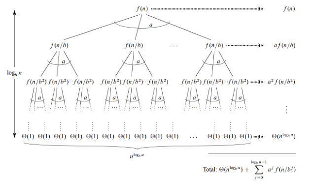

<!-- Start of picture text -->
F(n/b) F(n/b) . F(n/b) ssmmmnmnmnitw af (n/b) logy m | F(n/b?) f(n/b?)-fln/b?)— f(n/b?) f(n/b?y f(n/b?) S(m/b?) f(n/ b>) f(n[b?) meni a? f(n/b?) fle fle| ley le fle fl| fe| ff vee Total: (nb)+ > a! fn/b!) <!-- End of picture text -->

Figura: Diagrama del Teorema Maestro 

2do Cuatrimestre de 2026 

24 / 55 

TDA - Algo3 (DC, FCEyN, UBA) 

DC - FCEyN - UBA 

Divide & Conquer 

Algoritmo de Strassen 

Timba y máximo subarreglo 

Búsqueda y extensiones 

Algoritmo de Karatsuba 

## El Teorema Maestro: Caso 1 

Supongamos _f_ ( _n_ ) = _O_ ( _n__q−ε_ ). Como _a_ = _b__q_ , el nivel _i_ satisface para alguna constante _C a__i_ _f_ ( _n/b__i_ ) _≤ Ca__i_(︂ _b__ni_ )︂ _q−ε_ = _Cn__q−ε_ _b__εi_ _._ Con esto podemos acotar la suma geométrica como _L−_ 1 _L−_ 1 ∑︂ _a__i_ _f_ ( _n/b__i_ ) _≤ Cn__q−ε_ ∑︂( _b__ε_ )_i_ = _O_ (︁ _n__q−ε_ _b__εL_)︁ = _O_ ( _n__q_ ) _. i_ =0 _i_ =0 

Con esto podemos acotar la suma geométrica como 

Por lo tanto, en la expresión del costo el término de las hojas es dominante, y tenemos que: 

_T_ ( _n_ ) = Θ( _n__q_ ) _._ 

TDA - Algo3 (DC, FCEyN, UBA) 

DC - FCEyN - UBA 

2do Cuatrimestre de 2026 25 / 55 

Divide & Conquer 

Algoritmo de Strassen 

Timba y máximo subarreglo 

Búsqueda y extensiones 

Algoritmo de Karatsuba 

## El Teorema Maestro: Caso 2 

Supongamos _f_ ( _n_ ) = Θ( _n__q_ log_r_ _n_ ), con _r ≥_ 0. En el nivel _i_ : _a__i_ _f_ ( _n/b__i_ ) = Θ(︁ _a__i_ ( _n/b__i_ )_q_ log_r_ ( _n/b__i_ ))︁ = Θ( _n__q_ ( _L − i_ )_r_ ) _,_ 

pues _a_ = _b__q_ y log( _n/b__i_ ) = Θ( _L − i_ ). Entonces 

Como _L_ = Θ(log _n_ ), 

<!-- Start of picture text -->
L− 1 L ∑︂ a i f ( n/b i ) = Θ n q ∑︂ s r i =0 (︄ s =1 )︄ = Θ( n q L r +1 ) . T ( n ) = Θ( n q log r +1 n ) . <!-- End of picture text -->

TDA - Algo3 (DC, FCEyN, UBA) 

DC - FCEyN - UBA 

2do Cuatrimestre de 2026 

26 / 55 

Divide & Conquer 

Algoritmo de Strassen 

Timba y máximo subarreglo 

Búsqueda y extensiones 

Algoritmo de Karatsuba 

## El Teorema Maestro: Caso 3 

Supongamos _f_ ( _n_ ) = Ω( _n__q_+_ε_ ) y, para algún 0 _< c <_ 1 y todo _n_ suficientemente grande, _af_ ( _n/b_ ) _≤ cf_ ( _n_ ) _._ 

Iterando esta desigualadad, también sabemos que para _n_ suficientemente grande vale que _a__i_ _f_ ( _n/b__i_ ) _≤ c__i_ _f_ ( _n_ ) _._ 

Por lo tanto, aplicando esta desigualdad hasta el último piso donde se pueda (ya que solo vale a partir de un cierto _n_ ), podemos acotar 

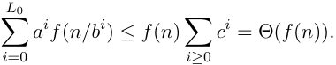

Los subárboles restantes aportan _O_ ( _n__q_ ), que es _O_ ( _f_ ( _n_ )). Concluimos entonces que 

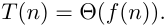

TDA - Algo3 (DC, FCEyN, UBA) 

DC - FCEyN - UBA 

2do Cuatrimestre de 2026 27 / 55 

Divide & Conquer Algoritmo de Karatsuba Algoritmo de Strassen Timba y máximo subarreglo Búsqueda y extensiones Los tres casos corresponden a tres formas del árbol Caso 1 Caso 2 Caso 3 El costo aumenta hacia Los niveles son El costo decrece hacia abajo. comparables. abajo. Dominan las hojas Se acumulan niveles Domina la raíz La prueba es simplemente el razonamiento que veníamos haciendo, pero hecho de forma más general. ~~<mark>=</mark>~~ TDA - Algo3 (DC, FCEyN, UBA) DC - FCEyN - UBA 2do Cuatrimestre de 2026 28 / 55 

2do Cuatrimestre de 2026 28 / 55 

Divide & Conquer 

Algoritmo de Strassen 

Timba y máximo subarreglo 

Búsqueda y extensiones 

Algoritmo de Karatsuba 

## El algoritmo de Karatsuba 

Apliquemos el teorema a la recursión de Karatsuba. La relación era 

_T_ ( _n_ ) = 3 _T_ ( _n/_ 2) + Θ( _n_ ) 

Entonces, tenemos 

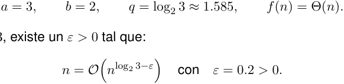

Como 1 _<_ log2 3, existe un _ε >_ 0 tal que: 

Por el caso 1, 

_T_ ( _n_ ) = Θ( _n_log2 3 ) _≈O_ ( _n_1_._585 ) _._ 

TDA - Algo3 (DC, FCEyN, UBA) 

DC - FCEyN - UBA 

2do Cuatrimestre de 2026 29 / 55 

Divide & Conquer 

Algoritmo de Strassen 

Timba y máximo subarreglo 

Búsqueda y extensiones 

Algoritmo de Karatsuba 

## Mergesort de nuevo 

Para practicar, apliquemos el Teorema Maestro a la recurrencia de Merge Sort _T_ ( _n_ ) = 2 _T_ ( _n/_ 2) + Θ( _n_ ) 

En este caso, tenemos 

_a_ = 2 _, b_ = 2 _, q_ = log2 2 = 1 _, f_ ( _n_ ) = Θ( _n_ ) 

Entonces caemos en el caso 2, con _r_ = 0, y vale que 

_T_ ( _n_ ) = Θ( _n_ log _n_ ) 

TDA - Algo3 (DC, FCEyN, UBA) 

DC - FCEyN - UBA 

2do Cuatrimestre de 2026 30 / 55 

Divide & Conquer 

Algoritmo de Strassen 

Timba y máximo subarreglo 

Búsqueda y extensiones 

Algoritmo de Karatsuba 

## El algoritmo de Karatsuba 

Unos comentarios interesantes: 

En Karatsuba mejoramos el algoritmo de producto partiendo los números de _n_ bits en 2 de _n/_ 2. Mejorará la cosa si partimos en 3? Y en 4? 

> 6Ver _Nature of Computation_ de Moore para más :D 

TDA - Algo3 (DC, FCEyN, UBA) 

2do Cuatrimestre de 2026 

31 / 55 

DC - FCEyN - UBA 

Divide & Conquer 

Algoritmo de Strassen 

Timba y máximo subarreglo 

Búsqueda y extensiones 

Algoritmo de Karatsuba 

## El algoritmo de Karatsuba 

Unos comentarios interesantes: 

En Karatsuba mejoramos el algoritmo de producto partiendo los números de _n_ bits en 2 de _n/_ 2. Mejorará la cosa si partimos en 3? Y en 4? Se puede! Y mejora. Es más, mientras más partes usamos, mejor. En general, podemos hacer un algoritmo _O_ ( _n_1+_ε_ ) para cualquier _ε >_ 0. Este algoritmo (o bien familia de algoritmos) se conoce como **Algoritmo de Toom-Cook** . 

> 6Ver _Nature of Computation_ de Moore para más :D 

TDA - Algo3 (DC, FCEyN, UBA) 

DC - FCEyN - UBA 

2do Cuatrimestre de 2026 31 / 55 

Divide & Conquer 

Algoritmo de Strassen 

Timba y máximo subarreglo 

Búsqueda y extensiones 

Algoritmo de Karatsuba 

## El algoritmo de Karatsuba 

### Unos comentarios interesantes: 

En Karatsuba mejoramos el algoritmo de producto partiendo los números de _n_ bits en 2 de _n/_ 2. Mejorará la cosa si partimos en 3? Y en 4? Se puede! Y mejora. Es más, mientras más partes usamos, mejor. En general, podemos hacer un algoritmo _O_ ( _n_1+_ε_ ) para cualquier _ε >_ 0. Este algoritmo (o bien familia de algoritmos) se conoce como **Algoritmo de Toom-Cook** . Pero se puede hacer mejor: podemos elegir la cantidad de particiones de forma dinámica. Haciendo esto, se puede obtener una complejidad _O_ ( _n_ 2 _√_ 2 log _n_ log _n_ ) (este algoritmo es de Knuth). 

> 6Ver _Nature of Computation_ de Moore para más :D 

TDA - Algo3 (DC, FCEyN, UBA) 

DC - FCEyN - UBA 

2do Cuatrimestre de 2026 31 / 55 

Divide & Conquer 

Algoritmo de Strassen 

Timba y máximo subarreglo 

Búsqueda y extensiones 

Algoritmo de Karatsuba 

## El algoritmo de Karatsuba 

Unos comentarios interesantes: 

En Karatsuba mejoramos el algoritmo de producto partiendo los números de _n_ bits en 2 de _n/_ 2. Mejorará la cosa si partimos en 3? Y en 4? 

Se puede! Y mejora. Es más, mientras más partes usamos, mejor. En general, podemos hacer un algoritmo _O_ ( _n_1+_ε_ ) para cualquier _ε >_ 0. Este algoritmo (o bien familia de algoritmos) se conoce como **Algoritmo de Toom-Cook** . Pero se puede hacer mejor: podemos elegir la cantidad de particiones de forma dinámica. Haciendo esto, se puede obtener una complejidad _O_ ( _n_ 2 _√_ 2 log _n_ log _n_ ) (este algoritmo es de Knuth). 

Y se puede mejorar más: reduciendo el problema a multiplicación de matrices, la complejidad se puede bajar a _O_ ( _n_ log _n_ log log _n_ ) (Strassen). 

> 6Ver _Nature of Computation_ de Moore para más :D 

2do Cuatrimestre de 2026 

TDA - Algo3 (DC, FCEyN, UBA) 

DC - FCEyN - UBA 

31 / 55 

Divide & Conquer 

Algoritmo de Strassen 

Timba y máximo subarreglo 

Búsqueda y extensiones 

Algoritmo de Karatsuba 

## El algoritmo de Karatsuba 

Unos comentarios interesantes: 

En Karatsuba mejoramos el algoritmo de producto partiendo los números de _n_ bits en 2 de _n/_ 2. Mejorará la cosa si partimos en 3? Y en 4? 

Se puede! Y mejora. Es más, mientras más partes usamos, mejor. En general, podemos hacer un algoritmo _O_ ( _n_1+_ε_ ) para cualquier _ε >_ 0. Este algoritmo (o bien familia de algoritmos) se conoce como **Algoritmo de Toom-Cook** . Pero se puede hacer mejor: podemos elegir la cantidad de particiones de forma dinámica. Haciendo esto, se puede obtener una complejidad _O_ ( _n_ 2 _√_ 2 log _n_ log _n_ ) (este algoritmo es de Knuth). 

Y se puede mejorar más: reduciendo el problema a multiplicación de matrices, la complejidad se puede bajar a _O_ ( _n_ log _n_ log log _n_ ) (Strassen). Lo óptimo se cree que es _O_ ( _n_ log _n_ ) (conjetura de Kolmogorov, entre otros), y fue alcanzado en 2019. La constante escondida es tan grande que para que el algoritmo <u>sea práctico la entrada tiene que tener tamaño por lo menos 2</u>1038 .6 

- 6Ver _Nature of Computation_ de Moore para más :D 

2do Cuatrimestre de 2026 31 / 55 

TDA - Algo3 (DC, FCEyN, UBA) 

DC - FCEyN - UBA 

Divide & Conquer 

Algoritmo de Strassen 

Timba y máximo subarreglo 

Búsqueda y extensiones 

Algoritmo de Karatsuba 

Pausa 

Pausa 

TDA - Algo3 (DC, FCEyN, UBA) 

DC - FCEyN - UBA 

2do Cuatrimestre de 2026 32 / 55 

Divide & Conquer 

Algoritmo de Strassen 

Timba y máximo subarreglo 

Búsqueda y extensiones 

Algoritmo de Karatsuba 

El algoritmo de Strassen 

Problema: multiplicar matrices Dadas dos matrices _A_ y _B_ , queremos calcular _C_ = _AB_ . Usando el algoritmo del CBC... Qué complejidad alcanzamos? 

TDA - Algo3 (DC, FCEyN, UBA) 

DC - FCEyN - UBA 

2do Cuatrimestre de 2026 33 / 55 

Divide & Conquer 

Algoritmo de Strassen 

Timba y máximo subarreglo 

Búsqueda y extensiones 

Algoritmo de Karatsuba 

El algoritmo de Strassen 

Problema: multiplicar matrices Dadas dos matrices _A_ y _B_ , queremos calcular _C_ = _AB_ . Usando el algoritmo del CBC... Qué complejidad alcanzamos? Es _O_ ( _n_3 ). Para mejorarlo, vamos a usar de vuelta D&C. 

TDA - Algo3 (DC, FCEyN, UBA) 

DC - FCEyN - UBA 

2do Cuatrimestre de 2026 33 / 55 

Divide & Conquer 

Algoritmo de Strassen 

Timba y máximo subarreglo 

Búsqueda y extensiones 

Algoritmo de Karatsuba 

## Algoritmo de Strassen 

Dividimos las matrices en bloques, 

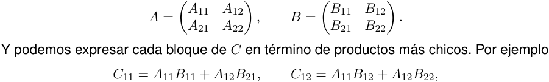

y análogamente para _C_ 21 y _C_ 22. En este algoritmo, qué complejidad tiene combinar? 

TDA - Algo3 (DC, FCEyN, UBA) 

DC - FCEyN - UBA 

2do Cuatrimestre de 2026 34 / 55 

Algoritmo de Strassen 

Timba y máximo subarreglo 

Búsqueda y extensiones 

Algoritmo de Karatsuba 

Divide & Conquer 

## Algoritmo de Strassen 

Dividimos las matrices en bloques, 

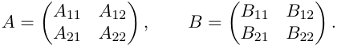

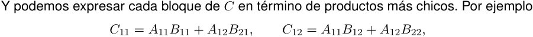

y análogamente para _C_ 21 y _C_ 22. 

En este algoritmo, qué complejidad tiene combinar? _O_ ( _n_2 ), o sea, lineal con respecto a la entrada. 

La recurrencia de la cantidad de operaciones es 

_T_ ( _m_ ) = 8 _T_ ( _m/_ 4) + Θ( _m_ ) 

con _m_ = _n_2 . Usando Maestro, sale que la complejidad es Θ( _m_3_/_2 ) = Θ(( _n_2 )3_/_2 ) = Θ( _n_3 ). O sea, no mejoramos nada. 

DC - FCEyN - UBA 2do Cuatrimestre de 2026 34 / 55 

TDA - Algo3 (DC, FCEyN, UBA) 

Divide & Conquer 

Algoritmo de Strassen 

Timba y máximo subarreglo 

Búsqueda y extensiones 

Algoritmo de Karatsuba 

## El algoritmo de Strassen 

Con mucha inspiración, es posible darse cuenta, como hizo Strassen, de que con 7 multiplicaciones podemos recuperar todos los bloques de _C_ . Estos son los elegidos: 

_M_ 1 = ( _A_ 11 + _A_ 22)( _B_ 11 + _B_ 22) _, M_ 2 = ( _A_ 21 + _A_ 22) _B_ 11 _, M_ 3 = _A_ 11( _B_ 12 _− B_ 22) _, M_ 4 = _A_ 22( _B_ 21 _− B_ 11) _, M_ 5 = ( _A_ 11 + _A_ 12) _B_ 22 _, M_ 6 = ( _A_ 21 _− A_ 11)( _B_ 11 + _B_ 12) _, M_ 7 = ( _A_ 12 _− A_ 22)( _B_ 21 + _B_ 22) _._ 

Por ejemplo, _C_ 11 = _M_ 1 + _M_ 7 + _M_ 4 _− M_ 5 (cuidado, lo revisé a mano). Esto reduce el problema de multiplicar dos matrices de _n × n_ a multiplicar 7 de _∼ n/_ 2 _× n/_ 2 y hacer _O_ (1) sumas que se pueden hacer en _O_ ( _n_2 ). Luego, la recurrencia queda como: 

_T_ ( _n_2 ) = 7 _T_ ( _n_2 _/_ 4) + Θ( _n_2 ) 

TDA - Algo3 (DC, FCEyN, UBA) 

DC - FCEyN - UBA 

2do Cuatrimestre de 2026 35 / 55 

Divide & Conquer 

Algoritmo de Strassen 

Timba y máximo subarreglo 

Búsqueda y extensiones 

Algoritmo de Karatsuba 

## Algoritmo de Strassen 

Llamando _m_ = _n_2 , 

_T_ ( _m_ ) = 7 _T_ ( _m/_ 4) + Θ( _m_ ) 

Las variables del Teorema Maestro quedan como _a_ = 7 _, b_ = 4 _, q_ = log4 7 _∼_ 1 _._ 41 _, f_ ( _m_ ) = Θ( _m_ ) 

Como _f_ ( _m_ ) = _m_ = _O_ ( _m__q−_0_._1 ) estamos en el primer caso, y la complejidad es _T_ ( _m_ ) = Θ( _m__q_ ) = _O_ (( _n_2 )1_,_41 ) = _O_ ( _n_2_,_82 ). Mejoramos! 

TDA - Algo3 (DC, FCEyN, UBA) 

DC - FCEyN - UBA 

2do Cuatrimestre de 2026 

36 / 55 

Divide & Conquer 

Algoritmo de Strassen 

Timba y máximo subarreglo 

Búsqueda y extensiones 

Algoritmo de Karatsuba 

## El algoritmo de Strassen 

Algunos comentarios adicionales: 

Se podrá hacer mejor? Onda, partir en más subbloques y encontrar (mágicamente) nuevas reescrituras? 

TDA - Algo3 (DC, FCEyN, UBA) 

DC - FCEyN - UBA 

2do Cuatrimestre de 2026 37 / 55 

Divide & Conquer 

Algoritmo de Strassen 

Timba y máximo subarreglo 

Búsqueda y extensiones 

Algoritmo de Karatsuba 

## El algoritmo de Strassen 

Algunos comentarios adicionales: 

Se podrá hacer mejor? Onda, partir en más subbloques y encontrar (mágicamente) nuevas reescrituras? 

Si y no. Ahora no es tan sencillo “descubrir” los subbloques, ni aprender como pegarlos. Strassen (con herramientas de Schönhage) demostró que, en el fondo, su algoritmo se corresponde con encontrar una **descomposición tensorial** del producto. 

TDA - Algo3 (DC, FCEyN, UBA) 

DC - FCEyN - UBA 

2do Cuatrimestre de 2026 37 / 55 

Divide & Conquer 

Algoritmo de Strassen 

Timba y máximo subarreglo 

Búsqueda y extensiones 

Algoritmo de Karatsuba 

## El algoritmo de Strassen 

Algunos comentarios adicionales: 

Se podrá hacer mejor? Onda, partir en más subbloques y encontrar (mágicamente) nuevas reescrituras? 

Si y no. Ahora no es tan sencillo “descubrir” los subbloques, ni aprender como pegarlos. Strassen (con herramientas de Schönhage) demostró que, en el fondo, su algoritmo se corresponde con encontrar una **descomposición tensorial** del producto. El juego entonces es encontrar mejores descomposiciones tensoriales. 

**Autores Año Complejidad** Strassen 1969 _O_ <u>(</u> _n_2_._8074) Coppersmith–Winograd 1990 _O_ (︁ _n_2_._375477+_ε_)︁ Vassilevska Williams 2012 _O_ (︁ _n_2_._3729+_ε_)︁ Le Gall 2014 _O_ (︁ _n_2_._372864+_ε_)︁ Duan–Wu–Zhou 2023 _O_ (︁ _n_2_._371866+_ε_)︁ Vassilevska Williams–Xu–Xu–Zhou 2024 _O_ (︁ _n_2_._371552+_ε_)︁ Dupont et al. ( _preprint_ ) 2026 _O_ <u><mark>(</mark></u> _n_2_._37117<mark>7+</mark>_ε_<u><mark>)</mark></u> 

TDA - Algo3 (DC, FCEyN, UBA) 

<u>DC - FCEyN - UBA</u> 

<u>2do Cuatrimestre de 2026</u> 37 / 55 

Divide & Conquer 

Algoritmo de Strassen 

Timba y máximo subarreglo 

Búsqueda y extensiones 

Algoritmo de Karatsuba 

## Timba 

## Problema: Timbear 

Tenemos predicciones para el precio de una acción para distintos días como _p_ 1 _. . . pn_ . Tenemos que elegir un día _i_ para comprar, y uno _j_ para vender. Naturalmente, queremos maximizar la ganancia. 

Formalmente, buscamos _i < j_ tal que 

_pj − pi_ = max 1 _≤a<b≤n__{pb −pa}_ 

Cuál es el algoritmo obvio? Qué complejidad tiene? 

TDA - Algo3 (DC, FCEyN, UBA) 

DC - FCEyN - UBA 

2do Cuatrimestre de 2026 38 / 55 

Divide & Conquer 

Algoritmo de Strassen 

Timba y máximo subarreglo 

Búsqueda y extensiones 

Algoritmo de Karatsuba 

## Timba 

## Problema: Timbear 

Tenemos predicciones para el precio de una acción para distintos días como _p_ 1 _. . . pn_ . Tenemos que elegir un día _i_ para comprar, y uno _j_ para vender. Naturalmente, queremos maximizar la ganancia. 

Formalmente, buscamos _i < j_ tal que 

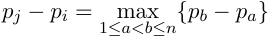

Cuál es el algoritmo obvio? Qué complejidad tiene? 

El problema se puede resolver fácilmente en _O_ ( _n_2 ). Intentemos hacerlo más rápido. 

TDA - Algo3 (DC, FCEyN, UBA) 

DC - FCEyN - UBA 

2do Cuatrimestre de 2026 38 / 55 

Divide & Conquer 

Algoritmo de Strassen 

Timba y máximo subarreglo 

Búsqueda y extensiones 

Algoritmo de Karatsuba 

## Timba 

Vamos a usar una estrategia muy útil para resolver problemas: reducirlo a otro (que con un poco de suerte ya resolvió otra persona, o bien es más fácil). Definamos 

_dk_ = _pk_ +1 _− pk,_ 1 _≤ k < n._ 

_dk_ indica la ganancia que obtenemos si compramos al día _k_ y vendemos al _k_ + 1. Si compramos el día _i_ y vendemos el día _j_ , vale que 

_pj − pi_ = ( _pi_ +1 _− pi_ ) + ( _pi_ +2 _− pi_ +1) + _· · ·_ + ( _pj − pj−_ 1) _j−_ 1 = _dk._ ∑︂ _k_ = _i_ 

O sea, los índices que maximizan _pj − pi_ son exactamente los que maximizan∑︁_j_ _k__−_ =1 _i__dk_. 

2do Cuatrimestre de 2026 39 / 55 

TDA - Algo3 (DC, FCEyN, UBA) 

DC - FCEyN - UBA 

Divide & Conquer 

Algoritmo de Strassen 

Timba y máximo subarreglo 

Búsqueda y extensiones 

Algoritmo de Karatsuba 

## Máximo subarreglo 

Más formalmente, tenemos la siguiente proposición Proposición 

_r_ max max _dk._ ∑︂ 1 _≤i<j≤n_(_pj−pi_) = 1 _≤ℓ≤r<n k_ = _ℓ_ 

En particular, si ( _i, j_ ) es una solución al problema de la timba, ( _i, j −_ 1) es una solución del problema de máximo subarreglo, y hay una traducción análoga en la otra dirección. **Demostración.** Es inmediata de la igualdad con la suma telescópica que hicimos antes. En base a este resultado, podemos olvidarnos de la timba y quedarnos con el problema del máximo subarreglo. 

TDA - Algo3 (DC, FCEyN, UBA) 

DC - FCEyN - UBA 

2do Cuatrimestre de 2026 40 / 55 

Divide & Conquer 

Algoritmo de Strassen 

Timba y máximo subarreglo 

Búsqueda y extensiones 

Algoritmo de Karatsuba 

<!-- Start of picture text -->
Está completamente Está completamente contenido en [ ℓ, m ]. contenido en [ m  + 1 , r ]. Intuitivamente MAXSUB( ℓ, r ) = max { MAXSUB( ℓ, m ) ,  MAXSUB( m  + 1 , r <!-- End of picture text -->

## Máximo subarreglo 

### Intentemos proponer un enfoque con D&C para resolver el problema. Qué podríamos hacer? 

TDA - Algo3 (DC, FCEyN, UBA) 

DC - FCEyN - UBA 

2do Cuatrimestre de 2026 41 / 55 

Divide & Conquer 

Algoritmo de Strassen 

Timba y máximo subarreglo 

Búsqueda y extensiones 

Algoritmo de Karatsuba 

## Máximo subarreglo 

Intentemos proponer un enfoque con D&C para resolver el problema. Qué podríamos hacer? Dividir el arreglo a la mitad, hacer recursión de cada lado, luego al combinar buscar el máximo subarreglo que pasa por el medio. Más formalmente, si buscamos el máximo subarreglo entre dos índices _ℓ_ y _r_ , hay tres opciones, con _m_ = ( _ℓ_ + _r_ ) _/_ 2: 

## Izquierda 

Está completamente contenido en [ _ℓ, m_ ]. 

Derecha 

Está completamente contenido en [ _m_ + 1 _, r_ ]. 

Cruza 

Cruza el centro: comienza en _i ≤ m_ y termina en _j ≥ m_ + 1. 

Intuitivamente 

MAXSUB( _ℓ, r_ ) = max _{_ MAXSUB( _ℓ, m_ ) _,_ MAXSUB( _m_ + 1 _, r_ ) _,_ CRUZA( _ℓ, m, r_ ) _} ._ 

TDA - Algo3 (DC, FCEyN, UBA) 

DC - FCEyN - UBA 

2do Cuatrimestre de 2026 

41 / 55 

Divide & Conquer 

Algoritmo de Strassen 

Timba y máximo subarreglo 

Búsqueda y extensiones 

Algoritmo de Karatsuba 

## Máximo subarreglo 

Para la parte de combinar, alcanza con observar que hay que maximizar para la izquierda y luego para la derecha: 

<!-- Start of picture text -->
j CRUZA( ℓ, m, r ) = max ∑︂ dk ℓ≤i≤m<j≤r k = i m j = max dk  + max dk. ∑︂ ∑︂ ℓ≤i≤m m<j≤r k = i k = m +1 <!-- End of picture text -->

En qué complejidad podemos calcular esto? 

TDA - Algo3 (DC, FCEyN, UBA) 

DC - FCEyN - UBA 

2do Cuatrimestre de 2026 42 / 55 

Divide & Conquer 

Algoritmo de Strassen 

Timba y máximo subarreglo 

Búsqueda y extensiones 

Algoritmo de Karatsuba 

## Máximo subarreglo 

Para la parte de combinar, alcanza con observar que hay que maximizar para la izquierda y luego para la derecha: 

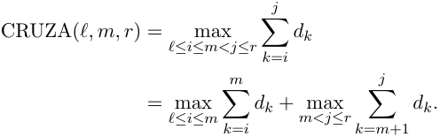

<!-- Start of picture text -->
j CRUZA( ℓ, m, r ) = max ∑︂ dk ℓ≤i≤m<j≤r k = i m j = max dk  + max dk. ∑︂ ∑︂ ℓ≤i≤m m<j≤r k = i k = m +1 <!-- End of picture text -->

En qué complejidad podemos calcular esto? En Θ( _r − ℓ_ ), es un recorrido manteniendo el mejor sufijo / prefijo. 

TDA - Algo3 (DC, FCEyN, UBA) 

DC - FCEyN - UBA 

2do Cuatrimestre de 2026 42 / 55 

Divide & Conquer 

Algoritmo de Strassen 

Timba y máximo subarreglo 

Búsqueda y extensiones 

Algoritmo de Karatsuba 

## Máximo subarreglo 

Hacemos que los llamados recursivos devuelvan el valor máximo y también el intervalo que lo alcanza. 

MAX-SUBARRAY( _d, ℓ, r_ ) 

**if** _ℓ_ = _r_ : **return** ([ _ℓ, ℓ_ ] _, dℓ_ ) _m ←⌊_ ( _ℓ_ + _r_ ) _/_ 2 _⌋ L ←_ MAX-SUBARRAY( _d, ℓ, m_ ) _R ←_ MAX-SUBARRAY( _d, m_ + 1 _, r_ ) _C ←_ MAX-CROSSING( _d, ℓ, m, r_ ) **return** el candidato de mayor suma entre _L, R, C_ 

**Correctitud** : por inducción, dado que solo hay 3 casos posibles (y tomamos el máximo entre los 3). 

TDA - Algo3 (DC, FCEyN, UBA) 

DC - FCEyN - UBA 

2do Cuatrimestre de 2026 43 / 55 

Divide & Conquer 

Algoritmo de Strassen 

Timba y máximo subarreglo 

Búsqueda y extensiones 

Algoritmo de Karatsuba 

## Máximo subarreglo 

**Complejidad** La cantidad de operaciones que hace el algoritmo satisface la recursión _T_ ( _n_ ) = 2 _T_ ( _n/_ 2) + Θ( _n_ ) _._ 

Podemos usar el Teorema Maestro (aunque esta recursión ya apareció antes) _a_ = 2 _, b_ = 2 _, q_ = 1 _, f_ ( _n_ ) = Θ( _n_ ) 

y por lo tanto caemos en el caso 2 con _r_ = 0: la complejidad final queda 

_T_ ( _n_ ) = Θ( _n_ log _n_ ) _._ 

TDA - Algo3 (DC, FCEyN, UBA) 

DC - FCEyN - UBA 

2do Cuatrimestre de 2026 44 / 55 

Divide & Conquer 

Algoritmo de Strassen 

Timba y máximo subarreglo 

Búsqueda y extensiones 

Algoritmo de Karatsuba 

## Máximo subarreglo 

Se puede hacer mejor? Hay alguna parte en donde estemos siendo redundantes? 

TDA - Algo3 (DC, FCEyN, UBA) 

DC - FCEyN - UBA 

2do Cuatrimestre de 2026 45 / 55 

Divide & Conquer 

Algoritmo de Strassen 

Timba y máximo subarreglo 

Búsqueda y extensiones 

Algoritmo de Karatsuba 

## Máximo subarreglo 

Se puede hacer mejor? Hay alguna parte en donde estemos siendo redundantes? En cada llamado recursivo se recorre todo el arreglo, y después cuando buscamos el máximo subarreglo que cruza volvemos a recorrer el arreglo. No podrían los llamados recursivos ayudarnos? 

TDA - Algo3 (DC, FCEyN, UBA) 

DC - FCEyN - UBA 

2do Cuatrimestre de 2026 45 / 55 

Divide & Conquer 

Algoritmo de Strassen 

Timba y máximo subarreglo 

Búsqueda y extensiones 

Algoritmo de Karatsuba 

## Máximo subarreglo 

Se puede hacer mejor? Hay alguna parte en donde estemos siendo redundantes? En cada llamado recursivo se recorre todo el arreglo, y después cuando buscamos el máximo subarreglo que cruza volvemos a recorrer el arreglo. No podrían los llamados recursivos ayudarnos? 

**Idea** : que cada llamado devuelva los índices de su mejor subarreglo, su valor, pero también los máximos subarreglos que empiezan **desde cada borde** . 

TDA - Algo3 (DC, FCEyN, UBA) 

DC - FCEyN - UBA 

2do Cuatrimestre de 2026 

45 / 55 

Divide & Conquer 

Algoritmo de Strassen 

Timba y máximo subarreglo 

Búsqueda y extensiones 

Algoritmo de Karatsuba 

## Máximo subarreglo 

### Para un segmento no vacío _X_ = _dℓ, . . . , dr_ definimos 

_r q_ tot( _X_ ) = ∑︂ _dk,_ pre( _X_ ) = max ∑︂ _dk, ℓ≤q≤r k_ = _ℓ k_ = _ℓ r v_ suf( _X_ ) = max ∑︂ _dk,_ best( _X_ ) = max ∑︂ _dk. ℓ≤q≤r ℓ≤u≤v≤r k_ = _q k_ = _u_ 

Para un singleton _X_ = ( _x_ ), 

tot( _X_ ) = pre( _X_ ) = suf( _X_ ) = best( _X_ ) = _x._ 

Es decir, para el caso base podemos calcular todo fácilmente. 

TDA - Algo3 (DC, FCEyN, UBA) 

DC - FCEyN - UBA 

2do Cuatrimestre de 2026 46 / 55 

Divide & Conquer 

Algoritmo de Strassen 

Timba y máximo subarreglo 

Búsqueda y extensiones 

Algoritmo de Karatsuba 

## Máximo subarreglo 

Sea _X_ = _LR_ , con _L_ y _R_ consecutivos. Entonces 

tot( _X_ ) = tot( _L_ ) + tot( _R_ ) _,_ 

TDA - Algo3 (DC, FCEyN, UBA) 

DC - FCEyN - UBA 

2do Cuatrimestre de 2026 47 / 55 

Divide & Conquer 

Algoritmo de Strassen 

Timba y máximo subarreglo 

Búsqueda y extensiones 

Algoritmo de Karatsuba 

## Máximo subarreglo 

Sea _X_ = _LR_ , con _L_ y _R_ consecutivos. Entonces 

tot( _X_ ) = tot( _L_ ) + tot( _R_ ) _,_ 

pre( _X_ ) = max _{_ pre( _L_ ) _,_ tot( _L_ ) + pre( _R_ ) _},_ 

TDA - Algo3 (DC, FCEyN, UBA) 

DC - FCEyN - UBA 

2do Cuatrimestre de 2026 47 / 55 

Divide & Conquer 

Algoritmo de Strassen 

Timba y máximo subarreglo 

Búsqueda y extensiones 

Algoritmo de Karatsuba 

## Máximo subarreglo 

Sea _X_ = _LR_ , con _L_ y _R_ consecutivos. Entonces 

tot( _X_ ) = tot( _L_ ) + tot( _R_ ) _,_ 

pre( _X_ ) = max _{_ pre( _L_ ) _,_ tot( _L_ ) + pre( _R_ ) _},_ 

suf( _X_ ) = max _{_ suf( _R_ ) _,_ suf( _L_ ) + tot( _R_ ) _}_ 

TDA - Algo3 (DC, FCEyN, UBA) 

DC - FCEyN - UBA 

2do Cuatrimestre de 2026 

47 / 55 

Divide & Conquer 

Algoritmo de Strassen 

Timba y máximo subarreglo 

Búsqueda y extensiones 

Algoritmo de Karatsuba 

## Máximo subarreglo 

Sea _X_ = _LR_ , con _L_ y _R_ consecutivos. Entonces 

tot( _X_ ) = tot( _L_ ) + tot( _R_ ) _,_ 

pre( _X_ ) = max _{_ pre( _L_ ) _,_ tot( _L_ ) + pre( _R_ ) _},_ 

suf( _X_ ) = max _{_ suf( _R_ ) _,_ suf( _L_ ) + tot( _R_ ) _}_ 

best( _X_ ) = max _{_ best( _L_ ) _,_ best( _R_ ) _,_ suf( _L_ ) + pre( _R_ ) _}_ 

Hay que justificar bien estas igualdades, capturan la correctitud del algoritmo recursivo. 

TDA - Algo3 (DC, FCEyN, UBA) 

DC - FCEyN - UBA 

2do Cuatrimestre de 2026 47 / 55 

Divide & Conquer 

Algoritmo de Strassen 

Timba y máximo subarreglo 

Búsqueda y extensiones 

Algoritmo de Karatsuba 

## Máximo subarreglo 

Con estos valores nos ahorramos gastar Θ( _n_ ) en la parte de combinar, y en cambio sale en _O_ (1). Luego, la recursión de la complejidad queda como 

_T_ ( _n_ ) = 2 _T_ ( _n/_ 2) + Θ(1) _._ 

Por el caso 1 del Teorema Maestro, 

_T_ ( _n_ ) = Θ( _n_ ) _._ 

lo cual es óptimo! **Tarea** : escribir bien el algoritmo para que devuelva también el intervalo que maximiza la suma (y no solo el valor máximo) 

TDA - Algo3 (DC, FCEyN, UBA) 

DC - FCEyN - UBA 

2do Cuatrimestre de 2026 48 / 55 

Divide & Conquer 

Algoritmo de Strassen 

Timba y máximo subarreglo 

Búsqueda y extensiones 

Algoritmo de Karatsuba 

## Búsqueda binaria 

La búsqueda binaria es un caso de D&C 

BINARY-SEARCH( _A, x, ℓ, r_ ) 

**Precondición** : _A_ [ _ℓ_ : _r_ ] está ordenado **if** _ℓ> r_ : **return** NO-ESTÁ _m ←⌊_ ( _ℓ_ + _r_ ) _/_ 2 _⌋_ **if** _A_ [ _m_ ] = _x_ : **return** _m_ **if** _x < A_ [ _m_ ]: **return** BINARY-SEARCH( _A, x, ℓ, m −_ 1) **si no** : 

**return** BINARY-SEARCH( _A, x, m_ + 1 _, r_ ) 

La complejidad respeta una recursión de la forma 

_T_ ( _n_ ) _≤ T_ ( _n/_ 2) + Θ(1) 

y usando el Teorema Maestro se puede ver que esto es _O_ (log _n_ ). 

TDA - Algo3 (DC, FCEyN, UBA) 

2do Cuatrimestre de 2026 49 / 55 

DC - FCEyN - UBA 

Divide & Conquer 

Algoritmo de Strassen 

Timba y máximo subarreglo 

Búsqueda y extensiones 

Algoritmo de Karatsuba 

## Más allá de búsqueda binaria 

Pero la idea de búsqueda binaria va más allá de un arreglo. Basta tener: un dominio ordenado de candidatos _T_ ; un predicado _P_ ( _t_ ) que queremos evaluar; y un único umbral _t__⋆_ donde el predicado cambia 

falso _, t < t__⋆_ _, P_ ( _t_ ) = {︄verdadero _, t ≥ t__⋆_ _._ 

En general vamos a poder hacer búsqueda binaria para encontrar el menor _t_ para el que la propiedad se cumple en _O_ (log _|T |_ ) (asumiendo que evaluar _P_ toma _O_ (1)). 

TDA - Algo3 (DC, FCEyN, UBA) 

DC - FCEyN - UBA 

2do Cuatrimestre de 2026 50 / 55 

Divide & Conquer 

Algoritmo de Strassen 

Timba y máximo subarreglo 

Búsqueda y extensiones 

Algoritmo de Karatsuba 

## Encuentro 

## Problema 

Tenemos _n_ amigos distribuidos en distintas posiciones _p_ 1 _. . . pn_ en una recta. Cada amigo tiene una cierta velocidad máxima a la que se puede mover _vi_ (en ambos sentidos). La pregunta es: cuál es el menor tiempo _t_ tal que todos los amigos se pueden encontrar? 

TDA - Algo3 (DC, FCEyN, UBA) 

DC - FCEyN - UBA 

2do Cuatrimestre de 2026 51 / 55 

Divide & Conquer 

Algoritmo de Strassen 

Timba y máximo subarreglo 

Búsqueda y extensiones 

Algoritmo de Karatsuba 

## Encuentro 

## Problema 

Tenemos _n_ amigos distribuidos en distintas posiciones _p_ 1 _. . . pn_ en una recta. Cada amigo tiene una cierta velocidad máxima a la que se puede mover _vi_ (en ambos sentidos). La pregunta es: cuál es el menor tiempo _t_ tal que todos los amigos se pueden encontrar? 

Asumamos que las posiciones están en metros, que el tiempo se mide en segundos, que la velocidad está expresada en metros por segundos y que hay un máximo tiempo (en segundos) _T_ . Aparte, supongamos que nos piden el menor segundo a partir del cuál se pueden encontrar. 

Hay algún algoritmo fácil que resuelva el problema? 

TDA - Algo3 (DC, FCEyN, UBA) 

DC - FCEyN - UBA 

2do Cuatrimestre de 2026 51 / 55 

Divide & Conquer 

Algoritmo de Strassen 

Timba y máximo subarreglo 

Búsqueda y extensiones 

Algoritmo de Karatsuba 

## Encuentro 

Intentemos repensar lo que nos piden. Que se puedan encontrar en el momento _t_ es equivalente a que exista un punto _p_ tal que todos puedan acercarse en _t_ o menos segundos. Dado un amigo _i_ , podemos calcular qué posiciones puede alcanzar en _t_ o menos segundos? 

TDA - Algo3 (DC, FCEyN, UBA) 

DC - FCEyN - UBA 

2do Cuatrimestre de 2026 52 / 55 

Divide & Conquer 

Algoritmo de Strassen 

Timba y máximo subarreglo 

Búsqueda y extensiones 

Algoritmo de Karatsuba 

## Encuentro 

Intentemos repensar lo que nos piden. Que se puedan encontrar en el momento _t_ es equivalente a que exista un punto _p_ tal que todos puedan acercarse en _t_ o menos segundos. Dado un amigo _i_ , podemos calcular qué posiciones puede alcanzar en _t_ o menos segundos? Es exactamente el intervalo 

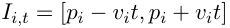

Luego... Cuándo vale que existe un punto en el que todos pueden encontrarse en _t_ o menos segundos? 

TDA - Algo3 (DC, FCEyN, UBA) 

DC - FCEyN - UBA 

2do Cuatrimestre de 2026 52 / 55 

Divide & Conquer 

Algoritmo de Strassen 

Timba y máximo subarreglo 

Búsqueda y extensiones 

Algoritmo de Karatsuba 

## Encuentro 

Intentemos repensar lo que nos piden. Que se puedan encontrar en el momento _t_ es equivalente a que exista un punto _p_ tal que todos puedan acercarse en _t_ o menos segundos. Dado un amigo _i_ , podemos calcular qué posiciones puede alcanzar en _t_ o menos segundos? Es exactamente el intervalo 

Luego... Cuándo vale que existe un punto en el que todos pueden encontrarse en _t_ o menos segundos? Tiene que haber un punto en común en esta intersección. Es decir, 

⋂︂ _n Ii,t̸_ = _∅ i_ =1 

TDA - Algo3 (DC, FCEyN, UBA) 

DC - FCEyN - UBA 

2do Cuatrimestre de 2026 52 / 55 

Divide & Conquer 

Algoritmo de Strassen 

Timba y máximo subarreglo 

Búsqueda y extensiones 

Algoritmo de Karatsuba 

## Encuentro 

Ahora si podemos proponer un primer algoritmo. 

- 1 Iterar por cada 0 _≤ t ≤ T_ . 

- 2 Por cada _t_ ver si⋂︁_n_ _i_ =1_Ii,t̸_=_∅_y quedarnos con el más chico (si no hay ninguno, los amigos no pueden encontrarse). 

El algoritmo es correcto: hace búsqueda sobre cada posible valor de _t_ , y para cada uno revisa exactamente si los amigos pueden encontrarse. **Complejidad** : 

TDA - Algo3 (DC, FCEyN, UBA) 

DC - FCEyN - UBA 

2do Cuatrimestre de 2026 53 / 55 

Divide & Conquer 

Algoritmo de Strassen 

Timba y máximo subarreglo 

Búsqueda y extensiones 

Algoritmo de Karatsuba 

## Encuentro 

Ahora si podemos proponer un primer algoritmo. 

- 1 Iterar por cada 0 _≤ t ≤ T_ . 

- 2 Por cada _t_ ver si⋂︁_n_ _i_ =1_Ii,t̸_=_∅_y quedarnos con el más chico (si no hay ninguno, los amigos no pueden encontrarse). 

El algoritmo es correcto: hace búsqueda sobre cada posible valor de _t_ , y para cada uno revisa exactamente si los amigos pueden encontrarse. **Complejidad** : _O_ ( _nT_ ) si implementamos prolijamente la intersección de intervalos. 

Se puede mejorar? 

TDA - Algo3 (DC, FCEyN, UBA) 

DC - FCEyN - UBA 

2do Cuatrimestre de 2026 

53 / 55 

Divide & Conquer 

Algoritmo de Strassen 

Timba y máximo subarreglo 

Búsqueda y extensiones 

Algoritmo de Karatsuba 

## Encuentro 

Notemos que hay un primer punto _t_ a partir del cual los amigos siempre pueden encontrarse. Esto es porque _Ii,t ⊆ Ii,t_ +1 (o, en criollo, si te doy más tiempo siempre podes cubrir más terreno). Luego, podemos hacer **búsqueda binaria** sobre [0 _. . . T_ ]. Agregando esta mejora, la complejidad baja a _O_ ( _n_ log _T_ ), lo cual alcanza para pasar este juez -> `https://codeforces.com/problemset/problem/782/B` 

TDA - Algo3 (DC, FCEyN, UBA) 

DC - FCEyN - UBA 

2do Cuatrimestre de 2026 54 / 55 

Algoritmo de Strassen 

Timba y máximo subarreglo 

Búsqueda y extensiones 

Algoritmo de Karatsuba 

La técnica de D&C permite resolver algunos problemas. La idea central es subdividir el problema en subproblemas, y luego combinar las soluciones obtenidas recursivamente. 

7Si los subproblemas no tienen el mismo tamaño se puede usar el Teorema de Akra-Bazzi, que generaliza el Maestro 

TDA - Algo3 (DC, FCEyN, UBA) 

Divide & Conquer Conclusión recursivamente. el Maestro ~~<u><mark>a</mark></u>~~ TDA - Algo3 (DC, FCEyN, UBA) 

DC - FCEyN - UBA 

2do Cuatrimestre de 2026 55 / 55 

Divide & Conquer Algoritmo de Karatsuba Algoritmo de Strassen Timba y máximo subarreglo Búsqueda y extensiones Conclusión La técnica de D&C permite resolver algunos problemas. La idea central es subdividir el problema en subproblemas, y luego combinar las soluciones obtenidas recursivamente. Generalmente las demostraciones de correctitud se hacen por inducción, y los cálculos de complejidad usando el Teorema Maestro7 . 7Si los subproblemas no tienen el mismo tamaño se puede usar el Teorema de Akra-Bazzi, que generaliza el Maestro ~~<mark>a</mark>~~ TDA - Algo3 (DC, FCEyN, UBA) DC - FCEyN - UBA 2do Cuatrimestre de 2026 55 / 55 

Divide & Conquer 

Algoritmo de Strassen 

Timba y máximo subarreglo 

Búsqueda y extensiones 

Algoritmo de Karatsuba 

## Conclusión 

La técnica de D&C permite resolver algunos problemas. La idea central es subdividir el problema en subproblemas, y luego combinar las soluciones obtenidas recursivamente. 

Generalmente las demostraciones de correctitud se hacen por inducción, y los cálculos de complejidad usando el Teorema Maestro7 . La tensión de la complejidad está entre el costo de los llamados recursivos y el costo de la combinación. Identificar cuál es el cuello de botella es relevante para entender qué hay que optimizar (ver el caso de máximo subarreglo). 

- 7Si los subproblemas no tienen el mismo tamaño se puede usar el Teorema de Akra-Bazzi, que generaliza 

- el Maestro 

TDA - Algo3 (DC, FCEyN, UBA) 

DC - FCEyN - UBA 

2do Cuatrimestre de 2026 55 / 55 

Divide & Conquer 

Algoritmo de Strassen 

Timba y máximo subarreglo 

Búsqueda y extensiones 

Algoritmo de Karatsuba 

## Conclusión 

La técnica de D&C permite resolver algunos problemas. La idea central es subdividir el problema en subproblemas, y luego combinar las soluciones obtenidas recursivamente. 

Generalmente las demostraciones de correctitud se hacen por inducción, y los cálculos de complejidad usando el Teorema Maestro7 . 

La tensión de la complejidad está entre el costo de los llamados recursivos y el costo de la combinación. Identificar cuál es el cuello de botella es relevante para entender qué hay que optimizar (ver el caso de máximo subarreglo). 

La búsqueda binaria es un tipo de algoritmo de D&C, y tiene muchas más aplicaciones que hacer búsquedas en bases de datos! 

- 7Si los subproblemas no tienen el mismo tamaño se puede usar el Teorema de Akra-Bazzi, que generaliza 

- el Maestro 

TDA - Algo3 (DC, FCEyN, UBA) 

DC - FCEyN - UBA 

2do Cuatrimestre de 2026 55 / 55 

