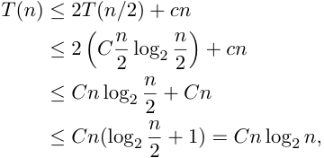

## El método de sustitución 

Sea _d_ = _T_ (2) la cantidad de operaciones en el caso base de merge sort, y recordemos que existe una _c_ tal que 

_T_ ( _n_ ) _≤_ 2 _T_ ( _n/_ 2) + _cn._ 

Luego, tomemos _f_ ( _n_ ) = _n_ log _n_ y _C_ = max _{c, d}_ y probemos que _T_ ( _n_ ) _≤ Cn_ log _n_ , lo cual implicaría que _T_ ( _n_ ) = _O_ ( _n_ log _n_ ). Lo hacemos por inducción (con caso base _n_ = 2, ya que log 1 = 0). 

El caso base _n_ = 2 vale por elección de _d_ . Para el caso inductivo, tenemos que 

Por lo que probamos el caso inductivo. Luego, la complejidad de M <mark>E</mark> R <mark>GE</mark> SO ~~<u>R</u>~~ T e ~~<u>s</u>~~ _<mark>O</mark>_ <mark>(</mark> _<mark>n</mark>_ <mark>log</mark> TDA - Algo3 _<mark>n</mark>_ <mark>).</mark> (DC, FCEyN, UBA) DC - FCEyN - UBA 2do Cuatrimestre de 2026 

2do Cuatrimestre de 2026 16 / 55 

Divide & Conquer 

Algoritmo de Strassen 

Timba y máximo subarreglo 

Búsqueda y extensiones 

Algoritmo de Karatsuba 

