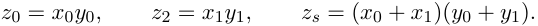
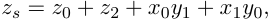
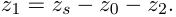

## Algoritmo de Karatsuba 

Alternativa: Calculamos recursivamente sólo 

Como 

obtenemos el término de antes como 

O sea: en vez de hacer 4 productos, hacemos unas sumas más y **solo 3 productos** . Notar que combinar se mantiene lineal. 

TDA - Algo3 (DC, FCEyN, UBA) 

DC - FCEyN - UBA 

2do Cuatrimestre de 2026 19 / 55 

Divide & Conquer 

Algoritmo de Strassen 

Timba y máximo subarreglo 

Búsqueda y extensiones 

Algoritmo de Karatsuba 

