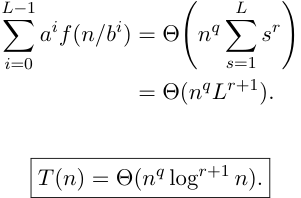

## El Teorema Maestro: Caso 2 

Supongamos _f_ ( _n_ ) = Θ( _n__q_ log_r_ _n_ ), con _r ≥_ 0. En el nivel _i_ : _a__i_ _f_ ( _n/b__i_ ) = Θ(︁ _a__i_ ( _n/b__i_ )_q_ log_r_ ( _n/b__i_ ))︁ = Θ( _n__q_ ( _L − i_ )_r_ ) _,_ 

pues _a_ = _b__q_ y log( _n/b__i_ ) = Θ( _L − i_ ). Entonces 

Como _L_ = Θ(log _n_ ), 

<!-- Start of picture text -->
L− 1 L ∑︂ a i f ( n/b i ) = Θ n q ∑︂ s r i =0 (︄ s =1 )︄ = Θ( n q L r +1 ) . T ( n ) = Θ( n q log r +1 n ) . <!-- End of picture text -->

TDA - Algo3 (DC, FCEyN, UBA) 

DC - FCEyN - UBA 

2do Cuatrimestre de 2026 

26 / 55 

Divide & Conquer 

Algoritmo de Strassen 

Timba y máximo subarreglo 

Búsqueda y extensiones 

Algoritmo de Karatsuba 

