Ordenamiento topológico 

Búsqueda a lo ancho 

Búsqueda en profundidad 

Detección de aristas de corte 

Los grafos como modelos 

Algoritmos sobre grafos Representaciones, ordenamiento topológico, BFS y DFS 

Departamento de Computación Facultad de Ciencias Exactas y Naturales Universidad de Buenos Aires 

2_do_ Cuatrimestre de 2026 

2_do_ Cuatrimestre de 2026 

(DC, FCEyN, UBA) 

DC - FCEyN - UBA 

1 / 58 

Ordenamiento topológico 

Búsqueda a lo ancho 

Búsqueda en profundidad 

Detección de aristas de corte 

Los grafos como modelos 

# Agenda de hoy 

- 1 Representación de grafos. 2 Ordenamiento topológico 

> 3 Búsqueda a lo ancho (BFS). 

> 4 Búsqueda en profundidad (DFS). 

> 5 Detección de aristas de corte. 

Basado en Cormen, Leiserson, Rivest, Stein, _Introduction to Algorithms_ , cap. 20. 

2_do_ Cuatrimestre de 2026 2 / 58 

(DC, FCEyN, UBA) 

DC - FCEyN - UBA 

Ordenamiento topológico 

Búsqueda a lo ancho 

Búsqueda en profundidad 

Detección de aristas de corte 

Los grafos como modelos 

# El grafo y su representación son objetos diferentes 

### **Objeto matemático** 

### **Estructura de datos** 

<!-- Start of picture text -->
1 0 2 4 3 <!-- End of picture text -->

Debe almacenar los vértices y las aristas. 

Debe permitir las operaciones que necesita el algoritmo. Distintas representaciones inducen distintos costos. 

_G_ = ( _V , E_ ) 

No hay una representación universalmente mejor. 

2_do_ Cuatrimestre de 2026 

(DC, FCEyN, UBA) 

DC - FCEyN - UBA 

3 / 58 

Ordenamiento topológico 

Búsqueda a lo ancho 

Búsqueda en profundidad 

Detección de aristas de corte 

Los grafos como modelos 

# Representamos el grafo mediante sus vecindarios 

En la práctica suponemos 

_V_ = _{_ 0 _, . . . , n −_ 1 _}._ 

**Operaciones que nos interesan** consultar si _vw ∈ E_ 

Para cada vértice _v_ , 

recorrer _N_ ( _v_ ) 

_N_ ( _v_ ) = _{w ∈ V_ : _vw ∈ E}._ 

insertar o remover aristas 

Una representación computacional implementa la función 

insertar o remover vértices 

_v ↦−→ N_ ( _v_ ) _._ 

2_do_ Cuatrimestre de 2026 4 / 58 

(DC, FCEyN, UBA) 

DC - FCEyN - UBA 

Ordenamiento topológico 

Búsqueda a lo ancho 

Búsqueda en profundidad 

Detección de aristas de corte 

Los grafos como modelos 

# Un mismo grafo admite distintas representaciones 

### **Grafo** 

### **Listas** 

### **Matriz** 

<!-- Start of picture text -->
0  ↦→ 1, 4 1 0 1  ↦→ 0, 2, 3, 4 2  ↦→ 1, 3 2 3  ↦→ 1, 2, 4 4 3 4  ↦→ 0, 1, 3 <!-- End of picture text -->

<!-- Start of picture text -->
0 1 2 3 4 0 0 1 0 0 1 1 1 0 1 1 1 2 0 1 0 1 0 3 0 1 1 0 1 4 1 1 0 1 0 <!-- End of picture text -->

La elección no cambia el grafo; cambia cómo accedemos a su información. 

2_do_ Cuatrimestre de 2026 5 / 58 

(DC, FCEyN, UBA) 

DC - FCEyN - UBA 

Ordenamiento topológico 

Búsqueda a lo ancho 

Búsqueda en profundidad 

Detección de aristas de corte 

Los grafos como modelos 

# Las listas almacenan solamente los vecinos existentes 

<!-- Start of picture text -->
0 1 4 1 0 2 3 4 2 1 3 3 1 2 4 4 0 1 3 <!-- End of picture text -->

Adj[ _v_ ] = _N_ ( _v_ ) _._ 

Hay una lista enlazada por vértice. 

En un digrafo se guardan, usualmente, los vecinos de salida: 

_N_+ ( _v_ ) = _{w_ : _v → w ∈ E}._ 

El orden de los vecinos no está determinado por el grafo. 

2_do_ Cuatrimestre de 2026 6 / 58 

(DC, FCEyN, UBA) 

DC - FCEyN - UBA 

Ordenamiento topológico 

Búsqueda a lo ancho 

Búsqueda en profundidad 

Detección de aristas de corte 

Los grafos como modelos 

# El espacio de las listas es lineal en el tamaño del grafo 

### **Digrafos** 

∑︂ _|_ Adj[ _v_ ] _|_ = _m. v ∈V_ 

_n_ encabezados uno por vértice 

Cada arco _v → w_ aparece una sola vez, en la lista de _v_ . 

### **Grafos no dirigidos** 

∑︂ _|_ Adj[ _v_ ] _|_ = 2 _m. v ∈V_ 

_m_ o 2 _m_ entradas una o dos por arista 

Espacio total: Θ( _n_ + _m_ ). 

Cada arista _vw_ aparece en las listas de _v_ y de _w_ . 

7 / 58 

2_do_ Cuatrimestre de 2026 

(DC, FCEyN, UBA) 

DC - FCEyN - UBA 

Ordenamiento topológico 

Búsqueda a lo ancho 

Búsqueda en profundidad 

Detección de aristas de corte 

Los grafos como modelos 

# Los costos dependen de cómo implementamos cada lista 

Supongamos listas no ordenadas, acceso directo a Adj[ _v_ ] e inserción al frente. **Consultas Actualizaciones** 

recorrer _N_ ( _v_ ) : _O_ ( _d_ ( _v_ )) _,_ decidir si _vw ∈ E_ : _O_ ( _d_ ( _v_ )) _._ 

Para decidir adyacencia debemos buscar _w_ dentro de la lista de _v_ . 

insertar _vw_ : _O_ (1) _,_ remover _vw_ : _O_ ( _d_ ( _v_ ) + _d_ ( _w_ )) _,_ remover _v_ : _O_ ( _n_ + _m_ ) (peor caso). 

2_do_ Cuatrimestre de 2026 8 / 58 

(DC, FCEyN, UBA) 

DC - FCEyN - UBA 

Ordenamiento topológico 

Búsqueda a lo ancho 

Búsqueda en profundidad 

Detección de aristas de corte 

Los grafos como modelos 

# La matriz reserva una posición para cada par de vértices 

1 _,_ si _vw ∈ E, A_ [ _v , w_ ] = {︄0 _,_ si _vw ∈/ E._ Espacio: Θ( _n_2 ). Consultar _vw ∈ E_ : _O_ (1). Recorrer _N_ ( _v_ ): _O_ ( _n_ ). Si _G_ es no dirigido, _A_ = _A_T . 

0 1 2 3 4 0 0 **1** 0 0 **1** 1 **1** 0 **1 1 1** 2 0 **1** 0 **1** 0 3 0 **1 1** 0 **1** 4 **1 1** 0 **1** 0 

La fila _v_ codifica _N_ ( _v_ ). 

2_do_ Cuatrimestre de 2026 9 / 58 

(DC, FCEyN, UBA) 

DC - FCEyN - UBA 

Ordenamiento topológico 

Búsqueda a lo ancho 

Búsqueda en profundidad 

Detección de aristas de corte 

Los grafos como modelos 

# La operación dominante orienta la elección 

Espacio Consultar _vw ∈ E_ Recorrer _N_ ( _v_ ) Recorrer todas las aristas 

**Listas** 

Θ( _n_ + _m_ ) _O_ ( _d_ ( _v_ )) _O_ ( _d_ ( _v_ )) _O_ ( _n_ + _m_ ) 

**Matriz** Θ( _n_2 ) _O_ (1) _O_ ( _n_ ) _O_ ( _n_2 ) 

**Grafo con pocas aristas** suelen convenir las listas porque _n_ + _m ≪ n_2 si _m ∼ n_ . 

**Grafo denso** puede convenir la matriz. 

2_do_ Cuatrimestre de 2026 

(DC, FCEyN, UBA) 

DC - FCEyN - UBA 

10 / 58 

Ordenamiento topológico 

Búsqueda a lo ancho 

Búsqueda en profundidad 

Detección de aristas de corte 

Los grafos como modelos 

# Los pesos se almacenan junto con las aristas 

**Listas de adyacencia** 

### **Matriz de adyacencia** 

Cada entrada guarda el vecino y el peso: Adj[ _v_ ] _∋_ ( _w, p_ ( _v , w_ )) _._ 

_p_ ( _v , w_ ) _, vw ∈ E, A_ [ _v , w_ ] = {︄NIL _, vw ∈/ E._ 

Por ejemplo, 

Adj[0] = [(1 _,_ 7) _,_ (4 _,_ 3)] _._ 

## Cuidado 

No conviene usar 0 para indicar ausencia si una arista puede tener peso 0. 

La estructura básica no cambia: cambia la información asociada a cada arista. 

2_do_ Cuatrimestre de 2026 11 / 58 

(DC, FCEyN, UBA) 

DC - FCEyN - UBA 

Ordenamiento topológico 

Búsqueda a lo ancho 

Búsqueda en profundidad 

Detección de aristas de corte 

Los grafos como modelos 

# Un orden topológico respeta todas las aristas 

Sea _D_ = ( _V , E_ ) un digrafo. Un **ordenamiento topológico** de _D_ es un orden lineal _v_ 1 _, v_ 2 _, . . . , vn_ de todos sus vértices tal que _vi → vj ∈ E_ = _⇒ i < j_ . 

<!-- Start of picture text -->
a b c d e f <!-- End of picture text -->

todas las flechas avanzan en el orden 

2_do_ Cuatrimestre de 2026 12 / 58 

(DC, FCEyN, UBA) 

DC - FCEyN - UBA 

Ordenamiento topológico 

Búsqueda a lo ancho 

Búsqueda en profundidad 

Detección de aristas de corte 

Los grafos como modelos 

# Un orden topológico respeta todas las aristas 

Sea _D_ = ( _V , E_ ) un digrafo. Un **ordenamiento topológico** de _D_ es un orden lineal _v_ 1 _, v_ 2 _, . . . , vn_ de todos sus vértices tal que _vi → vj ∈ E_ = _⇒ i < j_ . 

<!-- Start of picture text -->
a b c d e f <!-- End of picture text -->

todas las flechas avanzan en el orden 

## Lema 

Todo digrafo acíclico (DAG) tiene un vértice _v_ tal que _d_( _v_ ) = 0. 

2_do_ Cuatrimestre de 2026 12 / 58 

(DC, FCEyN, UBA) 

DC - FCEyN - UBA 

Ordenamiento topológico 

Búsqueda a lo ancho 

Búsqueda en profundidad 

Detección de aristas de corte 

Los grafos como modelos 

# Un orden topológico respeta todas las aristas 

Sea _D_ = ( _V , E_ ) un digrafo. Un **ordenamiento topológico** de _D_ es un orden lineal _v_ 1 _, v_ 2 _, . . . , vn_ de todos sus vértices tal que _vi → vj ∈ E_ = _⇒ i < j_ . 

<!-- Start of picture text -->
a b c d e f <!-- End of picture text -->

todas las flechas avanzan en el orden 

## Lema 

Todo digrafo acíclico (DAG) tiene un vértice _v_ tal que _d_( _v_ ) = 0. 

## Teorema 

Un digrafo admite un ordenamiento topológico si y solo si es acíclico . 

DC - FCEyN - UBA 2_do_ Cuatrimestre de 2026 12 / 58 

(DC, FCEyN, UBA) 

Ordenamiento topológico 

Búsqueda a lo ancho 

Búsqueda en profundidad 

Detección de aristas de corte 

Los grafos como modelos 

# Vértices con grado de entrada igual a cero 

En un DAG siempre existe algún vértice de grado de entrada cero. Cualquiera de ellos puede ocupar la próxima posición del orden. 

2_do_ Cuatrimestre de 2026 13 / 58 

(DC, FCEyN, UBA) 

DC - FCEyN - UBA 

Ordenamiento topológico 

Búsqueda a lo ancho 

Búsqueda en profundidad 

Detección de aristas de corte 

Los grafos como modelos 

# Vértices con grado de entrada igual a cero 

En un DAG siempre existe algún vértice de grado de entrada cero. Cualquiera de ellos puede ocupar la próxima posición del orden. 

## Algoritmo recursivo 

> 1 Buscar un vértice _u_ tal que _dD__−_(_u_) = 0 y agregarlo al final del orden. 

> 2 Eliminar _u_ de _D_ . 

> 3 Aplicar recursivamente el algoritmo al digrafo _D − u_ . 

> 4 Si el digrafo restante no es vacío y no tiene ningún vértice de grado de entrada cero, entonces contiene un ciclo dirigido. 

2_do_ Cuatrimestre de 2026 13 / 58 

(DC, FCEyN, UBA) 

DC - FCEyN - UBA 

Ordenamiento topológico 

Búsqueda a lo ancho 

Búsqueda en profundidad 

Detección de aristas de corte 

Los grafos como modelos 

# Vértices con grado de entrada igual a cero 

En un DAG siempre existe algún vértice de grado de entrada cero. Cualquiera de ellos puede ocupar la próxima posición del orden. 

## Algoritmo recursivo 

> 1 Buscar un vértice _u_ tal que _dD__−_(_u_) = 0 y agregarlo al final del orden. 

> 2 Eliminar _u_ de _D_ . 

> 3 Aplicar recursivamente el algoritmo al digrafo _D − u_ . 

> 4 Si el digrafo restante no es vacío y no tiene ningún vértice de grado de entrada cero, entonces contiene un ciclo dirigido. 

## Complejidad 

Con listas de adyacencia, buscar y eliminar un vértice cuesta _O_ ( _n_ + _m_ ). Como se realizan hasta _n_ pasos, esta implementación cuesta _O_ (︁ _n_ ( _n_ + _m_ ))︁. 

2_do_ Cuatrimestre de 2026 

(DC, FCEyN, UBA) 

DC - FCEyN - UBA 

13 / 58 

Ordenamiento topológico 

Búsqueda a lo ancho 

Búsqueda en profundidad 

Detección de aristas de corte 

Los grafos como modelos 

# El próximo vértice debe tener grado de entrada cero 

En un DAG siempre existe algún vértice de grado de entrada 0. Cualquiera de ellos puede ocupar la próxima posición del orden. 

- _v_ entrada[ _v_ ] _←_ entrada[ _v_ ] _−_ 1 1 Agregar _u_ al final del orden. 2 Eliminar conceptualmente a _u_ . 

- _u_ 3 Disminuir el grado de entrada de cada vecino saliente. 

- entrada[ _u_ ] = 0 _w_ entrada[ _w_ ] _←_ entrada[ _w_ ] _−_ 1 4 Encolar los vecinos cuyo grado pasa a ser 0. 

   - Solo se modifican los grados de entrada de los vértices _v ∈ N_+ ( _u_ ). 

2_do_ Cuatrimestre de 2026 14 / 58 

(DC, FCEyN, UBA) 

DC - FCEyN - UBA 

Ordenamiento topológico 

Búsqueda a lo ancho 

Búsqueda en profundidad 

Detección de aristas de corte 

Los grafos como modelos 

# Una cola mantiene los vértices disponibles 

##### **ORDEN-TOPOLÓGICO** ( _D_ ) 

##### **Inicialización** 

##### **Construcción del orden** 

- 1 _n ←|V_ ( _D_ ) _| L ←⟨⟩_ 

- 2 **computar** entrada[ _v_ ] = _d__−_ ( _v_ ) **para todo** _v ∈ V_ ( _D_ ) 

- 3 _Q ←_ cola vacía 

- 4 **para todo** _v ∈ V_ ( _D_ ) **hacer** 5 **si** entrada[ _v_ ] = 0 **entonces** 6 ENCOLAR( _Q, v_ ) 

- 7 **mientras** _Q̸_ = ∅ **hacer** 

- 8 _u ←_ DESENCOLAR( _Q_ ) 

- 9 agregar _u_ al final de _L_ 

- 10 **para todo** _v ∈ N_+ ( _u_ ) **hacer** 

- 11 entrada[ _v_ ] _←_ entrada[ _v_ ] _−_ 1 12 **si** entrada[ _v_ ] = 0 **entonces** 13 ENCOLAR( _Q, v_ ) 

- 14 **si** _|L| < n_ **entonces** 15 **devolver** “ _D_ tiene un ciclo” 

- 16 **devolver** _L_ 

Cada vértice se encola una sola vez y cada arista se procesa una sola vez. 

2_do_ Cuatrimestre de 2026 15 / 58 

(DC, FCEyN, UBA) 

DC - FCEyN - UBA 

Ordenamiento topológico 

Búsqueda a lo ancho 

Búsqueda en profundidad 

Detección de aristas de corte 

Los grafos como modelos 

# Ejemplo: la cola se actualiza al eliminar cada vértice 

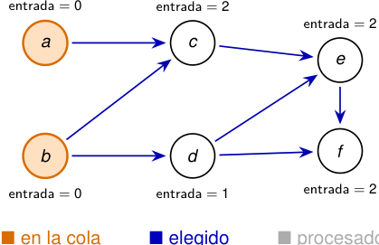

<!-- Start of picture text -->
entrada = 0 entrada = 2 entrada = 2 a c e b d f entrada = 0 entrada = 1 entrada = 2 ■ en la cola ■ elegido ■ procesado <!-- End of picture text -->

■ elegido ■ procesado 

**Inicialización** 

_Q_ = _⟨a, b⟩, L_ = _⟨⟩._ 

Los únicos vértices con grado de entrada 0 son _a_ y _b_ . 

2_do_ Cuatrimestre de 2026 16 / 58 

(DC, FCEyN, UBA) 

DC - FCEyN - UBA 

Ordenamiento topológico 

Búsqueda a lo ancho 

Búsqueda en profundidad 

Detección de aristas de corte 

Los grafos como modelos 

# Ejemplo: la cola se actualiza al eliminar cada vértice 

<!-- Start of picture text -->
entrada = 0 entrada = 1 entrada = 2 a c e b d f entrada = 0 entrada = 1 entrada = 2 ■ en la cola ■ elegido ■ procesado <!-- End of picture text -->

■ elegido ■ procesado 

**Procesamos** _a_ 

_Q_ = _⟨b⟩, L_ = _⟨a⟩._ 

Al eliminar _a → c_ , el grado de entrada de _c_ baja de 2 a 1. 

2_do_ Cuatrimestre de 2026 16 / 58 

(DC, FCEyN, UBA) 

DC - FCEyN - UBA 

Ordenamiento topológico 

Búsqueda a lo ancho 

Búsqueda en profundidad 

Detección de aristas de corte 

Los grafos como modelos 

# Ejemplo: la cola se actualiza al eliminar cada vértice 

<!-- Start of picture text -->
entrada = 0 entrada = 0 entrada = 2 a c e b d f entrada = 0 entrada = 0 entrada = 2 ■ en la cola ■ elegido ■ procesado <!-- End of picture text -->

■ elegido 

■ procesado 

**Procesamos** _b_ 

_Q_ = _⟨c, d⟩, L_ = _⟨a, b⟩._ Tanto _c_ como _d_ pasan a tener grado de entrada 0 y se encolan. 

2_do_ Cuatrimestre de 2026 16 / 58 

(DC, FCEyN, UBA) 

DC - FCEyN - UBA 

Ordenamiento topológico 

Búsqueda a lo ancho 

Búsqueda en profundidad 

Detección de aristas de corte 

Los grafos como modelos 

# Ejemplo: la cola se actualiza al eliminar cada vértice 

<!-- Start of picture text -->
entrada = 0 entrada = 0 entrada = 1 a c e b d f entrada = 0 entrada = 0 entrada = 2 <!-- End of picture text -->

#### **Procesamos** _c_ 

_Q_ = _⟨d⟩, L_ = _⟨a, b, c⟩._ El grado de entrada de _e_ baja de 2 a 1. 

■ en la cola 

■ elegido ■ procesado 

2_do_ Cuatrimestre de 2026 16 / 58 

(DC, FCEyN, UBA) 

DC - FCEyN - UBA 

Ordenamiento topológico 

Búsqueda a lo ancho 

Búsqueda en profundidad 

Detección de aristas de corte 

Los grafos como modelos 

# Ejemplo: la cola se actualiza al eliminar cada vértice 

<!-- Start of picture text -->
entrada = 0 entrada = 0 entrada = 0 a c e b d f entrada = 0 entrada = 0 entrada = 1 <!-- End of picture text -->

#### **Procesamos** _d_ 

_Q_ = _⟨e⟩, L_ = _⟨a, b, c, d⟩._ 

El vértice _e_ pasa a grado 0; el grado de _f_ baja a 1. 

■ en la cola 

■ elegido 

■ procesado 

2_do_ Cuatrimestre de 2026 16 / 58 

(DC, FCEyN, UBA) 

DC - FCEyN - UBA 

Ordenamiento topológico 

Búsqueda a lo ancho 

Búsqueda en profundidad 

Detección de aristas de corte 

Los grafos como modelos 

# Ejemplo: la cola se actualiza al eliminar cada vértice 

<!-- Start of picture text -->
entrada = 0 entrada = 0 entrada = 0 a c e b d f entrada = 0 entrada = 0 entrada = 0 ■ en la cola ■ elegido ■ procesado <!-- End of picture text -->

■ elegido ■ procesado 

#### **Procesamos** _e_ 

_Q_ = _⟨f ⟩, L_ = _⟨a, b, c, d, e⟩._ Al eliminar _e → f_ , el vértice _f_ queda disponible. 

2_do_ Cuatrimestre de 2026 16 / 58 

(DC, FCEyN, UBA) 

DC - FCEyN - UBA 

Ordenamiento topológico 

Búsqueda a lo ancho 

Búsqueda en profundidad 

Detección de aristas de corte 

Los grafos como modelos 

# Ejemplo: la cola se actualiza al eliminar cada vértice 

<!-- Start of picture text -->
entrada = 0 entrada = 0 entrada = 0 a c e b d f entrada = 0 entrada = 0 entrada = 0 <!-- End of picture text -->

#### **Procesamos** _f_ 

_Q_ = _⟨⟩, L_ = _⟨a, b, c, d, e, f ⟩._ Como _|L|_ = _|V_ ( _D_ ) _|_ , el algoritmo obtuvo un orden topológico. 

■ en la cola 

■ elegido ■ procesado 

2_do_ Cuatrimestre de 2026 16 / 58 

(DC, FCEyN, UBA) 

DC - FCEyN - UBA 

Ordenamiento topológico 

Búsqueda a lo ancho 

Búsqueda en profundidad 

Detección de aristas de corte 

Los grafos como modelos 

# El resultado coloca el origen antes que el destino 

#### La ejecución anterior devuelve 

#### _L_ = _⟨a, b, c, d, e, f ⟩._ 

<!-- Start of picture text -->
a b c d e f todas las aristas apuntan hacia la derecha Costo Si la cola se vacía antes Con listas de adyacencia, Si  |L| < |V ( D ) | , el subdigrafo inducido por los vértices restantes contiene un ciclo; no existe O (︁ |V ( D ) |  +  |E ( D ) | )︁ . orden topológico. <!-- End of picture text -->

2_do_ Cuatrimestre de 2026 17 / 58 

(DC, FCEyN, UBA) 

DC - FCEyN - UBA 

Ordenamiento topológico 

Búsqueda a lo ancho 

Búsqueda en profundidad 

Detección de aristas de corte 

Los grafos como modelos 

# Recorrer un grafo 

Muchos algoritmos sobre grafos siguen un mismo esquema para recorrer los vértices alcanzables desde un vértice inicial _s_ . 

> 1 Descubrir el vértice inicial _s_ . 

> 2 Mantener una colección de vértices descubiertos que todavía no fueron procesados. 

> 3 Elegir uno de esos vértices _u_ , procesarlo y examinar sus vecinos. 

> 4 Incorporar a la colección los vecinos de _u_ que todavía no fueron descubiertos. 

### **Estructura** 

**Orden de procesamiento** 

**Recorrido** 

Cola Pila 

primero el más antiguo primero el más reciente 

BFS DFS 

2_do_ Cuatrimestre de 2026 18 / 58 

(DC, FCEyN, UBA) 

DC - FCEyN - UBA 

Ordenamiento topológico 

Búsqueda a lo ancho 

Búsqueda en profundidad 

Detección de aristas de corte 

Los grafos como modelos 

# BFS explora por distancia creciente desde una fuente 

Sea _G_ = ( _V , E_ ) un grafo o digrafo **sin pesos** y sea _s ∈ V_ un vértice fuente. La búsqueda a lo ancho (BFS) explora primero los vértices más cercanos a _s_ . 

_Li_ = _{v ∈ V_ : _δ_ ( _s, v_ ) = _i},_ 

donde _δ_ ( _s, v_ ) es la longitud de un camino mínimo de _s_ a _v_ , y vale _∞_ si _v_ no es alcanzable desde _s_ . 

<!-- Start of picture text -->
L 0 =  {s} L 1 L 2 L 3 <!-- End of picture text -->

BFS calcula: 

- _d_ [ _v_ ]: la distancia desde _s_ hasta _v_ ; 

- _π_ [ _v_ ]: el predecesor de _v_ en un árbol de caminos mínimos. 

2_do_ Cuatrimestre de 2026 19 / 58 

(DC, FCEyN, UBA) 

DC - FCEyN - UBA 

Ordenamiento topológico 

Búsqueda a lo ancho 

Búsqueda en profundidad 

Detección de aristas de corte 

Los grafos como modelos 

# Los colores describen el estado de cada vértice 

Durante la ejecución, cada vértice se encuentra en uno de tres estados. 

Blanco: todavía no fue descubierto 

Su distancia es _d_ [ _v_ ] = _∞_ y su predecesor es _π_ [ _v_ ] = NIL. 

Gris: fue descubierto, pero no terminó de procesarse 

El vértice está en la cola. Es parte de la frontera entre los vértices descubiertos y los que todavía no fueron descubiertos. 

Negro: terminó de procesarse 

Toda su lista de adyacencia ya fue examinada. 

Al comienzo de cada iteración, la cola contiene exactamente los vértices grises. 

2_do_ Cuatrimestre de 2026 

(DC, FCEyN, UBA) 

DC - FCEyN - UBA 

20 / 58 

Ordenamiento topológico 

Búsqueda a lo ancho 

Búsqueda en profundidad 

Detección de aristas de corte 

Los grafos como modelos 

# BFS utiliza una cola para administrar la frontera 

**Función** BFS( _G, s_ ) 

**para cada** _u ∈ V_ ( _G_ ) _\ {s}_ **hacer** color[ _u_ ] _←_ blanco _d_ [ _u_ ] _←∞_ , _π_ [ _u_ ] _←_ NIL color[ _s_ ] _←_ gris _d_ [ _s_ ] _←_ 0, _π_ [ _s_ ] _←_ NIL _Q ←_ cola vacía; ENCOLAR( _Q, s_ ) **mientras** _Q̸_ = ∅ **hacer** _u ←_ DESENCOLAR( _Q_ ) **para cada** _v ∈_ Adj[ _u_ ] **hacer si** color[ _v_ ] = blanco **entonces** color[ _v_ ] _←_ gris _d_ [ _v_ ] _← d_ [ _u_ ] + 1, _π_ [ _v_ ] _← u_ ENCOLAR( _Q, v_ ) color[ _u_ ] _←_ negro 

**devolver** _d, π_ 

(DC, FCEyN, UBA) 

DC - FCEyN - UBA 

2_do_ Cuatrimestre de 2026 21 / 58 

Ordenamiento topológico 

Búsqueda a lo ancho 

Búsqueda en profundidad 

Detección de aristas de corte 

Los grafos como modelos 

# Ejemplo: la cola obliga a procesar el grafo por capas 

#### Suponemos que las listas de adyacencia están en orden alfabético. 

<!-- Start of picture text -->
r s t u v w x y <!-- End of picture text -->

#### Inicialización: _Q_ = _⟨s⟩_ . 

2_do_ Cuatrimestre de 2026 22 / 58 

(DC, FCEyN, UBA) 

DC - FCEyN - UBA 

Ordenamiento topológico 

Búsqueda a lo ancho 

Búsqueda en profundidad 

Detección de aristas de corte 

Los grafos como modelos 

# Ejemplo: la cola obliga a procesar el grafo por capas 

#### Suponemos que las listas de adyacencia están en orden alfabético. 

<!-- Start of picture text -->
r s t u v w x y <!-- End of picture text -->

Se procesa _s_ : se descubren _r , w_ y _Q_ = _⟨r , w⟩_ . 

2_do_ Cuatrimestre de 2026 22 / 58 

(DC, FCEyN, UBA) 

DC - FCEyN - UBA 

Ordenamiento topológico 

Búsqueda a lo ancho 

Búsqueda en profundidad 

Detección de aristas de corte 

Los grafos como modelos 

# Ejemplo: la cola obliga a procesar el grafo por capas 

#### Suponemos que las listas de adyacencia están en orden alfabético. 

<!-- Start of picture text -->
r s t u v w x y <!-- End of picture text -->

Se procesa _r_ : se descubre _v_ y _Q_ = _⟨w, v ⟩_ . 

2_do_ Cuatrimestre de 2026 22 / 58 

(DC, FCEyN, UBA) 

DC - FCEyN - UBA 

Ordenamiento topológico 

Búsqueda a lo ancho 

Búsqueda en profundidad 

Detección de aristas de corte 

Los grafos como modelos 

# Ejemplo: la cola obliga a procesar el grafo por capas 

#### Suponemos que las listas de adyacencia están en orden alfabético. 

<!-- Start of picture text -->
r s t u v w x y <!-- End of picture text -->

Se procesa _w_ : se descubren _t, x_ y _Q_ = _⟨v , t, x⟩_ . 

2_do_ Cuatrimestre de 2026 22 / 58 

(DC, FCEyN, UBA) 

DC - FCEyN - UBA 

Ordenamiento topológico 

Búsqueda a lo ancho 

Búsqueda en profundidad 

Detección de aristas de corte 

Los grafos como modelos 

# Ejemplo: la cola obliga a procesar el grafo por capas 

#### Suponemos que las listas de adyacencia están en orden alfabético. 

<!-- Start of picture text -->
r s t u v w x y <!-- End of picture text -->

Se procesa _v_ : no se descubre ningún vértice y _Q_ = _⟨t, x⟩_ . 

2_do_ Cuatrimestre de 2026 22 / 58 

(DC, FCEyN, UBA) 

DC - FCEyN - UBA 

Ordenamiento topológico 

Búsqueda a lo ancho 

Búsqueda en profundidad 

Detección de aristas de corte 

Los grafos como modelos 

# Ejemplo: la cola obliga a procesar el grafo por capas 

#### Suponemos que las listas de adyacencia están en orden alfabético. 

<!-- Start of picture text -->
r s t u v w x y <!-- End of picture text -->

Se procesa _t_ : se descubre _u_ y _Q_ = _⟨x, u⟩_ . 

2_do_ Cuatrimestre de 2026 22 / 58 

(DC, FCEyN, UBA) 

DC - FCEyN - UBA 

Ordenamiento topológico 

Búsqueda a lo ancho 

Búsqueda en profundidad 

Detección de aristas de corte 

Los grafos como modelos 

# Ejemplo: la cola obliga a procesar el grafo por capas 

#### Suponemos que las listas de adyacencia están en orden alfabético. 

<!-- Start of picture text -->
r s t u v w x y <!-- End of picture text -->

Se procesa _x_ : se descubre _y_ y _Q_ = _⟨u, y ⟩_ . 

2_do_ Cuatrimestre de 2026 22 / 58 

(DC, FCEyN, UBA) 

DC - FCEyN - UBA 

Ordenamiento topológico 

Búsqueda a lo ancho 

Búsqueda en profundidad 

Detección de aristas de corte 

Los grafos como modelos 

# Ejemplo: la cola obliga a procesar el grafo por capas 

#### Suponemos que las listas de adyacencia están en orden alfabético. 

<!-- Start of picture text -->
r s t u v w x y <!-- End of picture text -->

Se procesa _u_ : no se descubre ningún vértice y _Q_ = _⟨y ⟩_ . 

2_do_ Cuatrimestre de 2026 22 / 58 

(DC, FCEyN, UBA) 

DC - FCEyN - UBA 

Ordenamiento topológico 

Búsqueda a lo ancho 

Búsqueda en profundidad 

Detección de aristas de corte 

Los grafos como modelos 

# Ejemplo: la cola obliga a procesar el grafo por capas 

#### Suponemos que las listas de adyacencia están en orden alfabético. 

<!-- Start of picture text -->
r s t u v w x y <!-- End of picture text -->

Se procesa _y_ : la cola queda vacía y el algoritmo termina. 

2_do_ Cuatrimestre de 2026 22 / 58 

(DC, FCEyN, UBA) 

DC - FCEyN - UBA 

Ordenamiento topológico 

Búsqueda a lo ancho 

Búsqueda en profundidad 

Detección de aristas de corte 

Los grafos como modelos 

# Al terminar, las capas coinciden con las distancias 

<!-- Start of picture text -->
d = 1 d = 0 d = 2 d = 3 r s t u v w x y d = 2 d = 1 d = 2 d = 3 <!-- End of picture text -->

<!-- Start of picture text -->
i Li = {v :  d [ v ] =  i} predecesores 0 {s} π [ s ] = NIL 1 {r , w} π [ r ] =  π [ w ] =  s 2 {v , t, x} π [ v ] =  r , π [ t ] =  π [ x ] =  w 3 {u, y } π [ u ] =  t, π [ y ] =  x <!-- End of picture text -->

El orden de las listas puede cambiar el árbol, pero no las distancias. 

2_do_ Cuatrimestre de 2026 

(DC, FCEyN, UBA) 

DC - FCEyN - UBA 

23 / 58 

Ordenamiento topológico 

Búsqueda a lo ancho 

Búsqueda en profundidad 

Detección de aristas de corte 

Los grafos como modelos 

# Cada valor _d_ [ _v_ ] es la longitud de un camino encontrado 

## Lema 

Al terminar BFS, para todo _v ∈ V_ ( _G_ ), 

_d_ [ _v_ ] _≥ δ_ ( _s, v_ ) _._ 

2_do_ Cuatrimestre de 2026 24 / 58 

(DC, FCEyN, UBA) 

DC - FCEyN - UBA 

Ordenamiento topológico 

Búsqueda a lo ancho 

Búsqueda en profundidad 

Detección de aristas de corte 

Los grafos como modelos 

# Cada valor _d_ [ _v_ ] es la longitud de un camino encontrado 

## Lema 

Al terminar BFS, para todo _v ∈ V_ ( _G_ ), 

_d_ [ _v_ ] _≥ δ_ ( _s, v_ ) _._ 

**Demostración.** El único valor finito inicial es _d_ [ _s_ ] = 0. Cuando _v_ es descubierto desde _u_ , el algoritmo asigna 

_π_ [ _v_ ] = _u, d_ [ _v_ ] = _d_ [ _u_ ] + 1 _._ 

Sale por inducción sobre el número de descubrimientos (número de llamadas a ENCOLAR), los predecesores determinan un camino de _s_ a _v_ de longitud _d_ [ _v_ ]. Como _δ_ ( _s, v_ ) es la longitud mínima de un camino de _s_ a _v_ , 

_δ_ ( _s, v_ ) _≤ d_ [ _v_ ] _._ 

2_do_ Cuatrimestre de 2026 24 / 58 

(DC, FCEyN, UBA) 

DC - FCEyN - UBA 

Ordenamiento topológico 

Búsqueda a lo ancho 

Búsqueda en profundidad 

Detección de aristas de corte 

Los grafos como modelos 

# Cada valor _d_ [ _v_ ] es la longitud de un camino encontrado 

## Lema 

Al terminar BFS, para todo _v ∈ V_ ( _G_ ), 

_d_ [ _v_ ] _≥ δ_ ( _s, v_ ) _._ 

**Demostración.** El único valor finito inicial es _d_ [ _s_ ] = 0. Cuando _v_ es descubierto desde _u_ , el algoritmo asigna 

_π_ [ _v_ ] = _u, d_ [ _v_ ] = _d_ [ _u_ ] + 1 _._ 

Sale por inducción sobre el número de descubrimientos (número de llamadas a ENCOLAR), los predecesores determinan un camino de _s_ a _v_ de longitud _d_ [ _v_ ]. Como _δ_ ( _s, v_ ) es la longitud mínima de un camino de _s_ a _v_ , 

_δ_ ( _s, v_ ) _≤ d_ [ _v_ ] _._ 

Falta probar que BFS no encuentra un camino más largo que el mínimo. 

2_do_ Cuatrimestre de 2026 

(DC, FCEyN, UBA) 

DC - FCEyN - UBA 

24 / 58 

Ordenamiento topológico 

Búsqueda a lo ancho 

Búsqueda en profundidad 

Detección de aristas de corte 

Los grafos como modelos 

# La cola contiene vértices de a lo sumo dos capas 

## Lema de la cola 

Si _Q_ = _⟨v_ 1 _, v_ 2 _, . . . , vr ⟩_ , entonces _d_ [ _v_ 1] _≤ d_ [ _v_ 2] _≤· · · ≤ d_ [ _vr_ ] _≤ d_ [ _v_ 1] + 1 _._ 

2_do_ Cuatrimestre de 2026 25 / 58 

(DC, FCEyN, UBA) 

DC - FCEyN - UBA 

Ordenamiento topológico 

Búsqueda a lo ancho 

Búsqueda en profundidad 

Detección de aristas de corte 

Los grafos como modelos 

# La cola contiene vértices de a lo sumo dos capas 

## Lema de la cola 

Si _Q_ = _⟨v_ 1 _, v_ 2 _, . . . , vr ⟩_ , entonces _d_ [ _v_ 1] _≤ d_ [ _v_ 2] _≤· · · ≤ d_ [ _vr_ ] _≤ d_ [ _v_ 1] + 1 _._ 

**Idea de la demostración.** Se usa inducción sobre las operaciones realizadas sobre _Q_ . Al comienzo, _Q_ = _⟨s⟩_ , y la propiedad es inmediata. 

Al desencolar _v_ 1, el nuevo primer elemento _v_ 2 satisface _d_ [ _v_ 2] _≥ d_ [ _v_ 1]; las desigualdades se conservan. 

Si _v_ se descubre al procesar _u_ , entonces _d_ [ _v_ ] = _d_ [ _u_ ] + 1. Al agregarlo al final, queda detrás de vértices con distancia _d_ [ _u_ ] o _d_ [ _u_ ] + 1. 

2_do_ Cuatrimestre de 2026 25 / 58 

(DC, FCEyN, UBA) 

DC - FCEyN - UBA 

Ordenamiento topológico 

Búsqueda a lo ancho 

Búsqueda en profundidad 

Detección de aristas de corte 

Los grafos como modelos 

# La cola contiene vértices de a lo sumo dos capas 

## Lema de la cola 

Si _Q_ = _⟨v_ 1 _, v_ 2 _, . . . , vr ⟩_ , entonces _d_ [ _v_ 1] _≤ d_ [ _v_ 2] _≤· · · ≤ d_ [ _vr_ ] _≤ d_ [ _v_ 1] + 1 _._ 

**Idea de la demostración.** Se usa inducción sobre las operaciones realizadas sobre _Q_ . Al comienzo, _Q_ = _⟨s⟩_ , y la propiedad es inmediata. 

Al desencolar _v_ 1, el nuevo primer elemento _v_ 2 satisface _d_ [ _v_ 2] _≥ d_ [ _v_ 1]; las desigualdades se conservan. 

Si _v_ se descubre al procesar _u_ , entonces _d_ [ _v_ ] = _d_ [ _u_ ] + 1. Al agregarlo al final, queda detrás de vértices con distancia _d_ [ _u_ ] o _d_ [ _u_ ] + 1. 

En consecuencia, los vértices se encolan y se procesan en orden no decreciente de _d_ . 

2_do_ Cuatrimestre de 2026 25 / 58 

(DC, FCEyN, UBA) 

DC - FCEyN - UBA 

Ordenamiento topológico 

Búsqueda a lo ancho 

Búsqueda en profundidad 

Detección de aristas de corte 

Los grafos como modelos 

# BFS calcula las distancias mínimas desde _s_ 

## Teorema 

Para todo _v ∈ V_ ( _G_ ), al terminar BFS, _d_ [ _v_ ] = _δ_ ( _s, v_ ). Además, para todo vértice _v̸_ = _s_ alcanzable desde _s_ , un camino mínimo de _s_ a _v_ se obtiene tomando un camino mínimo de _s_ a _π_ [ _v_ ] y agregando la arista 

( _π_ [ _v_ ] _, v_ ) _._ 

2_do_ Cuatrimestre de 2026 26 / 58 

(DC, FCEyN, UBA) 

DC - FCEyN - UBA 

Ordenamiento topológico 

Búsqueda a lo ancho 

Búsqueda en profundidad 

Detección de aristas de corte 

Los grafos como modelos 

# BFS calcula las distancias mínimas desde _s_ 

## Teorema 

Para todo _v ∈ V_ ( _G_ ), al terminar BFS, _d_ [ _v_ ] = _δ_ ( _s, v_ ). Además, para todo vértice _v̸_ = _s_ alcanzable desde _s_ , un camino mínimo de _s_ a _v_ se obtiene tomando un camino mínimo de _s_ a _π_ [ _v_ ] y agregando la arista 

( _π_ [ _v_ ] _, v_ ) _._ 

**Idea de la demostración.** Supongamos que la igualdad falla y elijamos un vértice _v_ con _δ_ ( _s, v_ ) mínima entre los que tienen un valor incorrecto. 

2_do_ Cuatrimestre de 2026 26 / 58 

(DC, FCEyN, UBA) 

DC - FCEyN - UBA 

Ordenamiento topológico 

Búsqueda a lo ancho 

Búsqueda en profundidad 

Detección de aristas de corte 

Los grafos como modelos 

# BFS calcula las distancias mínimas desde _s_ 

## Teorema 

Para todo _v ∈ V_ ( _G_ ), al terminar BFS, _d_ [ _v_ ] = _δ_ ( _s, v_ ). Además, para todo vértice _v̸_ = _s_ alcanzable desde _s_ , un camino mínimo de _s_ a _v_ se obtiene tomando un camino mínimo de _s_ a _π_ [ _v_ ] y agregando la arista 

( _π_ [ _v_ ] _, v_ ) _._ 

**Idea de la demostración.** Supongamos que la igualdad falla y elijamos un vértice _v_ con _δ_ ( _s, v_ ) mínima entre los que tienen un valor incorrecto. 

El preprocesamiento toma _O_ ( _n_ ). Con listas de adyacencia, cada vértice se encola a lo sumo una vez y cada lista se examina a lo sumo una vez. Así que la complejidad es _O_ ( _n_ ) + _O_ (∑︁ _v ∈V_ ( _G_ )_d_(_v_)) =_O_(_n_+ 2_m_) =_O_(_n_+_m_). 

2_do_ Cuatrimestre de 2026 

(DC, FCEyN, UBA) 

DC - FCEyN - UBA 

26 / 58 

Ordenamiento topológico 

Búsqueda a lo ancho 

Búsqueda en profundidad 

Detección de aristas de corte 

Los grafos como modelos 

# Árbol BFS y reconstrucción de caminos mínimos 

## Subgrafo de predecesores 

Después de ejecutar BFS( _G, s_ ), definimos _Gπ_ = ( _Vπ, Eπ_ ), donde 

_Vπ_ = _{s} ∪{v ∈ V_ : _π_ [ _v_ ] _̸_ = NIL _}, Eπ_ = _{_ ( _π_ [ _v_ ] _, v_ ) : _v ∈ Vπ \ {s}}._ 

Un **árbol BFS con raíz** _s_ contiene exactamente los vértices alcanzables desde _s_ , y el camino del árbol de _s_ a cada uno de ellos es un camino mínimo en _G_ . 

## Lema 

PRINT-PATH( _G, s, v_ ) 

El subgrafo de predecesores _Gπ_ es un árbol BFS con raíz _s_ . Para todo vértice _v_ alcanzable desde _s_ , el único camino simple de _s_ a _v_ en _Gπ_ es un camino mínimo en _G_ , y su longitud es _d_ [ _v_ ] = _δ_ ( _s, v_ ). 

**si** _v_ = _s_ **entonces** IMPRIMIR( _s_ ) **sino, si** _π_ [ _v_ ] = NIL **entonces** IMPRIMIR(︁“no existe camino”)︁ 

**sino** 

PRINT-PATH( _G, s, π_ [ _v_ ]) IMPRIMIR( _v_ ) 

2_do_ Cuatrimestre de 2026 

(DC, FCEyN, UBA) 

DC - FCEyN - UBA 

27 / 58 

Ordenamiento topológico 

Búsqueda a lo ancho 

Búsqueda en profundidad 

Detección de aristas de corte 

Los grafos como modelos 

# ¿Descansamos 10 minutos? 

2_do_ Cuatrimestre de 2026 28 / 58 

(DC, FCEyN, UBA) 

DC - FCEyN - UBA 

Ordenamiento topológico 

Búsqueda a lo ancho 

Búsqueda en profundidad 

Detección de aristas de corte 

Los grafos como modelos 

# DFS avanza mientras encuentra vértices no descubiertos 

La búsqueda en profundidad (DFS) explora las aristas que salen del vértice **descubierto más recientemente** que todavía tiene aristas sin examinar. 

<!-- Start of picture text -->
Si puede avanzar: visita v w recursivamente un vecino blanco. u x Si no puede avanzar: retrocede al vértice des- z y de el cual llegó. <!-- End of picture text -->

Cuando termina de explorar lo alcanzable desde una fuente, el algoritmo elige otro vértice no descubierto. Por eso, en general, produce un **bosque** y no un único árbol. 

2_do_ Cuatrimestre de 2026 29 / 58 

(DC, FCEyN, UBA) 

DC - FCEyN - UBA 

Ordenamiento topológico 

Búsqueda a lo ancho 

Búsqueda en profundidad 

Detección de aristas de corte 

Los grafos como modelos 

# Los predecesores forman un bosque DFS 

Cuando DFS descubre a _v_ al examinar una arista ( _u, v_ ), asigna 

_π_ [ _v_ ] _← u._ 

El **subgrafo de predecesores** es 

_Gπ_ = ( _V , Eπ_ ) _, Eπ_ = _{_ ( _π_ [ _v_ ] _, v_ ) : _v ∈ V_ y _π_ [ _v_ ] _̸_ = NIL _}._ 

_Gπ_ es el **bosque DFS** . 

Cada llamada inicial a DFS-VISIT( _G, u_ ) crea una raíz. 

<!-- Start of picture text -->
u x w v z <!-- End of picture text -->

árbol 1 

árbol 2 

Las aristas de _Eπ_ son las **aristas del árbol** . 

A diferencia de BFS, DFS no está asociada a una única fuente: el bucle exterior garantiza que todos los vértices pertenezcan a algún árbol. 

2_do_ Cuatrimestre de 2026 

(DC, FCEyN, UBA) 

DC - FCEyN - UBA 

30 / 58 

Ordenamiento topológico 

Búsqueda a lo ancho 

Búsqueda en profundidad 

Detección de aristas de corte 

Los grafos como modelos 

# Los colores indican el estado de la llamada recursiva 

Blanco: todavía no fue descubierto 

No se inició ninguna llamada a DFS-VISIT para el vértice. 

Gris: fue descubierto, pero aún no terminó 

La llamada recursiva está activa. Todavía puede quedar alguna arista de su lista de adyacencia sin examinar. 

Negro: terminó de procesarse Ya se examinó completamente su lista de adyacencia. 

Los vértices grises son exactamente los vértices de la pila de llamadas recursivas. 

(DC, FCEyN, UBA) 

DC - FCEyN - UBA 

2_do_ Cuatrimestre de 2026 31 / 58 

Ordenamiento topológico 

Búsqueda a lo ancho 

Búsqueda en profundidad 

Detección de aristas de corte 

Los grafos como modelos 

# Tiempos de descubrimiento y de finalización 

<!-- Start of picture text -->
DFS mantiene un contador global  tiempo . Para cada vértice  u , registra: d [ u ]: instante en que  u se descubre y pasa a gris; f [ u ]: instante en que termina de examinarse y pasa a negro. d [ u ] f [ u ] tiempo blanco gris negro <!-- End of picture text -->

Como hay un descubrimiento y una finalización por vértice, los tiempos son enteros de 1 a 2 _|V |_ . En particular, 

1 _≤ d_ [ _u_ ] _< f_ [ _u_ ] _≤_ 2 _|V |._ 

2_do_ Cuatrimestre de 2026 32 / 58 

(DC, FCEyN, UBA) 

DC - FCEyN - UBA 

Ordenamiento topológico 

Búsqueda a lo ancho 

Búsqueda en profundidad 

Detección de aristas de corte 

Los grafos como modelos 

# DFS inicia una visita desde cada vértice que sigue blanco 

**Procedimiento** DFS( _G_ ) 

**para cada** _u ∈ V_ ( _G_ ) **hacer** color[ _u_ ] _←_ blanco _π_ [ _u_ ] _←_ NIL _tiempo ←_ 0 

**para cada** _u ∈ V_ ( _G_ ) **hacer si** color[ _u_ ] = blanco **entonces** DFS-VISIT( _G, u_ ) 

La primera iteración inicializa todos los vértices. La segunda recorre _V_ ( _G_ ): cada llamada realizada allí crea un nuevo árbol del bosque DFS. 

2_do_ Cuatrimestre de 2026 33 / 58 

(DC, FCEyN, UBA) 

DC - FCEyN - UBA 

Ordenamiento topológico 

Búsqueda a lo ancho 

Búsqueda en profundidad 

Detección de aristas de corte 

Los grafos como modelos 

# DFS-VISIT profundiza y luego retrocede 

**Procedimiento** DFS **-** VISIT( _G, u_ ) 

_tiempo ← tiempo_ + 1 _d_ [ _u_ ] _← tiempo_ color[ _u_ ] _←_ gris **para cada** _v ∈_ Adj[ _u_ ] **hacer si** color[ _v_ ] = blanco **entonces** _π_ [ _v_ ] _← u_ DFS-VISIT( _G, v_ ) _tiempo ← tiempo_ + 1 _f_ [ _u_ ] _← tiempo_ color[ _u_ ] _←_ negro 

La llamada de _u_ queda suspendida mientras se explora recursivamente un vecino blanco. Solo finaliza cuando ya se examinaron todas las aristas que salen de _u_ . 

2_do_ Cuatrimestre de 2026 34 / 58 

(DC, FCEyN, UBA) 

DC - FCEyN - UBA 

Ordenamiento topológico 

Búsqueda a lo ancho 

Búsqueda en profundidad 

Detección de aristas de corte 

Los grafos como modelos 

# Ejemplo dirigido: fijamos el orden de exploración 

El bucle exterior considera _u, v , w, x, y , z_ , en ese orden, y las listas de adyacencia son: 

_<u>q</u>_ Adj[ _<u>q</u>_ <u>]</u> _<u>q</u>_ Adj[ _<u>q</u>_ <u>]</u> _<u>q</u>_ Adj[ _<u>q</u>_ <u>]</u> _u ⟨v , x⟩ v ⟨y ⟩ w ⟨y , z⟩ x ⟨v ⟩ y ⟨x⟩ z ⟨z⟩ u v w x y z_ 

Estos órdenes determinan una corrida concreta; otros órdenes pueden producir otro bosque y otros tiempos. 

2_do_ Cuatrimestre de 2026 

(DC, FCEyN, UBA) 

DC - FCEyN - UBA 

35 / 58 

Ordenamiento topológico 

Búsqueda a lo ancho 

Búsqueda en profundidad 

Detección de aristas de corte 

Los grafos como modelos 

# Corrida paso a paso: DFS profundiza antes de retroceder 

<!-- Start of picture text -->
1 / u v w x y z <!-- End of picture text -->

Pila: _⟨u⟩_ . 

_t_ = 1: el bucle exterior encuentra _u_ blanco y lo descubre. 

2_do_ Cuatrimestre de 2026 36 / 58 

(DC, FCEyN, UBA) 

DC - FCEyN - UBA 

Ordenamiento topológico 

Búsqueda a lo ancho 

Búsqueda en profundidad 

Detección de aristas de corte 

Los grafos como modelos 

# Corrida paso a paso: DFS profundiza antes de retroceder 

<!-- Start of picture text -->
1 / 2 / u v w x y z <!-- End of picture text -->

_t_ = 2: se examina ( _u, v_ ); como _v_ está blanco, _π_ [ _v_ ] = _u_ y se lo descubre. 

Pila: _⟨u, v ⟩_ . 

2_do_ Cuatrimestre de 2026 36 / 58 

(DC, FCEyN, UBA) 

DC - FCEyN - UBA 

Ordenamiento topológico 

Búsqueda a lo ancho 

Búsqueda en profundidad 

Detección de aristas de corte 

Los grafos como modelos 

# Corrida paso a paso: DFS profundiza antes de retroceder 

<!-- Start of picture text -->
1 / 2 / u v w x y z 3 / <!-- End of picture text -->

_t_ = 3: se examina ( _v , y_ ); como _y_ está blanco, _π_ [ _y_ ] = _v_ . 

Pila: _⟨u, v , y⟩_ . 

2_do_ Cuatrimestre de 2026 36 / 58 

(DC, FCEyN, UBA) 

DC - FCEyN - UBA 

Ordenamiento topológico 

Búsqueda a lo ancho 

Búsqueda en profundidad 

Detección de aristas de corte 

Los grafos como modelos 

# Corrida paso a paso: DFS profundiza antes de retroceder 

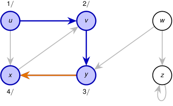

<!-- Start of picture text -->
1 / 2 / u v w x y z 4 / 3 / <!-- End of picture text -->

_t_ = 4: se examina ( _y , x_ ); como _x_ está blanco, _π_ [ _x_ ] = _y_ . 

Pila: _⟨u, v , y, x⟩_ . 

2_do_ Cuatrimestre de 2026 36 / 58 

(DC, FCEyN, UBA) 

DC - FCEyN - UBA 

Ordenamiento topológico 

Búsqueda a lo ancho 

Búsqueda en profundidad 

Detección de aristas de corte 

Los grafos como modelos 

# Corrida paso a paso: DFS profundiza antes de retroceder 

<!-- Start of picture text -->
1 / 2 / u v w x y z 4 / 5 3 / <!-- End of picture text -->

_x_ examina ( _x, v_ ), pero _v_ ya está gris. No hay llamada recursiva y _x_ finaliza en _t_ = 5. 

Pila: _⟨u, v , y ⟩_ . 

2_do_ Cuatrimestre de 2026 36 / 58 

(DC, FCEyN, UBA) 

DC - FCEyN - UBA 

Ordenamiento topológico 

Búsqueda a lo ancho 

Búsqueda en profundidad 

Detección de aristas de corte 

Los grafos como modelos 

# Corrida paso a paso: DFS profundiza antes de retroceder 

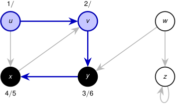

<!-- Start of picture text -->
1 / 2 / u v w x y z 4 / 5 3 / 6 <!-- End of picture text -->

_y_ ya no tiene aristas sin examinar y finaliza en _t_ = 6. 

Pila: _⟨u, v ⟩_ . 

2_do_ Cuatrimestre de 2026 36 / 58 

(DC, FCEyN, UBA) 

DC - FCEyN - UBA 

Ordenamiento topológico 

Búsqueda a lo ancho 

Búsqueda en profundidad 

Detección de aristas de corte 

Los grafos como modelos 

# Corrida paso a paso: DFS profundiza antes de retroceder 

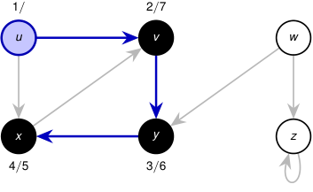

<!-- Start of picture text -->
1 / 2 / 7 u v w x y z 4 / 5 3 / 6 <!-- End of picture text -->

_v_ ya no tiene aristas sin examinar y finaliza en _t_ = 7. 

Pila: _⟨u⟩_ . 

2_do_ Cuatrimestre de 2026 36 / 58 

(DC, FCEyN, UBA) 

DC - FCEyN - UBA 

Ordenamiento topológico 

Búsqueda a lo ancho 

Búsqueda en profundidad 

Detección de aristas de corte 

Los grafos como modelos 

# Corrida paso a paso: DFS profundiza antes de retroceder 

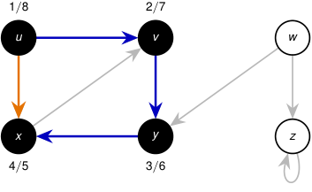

<!-- Start of picture text -->
1 / 8 2 / 7 u v w x y z 4 / 5 3 / 6 <!-- End of picture text -->

_u_ examina ( _u, x_ ), pero _x_ ya está negro; luego _u_ finaliza en _t_ = 8. 

Pila: _⟨⟩_ . 

2_do_ Cuatrimestre de 2026 36 / 58 

(DC, FCEyN, UBA) 

DC - FCEyN - UBA 

Ordenamiento topológico 

Búsqueda a lo ancho 

Búsqueda en profundidad 

Detección de aristas de corte 

Los grafos como modelos 

# Corrida paso a paso: DFS profundiza antes de retroceder 

<!-- Start of picture text -->
1 / 8 2 / 7 9 / u v w x y z 4 / 5 3 / 6 <!-- End of picture text -->

El bucle exterior llega a _w_ , todavía blanco: _d_ [ _w_ ] = 9. _w_ examina ( _w, y_ ), pero _y_ está negro. 

Pila: _⟨w⟩_ . 

2_do_ Cuatrimestre de 2026 36 / 58 

(DC, FCEyN, UBA) 

DC - FCEyN - UBA 

Ordenamiento topológico 

Búsqueda a lo ancho 

Búsqueda en profundidad 

Detección de aristas de corte 

Los grafos como modelos 

# Corrida paso a paso: DFS profundiza antes de retroceder 

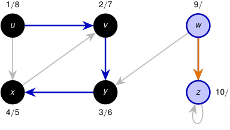

<!-- Start of picture text -->
1 / 8 2 / 7 9 / u v w x y z 10 / 4 / 5 3 / 6 <!-- End of picture text -->

_t_ = 10: se examina ( _w, z_ ); como _z_ está blanco, _π_ [ _z_ ] = _w_ . 

Pila: _⟨w, z⟩_ . 

2_do_ Cuatrimestre de 2026 36 / 58 

(DC, FCEyN, UBA) 

DC - FCEyN - UBA 

Ordenamiento topológico 

Búsqueda a lo ancho 

Búsqueda en profundidad 

Detección de aristas de corte 

Los grafos como modelos 

# Corrida paso a paso: DFS profundiza antes de retroceder 

<!-- Start of picture text -->
1 / 8 2 / 7 9 / u v w x y z 10 / 11 4 / 5 3 / 6 <!-- End of picture text -->

_z_ examina el bucle ( _z, z_ ); como _z_ está gris, no vuelve a visitarlo. _z_ finaliza en _t_ = 11. 

Pila: _⟨w⟩_ . 

2_do_ Cuatrimestre de 2026 36 / 58 

(DC, FCEyN, UBA) 

DC - FCEyN - UBA 

Ordenamiento topológico 

Búsqueda a lo ancho 

Búsqueda en profundidad 

Detección de aristas de corte 

Los grafos como modelos 

# Corrida paso a paso: DFS profundiza antes de retroceder 

<!-- Start of picture text -->
1 / 8 2 / 7 9 / 12 u v w x y z 10 / 11 4 / 5 3 / 6 <!-- End of picture text -->

_w_ ya no tiene aristas sin examinar y finaliza en _t_ = 12. Todos los vértices están negros y DFS termina. 

Pila: _⟨⟩_ . 

2_do_ Cuatrimestre de 2026 36 / 58 

(DC, FCEyN, UBA) 

DC - FCEyN - UBA 

Ordenamiento topológico 

Búsqueda a lo ancho 

Búsqueda en profundidad 

Detección de aristas de corte 

Los grafos como modelos 

# La corrida produce dos árboles y doce marcas temporales 

<!-- Start of picture text -->
1 / 8 2 / 7 9 / 12 u v w x y z 10 / 11 4 / 5 3 / 6 <!-- End of picture text -->

<!-- Start of picture text -->
q d [ q ] f [ q ] π [ q ] u 1 8 NIL v 2 7 u y 3 6 v x 4 5 y w 9 12 NIL z 10 11 w <!-- End of picture text -->

#### Azul: aristas del bosque DFS. 

Orden de descubrimiento: _u, v , y , x, w, z_ . Orden de finalización: _x, y, v , u, z, w_ . 

2_do_ Cuatrimestre de 2026 37 / 58 

(DC, FCEyN, UBA) 

DC - FCEyN - UBA 

Ordenamiento topológico 

Búsqueda a lo ancho 

Búsqueda en profundidad 

Detección de aristas de corte 

Los grafos como modelos 

# El orden puede cambiar el bosque 

La salida concreta de DFS puede depender de dos decisiones: el orden en que el bucle exterior considera los vértices; 

el orden de los vértices en cada lista de adyacencia. 

Esos órdenes pueden modificar las raíces, las aristas del bosque y los tiempos _d_ y _f_ . 

2_do_ Cuatrimestre de 2026 38 / 58 

(DC, FCEyN, UBA) 

DC - FCEyN - UBA 

Ordenamiento topológico 

Búsqueda a lo ancho 

Búsqueda en profundidad 

Detección de aristas de corte 

Los grafos como modelos 

# El orden puede cambiar el bosque 

La salida concreta de DFS puede depender de dos decisiones: 

el orden en que el bucle exterior considera los vértices; 

el orden de los vértices en cada lista de adyacencia. 

Esos órdenes pueden modificar las raíces, las aristas del bosque y los tiempos _d_ y _f_ . 

Tiempo de ejecución con listas de adyacencia 

La inicialización y el bucle exterior cuestan Θ( _|V |_ ). 

DFS-VISIT se llama exactamente una vez por vértice y, en total, el bucle recorre todas las aristas una vez 

∑︂ _|_ Adj[ _u_ ] _|_ = Θ( _|E|_ ) _. u∈V_ 

Por lo tanto, el tiempo total es 

Θ( _|V |_ + _|E|_ ) _._ 

2_do_ Cuatrimestre de 2026 

(DC, FCEyN, UBA) 

DC - FCEyN - UBA 

38 / 58 

Ordenamiento topológico 

Búsqueda a lo ancho 

Búsqueda en profundidad 

Detección de aristas de corte 

Los grafos como modelos 

# Los tiempos de DFS tienen una estructura de paréntesis 

El intervalo 

_I_ ( _u_ ) = [ _d_ [ _u_ ] _, f_ [ _u_ ]] 

representa el período durante el cual la llamada de _u_ está activa. En la corrida anterior, los intervalos de cada árbol se anidan: 

<!-- Start of picture text -->
I ( u ) = [1 ,  8] I ( w ) = [9 ,  12] I ( v ) = [2 ,  7] I ( z ) = [10 ,  11] I ( y ) = [3 ,  6] I ( x ) = [4 ,  5] tiempo 1 2 3 4 5 6 7 8 9 10 11 12 <!-- End of picture text -->

Si al descubrir _u_ escribimos (u y al finalizarlo escribimos u), obtenemos una expresión de paréntesis bien formada: una llamada recursiva debe terminar antes de que termine la llamada que la creó. 

2_do_ Cuatrimestre de 2026 39 / 58 

(DC, FCEyN, UBA) 

DC - FCEyN - UBA 

Ordenamiento topológico 

Búsqueda a lo ancho 

Búsqueda en profundidad 

Detección de aristas de corte 

Los grafos como modelos 

# Dos intervalos de DFS se anidan o son disjuntos 

## Teorema de los paréntesis 

Para cualesquiera _u, v ∈ V_ , ocurre exactamente una de las siguientes posibilidades: 1 _I_ ( _u_ ) _∩ I_ ( _v_ ) = ∅, y ninguno es descendiente del otro; 2 _I_ ( _u_ ) _⊂ I_ ( _v_ ), y _u_ es descendiente de _v_ ; 3 _I_ ( _v_ ) _⊂ I_ ( _u_ ), y _v_ es descendiente de _u_ . 

2_do_ Cuatrimestre de 2026 40 / 58 

(DC, FCEyN, UBA) 

DC - FCEyN - UBA 

Ordenamiento topológico 

Búsqueda a lo ancho 

Búsqueda en profundidad 

Detección de aristas de corte 

Los grafos como modelos 

# Dos intervalos de DFS se anidan o son disjuntos 

## Teorema de los paréntesis 

Para cualesquiera _u, v ∈ V_ , ocurre exactamente una de las siguientes posibilidades: 1 _I_ ( _u_ ) _∩ I_ ( _v_ ) = ∅, y ninguno es descendiente del otro; 2 _I_ ( _u_ ) _⊂ I_ ( _v_ ), y _u_ es descendiente de _v_ ; 3 _I_ ( _v_ ) _⊂ I_ ( _u_ ), y _v_ es descendiente de _u_ . 

#### **Idea de la demostración.** 

Supongamos _d_ [ _u_ ] _< d_ [ _v_ ]. Si _v_ se descubre antes de que termine _u_ , entonces _u_ está gris: la exploración de _v_ se completa antes de regresar a _u_ , y _I_ ( _v_ ) _⊂ I_ ( _u_ ). Si _u_ ya había terminado, entonces _f_ [ _u_ ] _< d_ [ _v_ ], y los intervalos son disjuntos. 

**Dos intervalos nunca se superponen parcialmente.** 

2_do_ Cuatrimestre de 2026 40 / 58 

(DC, FCEyN, UBA) 

DC - FCEyN - UBA 

Ordenamiento topológico 

Búsqueda a lo ancho 

Búsqueda en profundidad 

Detección de aristas de corte 

Los grafos como modelos 

# Los tiempos permiten reconocer descendientes 

## Corolario 

Un vértice _v_ es descendiente propio de _u_ en el bosque DFS si y solo si 

_d_ [ _u_ ] _< d_ [ _v_ ] _< f_ [ _v_ ] _< f_ [ _u_ ] _._ 

Por ejemplo, 

<!-- Start of picture text -->
1 / 8 u 2 / 7 v 3 / 6 4 / 5 y x <!-- End of picture text -->

1 _<_ 4 _<_ 5 _<_ 8 _,_ 

luego _x_ es descendiente de _u_ . 

#### **Idea de la demostración.** 

Es la traducción directa del caso de intervalos anidados del teorema de los paréntesis. 

2_do_ Cuatrimestre de 2026 41 / 58 

(DC, FCEyN, UBA) 

DC - FCEyN - UBA 

Ordenamiento topológico 

Búsqueda a lo ancho 

Búsqueda en profundidad 

Detección de aristas de corte 

Los grafos como modelos 

<!-- Start of picture text -->
p q camino completamente blanco al descubrir  u <!-- End of picture text -->

# Un camino blanco caracteriza a los descendientes 

## Teorema del camino blanco 

En el bosque DFS, _v_ es descendiente de _u_ si y solo si, en el instante _d_ [ _u_ ], existe un camino de _u_ a _v_ formado enteramente por vértices blancos. 

2_do_ Cuatrimestre de 2026 

(DC, FCEyN, UBA) 

DC - FCEyN - UBA 

42 / 58 

Ordenamiento topológico 

Búsqueda a lo ancho 

Búsqueda en profundidad 

Detección de aristas de corte 

Los grafos como modelos 

# Un camino blanco caracteriza a los descendientes 

## Teorema del camino blanco 

En el bosque DFS, _v_ es descendiente de _u_ si y solo si, en el instante _d_ [ _u_ ], existe un camino de _u_ a _v_ formado enteramente por vértices blancos. 

<!-- Start of picture text -->
u p q v <!-- End of picture text -->

camino completamente blanco al descubrir _u_ 

#### **Idea de la demostración.** 

- _⇒_ El camino de _u_ a cualquiera de sus descendientes en el árbol DFS todavía está blanco cuando se descubre _u_ . 

- _⇐_ Si DFS no incorporara todo el camino blanco, tomemos el primer vértice que queda afuera. Su predecesor sí es descendiente de _u_ y, al examinar la arista que los une, encontraría blanco al siguiente vértice: contradicción. 

2_do_ Cuatrimestre de 2026 42 / 58 

(DC, FCEyN, UBA) 

DC - FCEyN - UBA 

Ordenamiento topológico 

Búsqueda a lo ancho 

Búsqueda en profundidad 

Detección de aristas de corte 

Los grafos como modelos 

# Las aristas de un digrafo se dividen en cuatro tipos 

La clasificación se realiza con respecto al bosque DFS obtenido. Árbol. La arista ( _u, v_ ) descubre por primera vez a _v_ , por lo que 

_π_ [ _v_ ] = _u._ 

Retroceso. La arista ( _u, v_ ) va desde _u_ hacia uno de sus ancestros _v_ . Los bucles se consideran aristas de retroceso. 

Avance. La arista ( _u, v_ ) no pertenece al bosque y va hacia un descendiente propio de _u_ . Cruce. Es cualquier otra arista: sus extremos son incomparables en el árbol DFS o pertenecen a árboles distintos. 

La clasificación depende del bosque DFS y, por lo tanto, puede cambiar cuando cambia el orden de exploración. 

DC - FCEyN - UBA 

2_do_ Cuatrimestre de 2026 43 / 58 

(DC, FCEyN, UBA) 

Ordenamiento topológico 

Búsqueda a lo ancho 

Búsqueda en profundidad 

Detección de aristas de corte 

Los grafos como modelos 

# La corrida anterior contiene los cuatro tipos de arista 

<!-- Start of picture text -->
u v w x y z <!-- End of picture text -->

**_−→_** forward edge 

**_−→_** tree edge 

**_−→_** back edge 

**_−→_** cross edge 

_u → x_ es una forward edge _,_ 

_x → v_ es una back edge _,_ 

_w → y_ es una cross edge _._ 

2_do_ Cuatrimestre de 2026 

44 / 58 

(DC, FCEyN, UBA) 

DC - FCEyN - UBA 

Ordenamiento topológico 

Búsqueda a lo ancho 

Búsqueda en profundidad 

Detección de aristas de corte 

Los grafos como modelos 

# El color del destino clasifica la arista al explorarla 

Cuando DFS examina una arista ( _u, v_ ), el vértice _u_ está gris. 

color[ _v_ <u>]</u> tipo de <u>(</u> _u, v_ <u>)</u> razón blanco árbol _v_ se descubre mediante ( _u, v_ ) gris retroceso _v_ es un ancestro activo de _u_ negro avance o cruce _v_ ya terminó de procesarse 

#### **Idea clave.** 

Los vértices grises forman una cadena de ancestros: son exactamente las llamadas activas de la pila. Por eso, una arista hacia un vértice gris necesariamente vuelve hacia un ancestro. 

2_do_ Cuatrimestre de 2026 45 / 58 

(DC, FCEyN, UBA) 

DC - FCEyN - UBA 

Ordenamiento topológico 

Búsqueda a lo ancho 

Búsqueda en profundidad 

Detección de aristas de corte 

Los grafos como modelos 

# El color del destino clasifica la arista al explorarla 

Cuando DFS examina una arista ( _u, v_ ), el vértice _u_ está gris. 

color[ _v_ <u>]</u> tipo de <u>(</u> _u, v_ <u>)</u> razón blanco árbol _v_ se descubre mediante ( _u, v_ ) gris retroceso _v_ es un ancestro activo de _u_ negro avance o cruce _v_ ya terminó de procesarse 

#### **Idea clave.** 

Los vértices grises forman una cadena de ancestros: son exactamente las llamadas activas de la pila. Por eso, una arista hacia un vértice gris necesariamente vuelve hacia un ancestro. 

Si _v_ está negro, los tiempos distinguen los dos casos: 

_d_ [ _u_ ] _< d_ [ _v_ ] = _⇒_ avance _, d_ [ _v_ ] _< d_ [ _u_ ] = _⇒_ cruce _._ DC - FCEyN - UBA 2_do_ Cuatrimestre de 2026 45 / 58 

(DC, FCEyN, UBA) 

DC - FCEyN - UBA 

Ordenamiento topológico 

Búsqueda a lo ancho 

Búsqueda en profundidad 

Detección de aristas de corte 

Los grafos como modelos 

# En grafos no dirigidos no hay aristas de avance ni de cruce 

## Teorema 

En una búsqueda en profundidad de un grafo no dirigido _G_ , toda arista es una arista de árbol o una arista de retroceso. 

2_do_ Cuatrimestre de 2026 46 / 58 

(DC, FCEyN, UBA) 

DC - FCEyN - UBA 

Ordenamiento topológico 

Búsqueda a lo ancho 

Búsqueda en profundidad 

Detección de aristas de corte 

Los grafos como modelos 

# En grafos no dirigidos no hay aristas de avance ni de cruce 

## Teorema 

En una búsqueda en profundidad de un grafo no dirigido _G_ , toda arista es una arista de árbol o una arista de retroceso. 

**Idea de la demostración.** 

Sea _{u, v } ∈ E_ y supongamos _d_ [ _u_ ] _< d_ [ _v_ ]. 

Si la arista se examina primero desde _u_ , entonces _v_ todavía está blanco y la arista se incorpora al árbol. 

Si se examina primero desde _v_ , entonces _u_ todavía está gris y es un ancestro de _v_ ; la arista es de retroceso. 

Estas dos posibilidades agotan los casos. 

2_do_ Cuatrimestre de 2026 46 / 58 

(DC, FCEyN, UBA) 

DC - FCEyN - UBA 

Ordenamiento topológico 

Búsqueda a lo ancho 

Búsqueda en profundidad 

Detección de aristas de corte 

Los grafos como modelos 

Para hallar los puentes alcanza con completar una única DFS 

Sea _G_ un grafo no dirigido y sea _T_ el bosque producido por DFS. toda arista que no pertenece a _T_ está contenida en un ciclo; por lo tanto, solamente las aristas de _T_ pueden ser puentes. 

2_do_ Cuatrimestre de 2026 47 / 58 

(DC, FCEyN, UBA) 

DC - FCEyN - UBA 

Ordenamiento topológico 

Búsqueda a lo ancho 

Búsqueda en profundidad 

Detección de aristas de corte 

Los grafos como modelos 

Para hallar los puentes alcanza con completar una única DFS 

Sea _G_ un grafo no dirigido y sea _T_ el bosque producido por DFS. toda arista que no pertenece a _T_ está contenida en un ciclo; por lo tanto, solamente las aristas de _T_ pueden ser puentes. Cantidad de puentes Como todo puente pertenece al árbol DFS, #puentes _≤ n −_ 1. 

2_do_ Cuatrimestre de 2026 47 / 58 

(DC, FCEyN, UBA) 

DC - FCEyN - UBA 

Ordenamiento topológico 

Búsqueda a lo ancho 

Búsqueda en profundidad 

Detección de aristas de corte 

Los grafos como modelos 

# Para hallar los puentes alcanza con completar una única DFS 

Sea _G_ un grafo no dirigido y sea _T_ el bosque producido por DFS. 

toda arista que no pertenece a _T_ está contenida en un ciclo; 

por lo tanto, solamente las aristas de _T_ pueden ser puentes. 

## Cantidad de puentes 

Como todo puente pertenece al árbol DFS, #puentes _≤ n −_ 1. 

## Idea del algoritmo 

> 1 Durante una única DFS, calcular para cada vértice su tiempo de descubrimiento _d_ , su predecesor _π_ y un valor low ( _low_ ). 

> 2 Recorrer las aristas del bosque y decidir cuáles son puentes comparando low[ _v_ ] con _d_ [ _π_ [ _v_ ]]. 

2_do_ Cuatrimestre de 2026 47 / 58 

(DC, FCEyN, UBA) 

DC - FCEyN - UBA 

Ordenamiento topológico 

Búsqueda a lo ancho 

Búsqueda en profundidad 

Detección de aristas de corte 

Los grafos como modelos 

# Para hallar los puentes alcanza con completar una única DFS 

Sea _G_ un grafo no dirigido y sea _T_ el bosque producido por DFS. 

toda arista que no pertenece a _T_ está contenida en un ciclo; 

por lo tanto, solamente las aristas de _T_ pueden ser puentes. 

## Cantidad de puentes 

Como todo puente pertenece al árbol DFS, #puentes _≤ n −_ 1. 

## Idea del algoritmo 

> 1 Durante una única DFS, calcular para cada vértice su tiempo de descubrimiento _d_ , su predecesor _π_ y un valor low ( _low_ ). 

> 2 Recorrer las aristas del bosque y decidir cuáles son puentes comparando low[ _v_ ] con _d_ [ _π_ [ _v_ ]]. 

El algoritmo también funciona si _G_ no es conexo: en ese caso, DFS produce un bosque en lugar de un único árbol. 

(DC, FCEyN, UBA) 

DC - FCEyN - UBA 

2_do_ Cuatrimestre de 2026 47 / 58 

Ordenamiento topológico 

Búsqueda a lo ancho 

Búsqueda en profundidad 

Detección de aristas de corte 

Los grafos como modelos 

# _d_ [ _u_ ] conserva el significado de las filminas de DFS 

Cuando DFS descubre un vértice _u_ , incrementa el contador global _tiempo_ y asigna 

_d_ [ _u_ ] _← tiempo._ 

De este modo, al finalizar, 

_d_ : _V_ ( _G_ ) _−→{_ 1 _, . . . ,_ 2 _|V_ ( _G_ ) _|}_ 

es la función que asigna a cada vértice su tiempo de descubrimiento. Además, si _u_ fue descubierto al examinar la arista _{π_ [ _u_ ] _, u}_ , entonces _π_ [ _u_ ] es su padre en el bosque DFS. 

## Propiedad que vamos a usar 

Si _x_ es un ancestro propio de _u_ en el bosque DFS, entonces _d_ [ _x_ ] _< d_ [ _u_ ]. 

Para cada raíz _r_ del bosque, 

_π_ [ _r_ ] = NIL _._ 

(DC, FCEyN, UBA) 

DC - FCEyN - UBA 

2_do_ Cuatrimestre de 2026 

48 / 58 

Ordenamiento topológico 

Búsqueda a lo ancho 

Búsqueda en profundidad 

Detección de aristas de corte 

Los grafos como modelos 

# low[ _u_ ] indica hasta dónde puede volver el subárbol de _u_ 

Definimos low[ _u_ ] como el menor tiempo de descubrimiento de un vértice al que se puede llegar desde _u_ : 

bajando cero o más aristas del árbol DFS; y luego usando, a lo sumo, una arista que no pertenece al árbol. Más precisamente, 

⎧ _d_ [ _u_ ] _,_ low[ _u_ ] = m´ın _d_ [ _v_ ] : _{u, v }_ es una arista de retroceso y _v_ es ancestro de _u,_ ⎨ ⎩ low[ _w_ ] : _π_ [ _w_ ] = _u_ 

⎫ ⎬ ⎭_._ 

2_do_ Cuatrimestre de 2026 

49 / 58 

(DC, FCEyN, UBA) 

DC - FCEyN - UBA 

Ordenamiento topológico 

Búsqueda a lo ancho 

Búsqueda en profundidad 

Detección de aristas de corte 

Los grafos como modelos 

# Para hallar los puentes alcanza con completar una única DFS 

Sea _G_ un grafo no dirigido y sea _T_ el bosque producido por DFS. 

Toda arista que no pertenece a _T_ está contenida en un ciclo; por lo tanto, solamente las aristas de _T_ pueden ser puentes. 

## Idea del algoritmo 

- 1 Ejecutar una DFS ordinaria y calcular _T_ , _d_ , _f_ y _π_ . 

- 2 Una vez terminada la DFS, calcular los valores low recorriendo _T_ desde las hojas hacia las raíces. 

- 3 Para cada arista _{π_ [ _v_ ] _, v }_ del bosque, decidir si es puente comparando low[ _v_ ] con _d_ [ _π_ [ _v_ ]]. 

(DC, FCEyN, UBA) 

DC - FCEyN - UBA 

2_do_ Cuatrimestre de 2026 50 / 58 

Ordenamiento topológico 

Búsqueda a lo ancho 

Búsqueda en profundidad 

Detección de aristas de corte 

Los grafos como modelos 

# low puede calcularse después de terminar DFS 

Una vez conocidos el bosque DFS _T_ , los tiempos _d_ y los predecesores _π_ , ejecutamos: **Procedimiento** CALCULAR **-** LOW **-** OFFLINE( _G, T , d, π_ ) 

**para cada** _u ∈ V_ ( _G_ ) **hacer** low[ _u_ ] _← d_ [ _u_ ] **para cada** _{u, v } ∈ E_ ( _G_ ) _\ E_ ( _T_ ), con _v_ ancestro de _u_ , **hacer** low[ _u_ ] _←_ m´ın _{_ low[ _u_ ] _, d_ [ _v_ ] _}_ **para cada** _u ∈ V_ ( _G_ ) **en postorden de** _T_ **hacer si** _π_ [ _u_ ] _̸_ = NIL **entonces** low[ _π_ [ _u_ ]] _←_ m´ın _{_ low[ _π_ [ _u_ ]] _,_ low[ _u_ ] _}_ **retornar** low 

El postorden garantiza que, cuando se procesa _u_ , los valores de todos sus hijos ya fueron calculados. La complejidad es _O_ ( _n_ + _m_ ). 

2_do_ Cuatrimestre de 2026 51 / 58 

(DC, FCEyN, UBA) 

DC - FCEyN - UBA 

Ordenamiento topológico 

Búsqueda a lo ancho 

Búsqueda en profundidad 

Detección de aristas de corte 

Los grafos como modelos 

# Cálculo offline de low 

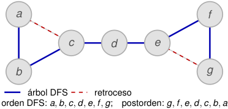

<!-- Start of picture text -->
a f c d e b g árbol DFS retroceso orden DFS:  a, b, c, d, e, f , g ; postorden:  g, f , e, d, c, b, a <!-- End of picture text -->

|_u_|_d_[_u_]|_f_[_u_]|low[_u_]|
|---|---|---|---|
|_a_|1|14|1|
|_b_|2|13|2|
|_c_|3|12|3|
|_d_|4|11|4|
|_e_|5|10|5|
|_f_|6|9|6|
|_g_|7|8|7|

##### **1. Inicialización.** 

La DFS ya terminó. Para todo vértice _u_ , 

low[ _u_ ] _← d_ [ _u_ ] _._ 

2_do_ Cuatrimestre de 2026 52 / 58 

(DC, FCEyN, UBA) 

DC - FCEyN - UBA 

Ordenamiento topológico 

Búsqueda a lo ancho 

Búsqueda en profundidad 

Detección de aristas de corte 

Los grafos como modelos 

# Cálculo offline de low 

<!-- Start of picture text -->
a f c d e b g árbol DFS retroceso orden DFS:  a, b, c, d, e, f , g ; postorden:  g, f , e, d, c, b, a <!-- End of picture text -->

|_u_|_d_[_u_]|_f_[_u_]|low[_u_]|
|---|---|---|---|
|_a_|1|14|1|
|_b_|2|13|2|
|_c_|3|12|3|
|_d_|4|11|4|
|_e_|5|10|5|
|_f_|6|9|6|
|_g_|7|8|5|

##### **2. Se procesa la arista de retroceso** _ge_ **.** Como _e_ es un ancestro de _g_ , 

low[ _g_ ] _←_ m´ın _{_ 7 _, d_ [ _e_ ] _}_ = 5 _._ 

2_do_ Cuatrimestre de 2026 52 / 58 

(DC, FCEyN, UBA) 

DC - FCEyN - UBA 

Ordenamiento topológico 

Búsqueda a lo ancho 

Búsqueda en profundidad 

Detección de aristas de corte 

Los grafos como modelos 

# Cálculo offline de low 

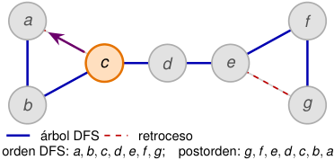

<!-- Start of picture text -->
a f c d e b g árbol DFS retroceso orden DFS:  a, b, c, d, e, f , g ; postorden:  g, f , e, d, c, b, a <!-- End of picture text -->

|_u_|_d_[_u_]|_f_[_u_]|low[_u_]|
|---|---|---|---|
|_a_|1|14|1|
|_b_|2|13|2|
|_c_|3|12|1|
|_d_|4|11|4|
|_e_|5|10|5|
|_f_|6|9|6|
|_g_|7|8|5|

##### **3. Se procesa la arista de retroceso** _ca_ **.** Como _a_ es un ancestro de _c_ , 

low[ _c_ ] _←_ m´ın _{_ 3 _, d_ [ _a_ ] _}_ = 1 _._ 

2_do_ Cuatrimestre de 2026 52 / 58 

(DC, FCEyN, UBA) 

DC - FCEyN - UBA 

Ordenamiento topológico 

Búsqueda a lo ancho 

Búsqueda en profundidad 

Detección de aristas de corte 

Los grafos como modelos 

# Cálculo offline de low 

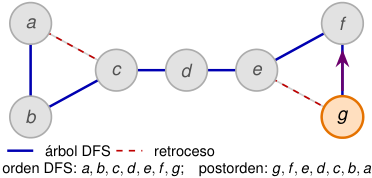

<!-- Start of picture text -->
a f c d e b g árbol DFS retroceso orden DFS:  a, b, c, d, e, f , g ; postorden:  g, f , e, d, c, b, a <!-- End of picture text -->

|_u_|_d_[_u_]|_f_[_u_]|low[_u_]|
|---|---|---|---|
|_a_|1|14|1|
|_b_|2|13|2|
|_c_|3|12|1|
|_d_|4|11|4|
|_e_|5|10|5|
|_f_|6|9|5|
|_g_|7|8|5|

**4. Comienza el recorrido en postorden con** _g_ **.** low[ _f_ ] _←_ m´ın _{_ 6 _,_ low[ _g_ ] _}_ = 5 _._ 

2_do_ Cuatrimestre de 2026 52 / 58 

(DC, FCEyN, UBA) 

DC - FCEyN - UBA 

Ordenamiento topológico 

Búsqueda a lo ancho 

Búsqueda en profundidad 

Detección de aristas de corte 

Los grafos como modelos 

# Cálculo offline de low 

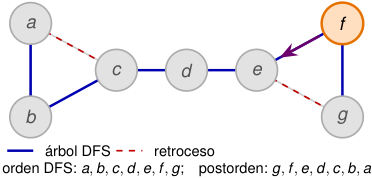

<!-- Start of picture text -->
a f c d e b g árbol DFS retroceso orden DFS:  a, b, c, d, e, f , g ; postorden:  g, f , e, d, c, b, a <!-- End of picture text -->

|_u_|_d_[_u_]|_f_[_u_]|low[_u_]|
|---|---|---|---|
|_a_|1|14|1|
|_b_|2|13|2|
|_c_|3|12|1|
|_d_|4|11|4|
|_e_|5|10|5|
|_f_|6|9|5|
|_g_|7|8|5|

**5. Se procesa** _f_ **.** 

low[ _e_ ] _←_ m´ın _{_ 5 _,_ low[ _f_ ] _}_ = 5 _._ 

2_do_ Cuatrimestre de 2026 

(DC, FCEyN, UBA) 

DC - FCEyN - UBA 

52 / 58 

Ordenamiento topológico 

Búsqueda a lo ancho 

Búsqueda en profundidad 

Detección de aristas de corte 

Los grafos como modelos 

# Cálculo offline de low 

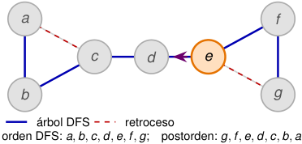

<!-- Start of picture text -->
a f c d e b g árbol DFS retroceso orden DFS:  a, b, c, d, e, f , g ; postorden:  g, f , e, d, c, b, a <!-- End of picture text -->

|_u_|_d_[_u_]|_f_[_u_]|low[_u_]|
|---|---|---|---|
|_a_|1|14|1|
|_b_|2|13|2|
|_c_|3|12|1|
|_d_|4|11|4|
|_e_|5|10|5|
|_f_|6|9|5|
|_g_|7|8|5|

**6. Se procesa** _e_ **.** 

low[ _d_ ] _←_ m´ın _{_ 4 _,_ low[ _e_ ] _}_ = 4 _._ 

2_do_ Cuatrimestre de 2026 

(DC, FCEyN, UBA) 

DC - FCEyN - UBA 

52 / 58 

Ordenamiento topológico 

Búsqueda a lo ancho 

Búsqueda en profundidad 

Detección de aristas de corte 

Los grafos como modelos 

# Cálculo offline de low 

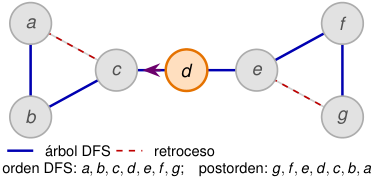

<!-- Start of picture text -->
a f c d e b g árbol DFS retroceso orden DFS:  a, b, c, d, e, f , g ; postorden:  g, f , e, d, c, b, a <!-- End of picture text -->

|_u_|_d_[_u_]|_f_[_u_]|low[_u_]|
|---|---|---|---|
|_a_|1|14|1|
|_b_|2|13|2|
|_c_|3|12|1|
|_d_|4|11|4|
|_e_|5|10|5|
|_f_|6|9|5|
|_g_|7|8|5|

**7. Se procesa** _d_ **.** 

low[ _c_ ] _←_ m´ın _{_ 1 _,_ low[ _d_ ] _}_ = 1 _._ 

2_do_ Cuatrimestre de 2026 

(DC, FCEyN, UBA) 

DC - FCEyN - UBA 

52 / 58 

Ordenamiento topológico 

Búsqueda a lo ancho 

Búsqueda en profundidad 

Detección de aristas de corte 

Los grafos como modelos 

# Cálculo offline de low 

<!-- Start of picture text -->
a f c d e b g árbol DFS retroceso orden DFS:  a, b, c, d, e, f , g ; postorden:  g, f , e, d, c, b, a <!-- End of picture text -->

|_u_|_d_[_u_]|_f_[_u_]|low[_u_]|
|---|---|---|---|
|_a_|1|14|1|
|_b_|2|13|1|
|_c_|3|12|1|
|_d_|4|11|4|
|_e_|5|10|5|
|_f_|6|9|5|
|_g_|7|8|5|

**8. Se procesa** _c_ **.** 

low[ _b_ ] _←_ m´ın _{_ 2 _,_ low[ _c_ ] _}_ = 1 _._ 

2_do_ Cuatrimestre de 2026 

(DC, FCEyN, UBA) 

DC - FCEyN - UBA 

52 / 58 

Ordenamiento topológico 

Búsqueda a lo ancho 

Búsqueda en profundidad 

Detección de aristas de corte 

Los grafos como modelos 

# Cálculo offline de low 

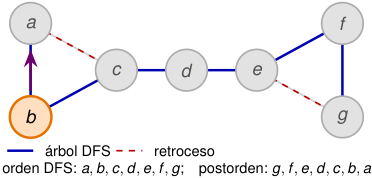

<!-- Start of picture text -->
a f c d e b g árbol DFS retroceso orden DFS:  a, b, c, d, e, f , g ; postorden:  g, f , e, d, c, b, a <!-- End of picture text -->

|_u_|_d_[_u_]|_f_[_u_]|low[_u_]|
|---|---|---|---|
|_a_|1|14|1|
|_b_|2|13|1|
|_c_|3|12|1|
|_d_|4|11|4|
|_e_|5|10|5|
|_f_|6|9|5|
|_g_|7|8|5|

##### **9. Se procesa** _b_ **.** 

low[ _a_ ] _←_ m´ın _{_ 1 _,_ low[ _b_ ] _}_ = 1 _._ 

2_do_ Cuatrimestre de 2026 

(DC, FCEyN, UBA) 

DC - FCEyN - UBA 

52 / 58 

Ordenamiento topológico 

Búsqueda a lo ancho 

Búsqueda en profundidad 

Detección de aristas de corte 

Los grafos como modelos 

# Cálculo offline de low 

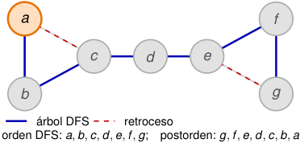

<!-- Start of picture text -->
a f c d e b g árbol DFS retroceso orden DFS:  a, b, c, d, e, f , g ; postorden:  g, f , e, d, c, b, a <!-- End of picture text -->

|_u_|_d_[_u_]|_f_[_u_]|low[_u_]|
|---|---|---|---|
|_a_|1|14|1|
|_b_|2|13|1|
|_c_|3|12|1|
|_d_|4|11|4|
|_e_|5|10|5|
|_f_|6|9|5|
|_g_|7|8|5|

##### **10. Se procesa la raíz** _a_ **.** 

Como _π_ [ _a_ ] = NIL, no se propaga ningún valor. Ya están calculados todos los valores de low. 

2_do_ Cuatrimestre de 2026 52 / 58 

(DC, FCEyN, UBA) 

DC - FCEyN - UBA 

Ordenamiento topológico 

Búsqueda a lo ancho 

Búsqueda en profundidad 

Detección de aristas de corte 

Los grafos como modelos 

# Cálculo offline de low 

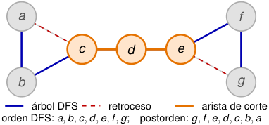

<!-- Start of picture text -->
a f c d e b g árbol DFS retroceso arista de corte orden DFS:  a, b, c, d, e, f , g ; postorden:  g, f , e, d, c, b, a <!-- End of picture text -->

|_u_|_d_[_u_]|_f_[_u_]|low[_u_]|
|---|---|---|---|
|_a_|1|14|1|
|_b_|2|13|1|
|_c_|3|12|1|
|_d_|4|11|4|
|_e_|5|10|5|
|_f_|6|9|5|
|_g_|7|8|5|

##### **11. Se aplica el criterio de puente.** 

low[ _d_ ] = 4 _> d_ [ _c_ ] = 3 _,_ low[ _e_ ] = 5 _> d_ [ _d_ ] = 4 _._ 

Por lo tanto, 

_cd_ y _de_ son aristas de corte _._ 

2_do_ Cuatrimestre de 2026 52 / 58 

(DC, FCEyN, UBA) 

DC - FCEyN - UBA 

Ordenamiento topológico 

Búsqueda a lo ancho 

Búsqueda en profundidad 

Detección de aristas de corte 

Los grafos como modelos 

# La primera fase extiende la inicialización de DFS 

**Procedimiento** PUENTES( _G_ ) 

**para cada** _u ∈ V_ ( _G_ ) **hacer** color[ _u_ ] _←_ blanco _π_ [ _u_ ] _←_ NIL _d_ [ _u_ ] _←∞_ low[ _u_ ] _←∞ tiempo ←_ 0 

**para cada** _u ∈ V_ ( _G_ ) **hacer si** color[ _u_ ] = blanco **entonces** DFS-PUENTES-VISIT( _G, u_ ) 

Al terminar esta fase, _d_ , low y _π_ están definidos para todos los vértices. La segunda fase solamente inspeccionará las aristas _{π_ [ _v_ ] _, v }_ del bosque DFS. 

2_do_ Cuatrimestre de 2026 53 / 58 

(DC, FCEyN, UBA) 

DC - FCEyN - UBA 

Ordenamiento topológico 

Búsqueda a lo ancho 

Búsqueda en profundidad 

Detección de aristas de corte 

Los grafos como modelos 

# DFS-PUENTES-VISIT calcula low al retroceder 

**Procedimiento** DFS **-** PUENTES **-** VISIT( _G, u_ ) 

_tiempo ← tiempo_ + 1 _d_ [ _u_ ] _← tiempo_ low[ _u_ ] _← d_ [ _u_ ] color[ _u_ ] _←_ gris **para cada** _v ∈_ Adj[ _u_ ] **hacer si** color[ _v_ ] = blanco **entonces** _π_ [ _v_ ] _← u_ DFS-PUENTES-VISIT( _G, v_ ) low[ _u_ ] _←_ m´ın _{_ low[ _u_ ] _,_ low[ _v_ ] _}_ **si no, si** color[ _v_ ] = gris **y** _v̸_ = _π_ [ _u_ ] **entonces** low[ _u_ ] _←_ m´ın _{_ low[ _u_ ] _, d_ [ _v_ ] _}_ 

_tiempo ← tiempo_ + 1 _f_ [ _u_ ] _← tiempo_ color[ _u_ ] _←_ negro 

La condición _v̸_ = _π_ [ _u_ ] evita considerar como arista de retroceso la copia de la arista del árbol que lleva de _u_ a su padre. 

2_do_ Cuatrimestre de 2026 54 / 58 

(DC, FCEyN, UBA) 

DC - FCEyN - UBA 

Ordenamiento topológico 

Búsqueda a lo ancho 

Búsqueda en profundidad 

Detección de aristas de corte 

Los grafos como modelos 

# Al retroceder, DFS completa _f_ y propaga low 

<!-- Start of picture text -->
a f c d e b g árbol DFS retroceso orden:  a, b, c, d, e, f , g ; en  c se examina  d antes que  a <!-- End of picture text -->

|_u_|_d_[_u_]|_f_[_u_]|low[_u_]|
|---|---|---|---|
|_a_|1|–|1|
|_b_|–|–|–|
|_c_ _d_|– –|– –|– –|
|_e_ _f_ _g_|– – –|– – –|– – –|

##### **1. Descubre** _a_ **.** 

##### _d_ [ _a_ ] = low[ _a_ ] = 1 _._ 

2_do_ Cuatrimestre de 2026 

(DC, FCEyN, UBA) 

DC - FCEyN - UBA 

55 / 58 

Ordenamiento topológico 

Búsqueda a lo ancho 

Búsqueda en profundidad 

Detección de aristas de corte 

Los grafos como modelos 

# Al retroceder, DFS completa _f_ y propaga low 

<!-- Start of picture text -->
a f c d e b g árbol DFS retroceso <!-- End of picture text -->

orden: _a, b, c, d, e, f , g_ ; en _c_ se examina _d_ antes que _a_ 

<!-- Start of picture text -->
u d [ u ] f [ u ] low[ u ] a 1 – 1 b 2 – 2 c – – – d – – – e – – – f – – – g – – – <!-- End of picture text -->

##### **2. Avanza por** _ab_ **y descubre** _b_ **.** 

##### _d_ [ _b_ ] = low[ _b_ ] = 2 _._ 

2_do_ Cuatrimestre de 2026 

(DC, FCEyN, UBA) 

DC - FCEyN - UBA 

55 / 58 

Ordenamiento topológico 

Búsqueda a lo ancho 

Búsqueda en profundidad 

Detección de aristas de corte 

Los grafos como modelos 

# Al retroceder, DFS completa _f_ y propaga low 

<!-- Start of picture text -->
a f c d e b g árbol DFS retroceso orden:  a, b, c, d, e, f , g ; en  c se examina  d antes que  a <!-- End of picture text -->

<!-- Start of picture text -->
u d [ u ] f [ u ] low[ u ] a 1 – 1 b 2 – 2 c 3 – 3 d – – – e – – – f – – – g – – – <!-- End of picture text -->

##### **3. Avanza por** _bc_ **y descubre** _c_ **.** 

##### _d_ [ _c_ ] = low[ _c_ ] = 3 _._ 

2_do_ Cuatrimestre de 2026 

(DC, FCEyN, UBA) 

DC - FCEyN - UBA 

55 / 58 

Ordenamiento topológico 

Búsqueda a lo ancho 

Búsqueda en profundidad 

Detección de aristas de corte 

Los grafos como modelos 

# Al retroceder, DFS completa _f_ y propaga low 

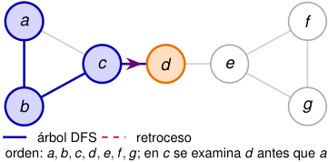

<!-- Start of picture text -->
a f c d e b g árbol DFS retroceso orden:  a, b, c, d, e, f , g ; en  c se examina  d antes que  a <!-- End of picture text -->

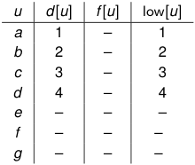

<!-- Start of picture text -->
u d [ u ] f [ u ] low[ u ] a 1 – 1 b 2 – 2 c 3 – 3 d 4 – 4 e – – – f – – – g – – – <!-- End of picture text -->

##### **4. Desde** _c_ **visita primero a** _d_ **.** 

_d_ [ _d_ ] = low[ _d_ ] = 4 _._ 

2_do_ Cuatrimestre de 2026 

(DC, FCEyN, UBA) 

DC - FCEyN - UBA 

55 / 58 

Ordenamiento topológico 

Búsqueda a lo ancho 

Búsqueda en profundidad 

Detección de aristas de corte 

Los grafos como modelos 

# Al retroceder, DFS completa _f_ y propaga low 

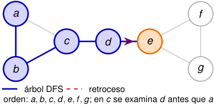

<!-- Start of picture text -->
a f c d e b g árbol DFS retroceso orden:  a, b, c, d, e, f , g ; en  c se examina  d antes que  a <!-- End of picture text -->

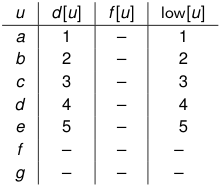

<!-- Start of picture text -->
u d [ u ] f [ u ] low[ u ] a 1 – 1 b 2 – 2 c 3 – 3 d 4 – 4 e 5 – 5 f – – – g – – – <!-- End of picture text -->

##### **5. Avanza por** _de_ **y descubre** _e_ **.** 

_d_ [ _e_ ] = low[ _e_ ] = 5 _._ 

2_do_ Cuatrimestre de 2026 55 / 58 

(DC, FCEyN, UBA) 

DC - FCEyN - UBA 

Ordenamiento topológico 

Búsqueda a lo ancho 

Búsqueda en profundidad 

Detección de aristas de corte 

Los grafos como modelos 

# Al retroceder, DFS completa _f_ y propaga low 

<!-- Start of picture text -->
a f c d e b g árbol DFS retroceso orden:  a, b, c, d, e, f , g ; en  c se examina  d antes que  a <!-- End of picture text -->

<!-- Start of picture text -->
u d [ u ] f [ u ] low[ u ] a 1 – 1 b 2 – 2 c 3 – 3 d 4 – 4 e 5 – 5 f 6 – 6 g – – – <!-- End of picture text -->

##### **6. Avanza por** _ef_ **y descubre** _f_ **.** 

_d_ [ _f_ ] = low[ _f_ ] = 6 _._ 

2_do_ Cuatrimestre de 2026 

(DC, FCEyN, UBA) 

DC - FCEyN - UBA 

55 / 58 

Ordenamiento topológico 

Búsqueda a lo ancho 

Búsqueda en profundidad 

Detección de aristas de corte 

Los grafos como modelos 

# Al retroceder, DFS completa _f_ y propaga low 

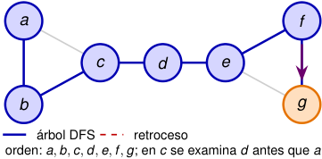

<!-- Start of picture text -->
a f c d e b g árbol DFS retroceso orden:  a, b, c, d, e, f , g ; en  c se examina  d antes que  a <!-- End of picture text -->

|_u_|_d_[_u_]|_f_[_u_]|low[_u_]|
|---|---|---|---|
|_a_|1|–|1|
|_b_|2|–|2|
|_c_|3|–|3|
|_d_|4|–|4|
|_e_|5|–|5|
|_f_|6|–|6|
|_g_|7|–|7|

##### **7. Avanza por** _fg_ **y descubre** _g_ **.** 

_d_ [ _g_ ] = low[ _g_ ] = 7 _._ 

2_do_ Cuatrimestre de 2026 

(DC, FCEyN, UBA) 

DC - FCEyN - UBA 

55 / 58 

Ordenamiento topológico 

Búsqueda a lo ancho 

Búsqueda en profundidad 

Detección de aristas de corte 

Los grafos como modelos 

# Al retroceder, DFS completa _f_ y propaga low 

<!-- Start of picture text -->
a f c d e b g árbol DFS retroceso orden:  a, b, c, d, e, f , g ; en  c se examina  d antes que  a <!-- End of picture text -->

<!-- Start of picture text -->
u d [ u ] f [ u ] low[ u ] a 1 – 1 b 2 – 2 c 3 – 3 d 4 – 4 e 5 – 5 f 6 – 6 g 7 – 5 <!-- End of picture text -->

**8.** _g_ **encuentra la arista de retroceso** _ge_ **.** Como _e_ es un ancestro, 

low[ _g_ ] _←_ m´ın _{_ 7 _, d_ [ _e_ ] _}_ = 5 _._ 

El tiempo no aumenta. 

2_do_ Cuatrimestre de 2026 55 / 58 

(DC, FCEyN, UBA) 

DC - FCEyN - UBA 

Ordenamiento topológico 

Búsqueda a lo ancho 

Búsqueda en profundidad 

Detección de aristas de corte 

Los grafos como modelos 

# Al retroceder, DFS completa _f_ y propaga low 

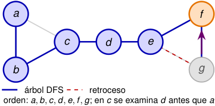

<!-- Start of picture text -->
a f c d e b g árbol DFS retroceso orden:  a, b, c, d, e, f , g ; en  c se examina  d antes que  a <!-- End of picture text -->

|_u_|_d_[_u_]|_f_[_u_] low[_u_]|
|---|---|---|
|_a_|1|– 1|
|_b_|2|– 2|
|_c_|3|– 3|
|_d_|4|– 4|
|_e_|5|– 5|
|_f_|6|– 5|
|_g_|7|8 5|

**9. Finaliza** _g_ **y vuelve a** _f_ **.** 

_f_ [ _g_ ] = 8 _,_ low[ _f_ ] _←_ m´ın _{_ 6 _,_ low[ _g_ ] _}_ = 5 _._ 

2_do_ Cuatrimestre de 2026 55 / 58 

(DC, FCEyN, UBA) 

DC - FCEyN - UBA 

Ordenamiento topológico 

Búsqueda a lo ancho 

Búsqueda en profundidad 

Detección de aristas de corte 

Los grafos como modelos 

# Al retroceder, DFS completa _f_ y propaga low 

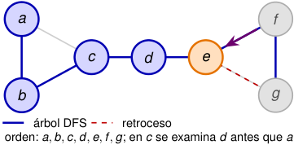

<!-- Start of picture text -->
a f c d e b g árbol DFS retroceso orden:  a, b, c, d, e, f , g ; en  c se examina  d antes que  a <!-- End of picture text -->

|_u_|_d_[_u_]|_f_[_u_]|low[_u_]|
|---|---|---|---|
|_a_|1|–|1|
|_b_|2|–|2|
|_c_|3|–|3|
|_d_|4|–|4|
|_e_|5|–|5|
|_f_|6|9|5|
|_g_|7|8|5|

**10. Finaliza** _f_ **y vuelve a** _e_ **.** 

_f_ [ _f_ ] = 9 _,_ low[ _e_ ] _←_ m´ın _{_ 5 _,_ low[ _f_ ] _}_ = 5 _._ 

2_do_ Cuatrimestre de 2026 55 / 58 

(DC, FCEyN, UBA) 

DC - FCEyN - UBA 

Ordenamiento topológico 

Búsqueda a lo ancho 

Búsqueda en profundidad 

Detección de aristas de corte 

Los grafos como modelos 

# Al retroceder, DFS completa _f_ y propaga low 

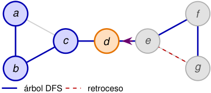

<!-- Start of picture text -->
a f c d e b g árbol DFS retroceso <!-- End of picture text -->

orden: _a, b, c, d, e, f , g_ ; en _c_ se examina _d_ antes que _a_ 

|_u_|_d_[_u_]|_f_[_u_]|low[_u_]|
|---|---|---|---|
|_a_|1|–|1|
|_b_|2|–|2|
|_c_|3|–|3|
|_d_|4|–|4|
|_e_|5|10|5|
|_f_|6|9|5|
|_g_|7|8|5|

**11. Finaliza** _e_ **y vuelve a** _d_ **.** 

_f_ [ _e_ ] = 10 _,_ low[ _d_ ] _←_ m´ın _{_ 4 _,_ low[ _e_ ] _}_ = 4 _._ 

2_do_ Cuatrimestre de 2026 55 / 58 

(DC, FCEyN, UBA) 

DC - FCEyN - UBA 

Ordenamiento topológico 

Búsqueda a lo ancho 

Búsqueda en profundidad 

Detección de aristas de corte 

Los grafos como modelos 

# Al retroceder, DFS completa _f_ y propaga low 

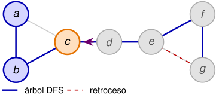

<!-- Start of picture text -->
a f c d e b g árbol DFS retroceso <!-- End of picture text -->

orden: _a, b, c, d, e, f , g_ ; en _c_ se examina _d_ antes que _a_ 

|_u_|_d_[_u_]|_f_[_u_]|low[_u_]|
|---|---|---|---|
|_a_|1|–|1|
|_b_|2|–|2|
|_c_|3|–|3|
|_d_|4|11|4|
|_e_|5|10|5|
|_f_|6|9|5|
|_g_|7|8|5|

**12. Finaliza** _d_ **y vuelve a** _c_ **.** 

_f_ [ _d_ ] = 11 _,_ low[ _c_ ] _←_ m´ın _{_ 3 _,_ low[ _d_ ] _}_ = 3 _._ 

2_do_ Cuatrimestre de 2026 55 / 58 

(DC, FCEyN, UBA) 

DC - FCEyN - UBA 

Ordenamiento topológico 

Búsqueda a lo ancho 

Búsqueda en profundidad 

Detección de aristas de corte 

Los grafos como modelos 

# Al retroceder, DFS completa _f_ y propaga low 

<!-- Start of picture text -->
a f c d e b g árbol DFS retroceso <!-- End of picture text -->

orden: _a, b, c, d, e, f , g_ ; en _c_ se examina _d_ antes que _a_ 

|_u_|_d_[_u_]|_f_[_u_]|low[_u_]|
|---|---|---|---|
|_a_|1|–|1|
|_b_|2|–|2|
|_c_|3|–|1|
|_d_|4|11|4|
|_e_|5|10|5|
|_f_|6|9|5|
|_g_|7|8|5|

##### **13. Ahora** _c_ **examina la arista** _ca_ **.** Como _a_ todavía está abierto, 

##### low[ _c_ ] _←_ m´ın _{_ 3 _, d_ [ _a_ ] _}_ = 1 _._ 

2_do_ Cuatrimestre de 2026 55 / 58 

(DC, FCEyN, UBA) 

DC - FCEyN - UBA 

Ordenamiento topológico 

Búsqueda a lo ancho 

Búsqueda en profundidad 

Detección de aristas de corte 

Los grafos como modelos 

# Al retroceder, DFS completa _f_ y propaga low 

<!-- Start of picture text -->
a f c d e b g árbol DFS retroceso <!-- End of picture text -->

orden: _a, b, c, d, e, f , g_ ; en _c_ se examina _d_ antes que _a_ 

|_u_|_d_[_u_]|_f_[_u_]|low[_u_]|
|---|---|---|---|
|_a_|1|–|1|
|_b_|2|–|1|
|_c_|3|12|1|
|_d_|4|11|4|
|_e_|5|10|5|
|_f_|6|9|5|
|_g_|7|8|5|

**14. Finaliza** _c_ **y vuelve a** _b_ **.** 

_f_ [ _c_ ] = 12 _,_ low[ _b_ ] _←_ m´ın _{_ 2 _,_ low[ _c_ ] _}_ = 1 _._ 

2_do_ Cuatrimestre de 2026 55 / 58 

(DC, FCEyN, UBA) 

DC - FCEyN - UBA 

Ordenamiento topológico 

Búsqueda a lo ancho 

Búsqueda en profundidad 

Detección de aristas de corte 

Los grafos como modelos 

# Al retroceder, DFS completa _f_ y propaga low 

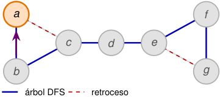

<!-- Start of picture text -->
a f c d e b g árbol DFS retroceso <!-- End of picture text -->

orden: _a, b, c, d, e, f , g_ ; en _c_ se examina _d_ antes que _a_ 

|_u_|_d_[_u_]|_f_[_u_]|low[_u_]|
|---|---|---|---|
|_a_|1|–|1|
|_b_|2|13|1|
|_c_|3|12|1|
|_d_|4|11|4|
|_e_|5|10|5|
|_f_|6|9|5|
|_g_|7|8|5|

**15. Finaliza** _b_ **y vuelve a** _a_ **.** 

_f_ [ _b_ ] = 13 _,_ low[ _a_ ] _←_ m´ın _{_ 1 _,_ low[ _b_ ] _}_ = 1 _._ 

2_do_ Cuatrimestre de 2026 55 / 58 

(DC, FCEyN, UBA) 

DC - FCEyN - UBA 

Ordenamiento topológico 

Búsqueda a lo ancho 

Búsqueda en profundidad 

Detección de aristas de corte 

Los grafos como modelos 

# Al retroceder, DFS completa _f_ y propaga low 

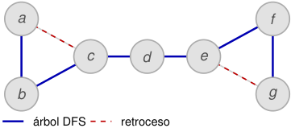

<!-- Start of picture text -->
a f c d e b g árbol DFS retroceso <!-- End of picture text -->

orden: _a, b, c, d, e, f , g_ ; en _c_ se examina _d_ antes que _a_ 

|_u_|_d_[_u_]|_f_[_u_]|low[_u_]|
|---|---|---|---|
|_a_|1|14|1|
|_b_|2|13|1|
|_c_|3|12|1|
|_d_|4|11|4|
|_e_|5|10|5|
|_f_|6|9|5|
|_g_|7|8|5|

##### **16. Finaliza la raíz** _a_ **.** 

_f_ [ _a_ ] = 14 _._ 

Ya están calculados todos los valores. 

2_do_ Cuatrimestre de 2026 55 / 58 

(DC, FCEyN, UBA) 

DC - FCEyN - UBA 

Ordenamiento topológico 

Búsqueda a lo ancho 

Búsqueda en profundidad 

Detección de aristas de corte 

Los grafos como modelos 

# Al retroceder, DFS completa _f_ y propaga low 

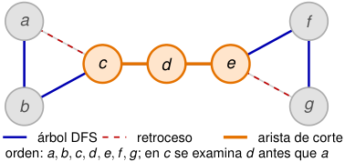

<!-- Start of picture text -->
a f c d e b g árbol DFS retroceso arista de corte orden:  a, b, c, d, e, f , g ; en  c se examina  d antes que  a <!-- End of picture text -->

|_u_|_d_[_u_]|_f_[_u_]|low[_u_]|
|---|---|---|---|
|_a_|1|14|1|
|_b_|2|13|1|
|_c_|3|12|1|
|_d_|4|11|4|
|_e_|5|10|5|
|_f_|6|9|5|
|_g_|7|8|5|

##### **17. Se aplica el criterio de puente.** 

low[ _d_ ] = 4 _> d_ [ _c_ ] = 3 _,_ low[ _e_ ] = 5 _> d_ [ _d_ ] = 4 _._ 

Por lo tanto, 

_cd_ y _de_ son aristas de corte _._ 

2_do_ Cuatrimestre de 2026 55 / 58 

(DC, FCEyN, UBA) 

DC - FCEyN - UBA 

Ordenamiento topológico 

Búsqueda a lo ancho 

Búsqueda en profundidad 

Detección de aristas de corte 

Los grafos como modelos 

# Las dos actualizaciones de low reúnen toda la información 

Al descubrir _u_ , inicialmente solamente sabemos que _u_ se alcanza a sí mismo: 

low[ _u_ ] _← d_ [ _u_ ] _._ 

## Un hijo _v_ termina de procesarse 

Todo lo que puede alcanzarse desde el subárbol de _v_ también puede alcanzarse desde el subárbol de _u_ . Por eso, 

low[ _u_ ] _←_ m´ın _{_ low[ _u_ ] _,_ low[ _v_ ] _}._ 

Se examina una arista que no es la arista al padre 

La arista _uv_ permite alcanzar directamente un vértice ya descubierto. Por eso, 

low[ _u_ ] _←_ m´ın _{_ low[ _u_ ] _, d_ [ _v_ ] _}._ 

Como la actualización con low[ _v_ ] se realiza después de la llamada recursiva, los valores se propagan de las hojas hacia la raíz. 

(DC, FCEyN, UBA) 

DC - FCEyN - UBA 

2_do_ Cuatrimestre de 2026 

56 / 58 

Ordenamiento topológico 

Búsqueda a lo ancho 

Búsqueda en profundidad 

Detección de aristas de corte 

Los grafos como modelos 

# La segunda fase prueba una desigualdad por arista del árbol 

Después de completar todas las llamadas a DFS-PUENTES-VISIT, el procedimiento PUENTES( _G_ ) continúa así: 

_B ←_ ∅ **para cada** _v ∈ V_ ( _G_ ) **hacer si** _π_ [ _v_ ] _̸_ = NIL **y** low[ _v_ ] _> d_ [ _π_ [ _v_ ]] **entonces** _B ← B ∪_ {︁ _{π_ [ _v_ ] _, v }_ }︁ **retornar** _B_ 

No es necesario recorrer todo _E_ ( _G_ ) en esta fase: alcanza con recorrer los vértices no raíz, uno por cada arista del bosque DFS. 

2_do_ Cuatrimestre de 2026 57 / 58 

(DC, FCEyN, UBA) 

DC - FCEyN - UBA 

Ordenamiento topológico 

Búsqueda a lo ancho 

Búsqueda en profundidad 

Detección de aristas de corte 

Los grafos como modelos 

# La segunda fase prueba una desigualdad por arista del árbol 

Después de completar todas las llamadas a DFS-PUENTES-VISIT, el procedimiento PUENTES( _G_ ) continúa así: 

_B ←_ ∅ **para cada** _v ∈ V_ ( _G_ ) **hacer si** _π_ [ _v_ ] _̸_ = NIL **y** low[ _v_ ] _> d_ [ _π_ [ _v_ ]] **entonces** _B ← B ∪_ {︁ _{π_ [ _v_ ] _, v }_ }︁ **retornar** _B_ 

No es necesario recorrer todo _E_ ( _G_ ) en esta fase: alcanza con recorrer los vértices no raíz, uno por cada arista del bosque DFS. 

## Teorema 

Sea _G_ un grafo con _uv ∈ E_ ( _G_ ) y _π_ producido por el algoritmo DFS. Entonces, _uv_ es puente de _G_ , con _π_ [ _v_ ] = _u_ si y solo si low[ _v_ ] _> d_ [ _u_ ] 

DC - FCEyN - UBA 

2_do_ Cuatrimestre de 2026 57 / 58 

(DC, FCEyN, UBA) 

Ordenamiento topológico 

Búsqueda a lo ancho 

Búsqueda en profundidad 

Detección de aristas de corte 

Los grafos como modelos 

El algoritmo encuentra todos los puentes en tiempo lineal 

La inicialización cuesta Θ( _|V |_ ). 

Cada vértice es descubierto una sola vez. 

Cada arista aparece dos veces en las listas de adyacencia y provoca solamente una cantidad constante de operaciones. 

La segunda fase recorre _V_ ( _G_ ) una vez. 

Por lo tanto, con listas de adyacencia, 

Θ( _|V |_ + _|E|_ ) _._ 

Se almacenan los arreglos color, _π_ , _d_ , _f_ y low, además de la pila de recursión y la salida. El espacio adicional es 

_O_ ( _|V |_ ) 

sin contar la representación del grafo ni la lista de puentes devuelta. 

2_do_ Cuatrimestre de 2026 

(DC, FCEyN, UBA) 

DC - FCEyN - UBA 

58 / 58 

