# Resumen — BFS explicado paso a paso

> Fuente única: `grafos-algoritmos.md` y la carpeta `temas/`.
> Al final de cada sección está citado el archivo del que sale la explicación.

---

## 0. Vocabulario mínimo

Antes de arrancar, las palabras que se van a repetir:

- **Grafo**: un dibujo de puntos unidos por líneas. Los puntos son los **nodos** (o nodos) y las líneas son las **aristas**.
- **Digrafo** (grafo dirigido): igual, pero las líneas tienen flecha, o sea que se recorren en un solo sentido.
- **Sin pesos**: las aristas no tienen números encima. Cruzar cualquier arista cuesta lo mismo: **1 paso**.
- **Vecinos de un nodo** (lista de adyacencia, `Adj[u]`): la lista de los nodos con los que está conectado directamente.
- **Camino mínimo**: la forma de ir de un nodo a otro pasando por la menor cantidad posible de aristas.
- **δ(s, v)** (se lee "delta de s a v"): la cantidad de aristas del camino más corto que va de `s` a `v`. Si no se puede llegar, vale **∞** (infinito).
- **Fuente** `s`: el nodo desde el que arranco a recorrer.

---

## 1. Qué es BFS

**BFS** son las siglas en inglés de **B**readth-**F**irst **S**earch. En español: **búsqueda a lo ancho** (también se la llama "búsqueda por niveles" o "en amplitud").

La idea en una frase: **arranco en un nodo `s` y voy visitando primero lo que está más cerca, después lo que está un poquito más lejos, y así.** No me meto en profundidad: primero barro todo lo que está a 1 paso, después todo lo que está a 2 pasos, etc.

Eso arma **capas**:

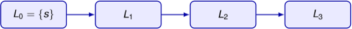

Formalmente, la capa `i` es el conjunto de nodos que están exactamente a `i` pasos de `s`:

```
L_i = { v ∈ V : δ(s, v) = i }
```

BFS trabaja sobre un grafo o digrafo **sin pesos** y devuelve **dos cosas**:

| Devuelve | Qué guarda | En castellano |
|---|---|---|
| `d[v]` | la distancia de `s` hasta `v` | "¿a cuántos pasos me queda `v`?" 
| `π[v]` | el predecesor de `v` | "¿quién fue el que descubrió a `v`?" (su "padre") |

-------------
`π` es la letra griega **pi**; acá no tiene nada que ver con 3,14 — es solo un nombre de variable para guardar el padre de cada nodo.

`d[v]` = cantidad de aristas del camino más corto. Se fija en un instante único: cuando v se descubre (pasa a gris), no cuando se procesa. Fórmula: d[v] = d[u] + 1, donde u es quien lo descubrió. No depende de cuántos otros nodos ya procesó el algoritmo antes. 

> `temas/35-bfs-explora-por-distancia-creciente-desd.md` — BFS explora por distancia creciente desde una fuente

---

## 2. El esquema general (BFS y DFS son primos)

Muchísimos algoritmos de grafos siguen este mismo molde para recorrer todo lo alcanzable desde `s`:

1. Descubrir el nodo inicial `s`.
2. Mantener una **colección** de nodos ya descubiertos pero todavía sin procesar.
3. Elegir uno de esos nodos `u`, procesarlo y mirar sus vecinos.
4. Meter en la colección a los vecinos de `u` que todavía no habían sido descubiertos.

Lo único que cambia entre un algoritmo y otro es **qué estructura uso** en el paso 2:

| Estructura | A quién saco primero | Algoritmo resultante |
|---|---|---|
| **Cola** (fila del banco: FIFO, el primero que llega es el primero que sale) | el **más antiguo** | **BFS** |
| **Pila** (pila de platos: LIFO, el último que apilé es el primero que saco) | el **más reciente** | **DFS** |

Ese único detalle es el que hace que BFS vaya por capas y DFS se meta a lo profundo.

> `temas/34-recorrer-un-grafo.md` — Recorrer un grafo

---

## 3. Los tres colores: el estado de cada nodo

Mientras corre el algoritmo, cada nodo está en uno de tres estados. Los colores son solo una forma cómoda de nombrarlos:

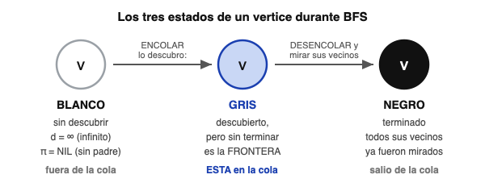

- **Blanco** — todavía **no lo descubrí**. Su distancia es `d[v] = ∞` y su padre es `π[v] = NIL` (NIL = "nada", "vacío").
- **Gris** — **ya lo descubrí, pero todavía no lo terminé**. Está **adentro de la cola**. Los grises forman la **frontera**: el borde entre lo que ya conozco y lo que todavía no.
- **Negro** — **terminado**. Ya recorrí toda su lista de vecinos, no me queda nada por mirar de él.

Y hay un detalle que conviene fijar porque explica todo lo demás:

> **Al comienzo de cada vuelta del ciclo, la cola contiene exactamente a los nodos grises.**

O sea: *cola* y *conjunto de grises* son la misma cosa mirada de dos maneras.

> `temas/36-los-colores-describen-el-estado-de-cada-.md` — Los colores describen el estado de cada nodo

---

## 4. El algoritmo, línea por línea

Este es el pseudocódigo tal cual está en el apunte:
V[G] = conjunto de vertices del grafo G

```
Función BFS(G, s)

    para cada u ∈ V(G) \ {s} hacer
        color[u] ← blanco
        d[u] ← ∞ ,  π[u] ← NIL

    color[s] ← gris
    d[s] ← 0 ,  π[s] ← NIL

    Q ← cola vacía
    ENCOLAR(Q, s)

    mientras Q ≠ ∅ hacer
        u ← DESENCOLAR(Q)
        para cada v ∈ Adj[u] hacer
            si color[v] = blanco entonces
                color[v] ← gris
                d[v] ← d[u] + 1 ,  π[v] ← u
                ENCOLAR(Q, v)
        color[u] ← negro

    devolver d, π
```

Traducido a lenguaje de todos los días:

| Línea | Qué está haciendo |
|---|---|
| `para cada u ... blanco, ∞, NIL` | **Inicialización.** Pinto todo de blanco: no descubrí nada todavía, todos están "infinitamente lejos" y nadie tiene padre. |
| `color[s] ← gris, d[s] ← 0` | La fuente es el único caso especial: está a **distancia 0 de sí misma** y ya está descubierta. Su padre es NIL porque nadie la descubrió, es el arranque. |
| `Q ← cola vacía; ENCOLAR(Q, s)` | Creo la **cola** y meto adentro a `s`. Es lo único pendiente por ahora. |
| `mientras Q ≠ ∅` | Mientras quede alguien pendiente, seguí trabajando. |
| `u ← DESENCOLAR(Q)` | Saco el **primero de la fila** (el que hace más tiempo que espera). Este es el paso clave: por ser cola y no pila, sale el más viejo. |
| `para cada v ∈ Adj[u]` | Miro **todos los vecinos** de `u`, uno por uno. |
| `si color[v] = blanco` | **Solo me interesan los que nunca vi.** Si `v` ya es gris o negro, lo ignoro: alguien lo descubrió antes que yo, por un camino igual de corto o más corto. |
| `color[v] ← gris` | Lo marco como descubierto para que nadie lo vuelva a descubrir. |
| `d[v] ← d[u] + 1` | `v` está **un paso más lejos** que `u`. Esta es la única forma en que se asignan distancias. |
| `π[v] ← u` | Me anoto quién lo descubrió, para después poder reconstruir el camino. |
| `ENCOLAR(Q, v)` | Lo mando **al final de la fila**. Por eso se procesa después que todos los que ya estaban esperando. |
| `color[u] ← negro` | Terminé con `u`: ya miré todos sus vecinos. |

Dos cosas que vale la pena remarcar porque son las que hacen que todo funcione:

1. **El chequeo `si color[v] = blanco`** garantiza que cada nodo se encola **una sola vez en toda la corrida**. Sin eso, el algoritmo daría vueltas para siempre en un grafo con ciclos.
2. **`ENCOLAR` mete al final y `DESENCOLAR` saca del principio.** Eso obliga a terminar toda una capa antes de empezar la siguiente.

> `temas/37-bfs-utiliza-una-cola-para-administrar-la.md` — BFS utiliza una cola para administrar la frontera

---

## 5. Ejemplo completo, paso a paso

El grafo del apunte tiene 8 nodos (`r s t u` arriba, `v w x y` abajo) y 10 aristas. La fuente es `s`.

**Supuesto del ejemplo:** las listas de vecinos están **en orden alfabético**. Esto importa porque decide en qué orden se descubren los vecinos.

Referencia de colores en los dibujos: **blanco** = sin descubrir · **azul claro** = gris (en la cola) · **negro** = terminado · las aristas azules gruesas son las que descubrieron un nodo nuevo.

---

### Inicialización — `Q = ⟨s⟩`

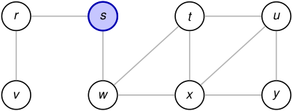

`s` se pinta gris con `d[s] = 0` y entra a la cola. Todo el resto está blanco con `d = ∞`.

> `temas/38-ejemplo-la-cola-obliga-a-procesar-el-gra.md` — Ejemplo: la cola obliga a procesar el grafo por capas

---

### Paso 1 — sale `s`, se descubren `r` y `w` → `Q = ⟨r, w⟩`

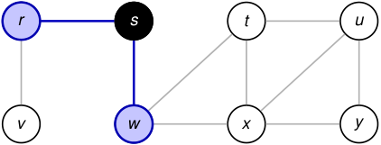

Saco `s` de la cola. Sus vecinos son `r` y `w`, los dos blancos: los pinto grises, les pongo `d = 0 + 1 = 1`, `π[r] = π[w] = s`, y los encolo. `s` queda **negro**.

> `temas/39-ejemplo-la-cola-obliga-a-procesar-el-gra.md`

---

### Paso 2 — sale `r`, se descubre `v` → `Q = ⟨w, v⟩`

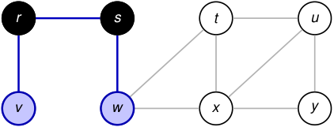

Sale `r` (era el primero de la fila). Sus vecinos son `s` y `v`. A `s` lo ignoro porque **ya es negro**. `v` está blanco: `d[v] = 1 + 1 = 2`, `π[v] = r`, y va **al final** de la cola, detrás de `w`.

Acá se ve la gracia de la cola: aunque `v` se acaba de descubrir, **no** se procesa antes que `w`, que estaba esperando desde el paso anterior.

> `temas/40-ejemplo-la-cola-obliga-a-procesar-el-gra.md`

---

### Paso 3 — sale `w`, se descubren `t` y `x` → `Q = ⟨v, t, x⟩`

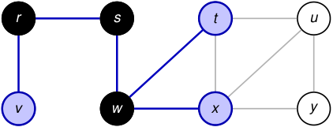

Sale `w`. Vecinos: `s` (negro, lo ignoro), `t` y `x` (blancos). Los dos quedan con `d = 1 + 1 = 2` y `π[t] = π[x] = w`.

Con esto **se terminó de descubrir la capa 2 entera**: `{v, t, x}`.

> `temas/41-ejemplo-la-cola-obliga-a-procesar-el-gra.md`

---

### Paso 4 — sale `v`, no descubre nada → `Q = ⟨t, x⟩`

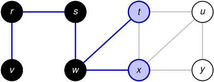

Sale `v`. Su único vecino es `r`, que ya está negro. No descubre nada nuevo. `v` pasa a negro y listo.

Que un nodo no descubra nada es totalmente normal y no rompe nada.

> `temas/42-ejemplo-la-cola-obliga-a-procesar-el-gra.md`

---

### Paso 5 — sale `t`, se descubre `u` → `Q = ⟨x, u⟩`

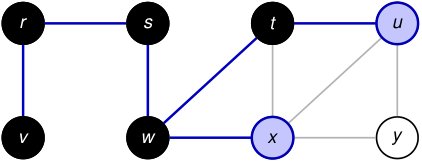

Sale `t`. Vecinos: `w` (negro), `x` (**gris**, ya está en la cola → lo ignoro) y `u` (blanco). Entonces `d[u] = 2 + 1 = 3` y `π[u] = t`.

Ojo con `x`: lo salteo **no** porque esté terminado, sino porque ya fue descubierto. La condición del algoritmo es "¿es blanco?", no "¿es negro?".

> `temas/43-ejemplo-la-cola-obliga-a-procesar-el-gra.md`

---

### Paso 6 — sale `x`, se descubre `y` → `Q = ⟨u, y⟩`

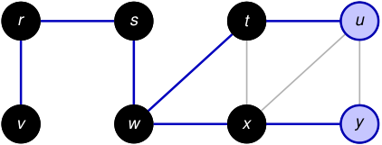

Sale `x`. Vecinos: `w` y `t` (negros), `u` (gris, ya descubierto en el paso anterior) e `y` (blanco). Entonces `d[y] = 2 + 1 = 3` y `π[y] = x`.

Fijate que `u` **podría** haber sido descubierto por `x`, pero `t` llegó primero. Por eso `π[u] = t` y no `x`. Las dos opciones dan distancia 3: el árbol cambia, la distancia no.

> `temas/44-ejemplo-la-cola-obliga-a-procesar-el-gra.md`

---

### Paso 7 — sale `u`, no descubre nada → `Q = ⟨y⟩`

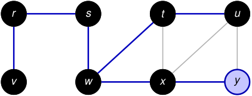

Sale `u`. Todos sus vecinos (`t`, `x`, `y`) ya fueron descubiertos. No hace nada, pasa a negro.

> `temas/45-ejemplo-la-cola-obliga-a-procesar-el-gra.md`

---

### Paso 8 — sale `y`, la cola queda vacía → **FIN**


Sale `y`, sus vecinos ya están todos vistos, pasa a negro y **la cola queda vacía**. El `mientras` corta y el algoritmo termina.

> `temas/46-ejemplo-la-cola-obliga-a-procesar-el-gra.md`

---

### La cola de un vistazo

Todos los pasos anteriores, resumidos en cómo fue quedando la cola:

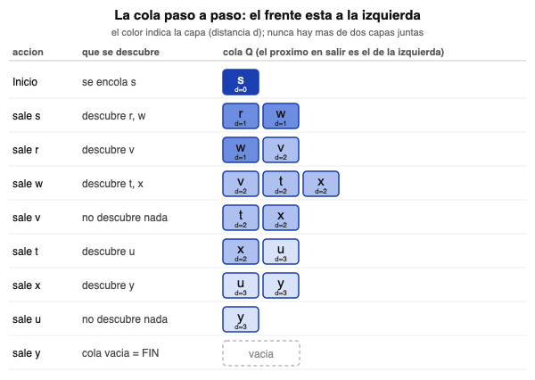

Mirando la columna de la derecha se ve solo el efecto de la cola: **los colores nunca se mezclan más de dos a la vez**, y siempre son dos capas consecutivas. Eso no es casualidad — es el lema de la sección 7.

---

## 6. El resultado final

Cuando termina, las capas coinciden exactamente con las distancias:

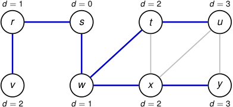

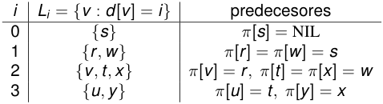

| Capa `i` | `L_i = { v : d[v] = i }` | Predecesores |
|---|---|---|
| 0 | `{s}` | `π[s] = NIL` |
| 1 | `{r, w}` | `π[r] = π[w] = s` |
| 2 | `{v, t, x}` | `π[v] = r`, `π[t] = π[x] = w` |
| 3 | `{u, y}` | `π[u] = t`, `π[y] = x` |

Y una aclaración importante del apunte:

> **El orden de las listas de vecinos puede cambiar el árbol, pero no las distancias.**

Es decir: si las listas de adyacencia estuvieran en otro orden, capaz `π[u]` daría `x` en vez de `t`. Pero `d[u] = 3` siempre. Las distancias son una propiedad del grafo; el árbol es una de las varias respuestas posibles.

> `temas/47-al-terminar-las-capas-coinciden-con-las-.md` — Al terminar, las capas coinciden con las distancias

---

## 7. Por qué funciona (las demostraciones, en criollo)

Hay que probar dos mitades: que `d[v]` **no se queda corto** y que **no se pasa**.

### 7.1 `d[v]` nunca es menor que la distancia real

**Lema:** al terminar BFS, para todo `v`: `d[v] ≥ δ(s, v)`.

La idea es simple: el único valor finito que se pone "de arranque" es `d[s] = 0`. Todos los demás nacen de la línea `d[v] ← d[u] + 1`, cuando `v` es descubierto desde `u`.

Por **inducción** (probar el caso más chico y después probar que si vale para un caso vale para el siguiente) sobre la cantidad de veces que se llamó a `ENCOLAR`: los `π` van armando un camino real de `s` hasta `v` que tiene exactamente `d[v]` aristas.

Y si `d[v]` es la longitud de **algún** camino que existe de verdad, y `δ(s, v)` es la longitud del camino **más corto**, entonces por definición `δ(s, v) ≤ d[v]`.

En criollo: **BFS nunca miente para abajo**, porque cada número que escribe corresponde a un camino que realmente encontró.

> `temas/48-cada-valor-d-v-es-la-longitud-de-un-cami.md` y `temas/53-lema.md` — Cada valor _d_[_v_] es la longitud de un camino encontrado

### 7.2 El lema de la cola: adentro hay a lo sumo dos capas

Falta probar que BFS tampoco se pasa para arriba. La herramienta para eso es este lema sobre el contenido de la cola.

**Lema de la cola:** si `Q = ⟨v₁, v₂, ..., v_r⟩` (de adelante hacia atrás), entonces

```
d[v₁] ≤ d[v₂] ≤ ... ≤ d[v_r] ≤ d[v₁] + 1
```

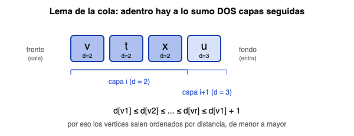

O sea: los de adentro de la cola están **ordenados por distancia**, y entre el primero y el último hay **como mucho 1 de diferencia**. Nunca conviven tres capas.

La demostración es por inducción sobre las operaciones que se le hacen a `Q`:

- **Al principio** `Q = ⟨s⟩`: hay un solo elemento, la propiedad se cumple sola.
- **Al desencolar** `v₁`: el nuevo primero es `v₂`, y ya sabíamos que `d[v₂] ≥ d[v₁]`. Las desigualdades se mantienen.
- **Al encolar**: si `v` se descubre procesando `u`, entonces `d[v] = d[u] + 1`. Como se agrega **al final**, queda detrás de nodos que tienen distancia `d[u]` o `d[u] + 1`. Sigue cumpliéndose.

**Consecuencia clave:** los nodos se encolan y se procesan **en orden no decreciente de `d`**. Nunca proceso un nodo de la capa 3 antes de terminar la capa 2. Eso es, literalmente, "ir por capas".

> `temas/54-la-cola-contiene-v-rtices-de-a-lo-sumo-d.md` y `temas/55-lema-de-la-cola.md` — La cola contiene nodos de a lo sumo dos capas / Lema de la cola

### 7.3 Teorema final

**Teorema:** para todo `v ∈ V(G)`, al terminar BFS vale `d[v] = δ(s, v)`. Además, para todo `v ≠ s` alcanzable desde `s`, un camino mínimo de `s` a `v` se obtiene tomando un camino mínimo de `s` a `π[v]` y agregándole la arista `(π[v], v)`.

**Idea de la demostración:** se supone que la igualdad falla y se elige, entre todos los nodos con valor incorrecto, **el que tiene `δ(s, v)` más chica**. Después se llega a una contradicción usando el lema de la cola (ese nodo tendría que haber sido descubierto antes de lo que fue).

La segunda parte del teorema es la que hace útil a `π`: para reconstruir el camino más corto no hace falta guardar caminos enteros, alcanza con guardar **un solo padre por nodo**.

> `temas/64-bfs-calcula-las-distancias-m-nimas-desde.md` y `temas/65-teorema.md` — BFS calcula las distancias mínimas desde _s_ / Teorema

---

## 8. El árbol BFS y cómo recuperar el camino

Después de correr `BFS(G, s)`, se define el **subgrafo de predecesores** `Gπ = (Vπ, Eπ)`, que es lo que queda si dibujo solamente las aristas por las que descubrí cosas:

```
Vπ = {s} ∪ { v ∈ V : π[v] ≠ NIL }
Eπ = { (π[v], v) : v ∈ Vπ \ {s} }
```

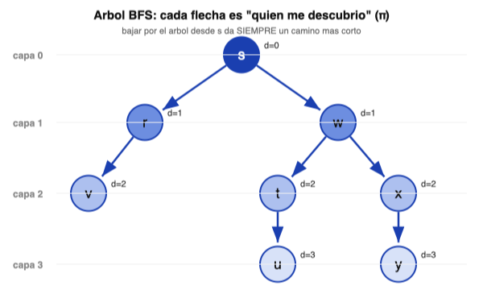

**Lema:** `Gπ` es un **árbol BFS con raíz `s`**. Contiene exactamente los nodos alcanzables desde `s`, y para cada uno de ellos el único camino simple (sin repetir nodos) que va de `s` a `v` dentro del árbol **es un camino mínimo en `G`**, de longitud `d[v] = δ(s, v)`.

Traducido: **bajar por el árbol desde la raíz siempre te da un camino más corto**. No hay que buscar nada, ya está ahí.

Para imprimirlo hay un procedimiento recursivo de tres casos:

```
PRINT-PATH(G, s, v)

    si v = s entonces
        IMPRIMIR(s)
    sino, si π[v] = NIL entonces
        IMPRIMIR("no existe camino")
    sino
        PRINT-PATH(G, s, π[v])
        IMPRIMIR(v)
```

Los tres casos son:

1. **Llegué a la raíz** → la imprimo y corto.
2. **`v` no tiene padre y no es `s`** → nunca fue descubierto, así que **no hay camino** de `s` a `v`.
3. **Caso general** → primero imprimo todo el camino hasta mi padre, y recién después me imprimo a mí. Ese orden (primero la llamada recursiva, después el `IMPRIMIR`) es lo que hace que salga de `s` hacia `v` y no al revés.

**Ejemplo con el grafo de arriba** — camino de `s` a `u`: `π[u] = t`, `π[t] = w`, `π[w] = s`. Se imprime **`s → w → t → u`**, que son 3 aristas, exactamente `d[u] = 3`. ✔

> `temas/66-rbol-bfs-y-reconstrucci-n-de-caminos-m-n.md`, `temas/67-subgrafo-de-predecesores.md` y `temas/68-lema.md` — Árbol BFS y reconstrucción de caminos mínimos / Subgrafo de predecesores / Lema

---

## 9. Cuánto tarda (complejidad)

Con `n` = cantidad de nodos y `m` = cantidad de aristas, y **usando listas de adyacencia**:

- La **inicialización** (pintar todo de blanco, poner `∞` y `NIL`) recorre todos los nodos una vez: `O(n)`.
- Cada nodo **se encola a lo sumo una vez** (gracias al chequeo de blanco), así que también se desencola a lo sumo una vez.
- Como cada nodo se procesa una sola vez, **cada lista de vecinos se examina una sola vez**. La suma de los tamaños de todas las listas es la suma de los grados, que da `2m` en un grafo (cada arista aparece en las listas de sus dos extremos).

```
O(n) + O( Σ d(v) )  =  O(n + 2m)  =  O(n + m)
```

`O(...)` (notación "O grande") quiere decir "el tiempo crece **a lo sumo** proporcional a esto". `O(n + m)` es **lineal en el tamaño del grafo**: es lo mejor a lo que se puede aspirar, porque para responder cualquier cosa hay que al menos mirar el grafo entero una vez.

> `temas/65-teorema.md` — Teorema (el cálculo de la complejidad está al final del mismo archivo)

---

## 10. BFS vs DFS, en una tabla

| | **BFS** (a lo ancho) | **DFS** (a lo profundo) |
|---|---|---|
| Estructura | **cola** (sale el más antiguo) | **pila** / recursión (sale el más reciente) |
| Cómo avanza | termina una capa entera antes de pasar a la siguiente | se mete lo más profundo que puede y después retrocede |
| Punto de partida | **una sola fuente `s`** | **no está atada a una fuente**: un ciclo exterior arranca desde cada nodo que siga blanco |
| Qué arma | **un árbol** con raíz `s` (solo lo alcanzable desde `s`) | un **bosque** (varios árboles), que cubre todos los nodos |
| Para qué sirve | **caminos mínimos** en grafos sin pesos | orden topológico, componentes, puentes, ciclos |

> `temas/34-recorrer-un-grafo.md` y `temas/70-dfs-avanza-mientras-encuentra-v-rtices-n.md` — Recorrer un grafo / DFS avanza mientras encuentra nodos no descubiertos

---

## 11. Lo mínimo que hay que acordarse

1. **BFS = Breadth-First Search = búsqueda a lo ancho.** Recorre por **capas**, de lo más cerca a lo más lejos.
2. Sirve para grafos y digrafos **sin pesos**. Con pesos hay que usar otro algoritmo.
3. La **cola** (FIFO) es lo único que hace la magia. Cambiala por una pila y tenés DFS.
4. Devuelve `d[v]` (distancia mínima) y `π[v]` (padre para reconstruir el camino).
5. Un nodo se encola **una sola vez**, gracias al chequeo `si color[v] = blanco`.
6. En la cola conviven **a lo sumo dos capas consecutivas** (lema de la cola).
7. Al terminar, `d[v] = δ(s, v)` **garantizado** (teorema).
8. Cuesta **`O(n + m)`** con listas de adyacencia.
9. Las **distancias son únicas**; el **árbol no** (depende del orden de las listas de vecinos).
