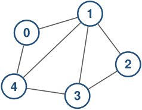

# El grafo y su representación son objetos diferentes 

### **Objeto matemático** 

### **Estructura de datos** 

<!-- Start of picture text -->
1 0 2 4 3 <!-- End of picture text -->

Debe almacenar los vértices y las aristas. 

Debe permitir las operaciones que necesita el algoritmo. Distintas representaciones inducen distintos costos. 

_G_ = ( _V , E_ ) 

No hay una representación universalmente mejor. 

2_do_ Cuatrimestre de 2026 

(DC, FCEyN, UBA) 

DC - FCEyN - UBA 

3 / 58 

Ordenamiento topológico 

Búsqueda a lo ancho 

Búsqueda en profundidad 

Detección de aristas de corte 

Los grafos como modelos 

