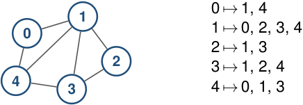
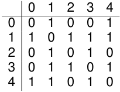

# Un mismo grafo admite distintas representaciones 

### **Grafo** 

### **Listas** 

### **Matriz** 

<!-- Start of picture text -->
0  ↦→ 1, 4 1 0 1  ↦→ 0, 2, 3, 4 2  ↦→ 1, 3 2 3  ↦→ 1, 2, 4 4 3 4  ↦→ 0, 1, 3 <!-- End of picture text -->

<!-- Start of picture text -->
0 1 2 3 4 0 0 1 0 0 1 1 1 0 1 1 1 2 0 1 0 1 0 3 0 1 1 0 1 4 1 1 0 1 0 <!-- End of picture text -->

La elección no cambia el grafo; cambia cómo accedemos a su información. 

2_do_ Cuatrimestre de 2026 5 / 58 

(DC, FCEyN, UBA) 

DC - FCEyN - UBA 

Ordenamiento topológico 

Búsqueda a lo ancho 

Búsqueda en profundidad 

Detección de aristas de corte 

Los grafos como modelos 

