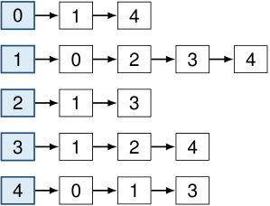

# Las listas almacenan solamente los vecinos existentes 

<!-- Start of picture text -->
0 1 4 1 0 2 3 4 2 1 3 3 1 2 4 4 0 1 3 <!-- End of picture text -->

Adj[ _v_ ] = _N_ ( _v_ ) _._ 

Hay una lista enlazada por vértice. 

En un digrafo se guardan, usualmente, los vecinos de salida: 

_N_+ ( _v_ ) = _{w_ : _v → w ∈ E}._ 

El orden de los vecinos no está determinado por el grafo. 

2_do_ Cuatrimestre de 2026 6 / 58 

(DC, FCEyN, UBA) 

DC - FCEyN - UBA 

Ordenamiento topológico 

Búsqueda a lo ancho 

Búsqueda en profundidad 

Detección de aristas de corte 

Los grafos como modelos 

