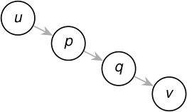

## Teorema del camino blanco 

En el bosque DFS, _v_ es descendiente de _u_ si y solo si, en el instante _d_ [ _u_ ], existe un camino de _u_ a _v_ formado enteramente por vértices blancos. 

<!-- Start of picture text -->
u p q v <!-- End of picture text -->

camino completamente blanco al descubrir _u_ 

#### **Idea de la demostración.** 

- _⇒_ El camino de _u_ a cualquiera de sus descendientes en el árbol DFS todavía está blanco cuando se descubre _u_ . 

- _⇐_ Si DFS no incorporara todo el camino blanco, tomemos el primer vértice que queda afuera. Su predecesor sí es descendiente de _u_ y, al examinar la arista que los une, encontraría blanco al siguiente vértice: contradicción. 

2_do_ Cuatrimestre de 2026 42 / 58 

(DC, FCEyN, UBA) 

DC - FCEyN - UBA 

Ordenamiento topológico 

Búsqueda a lo ancho 

Búsqueda en profundidad 

Detección de aristas de corte 

Los grafos como modelos 

