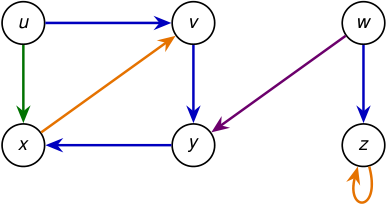

# La corrida anterior contiene los cuatro tipos de arista 

<!-- Start of picture text -->
u v w x y z <!-- End of picture text -->

**_−→_** forward edge 

**_−→_** tree edge 

**_−→_** back edge 

**_−→_** cross edge 

_u → x_ es una forward edge _,_ 

_x → v_ es una back edge _,_ 

_w → y_ es una cross edge _._ 

2_do_ Cuatrimestre de 2026 

44 / 58 

(DC, FCEyN, UBA) 

DC - FCEyN - UBA 

Ordenamiento topológico 

Búsqueda a lo ancho 

Búsqueda en profundidad 

Detección de aristas de corte 

Los grafos como modelos 

