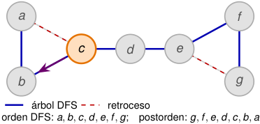

# Cálculo offline de low 

<!-- Start of picture text -->
a f c d e b g árbol DFS retroceso orden DFS:  a, b, c, d, e, f , g ; postorden:  g, f , e, d, c, b, a <!-- End of picture text -->

|_u_|_d_[_u_]|_f_[_u_]|low[_u_]|
|---|---|---|---|
|_a_|1|14|1|
|_b_|2|13|1|
|_c_|3|12|1|
|_d_|4|11|4|
|_e_|5|10|5|
|_f_|6|9|5|
|_g_|7|8|5|

**8. Se procesa** _c_ **.** 

low[ _b_ ] _←_ m´ın _{_ 2 _,_ low[ _c_ ] _}_ = 1 _._ 

2_do_ Cuatrimestre de 2026 

(DC, FCEyN, UBA) 

DC - FCEyN - UBA 

52 / 58 

Ordenamiento topológico 

Búsqueda a lo ancho 

Búsqueda en profundidad 

Detección de aristas de corte 

Los grafos como modelos 

