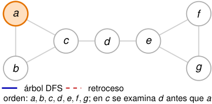

# Al retroceder, DFS completa _f_ y propaga low 

<!-- Start of picture text -->
a f c d e b g árbol DFS retroceso orden:  a, b, c, d, e, f , g ; en  c se examina  d antes que  a <!-- End of picture text -->

|_u_|_d_[_u_]|_f_[_u_]|low[_u_]|
|---|---|---|---|
|_a_|1|–|1|
|_b_|–|–|–|
|_c_ _d_|– –|– –|– –|
|_e_ _f_ _g_|– – –|– – –|– – –|

##### **1. Descubre** _a_ **.** 

##### _d_ [ _a_ ] = low[ _a_ ] = 1 _._ 

2_do_ Cuatrimestre de 2026 

(DC, FCEyN, UBA) 

DC - FCEyN - UBA 

55 / 58 

Ordenamiento topológico 

Búsqueda a lo ancho 

Búsqueda en profundidad 

Detección de aristas de corte 

Los grafos como modelos 

