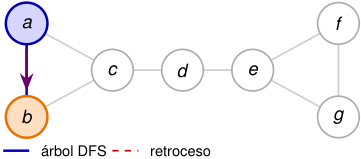
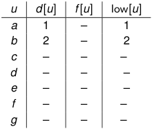

# Al retroceder, DFS completa _f_ y propaga low 

<!-- Start of picture text -->
a f c d e b g árbol DFS retroceso <!-- End of picture text -->

orden: _a, b, c, d, e, f , g_ ; en _c_ se examina _d_ antes que _a_ 

<!-- Start of picture text -->
u d [ u ] f [ u ] low[ u ] a 1 – 1 b 2 – 2 c – – – d – – – e – – – f – – – g – – – <!-- End of picture text -->

##### **2. Avanza por** _ab_ **y descubre** _b_ **.** 

##### _d_ [ _b_ ] = low[ _b_ ] = 2 _._ 

2_do_ Cuatrimestre de 2026 

(DC, FCEyN, UBA) 

DC - FCEyN - UBA 

55 / 58 

Ordenamiento topológico 

Búsqueda a lo ancho 

Búsqueda en profundidad 

Detección de aristas de corte 

Los grafos como modelos 

