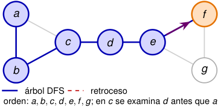
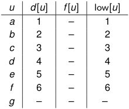

# Al retroceder, DFS completa _f_ y propaga low 

<!-- Start of picture text -->
a f c d e b g árbol DFS retroceso orden:  a, b, c, d, e, f , g ; en  c se examina  d antes que  a <!-- End of picture text -->

<!-- Start of picture text -->
u d [ u ] f [ u ] low[ u ] a 1 – 1 b 2 – 2 c 3 – 3 d 4 – 4 e 5 – 5 f 6 – 6 g – – – <!-- End of picture text -->

##### **6. Avanza por** _ef_ **y descubre** _f_ **.** 

_d_ [ _f_ ] = low[ _f_ ] = 6 _._ 

2_do_ Cuatrimestre de 2026 

(DC, FCEyN, UBA) 

DC - FCEyN - UBA 

55 / 58 

Ordenamiento topológico 

Búsqueda a lo ancho 

Búsqueda en profundidad 

Detección de aristas de corte 

Los grafos como modelos 

