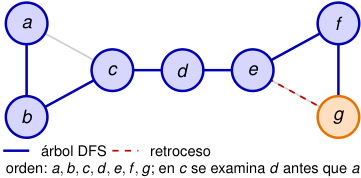
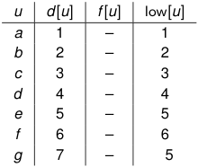

# Al retroceder, DFS completa _f_ y propaga low 

<!-- Start of picture text -->
a f c d e b g árbol DFS retroceso orden:  a, b, c, d, e, f , g ; en  c se examina  d antes que  a <!-- End of picture text -->

<!-- Start of picture text -->
u d [ u ] f [ u ] low[ u ] a 1 – 1 b 2 – 2 c 3 – 3 d 4 – 4 e 5 – 5 f 6 – 6 g 7 – 5 <!-- End of picture text -->

**8.** _g_ **encuentra la arista de retroceso** _ge_ **.** Como _e_ es un ancestro, 

low[ _g_ ] _←_ m´ın _{_ 7 _, d_ [ _e_ ] _}_ = 5 _._ 

El tiempo no aumenta. 

2_do_ Cuatrimestre de 2026 55 / 58 

(DC, FCEyN, UBA) 

DC - FCEyN - UBA 

Ordenamiento topológico 

Búsqueda a lo ancho 

Búsqueda en profundidad 

Detección de aristas de corte 

Los grafos como modelos 

