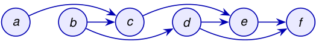

# Un orden topológico respeta todas las aristas 

Sea _D_ = ( _V , E_ ) un digrafo. Un **ordenamiento topológico** de _D_ es un orden lineal _v_ 1 _, v_ 2 _, . . . , vn_ de todos sus vértices tal que _vi → vj ∈ E_ = _⇒ i < j_ . 

<!-- Start of picture text -->
a b c d e f <!-- End of picture text -->

todas las flechas avanzan en el orden 

