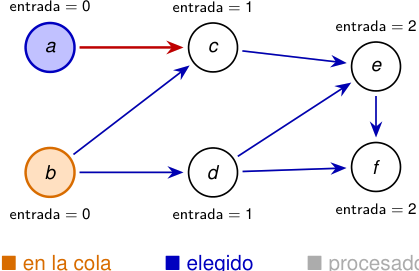

# Ejemplo: la cola se actualiza al eliminar cada vértice 

<!-- Start of picture text -->
entrada = 0 entrada = 1 entrada = 2 a c e b d f entrada = 0 entrada = 1 entrada = 2 ■ en la cola ■ elegido ■ procesado <!-- End of picture text -->

■ elegido ■ procesado 

**Procesamos** _a_ 

_Q_ = _⟨b⟩, L_ = _⟨a⟩._ 

Al eliminar _a → c_ , el grado de entrada de _c_ baja de 2 a 1. 

2_do_ Cuatrimestre de 2026 16 / 58 

(DC, FCEyN, UBA) 

DC - FCEyN - UBA 

Ordenamiento topológico 

Búsqueda a lo ancho 

Búsqueda en profundidad 

Detección de aristas de corte 

Los grafos como modelos 

