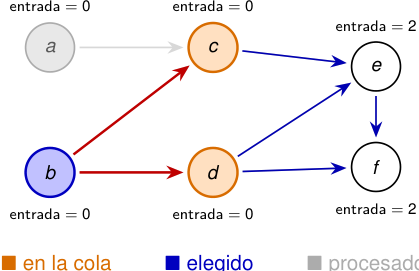

# Ejemplo: la cola se actualiza al eliminar cada vértice 

<!-- Start of picture text -->
entrada = 0 entrada = 0 entrada = 2 a c e b d f entrada = 0 entrada = 0 entrada = 2 ■ en la cola ■ elegido ■ procesado <!-- End of picture text -->

■ elegido 

■ procesado 

**Procesamos** _b_ 

_Q_ = _⟨c, d⟩, L_ = _⟨a, b⟩._ Tanto _c_ como _d_ pasan a tener grado de entrada 0 y se encolan. 

2_do_ Cuatrimestre de 2026 16 / 58 

(DC, FCEyN, UBA) 

DC - FCEyN - UBA 

Ordenamiento topológico 

Búsqueda a lo ancho 

Búsqueda en profundidad 

Detección de aristas de corte 

Los grafos como modelos 

