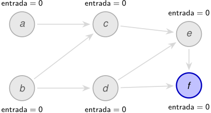

# Ejemplo: la cola se actualiza al eliminar cada vértice 

<!-- Start of picture text -->
entrada = 0 entrada = 0 entrada = 0 a c e b d f entrada = 0 entrada = 0 entrada = 0 <!-- End of picture text -->

#### **Procesamos** _f_ 

_Q_ = _⟨⟩, L_ = _⟨a, b, c, d, e, f ⟩._ Como _|L|_ = _|V_ ( _D_ ) _|_ , el algoritmo obtuvo un orden topológico. 

■ en la cola 

■ elegido ■ procesado 

2_do_ Cuatrimestre de 2026 16 / 58 

(DC, FCEyN, UBA) 

DC - FCEyN - UBA 

Ordenamiento topológico 

Búsqueda a lo ancho 

Búsqueda en profundidad 

Detección de aristas de corte 

Los grafos como modelos 

