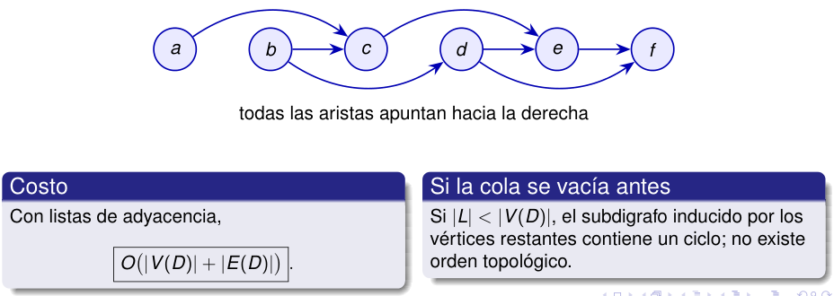

# El resultado coloca el origen antes que el destino 

#### La ejecución anterior devuelve 

#### _L_ = _⟨a, b, c, d, e, f ⟩._ 

<!-- Start of picture text -->
a b c d e f todas las aristas apuntan hacia la derecha Costo Si la cola se vacía antes Con listas de adyacencia, Si  |L| < |V ( D ) | , el subdigrafo inducido por los vértices restantes contiene un ciclo; no existe O (︁ |V ( D ) |  +  |E ( D ) | )︁ . orden topológico. <!-- End of picture text -->

2_do_ Cuatrimestre de 2026 17 / 58 

(DC, FCEyN, UBA) 

DC - FCEyN - UBA 

Ordenamiento topológico 

Búsqueda a lo ancho 

Búsqueda en profundidad 

Detección de aristas de corte 

Los grafos como modelos 

