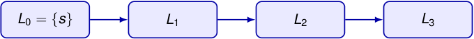

# BFS explora por distancia creciente desde una fuente 

Sea _G_ = ( _V , E_ ) un grafo o digrafo **sin pesos** y sea _s ∈ V_ un vértice fuente. La búsqueda a lo ancho (BFS) explora primero los vértices más cercanos a _s_ . 

_Li_ = _{v ∈ V_ : _δ_ ( _s, v_ ) = _i},_ 

donde _δ_ ( _s, v_ ) es la longitud de un camino mínimo de _s_ a _v_ , y vale _∞_ si _v_ no es alcanzable desde _s_ . 

<!-- Start of picture text -->
L 0 =  {s} L 1 L 2 L 3 <!-- End of picture text -->

BFS calcula: 

- _d_ [ _v_ ]: la distancia desde _s_ hasta _v_ ; 

- _π_ [ _v_ ]: el predecesor de _v_ en un árbol de caminos mínimos. 

2_do_ Cuatrimestre de 2026 19 / 58 

(DC, FCEyN, UBA) 

DC - FCEyN - UBA 

Ordenamiento topológico 

Búsqueda a lo ancho 

Búsqueda en profundidad 

Detección de aristas de corte 

Los grafos como modelos 

