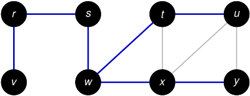

# Ejemplo: la cola obliga a procesar el grafo por capas 

#### Suponemos que las listas de adyacencia están en orden alfabético. 

<!-- Start of picture text -->
r s t u v w x y <!-- End of picture text -->

Se procesa _y_ : la cola queda vacía y el algoritmo termina. 

2_do_ Cuatrimestre de 2026 22 / 58 

(DC, FCEyN, UBA) 

DC - FCEyN - UBA 

Ordenamiento topológico 

Búsqueda a lo ancho 

Búsqueda en profundidad 

Detección de aristas de corte 

Los grafos como modelos 

