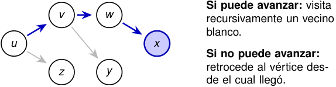

# DFS avanza mientras encuentra vértices no descubiertos 

La búsqueda en profundidad (DFS) explora las aristas que salen del vértice **descubierto más recientemente** que todavía tiene aristas sin examinar. 

<!-- Start of picture text -->
Si puede avanzar: visita v w recursivamente un vecino blanco. u x Si no puede avanzar: retrocede al vértice des- z y de el cual llegó. <!-- End of picture text -->

Cuando termina de explorar lo alcanzable desde una fuente, el algoritmo elige otro vértice no descubierto. Por eso, en general, produce un **bosque** y no un único árbol. 

2_do_ Cuatrimestre de 2026 29 / 58 

(DC, FCEyN, UBA) 

DC - FCEyN - UBA 

Ordenamiento topológico 

Búsqueda a lo ancho 

Búsqueda en profundidad 

Detección de aristas de corte 

Los grafos como modelos 

