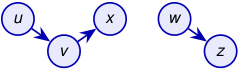

# Los predecesores forman un bosque DFS 

Cuando DFS descubre a _v_ al examinar una arista ( _u, v_ ), asigna 

_π_ [ _v_ ] _← u._ 

El **subgrafo de predecesores** es 

_Gπ_ = ( _V , Eπ_ ) _, Eπ_ = _{_ ( _π_ [ _v_ ] _, v_ ) : _v ∈ V_ y _π_ [ _v_ ] _̸_ = NIL _}._ 

_Gπ_ es el **bosque DFS** . 

Cada llamada inicial a DFS-VISIT( _G, u_ ) crea una raíz. 

<!-- Start of picture text -->
u x w v z <!-- End of picture text -->

árbol 1 

árbol 2 

Las aristas de _Eπ_ son las **aristas del árbol** . 

A diferencia de BFS, DFS no está asociada a una única fuente: el bucle exterior garantiza que todos los vértices pertenezcan a algún árbol. 

2_do_ Cuatrimestre de 2026 

(DC, FCEyN, UBA) 

DC - FCEyN - UBA 

30 / 58 

Ordenamiento topológico 

Búsqueda a lo ancho 

Búsqueda en profundidad 

Detección de aristas de corte 

Los grafos como modelos 

