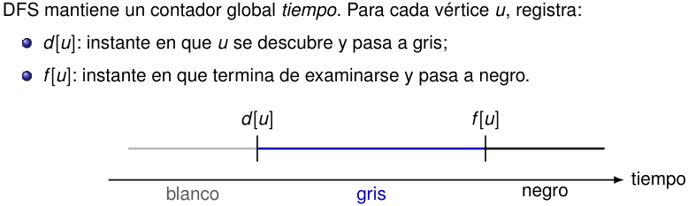

# Tiempos de descubrimiento y de finalización 

<!-- Start of picture text -->
DFS mantiene un contador global  tiempo . Para cada vértice  u , registra: d [ u ]: instante en que  u se descubre y pasa a gris; f [ u ]: instante en que termina de examinarse y pasa a negro. d [ u ] f [ u ] tiempo blanco gris negro <!-- End of picture text -->

Como hay un descubrimiento y una finalización por vértice, los tiempos son enteros de 1 a 2 _|V |_ . En particular, 

1 _≤ d_ [ _u_ ] _< f_ [ _u_ ] _≤_ 2 _|V |._ 

2_do_ Cuatrimestre de 2026 32 / 58 

(DC, FCEyN, UBA) 

DC - FCEyN - UBA 

Ordenamiento topológico 

Búsqueda a lo ancho 

Búsqueda en profundidad 

Detección de aristas de corte 

Los grafos como modelos 

