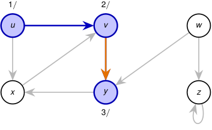

# Corrida paso a paso: DFS profundiza antes de retroceder 

<!-- Start of picture text -->
1 / 2 / u v w x y z 3 / <!-- End of picture text -->

_t_ = 3: se examina ( _v , y_ ); como _y_ está blanco, _π_ [ _y_ ] = _v_ . 

Pila: _⟨u, v , y⟩_ . 

2_do_ Cuatrimestre de 2026 36 / 58 

(DC, FCEyN, UBA) 

DC - FCEyN - UBA 

Ordenamiento topológico 

Búsqueda a lo ancho 

Búsqueda en profundidad 

Detección de aristas de corte 

Los grafos como modelos 

