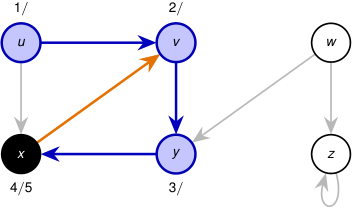

# Corrida paso a paso: DFS profundiza antes de retroceder 

<!-- Start of picture text -->
1 / 2 / u v w x y z 4 / 5 3 / <!-- End of picture text -->

_x_ examina ( _x, v_ ), pero _v_ ya está gris. No hay llamada recursiva y _x_ finaliza en _t_ = 5. 

Pila: _⟨u, v , y ⟩_ . 

2_do_ Cuatrimestre de 2026 36 / 58 

(DC, FCEyN, UBA) 

DC - FCEyN - UBA 

Ordenamiento topológico 

Búsqueda a lo ancho 

Búsqueda en profundidad 

Detección de aristas de corte 

Los grafos como modelos 

