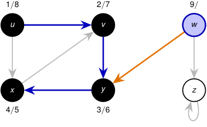

# Corrida paso a paso: DFS profundiza antes de retroceder 

<!-- Start of picture text -->
1 / 8 2 / 7 9 / u v w x y z 4 / 5 3 / 6 <!-- End of picture text -->

El bucle exterior llega a _w_ , todavía blanco: _d_ [ _w_ ] = 9. _w_ examina ( _w, y_ ), pero _y_ está negro. 

Pila: _⟨w⟩_ . 

2_do_ Cuatrimestre de 2026 36 / 58 

(DC, FCEyN, UBA) 

DC - FCEyN - UBA 

Ordenamiento topológico 

Búsqueda a lo ancho 

Búsqueda en profundidad 

Detección de aristas de corte 

Los grafos como modelos 

