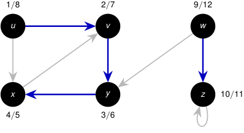

# Corrida paso a paso: DFS profundiza antes de retroceder 

<!-- Start of picture text -->
1 / 8 2 / 7 9 / 12 u v w x y z 10 / 11 4 / 5 3 / 6 <!-- End of picture text -->

_w_ ya no tiene aristas sin examinar y finaliza en _t_ = 12. Todos los vértices están negros y DFS termina. 

Pila: _⟨⟩_ . 

2_do_ Cuatrimestre de 2026 36 / 58 

(DC, FCEyN, UBA) 

DC - FCEyN - UBA 

Ordenamiento topológico 

Búsqueda a lo ancho 

Búsqueda en profundidad 

Detección de aristas de corte 

Los grafos como modelos 

