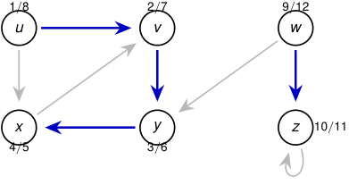
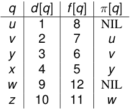

# La corrida produce dos árboles y doce marcas temporales 

<!-- Start of picture text -->
1 / 8 2 / 7 9 / 12 u v w x y z 10 / 11 4 / 5 3 / 6 <!-- End of picture text -->

<!-- Start of picture text -->
q d [ q ] f [ q ] π [ q ] u 1 8 NIL v 2 7 u y 3 6 v x 4 5 y w 9 12 NIL z 10 11 w <!-- End of picture text -->

#### Azul: aristas del bosque DFS. 

Orden de descubrimiento: _u, v , y , x, w, z_ . Orden de finalización: _x, y, v , u, z, w_ . 

2_do_ Cuatrimestre de 2026 37 / 58 

(DC, FCEyN, UBA) 

DC - FCEyN - UBA 

Ordenamiento topológico 

Búsqueda a lo ancho 

Búsqueda en profundidad 

Detección de aristas de corte 

Los grafos como modelos 

