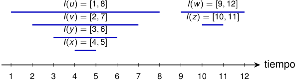

# Los tiempos de DFS tienen una estructura de paréntesis 

El intervalo 

_I_ ( _u_ ) = [ _d_ [ _u_ ] _, f_ [ _u_ ]] 

representa el período durante el cual la llamada de _u_ está activa. En la corrida anterior, los intervalos de cada árbol se anidan: 

<!-- Start of picture text -->
I ( u ) = [1 ,  8] I ( w ) = [9 ,  12] I ( v ) = [2 ,  7] I ( z ) = [10 ,  11] I ( y ) = [3 ,  6] I ( x ) = [4 ,  5] tiempo 1 2 3 4 5 6 7 8 9 10 11 12 <!-- End of picture text -->

Si al descubrir _u_ escribimos (u y al finalizarlo escribimos u), obtenemos una expresión de paréntesis bien formada: una llamada recursiva debe terminar antes de que termine la llamada que la creó. 

2_do_ Cuatrimestre de 2026 39 / 58 

(DC, FCEyN, UBA) 

DC - FCEyN - UBA 

Ordenamiento topológico 

Búsqueda a lo ancho 

Búsqueda en profundidad 

Detección de aristas de corte 

Los grafos como modelos 

