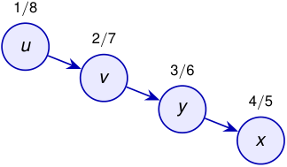

## Corolario 

Un vértice _v_ es descendiente propio de _u_ en el bosque DFS si y solo si 

_d_ [ _u_ ] _< d_ [ _v_ ] _< f_ [ _v_ ] _< f_ [ _u_ ] _._ 

Por ejemplo, 

<!-- Start of picture text -->
1 / 8 u 2 / 7 v 3 / 6 4 / 5 y x <!-- End of picture text -->

1 _<_ 4 _<_ 5 _<_ 8 _,_ 

luego _x_ es descendiente de _u_ . 

#### **Idea de la demostración.** 

Es la traducción directa del caso de intervalos anidados del teorema de los paréntesis. 

2_do_ Cuatrimestre de 2026 41 / 58 

(DC, FCEyN, UBA) 

DC - FCEyN - UBA 

Ordenamiento topológico 

Búsqueda a lo ancho 

Búsqueda en profundidad 

Detección de aristas de corte 

Los grafos como modelos 

<!-- Start of picture text -->
p q camino completamente blanco al descubrir  u <!-- End of picture text -->

