Caminos, ciclos y conexidad 

Grafos bipartitos 

Definiciones básicas y notación 

Noción de isomorfismo 

Los grafos como modelos 

Introducción a la teoría de grafos Modelos, definiciones, isomorfismo y conexidad 

Departamento de Computación Facultad de Ciencias Exactas y Naturales Universidad de Buenos Aires 

2_do_ Cuatrimestre de 2026 

2_do_ Cuatrimestre de 2026 

(DC, FCEyN, UBA) 

DC - FCEyN - UBA 

1 / 67 

Caminos, ciclos y conexidad 

Grafos bipartitos 

Definiciones básicas y notación 

Noción de isomorfismo 

Los grafos como modelos 

# Agenda de hoy 

> 1 Los grafos como modelos. 

> 2 Definiciones básicas y notación. 

> 3 Noción de isomorfismo (grados, orientaciones). 

> 4 Caminos, ciclos y conexidad. 

> 5 Grafos bipartitos. 

Basado en Cormen, Leiserson, Rivest, Stein, _Introduction to Algorithms_ , cap. 22 (Elementary Graph Algorithms), y Kleinberg, Tardos, _Algorithm Design_ , cap. 3 (Graphs). 

2_do_ Cuatrimestre de 2026 

(DC, FCEyN, UBA) 

DC - FCEyN - UBA 

2 / 67 

Los grafos como modelos Definiciones básicas y notación Noción de isomorfismo Caminos, ciclos y conexidad Grafos bipartitos Noción de grafo Modelar relaciones de a pares A B Un grafo codifica una colección de objetos y algunas relaciones entre ellos. E C _G_ = ( _V , E_ ) D _V_ : conjunto de vértices o nodos. un mismo lenguaje para muchos contextos _E_ : conjunto de aristas formado por pares no ordenados de vértices. El dibujo ayuda a pensar, pero el grafo es la estructura combinatoria. ~~<mark>_</mark>~~ (DC, FCEyN, UBA) DC - FCEyN - UBA ~~<u><mark>ia</mark></u>~~ 2_do_ Cuatrimestre de 2026 3 / 67 

2_do_ Cuatrimestre de 2026 3 / 67 

Caminos, ciclos y conexidad 

Grafos bipartitos 

Definiciones básicas y notación 

Noción de isomorfismo 

Los grafos como modelos 

# Redes de transporte 

Ejemplo 

Una red aérea puede modelarse con vértices que representan aeropuertos y aristas que representan vuelos directos. 

Si sólo importa que haya conexión directa: grafo no dirigido. Si importa el sentido del vuelo: digrafo. Los hubs aparecen como vértices con muchas aristas incidentes. 

<!-- Start of picture text -->
C A D H B E <!-- End of picture text -->

vértices: aeropuertos aristas: vuelos directos 

2_do_ Cuatrimestre de 2026 

(DC, FCEyN, UBA) 

DC - FCEyN - UBA 

4 / 67 

Caminos, ciclos y conexidad 

Grafos bipartitos 

Definiciones básicas y notación 

Noción de isomorfismo 

Los grafos como modelos 

# Comunicación e información 

## Red física o virtual 

Computadoras, servidores, páginas web o proveedores pueden ser vértices. 

Una conexión física puede modelarse como arista. 

Un enlace web es naturalmente dirigido. La dirección cambia las preguntas: no es lo mismo llegar de _u_ a _v_ que de _v_ a _u_ . 

<!-- Start of picture text -->
1 2 3 4 5 <!-- End of picture text -->

páginas web y enlaces: un digrafo 

2_do_ Cuatrimestre de 2026 

(DC, FCEyN, UBA) 

DC - FCEyN - UBA 

5 / 67 

Caminos, ciclos y conexidad 

Grafos bipartitos 

Definiciones básicas y notación 

Noción de isomorfismo 

Los grafos como modelos 

# Redes sociales y afiliaciones 

## Dos tipos de relaciones 

Amistad o colaboración: relación simétrica. 

Seguir, citar, consultar: relación dirigida. 

También aparecen grafos bipartitos: personas de un lado, organizaciones o actividades del otro. 

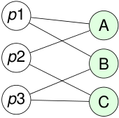

<!-- Start of picture text -->
p 1 A p 2 B p 3 C <!-- End of picture text -->

personas _↔_ actividades 

2_do_ Cuatrimestre de 2026 

(DC, FCEyN, UBA) 

DC - FCEyN - UBA 

6 / 67 

Caminos, ciclos y conexidad 

Grafos bipartitos 

Definiciones básicas y notación 

Noción de isomorfismo 

Los grafos como modelos 

# Redes de dependencias 

## Cuando una cosa debe venir antes que otra 

Un digrafo permite representar dependencias. 

Cursos y correlativas. 

Módulos de un programa y llamadas a funciones. 

Tareas de un proyecto y prerrequisitos. 

<!-- Start of picture text -->
A C E B D <!-- End of picture text -->

un orden parcial representado por flechas 

Una arista _u → v_ se lee: “ _u_ es necesario antes de _v_ ”. 

2_do_ Cuatrimestre de 2026 

(DC, FCEyN, UBA) 

DC - FCEyN - UBA 

7 / 67 

Caminos, ciclos y conexidad 

Grafos bipartitos 

Definiciones básicas y notación 

Noción de isomorfismo 

Los grafos como modelos 

# Del modelo a las preguntas algorítmicas 

Una vez elegido el grafo, las preguntas se vuelven precisas. 

Preguntas típicas 

¿Hay un camino entre dos vértices? ¿El grafo es conexo? ¿Qué vértices tienen muchas relaciones? ¿La relación tiene dirección? ¿Hay una partición natural de los vértices? 

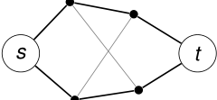

<!-- Start of picture text -->
s t <!-- End of picture text -->

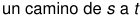

<!-- Start of picture text -->
un camino de  s a  t <!-- End of picture text -->

La teoría algorítmica de grafos nos da lenguaje para formular estas preguntas y herramientas para responderlas. 

2_do_ Cuatrimestre de 2026 

(DC, FCEyN, UBA) 

DC - FCEyN - UBA 

8 / 67 

Caminos, ciclos y conexidad 

Grafos bipartitos 

Definiciones básicas y notación 

Noción de isomorfismo 

Los grafos como modelos 

# Redes con pesos en las aristas 

## Ejemplo 

Una red de caminos puede modelarse con un grafo donde: los vértices representan ciudades; 

las aristas representan rutas directas; 

cada arista tiene un peso: distancia, tiempo o costo. 

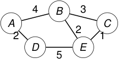

<!-- Start of picture text -->
4 B 3 A C 2 2 1 D E 5 <!-- End of picture text -->

_w_ ( _AB_ ) = 4 _, w_ ( _DE_ ) = 5 _, w_ ( _EC_ ) = 1 _._ 

Los pesos permiten formular problemas de caminos de menor costo. 

2_do_ Cuatrimestre de 2026 

(DC, FCEyN, UBA) 

DC - FCEyN - UBA 

9 / 67 

Caminos, ciclos y conexidad 

Grafos bipartitos 

Definiciones básicas y notación 

Noción de isomorfismo 

Los grafos como modelos 

# Temas de esta unidad 

Conceptos que vamos a formalizar Grafos y digrafos: _G_ = ( _V , E_ ). Isomorfismo. Grados. Caminos, ciclos y conectividad. Subgrafos, subgrafos inducidos y particiones. 

2_do_ Cuatrimestre de 2026 

(DC, FCEyN, UBA) 

DC - FCEyN - UBA 

10 / 67 

Caminos, ciclos y conexidad 

Grafos bipartitos 

Definiciones básicas y notación 

Noción de isomorfismo 

Los grafos como modelos 

# Grafos: objetos y relaciones 

## Definición 

Un grafo es un par 

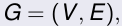

<!-- Start of picture text -->
G  = ( V , E ) , <!-- End of picture text -->

donde: 

_V_ = _V_ ( _G_ ) es el conjunto de vértices, 

_E_ = _E_ ( _G_ ) es el conjunto de aristas. 

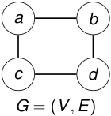

<!-- Start of picture text -->
a b c d G  = ( V , E ) <!-- End of picture text -->

Una arista representa una relación entre dos vértices. 

2_do_ Cuatrimestre de 2026 

(DC, FCEyN, UBA) 

DC - FCEyN - UBA 

11 / 67 

Caminos, ciclos y conexidad 

Grafos bipartitos 

Definiciones básicas y notación 

Noción de isomorfismo 

Los grafos como modelos 

# Vértices, aristas y extremos 

## Aristas no dirigidas 

En un grafo no dirigido, una arista se escribe como _e_ = _{u, v }_ o simplemente _uv_ . Los vértices _u_ y _v_ son los extremos de la arista. 

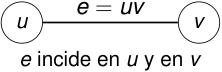

<!-- Start of picture text -->
e  =  uv u v e incide en  u y en  v <!-- End of picture text -->

_u ∼ v ⇐⇒ uv ∈ E_ ( _G_ ) _._ 

2_do_ Cuatrimestre de 2026 

(DC, FCEyN, UBA) 

DC - FCEyN - UBA 

12 / 67 

Caminos, ciclos y conexidad 

Grafos bipartitos 

Definiciones básicas y notación 

Noción de isomorfismo 

Los grafos como modelos 

# Notación básica 

## Conjuntos 

_V_ ( _G_ ) vértices de _G E_ ( _G_ ) aristas de _G_ 

## Tamaño 

_|V_ ( _G_ ) _|_ = _n |E_ ( _G_ ) _|_ = _m_ 

## Relaciones 

_u ∼ v_ 

significa que _u_ y _v_ son adyacentes. 

_e_ incide en _v_ 

significa que _v_ es extremo de _e_ . 

El dibujo ayuda, pero el grafo está definido por sus vértices y sus aristas. 

2_do_ Cuatrimestre de 2026 

(DC, FCEyN, UBA) 

DC - FCEyN - UBA 

13 / 67 

Caminos, ciclos y conexidad 

Grafos bipartitos 

Definiciones básicas y notación 

Noción de isomorfismo 

Los grafos como modelos 

# Digrafos 

## Definición 

Un digrafo es un grafo donde las aristas tienen dirección. Escribimos 

_D_ = ( _V , A_ ) _._ 

Cada arco es un par ordenado: 

( _u, v_ ) _∈ A_ ( _D_ ) _._ 

<!-- Start of picture text -->
( u, v ) u v ( u, v ) ̸  = ( v , u ) . <!-- End of picture text -->

2_do_ Cuatrimestre de 2026 

(DC, FCEyN, UBA) 

DC - FCEyN - UBA 

14 / 67 

Caminos, ciclos y conexidad 

Grafos bipartitos 

Definiciones básicas y notación 

Noción de isomorfismo 

Los grafos como modelos 

# El dibujo no es el grafo 

<!-- Start of picture text -->
1 2 3 4 5 6 7 Primer dibujo <!-- End of picture text -->

<!-- Start of picture text -->
4 2 7 1 5 3 6 Otro dibujo del mismo grafo <!-- End of picture text -->

### La posición de los vértices en el plano no forma parte de la definición. 

2_do_ Cuatrimestre de 2026 

(DC, FCEyN, UBA) 

DC - FCEyN - UBA 

15 / 67 

Caminos, ciclos y conexidad 

Grafos bipartitos 

Definiciones básicas y notación 

Noción de isomorfismo 

Los grafos como modelos 

# Igualdad de grafos 

## Grafos iguales 

Dos grafos _G_ y _H_ son iguales si tienen exactamente los mismos vértices y las mismas aristas: 

_V_ ( _G_ ) = _V_ ( _H_ ) y _E_ ( _G_ ) = _E_ ( _H_ ) _._ 

<!-- Start of picture text -->
c a b V =  {a, b, c} , E =  {ab, bc} <!-- End of picture text -->

Cambiar el dibujo no cambia el grafo. Cambiar los nombres de los vértices sí puede cambiarlo. 

2_do_ Cuatrimestre de 2026 

(DC, FCEyN, UBA) 

DC - FCEyN - UBA 

16 / 67 

Caminos, ciclos y conexidad 

Grafos bipartitos 

Definiciones básicas y notación 

Noción de isomorfismo 

Los grafos como modelos 

# Isomorfismo de grafos 

## Definición 

Dos grafos _G_ y _H_ son isomorfos si existe una biyección 

_f_ : _V_ ( _G_ ) _−→ V_ ( _H_ ) 

tal que, para todo par de vértices _u, v ∈ V_ ( _G_ ), 

_uv ∈ E_ ( _G_ ) _⇐⇒ f_ ( _u_ ) _f_ ( _v_ ) _∈ E_ ( _H_ ) _._ 

Un isomorfismo preserva la estructura de adyacencias. 

_u ∼ v ⇐⇒ f_ ( _u_ ) _∼ f_ ( _v_ ) _._ 

2_do_ Cuatrimestre de 2026 

(DC, FCEyN, UBA) 

DC - FCEyN - UBA 

17 / 67 

Caminos, ciclos y conexidad 

Grafos bipartitos 

Definiciones básicas y notación 

Noción de isomorfismo 

Los grafos como modelos 

# Ejemplo: dos dibujos del grafo de Petersen 

<!-- Start of picture text -->
0 5 4 1 9 6 8 7 3 2 <!-- End of picture text -->

<!-- Start of picture text -->
1 6 2 8 3 0 5 4 7 9 <!-- End of picture text -->

#### Dibujo clásico 

#### Dibujo con un 9-ciclo 

En ambos casos el conjunto de vértices es _{_ 0 _,_ 1 _, . . . ,_ 9 _}_ , y las adyacencias son las mismas. 

_f_ ( _i_ ) = _i_ (0 _≤ i ≤_ 9) 

es un isomorfismo entre los dos dibujos. 

2_do_ Cuatrimestre de 2026 

(DC, FCEyN, UBA) 

DC - FCEyN - UBA 

18 / 67 

Caminos, ciclos y conexidad 

Grafos bipartitos 

Definiciones básicas y notación 

Noción de isomorfismo 

Los grafos como modelos 

# Grado de un vértice 

## Definición 

El grado de un vértice _v_ en un grafo _G_ es 

deg _G_ ( _v_ ) = _|{e ∈ E_ ( _G_ ) : _e_ incide en _v }| ._ 

deg _G_ ( _v_ ) = cantidad de aristas que tienen a _v_ como extremo. 

<!-- Start of picture text -->
a b v c d deg G ( v ) = 3 <!-- End of picture text -->

2_do_ Cuatrimestre de 2026 

(DC, FCEyN, UBA) 

DC - FCEyN - UBA 

19 / 67 

Caminos, ciclos y conexidad 

Grafos bipartitos 

Definiciones básicas y notación 

Noción de isomorfismo 

Los grafos como modelos 

# Secuencia de grados 

La secuencia de grados de un grafo se obtiene listando los grados de todos sus vértices. 

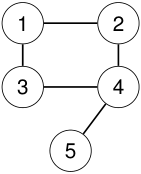

<!-- Start of picture text -->
1 2 3 4 5 <!-- End of picture text -->

deg(1) = 2 _,_ deg(2) = 2 _,_ deg(3) = 2 _,_ deg(4) = 3 _,_ deg(5) = 1 _._ Ordenando de menor a mayor: (1 _,_ 2 _,_ 2 _,_ 2 _,_ 3) _._ 

La secuencia de grados es un invariante por isomorfismo. 

2_do_ Cuatrimestre de 2026 

(DC, FCEyN, UBA) 

DC - FCEyN - UBA 

20 / 67 

Caminos, ciclos y conexidad 

Grafos bipartitos 

Definiciones básicas y notación 

Noción de isomorfismo 

Los grafos como modelos 

# Ejemplo: mismo _n_ y mismo _m_ , pero no isomorfos 

<!-- Start of picture text -->
1 2 3 4 P 4 |V |  = 4 , |E|  = 3 grados: 1 ,  1 ,  2 ,  2 . <!-- End of picture text -->

<!-- Start of picture text -->
2 1 3 4 K 1 , 3 <!-- End of picture text -->

<!-- Start of picture text -->
|V |  = 4 , |E|  = 3 <!-- End of picture text -->

grados: 1 _,_ 1 _,_ 1 _,_ 3 _._ 

No son isomorfos porque sus secuencias de grados son distintas. 

2_do_ Cuatrimestre de 2026 

(DC, FCEyN, UBA) 

DC - FCEyN - UBA 

21 / 67 

Caminos, ciclos y conexidad 

Grafos bipartitos 

Definiciones básicas y notación 

Noción de isomorfismo 

Los grafos como modelos 

# Otro ejemplo: misma secuencia de grados 

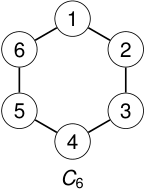

<!-- Start of picture text -->
1 6 2 5 3 4 C 6 <!-- End of picture text -->

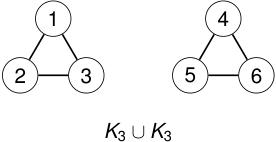

<!-- Start of picture text -->
1 4 2 3 5 6 K 3  ∪ K 3 <!-- End of picture text -->

### disconexo 

### conexo 

Ambos tienen: 

_|V |_ = 6 _, |E|_ = 6 _,_ secuencia de grados 2 _,_ 2 _,_ 2 _,_ 2 _,_ 2 _,_ 2 _._ 

No son isomorfos: uno es conexo y el otro no. 

2_do_ Cuatrimestre de 2026 22 / 67 

(DC, FCEyN, UBA) 

DC - FCEyN - UBA 

Caminos, ciclos y conexidad 

Grafos bipartitos 

Definiciones básicas y notación 

Noción de isomorfismo 

Los grafos como modelos 

# Lema del apretón de manos 

Lema 

� deg _G_ ( _v_ ) = 2 _|E_ ( _G_ ) _|. v ∈V_ ( _G_ ) 

Como el lado derecho es un número par, obtenemos: Corolario 

No existe un grafo cuya suma de grados sea impar. 

## Corolario 

Todo grafo tiene una cantidad par de vértices de grado impar. 

2_do_ Cuatrimestre de 2026 23 / 67 

(DC, FCEyN, UBA) 

DC - FCEyN - UBA 

Caminos, ciclos y conexidad 

Grafos bipartitos 

Definiciones básicas y notación 

Noción de isomorfismo 

Los grafos como modelos 

# Dos vértices con el mismo grado 

## Principio del palomar 

Si se distribuyen más de _k_ objetos en _k_ cajas, entonces alguna caja contiene al menos dos objetos. 

En forma equivalente, si 

_f_ : _A −→ B_ 

es una función entre conjuntos finitos y _|A| > |B|_ , entonces _f_ no puede ser inyectiva. Por lo tanto, existen _x, y ∈ A_ , con _x̸_ = _y_ , tales que _f_ ( _x_ ) = _f_ ( _y_ ). Proposición 

Todo grafo con al menos dos vértices tiene dos vértices distintos del mismo grado. 

2_do_ Cuatrimestre de 2026 

(DC, FCEyN, UBA) 

DC - FCEyN - UBA 

24 / 67 

Caminos, ciclos y conexidad 

Grafos bipartitos 

Definiciones básicas y notación 

Noción de isomorfismo 

Los grafos como modelos 

# Grado de entrada y grado de salida 

Sea _D_ = ( _V , A_ ) un digrafo y sea _v ∈ V_ ( _D_ ). Grado de salida 

_d_ out( _v_ ) = _|{_ ( _v , w_ ) _∈ A_ ( _D_ ) : _w ∈ V_ ( _D_ ) _}|._ Cuenta los arcos que salen de _v_ . 

Grado de entrada 

_d_ in( _v_ ) = _|{_ ( _w, v_ ) _∈ A_ ( _D_ ) : _w ∈ V_ ( _D_ ) _}|._ 

Cuenta los arcos que entran en _v_ . 

2_do_ Cuatrimestre de 2026 

(DC, FCEyN, UBA) 

DC - FCEyN - UBA 

25 / 67 

Caminos, ciclos y conexidad 

Grafos bipartitos 

Definiciones básicas y notación 

Noción de isomorfismo 

Los grafos como modelos 

# Ejemplo 

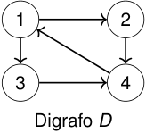

<!-- Start of picture text -->
1 2 3 4 Digrafo  D <!-- End of picture text -->

### _E_ ( _D_ ) = _{_ (1 _,_ 2) _,_ (1 _,_ 3) _,_ (2 _,_ 4) _,_ (3 _,_ 4) _,_ (4 _,_ 1) _}._ 

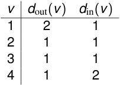

<!-- Start of picture text -->
v d out( v ) d in( v ) 1 2 1 2 1 1 3 1 1 4 1 2 <!-- End of picture text -->

2_do_ Cuatrimestre de 2026 

(DC, FCEyN, UBA) 

DC - FCEyN - UBA 

26 / 67 

Caminos, ciclos y conexidad 

Grafos bipartitos 

Definiciones básicas y notación 

Noción de isomorfismo 

Los grafos como modelos 

# Equilibrio de grados en un digrafo 

## Teorema 

Todo digrafo _D_ satisface 

� _d_ in( _v_ ) = � _d_ out( _v_ ) = _|E_ ( _D_ ) _|. v ∈V_ ( _D_ ) _v ∈V_ ( _D_ ) 

Cada arco 

( _u, v_ ) 

contribuye exactamente: 

1 al grado de salida de _u,_ 

1 al grado de entrada de _v ._ 

Cada arco se cuenta una vez como salida y una vez como entrada. 

2_do_ Cuatrimestre de 2026 

(DC, FCEyN, UBA) 

DC - FCEyN - UBA 

27 / 67 

Caminos, ciclos y conexidad 

Grafos bipartitos 

Definiciones básicas y notación 

Noción de isomorfismo 

Los grafos como modelos 

# Orientaciones de un grafo 

### Un grafo orientado se obtiene a partir de un grafo no dirigido eligiendo una dirección para cada arista. 

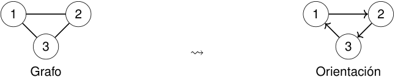

<!-- Start of picture text -->
1 2 1 2 3 3 ⇝ Grafo Orientación <!-- End of picture text -->

En una orientación, para cada par de vértices aparece a lo sumo uno de 

_u → v_ y _v → u._ 

2_do_ Cuatrimestre de 2026 

(DC, FCEyN, UBA) 

DC - FCEyN - UBA 

28 / 67 

Caminos, ciclos y conexidad 

Grafos bipartitos 

Definiciones básicas y notación 

Noción de isomorfismo 

Los grafos como modelos 

# Digrafo vs. grafo orientado 

## Digrafo 

Puede tener simultáneamente 

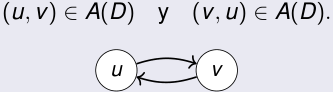

<!-- Start of picture text -->
( u, v )  ∈ A ( D ) y ( v , u )  ∈ A ( D ) . u v <!-- End of picture text -->

## Grafo orientado 

Para cada par _u, v_ , no pueden aparecer ambos arcos: 

<!-- Start of picture text -->
u → v y v → u. u v <!-- End of picture text -->

2_do_ Cuatrimestre de 2026 

(DC, FCEyN, UBA) 

DC - FCEyN - UBA 

29 / 67 

Caminos, ciclos y conexidad 

Grafos bipartitos 

Definiciones básicas y notación 

Noción de isomorfismo 

Los grafos como modelos 

# ¿Descansamos 10 minutos? 

2_do_ Cuatrimestre de 2026 

(DC, FCEyN, UBA) 

DC - FCEyN - UBA 

30 / 67 

Caminos, ciclos y conexidad 

Grafos bipartitos 

Definiciones básicas y notación 

Noción de isomorfismo 

Los grafos como modelos 

# Caminos 

Sea _G_ = ( _V , E_ ) un grafo. Definición 

Un camino en _G_ es una secuencia de vértices 

_P_ = _v_ 0 _, v_ 1 _, . . . , vk_ 

tal que 

- _{vi , vi_ +1 _} ∈ E_ ( _G_ ) para todo _i_ = 0 _, . . . , k −_ 1 _._ 

_P_ es un camino de _v_ 0 a _vk ._ 

La longitud de _P_ es _k ._ 

(DC, FCEyN, UBA) 

La longitud cuenta aristas, no vértices. 

DC - FCEyN - UBA 

2_do_ Cuatrimestre de 2026 31 / 67 

Caminos, ciclos y conexidad 

Grafos bipartitos 

Definiciones básicas y notación 

Noción de isomorfismo 

Los grafos como modelos 

# Ejemplo de camino 

### Un camino de 4 a 6 es 

_P_ = 4 _,_ 5 _,_ 2 _,_ 3 _,_ 6 _._ 

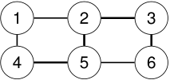

<!-- Start of picture text -->
1 2 3 4 5 6 <!-- End of picture text -->

### Sus aristas son 

_{_ 4 _,_ 5 _}, {_ 5 _,_ 2 _}, {_ 2 _,_ 3 _}, {_ 3 _,_ 6 _}._ 

Por lo tanto, 

_ℓ_ ( _P_ ) = 4 _._ 

2_do_ Cuatrimestre de 2026 

(DC, FCEyN, UBA) 

DC - FCEyN - UBA 

32 / 67 

Caminos, ciclos y conexidad 

Grafos bipartitos 

Definiciones básicas y notación 

Noción de isomorfismo 

Los grafos como modelos 

# Camino simple 

## Definición 

Un camino 

_P_ = _v_ 0 _, v_ 1 _, . . . , vk_ 

es simple si no repite vértices. 

Camino simple 1 _,_ 2 _,_ 3 _,_ 4 No repite vértices. 

Camino no simple 1 _,_ 2 _,_ 3 _,_ 2 _,_ 4 Repite el vértice 2. 

En muchas demostraciones conviene trabajar con caminos simples. 

2_do_ Cuatrimestre de 2026 

(DC, FCEyN, UBA) 

DC - FCEyN - UBA 

33 / 67 

Caminos, ciclos y conexidad Grafos bipartitos 

Definiciones básicas y notación 

Noción de isomorfismo 

Los grafos como modelos 

# Todo camino contiene un camino simple 

Lema Si existe un camino de _u_ a _v_ en un grafo _G_ , entonces existe un camino simple de _u_ a _v_ en _G_ . ~~<mark>eee</mark>~~ Idea de la prueba Si el camino repite un vértice, podemos borrar el tramo cerrado entre dos apariciones consecutivas de ese vértice. ~~<u><mark>a</mark></u>~~ Por ejemplo, si 

_P_ = _u, . . . , x, a, . . . , b , x, . . . , v ,_ <u>�</u> �� <u>�</u> tramo que se borra 

entonces reemplazamos _P_ por _P__′_ = _u, . . . , x, . . . , v ._ 

Repitiendo este procedimiento, obtenemos un camino de _u_ a _v_ sin vértices repetidos. 

Para estudiar conectividad alcanza con considerar caminos simples. 

DC - FCEyN - UBA 

2_do_ Cuatrimestre de 2026 34 / 67 

(DC, FCEyN, UBA) 

Caminos, ciclos y conexidad 

Grafos bipartitos 

Definiciones básicas y notación 

Noción de isomorfismo 

Los grafos como modelos 

# Ciclos 

## Definición 

Un ciclo es un camino 

_C_ = _v_ 0 _, v_ 1 _, . . . , vk −_ 1 _, vk v_ 0 = _vk , v_ 0 _, v_ 1 _, . . . , vk −_ 1 _k ≥_ 3 _._ 

tal que 

los vértices 

son todos distintos, y 

Es decir: empieza y termina en el mismo vértice, sin repetir vértices en el medio. 

2_do_ Cuatrimestre de 2026 

(DC, FCEyN, UBA) 

DC - FCEyN - UBA 

35 / 67 

Caminos, ciclos y conexidad 

Grafos bipartitos 

Definiciones básicas y notación 

Noción de isomorfismo 

Los grafos como modelos 

# Caminos cerrados impares y ciclos impares 

Lema 

Sea 

_P_ = _v_ 0 _, v_ 1 _, . . . , vk_ 

un camino cerrado, es decir, 

_v_ 0 = _vk ._ 

Si _k_ es impar y _k ≥_ 3, entonces _P_ contiene un ciclo de longitud impar. 

## Idea de la prueba 

Si _P_ no repite vértices salvo _v_ 0 = _vk_ , entonces _P_ ya es un ciclo impar. De lo contrario, _P_ se parte en dos caminos cerrados más pequeños tales que uno de ellos tiene longitud impar. 

2_do_ Cuatrimestre de 2026 

(DC, FCEyN, UBA) 

DC - FCEyN - UBA 

36 / 67 

Caminos, ciclos y conexidad 

Grafos bipartitos 

Definiciones básicas y notación 

Noción de isomorfismo 

Los grafos como modelos 

# Conectividad 

## Definición 

Un grafo _G_ es conexo si para todo par de vértices 

_u, v ∈ V_ ( _G_ ) 

existe un camino de _u_ a _v_ . 

Equivalentemente: 

_∀u, v ∈ V_ ( _G_ ) _, u_ puede alcanzarse desde _v ._ 

Conectividad significa que el grafo está “en una sola pieza”. 

2_do_ Cuatrimestre de 2026 

(DC, FCEyN, UBA) 

DC - FCEyN - UBA 

37 / 67 

Caminos, ciclos y conexidad 

Grafos bipartitos 

Definiciones básicas y notación 

Noción de isomorfismo 

Los grafos como modelos 

# Eliminar vértices 

Sea _G_ = ( _V , E_ ) un grafo y sea _v ∈ V_ ( _G_ ). Definición 

El grafo _G − v_ se obtiene eliminando: 

_v_ 

y todas las aristas incidentes en _v_ . 

_V_ ( _G − v_ ) = _V_ ( _G_ ) _\ {v }._ 

_E_ ( _G − v_ ) = _{xy ∈ E_ ( _G_ ) : _x̸_ = _v , y̸_ = _v }._ 

2_do_ Cuatrimestre de 2026 

(DC, FCEyN, UBA) 

DC - FCEyN - UBA 

38 / 67 

Caminos, ciclos y conexidad 

Grafos bipartitos 

Definiciones básicas y notación 

Noción de isomorfismo 

Los grafos como modelos 

# Ejemplo: eliminar un vértice 

<!-- Start of picture text -->
1 2 3 1 3 −→ 4 4 G G − 2 G − 2 <!-- End of picture text -->

### Al eliminar un vértice también desaparecen todas sus aristas incidentes. 

2_do_ Cuatrimestre de 2026 

(DC, FCEyN, UBA) 

DC - FCEyN - UBA 

39 / 67 

Caminos, ciclos y conexidad 

Grafos bipartitos 

Definiciones básicas y notación 

Noción de isomorfismo 

Los grafos como modelos 

# Eliminar aristas 

Sea _G_ = ( _V , E_ ) un grafo y sea _e ∈ E_ ( _G_ ). Definición 

El grafo _G − e_ se obtiene eliminando la arista _e_ , pero conservando todos los vértices. 

_V_ ( _G − e_ ) = _V_ ( _G_ ) _._ 

_E_ ( _G − e_ ) = _E_ ( _G_ ) _\ {e}._ 

Eliminar una arista no elimina sus extremos. 

2_do_ Cuatrimestre de 2026 

(DC, FCEyN, UBA) 

DC - FCEyN - UBA 

40 / 67 

Caminos, ciclos y conexidad 

Grafos bipartitos 

Definiciones básicas y notación 

Noción de isomorfismo 

Los grafos como modelos 

# Subgrafos 

## Definición 

Un grafo _H_ es un subgrafo de _G_ si 

_V_ ( _H_ ) _⊆ V_ ( _G_ ) _E_ ( _H_ ) _⊆ E_ ( _G_ ) _._ 

y 

Es decir, _H_ se obtiene de _G_ eliminando algunos vértices y/o algunas aristas. 

2_do_ Cuatrimestre de 2026 

(DC, FCEyN, UBA) 

DC - FCEyN - UBA 

41 / 67 

Caminos, ciclos y conexidad 

Grafos bipartitos 

Definiciones básicas y notación 

Noción de isomorfismo 

Los grafos como modelos 

# Subgrafo inducido 

Sea _W ⊆ V_ ( _G_ ). 

Definición 

El subgrafo inducido por _W_ es el grafo _G_ [ _W_ ] dado por 

_V_ ( _G_ [ _W_ ]) = _W_ 

y 

_E_ ( _G_ [ _W_ ]) = _{uv ∈ E_ ( _G_ ) : _u, v ∈ W }._ 

En un subgrafo inducido elegimos vértices; las aristas quedan determinadas. 

2_do_ Cuatrimestre de 2026 

(DC, FCEyN, UBA) 

DC - FCEyN - UBA 

42 / 67 

Caminos, ciclos y conexidad 

Grafos bipartitos 

Definiciones básicas y notación 

Noción de isomorfismo 

Los grafos como modelos 

# Componentes conexas 

## Definición 

Un subgrafo propio de un grafo _G_ es un subgrafo _H_ de _G_ tal que _H̸_ = _G_ . Definición 

Sea _P_ una propiedad sobre el conjunto de los grafos. Un subgrafo _H_ de _G_ es maximal con respecto a la propiedad _P_ si _H_ satisface _P_ y no es subgrafo propio de ningún subgrafo _H__′_ de _G_ que también satisfaga _P_ . 

## Definición 

Una componente conexa de _G_ es un subgrafo conexo maximal de _G_ . 

2_do_ Cuatrimestre de 2026 

(DC, FCEyN, UBA) 

DC - FCEyN - UBA 

43 / 67 

Caminos, ciclos y conexidad 

Grafos bipartitos 

Definiciones básicas y notación 

Noción de isomorfismo 

Los grafos como modelos 

# Grafo conexo y grafo disconexo 

<!-- Start of picture text -->
1 2 1 2 4 5 3 4 3 conexo disconexo <!-- End of picture text -->

### En el segundo grafo no existe un camino de 1 a 4. 

2_do_ Cuatrimestre de 2026 44 / 67 

(DC, FCEyN, UBA) 

DC - FCEyN - UBA 

Caminos, ciclos y conexidad 

Grafos bipartitos 

Definiciones básicas y notación 

Noción de isomorfismo 

Los grafos como modelos 

# Particiones de vértices 

Sea _G_ = ( _V , E_ ) un grafo. Definición 

Una partición de _V_ ( _G_ ) en dos conjuntos es un par _A, B ⊆ V_ ( _G_ ) tal que _A̸_ = _∅, B̸_ = _∅, A ∩ B_ = _∅, A ∪ B_ = _V_ ( _G_ ) _._ Escribimos _V_ ( _G_ ) = _A ∪_˙ _B._ 

2_do_ Cuatrimestre de 2026 

(DC, FCEyN, UBA) 

DC - FCEyN - UBA 

45 / 67 

Caminos, ciclos y conexidad 

Grafos bipartitos 

Definiciones básicas y notación 

Noción de isomorfismo 

Los grafos como modelos 

# Aristas que cruzan una partición 

Sea 

### _V_ ( _G_ ) = _A ∪_˙ _B._ 

## Definición 

Una arista _e_ = _uv_ cruza la partición ( _A, B_ ) si tiene un extremo en _A_ y el otro en _B_ . Es decir, 

_u ∈ A, v ∈ B_ o _u ∈ B, v ∈ A._ 

<!-- Start of picture text -->
a 1 b 1 a 2 b 2 A B <!-- End of picture text -->

2_do_ Cuatrimestre de 2026 

(DC, FCEyN, UBA) 

DC - FCEyN - UBA 

46 / 67 

Caminos, ciclos y conexidad 

Grafos bipartitos 

Definiciones básicas y notación 

Noción de isomorfismo 

Los grafos como modelos 

# Conectividad y cortes 

Teorema 

Un grafo _G_ es conexo si y solo si para toda partición 

_V_ ( _G_ ) = _A ∪_˙ _B_ 

existe una arista de _G_ que cruza entre _A_ y _B_ . 

Idea de la demostración Resolver el correspondiente ejercicio de la práctica. 

2_do_ Cuatrimestre de 2026 

(DC, FCEyN, UBA) 

DC - FCEyN - UBA 

47 / 67 

Caminos, ciclos y conexidad 

Grafos bipartitos 

Definiciones básicas y notación 

Noción de isomorfismo 

Los grafos como modelos 

# Interpretación 

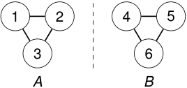

<!-- Start of picture text -->
1 2 4 5 3 6 A B <!-- End of picture text -->

Esta partición no tiene aristas que crucen. 

_⇒_ el grafo es disconexo. 

Un grafo conexo no puede separarse en dos partes sin cortar alguna arista. 

2_do_ Cuatrimestre de 2026 

(DC, FCEyN, UBA) 

DC - FCEyN - UBA 

48 / 67 

Caminos, ciclos y conexidad 

Grafos bipartitos 

Definiciones básicas y notación 

Noción de isomorfismo 

Los grafos como modelos 

# Distancia 

Si _u_ y _v_ están en la misma componente conexa, la distancia entre _u_ y _v_ es la mínima longitud de un camino que une _u_ con _v_ . 

dist( _u, v_ ) = m´ın _{ℓ_ ( _P_ ) : _P_ es un camino de _u_ a _v }._ 

Si no existe ningún camino de _u_ a _v_ , escribimos 

dist( _u, v_ ) = _∞._ 

La distancia cuenta la menor cantidad de aristas necesarias para llegar. 

2_do_ Cuatrimestre de 2026 

(DC, FCEyN, UBA) 

DC - FCEyN - UBA 

49 / 67 

Los grafos como modelos Definiciones básicas y notación Noción de isomorfismo Caminos, ciclos y conexidad Grafos bipartitos Puntos de articulación Definición Un vértice _v_ de un grafo _G_ es un punto de articulación si _G − v_ tiene más componentes conexas que _G_ . En particular, si _G_ es conexo, entonces _v_ es punto de articulación si _G − v_ es disconexo. Un punto de articulación es un vértice cuya eliminación rompe el grafo. ~~<mark>a</mark>~~ (DC, FCEyN, UBA) DC - FCEyN - UBA 2_do_ Cuatrimestre de 2026 50 / 67 

(DC, FCEyN, UBA) DC - FCEyN - UBA 2_do_ Cuatrimestre de 2026 50 / 67 

Caminos, ciclos y conexidad 

Grafos bipartitos 

Definiciones básicas y notación 

Noción de isomorfismo 

Los grafos como modelos 

# Ejemplo: un punto de articulación 

<!-- Start of picture text -->
1 2 3 4 5 punto de articulación G <!-- End of picture text -->

<!-- Start of picture text -->
1 2 4 5 G − 3 <!-- End of picture text -->

_G_ es conexo, pero _G −_ 3 tiene dos componentes conexas. 

2_do_ Cuatrimestre de 2026 

(DC, FCEyN, UBA) 

DC - FCEyN - UBA 

51 / 67 

Caminos, ciclos y conexidad 

Grafos bipartitos 

Definiciones básicas y notación 

Noción de isomorfismo 

Los grafos como modelos 

# Un vértice que no es punto de articulación 

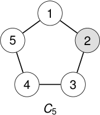

<!-- Start of picture text -->
1 5 2 4 3 C 5 <!-- End of picture text -->

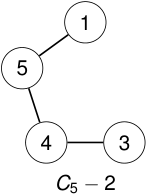

<!-- Start of picture text -->
1 5 4 3 C 5  − 2 <!-- End of picture text -->

### _C_ 5 _−_ 2 sigue siendo conexo. 

### Por lo tanto, 2 no es punto de articulación de _C_ 5. 

2_do_ Cuatrimestre de 2026 

(DC, FCEyN, UBA) 

DC - FCEyN - UBA 

52 / 67 

Caminos, ciclos y conexidad 

Grafos bipartitos 

Definiciones básicas y notación 

Noción de isomorfismo 

Los grafos como modelos 

# Aristas de corte 

## Definición 

Una arista _e_ de un grafo _G_ es una arista de corte si 

_G − e_ 

tiene más componentes conexas que _G_ . 

## Proposición 

Sea _e ∈ E_ ( _G_ ). Entonces _e_ es una arista de corte de _G_ si y solo si _e_ no pertenece a ningún ciclo de _G_ . 

Una arista de corte es una arista cuya eliminación rompe alguna conexión. 

2_do_ Cuatrimestre de 2026 

(DC, FCEyN, UBA) 

DC - FCEyN - UBA 

53 / 67 

Caminos, ciclos y conexidad 

Grafos bipartitos 

Definiciones básicas y notación 

Noción de isomorfismo 

Los grafos como modelos 

# Grafos acíclicos y árboles 

## Lema 

Todo grafo acíclico con al menos dos vértices tiene al menos dos vértices de grado uno. 

## Proposición 

Sean _G_ un grafo con _n_ vértices. Cualesquiera dos de las siguientes afirmaciones implican la tercera: 

> 1 _G_ es conexo. 

> 2 _G_ es acíclico. 

> 3 _G_ tiene _n −_ 1 aristas. 

Un grafo conexo y acíclico se llama árbol. 

2_do_ Cuatrimestre de 2026 

(DC, FCEyN, UBA) 

DC - FCEyN - UBA 

54 / 67 

Caminos, ciclos y conexidad 

Grafos bipartitos 

Definiciones básicas y notación 

Noción de isomorfismo 

Los grafos como modelos 

# Grafos biconexos 

## Definición 

Un grafo _G_ es biconexo si: 

> 1 _G_ es conexo; 

> 2 _G_ no tiene puntos de articulación. 

Equivalentemente, si _G_ es conexo, entonces _G_ es biconexo cuando 

_G − v_ 

sigue siendo conexo para todo vértice _v ∈ V_ ( _G_ ). 

Biconexo significa que la conectividad sobrevive al borrar cualquier vértice. 

2_do_ Cuatrimestre de 2026 

(DC, FCEyN, UBA) 

DC - FCEyN - UBA 

55 / 67 

Caminos, ciclos y conexidad 

Grafos bipartitos 

Definiciones básicas y notación 

Noción de isomorfismo 

Los grafos como modelos 

# Ejemplos 

<!-- Start of picture text -->
1 2 3 4 P 4 <!-- End of picture text -->

### No es biconexo. 

<!-- Start of picture text -->
1 5 2 4 3 C 5 <!-- End of picture text -->

Es biconexo. 

<!-- Start of picture text -->
1 2 3 K 3 <!-- End of picture text -->

Es biconexo. 

2_do_ Cuatrimestre de 2026 

(DC, FCEyN, UBA) 

DC - FCEyN - UBA 

56 / 67 

Caminos, ciclos y conexidad 

Grafos bipartitos 

Definiciones básicas y notación 

Noción de isomorfismo 

Los grafos como modelos 

# Componentes biconexas y bloques 

## Definición 

Una componente biconexa, o bloque, de un grafo _G_ es un subgrafo biconexo maximal de _G_ . 

## Proposición 

Sean _B_ 1 y _B_ 2 dos bloques distintos de un grafo _G_ . Entonces �� _V_ ( _B_ 1) _∩ V_ ( _B_ 2)�� _≤_ 1 _._ Además, si _V_ ( _B_ 1) _∩ V_ ( _B_ 2) = _{v },_ 

Además, si 

entonces _v_ es un punto de articulación de _G_ . 

Los bloques se conectan entre sí únicamente a través de puntos de articulación. 

DC - FCEyN - UBA 

2_do_ Cuatrimestre de 2026 57 / 67 

(DC, FCEyN, UBA) 

Caminos, ciclos y conexidad 

Grafos bipartitos 

Definiciones básicas y notación 

Noción de isomorfismo 

Los grafos como modelos 

# Complemento de un grafo 

Sea _G_ = ( _V , E_ ) un grafo simple. Definición 

El complemento de _G_ , denotado _G_ , es el grafo con 

_V_ ( _G_ ) = _V_ ( _G_ ) _,_ 

y, para todo par de vértices distintos _u, v_ , 

_uv ∈ E_ ( _G_ ) _⇐⇒ uv ∈/ E_ ( _G_ ) _._ 

El complemento cambia aristas por no aristas. 

2_do_ Cuatrimestre de 2026 

(DC, FCEyN, UBA) 

DC - FCEyN - UBA 

58 / 67 

Caminos, ciclos y conexidad 

Grafos bipartitos 

Definiciones básicas y notación 

Noción de isomorfismo 

Los grafos como modelos 

# Ejemplo: complemento 

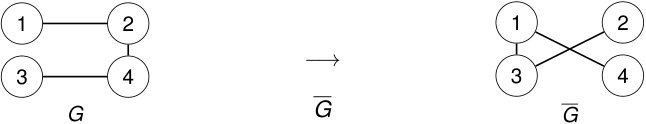

<!-- Start of picture text -->
1 2 1 2 −→ 3 4 3 4 G G G <!-- End of picture text -->

En _K_ 4 hay �24� = 6 aristas posibles. Si _G_ tiene 3, entonces _G_ tiene las otras 3. 

2_do_ Cuatrimestre de 2026 

(DC, FCEyN, UBA) 

DC - FCEyN - UBA 

59 / 67 

Caminos, ciclos y conexidad 

Grafos bipartitos 

Definiciones básicas y notación 

Noción de isomorfismo 

Los grafos como modelos 

# Grados en el complemento 

Sea _G_ un grafo con _n_ vértices. Para cada vértice _v_ , 

deg _G_ ( _v_ ) + deg _G_(_v_) =_n −_1_._ 

Por lo tanto, 

deg _G_~~(~~_v_) =_n −_1_−_deg_G_(_v_)_._ 

Idea 

Cada vértice _v_ tiene _n −_ 1 posibles vecinos. Los vecinos que tiene en _G_ no los tiene en _G_ , y viceversa. 

2_do_ Cuatrimestre de 2026 

(DC, FCEyN, UBA) 

DC - FCEyN - UBA 

60 / 67 

Los grafos como modelos Definiciones básicas y notación Noción de isomorfismo Caminos, ciclos y conexidad Grafos bipartitos Complemento de un grafo disconexo Lema Si _G_ es un grafo disconexo, entonces su complemento _G_ es conexo. Idea de la prueba Sean _u, v ∈ V_ ( _G_ ). Considerar dos casos: 1 _u_ y _v_ están en distintas componentes conexas de _G_ , 2 _u_ y _v_ pertenecen a la misma componente conexa. ~~<u><mark>==></mark></u>~~ (DC, FCEyN, UBA) DC - FCEyN - UBA 2_do_ Cuatrimestre de 2026 61 / 67 

Caminos, ciclos y conexidad 

Grafos bipartitos 

Definiciones básicas y notación 

Noción de isomorfismo 

Los grafos como modelos 

# Grafos bipartitos 

Sea _G_ = ( _V , E_ ) un grafo. Definición 

Decimos que _G_ es bipartito si existe una partición 

_V_ ( _G_ ) = _X ∪_˙ _Y_ 

tal que toda arista de _G_ tiene un extremo en _X_ y el otro en _Y_ . 

Es decir, no hay aristas con ambos extremos en _X_ ni en _Y_ : 

_uv ∈ E_ ( _G_ ) = _⇒ u ∈ X , v ∈ Y_ o _u ∈ Y , v ∈ X ._ 

2_do_ Cuatrimestre de 2026 

(DC, FCEyN, UBA) 

DC - FCEyN - UBA 

62 / 67 

Caminos, ciclos y conexidad 

Grafos bipartitos 

Definiciones básicas y notación 

Noción de isomorfismo 

Los grafos como modelos 

# Ejemplo de grafo bipartito 

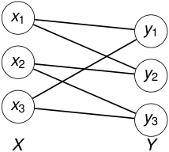

<!-- Start of picture text -->
x 1 y 1 x 2 y 2 x 3 y 3 X Y <!-- End of picture text -->

### Una bipartición es 

_X_ = _{x_ 1 _, x_ 2 _, x_ 3 _}, Y_ = _{y_ 1 _, y_ 2 _, y_ 3 _}._ 

Toda arista cruza entre _X_ e _Y_ . No existen aristas: _xi xj_ ni _yii , y yj_ 

ni _yii , y yj ._ 

2_do_ Cuatrimestre de 2026 

(DC, FCEyN, UBA) 

DC - FCEyN - UBA 

63 / 67 

Caminos, ciclos y conexidad 

Grafos bipartitos 

Definiciones básicas y notación 

Noción de isomorfismo 

Los grafos como modelos 

# Coloreo con dos colores 

Un grafo es bipartito si y solo si sus vértices pueden colorearse con dos colores de modo que toda arista una vértices de colores distintos. 

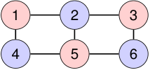

<!-- Start of picture text -->
1 2 3 4 5 6 <!-- End of picture text -->

_X_ = _{_ vértices rojos _}, Y_ = _{_ vértices azules _}._ 

Una bipartición es lo mismo que un coloreo propio con dos colores. 

2_do_ Cuatrimestre de 2026 64 / 67 

(DC, FCEyN, UBA) 

DC - FCEyN - UBA 

Caminos, ciclos y conexidad 

Grafos bipartitos 

Definiciones básicas y notación 

Noción de isomorfismo 

Los grafos como modelos 

# Ciclos pares e impares 

Un ciclo _Ck_ tiene longitud _k_ . Paridad 

_Ck_ es par _⇐⇒ k_ es par _. Ck_ es impar _⇐⇒ k_ es impar _._ 

Ejemplos: 

_C_ 4 es un ciclo par _, C_ 5 es un ciclo impar _._ 

Los ciclos impares impiden colorear con dos colores. 

2_do_ Cuatrimestre de 2026 

(DC, FCEyN, UBA) 

DC - FCEyN - UBA 

65 / 67 

Caminos, ciclos y conexidad 

Grafos bipartitos 

Definiciones básicas y notación 

Noción de isomorfismo 

Los grafos como modelos 

# Un ciclo impar no es bipartito 

### Intentemos colorear un ciclo alternando dos colores. 

<!-- Start of picture text -->
1 5 2 4 3 <!-- End of picture text -->

Al cerrar el ciclo, la última arista une dos vértices del mismo color: 

_{_ 5 _,_ 1 _}._ 

Por lo tanto, _C_ 5 no es bipartito. 

2_do_ Cuatrimestre de 2026 

(DC, FCEyN, UBA) 

DC - FCEyN - UBA 

66 / 67 

Caminos, ciclos y conexidad 

Grafos bipartitos 

Definiciones básicas y notación 

Noción de isomorfismo 

Los grafos como modelos 

# Caracterización 

Teorema 

Un grafo _G_ es bipartito si y solo si no contiene ciclos impares. 

## Idea de la demostración 

Si _G_ es bipartito, todo ciclo alterna entre las dos partes de la bipartición. Por lo tanto, todo ciclo de _G_ tiene longitud par. Recíprocamente, supongamos que _G_ no contiene ciclos impares. En cada componente conexa elegimos un vértice _s_ y agrupamos los vértices según la paridad de su distancia a _s_ . 

2_do_ Cuatrimestre de 2026 

(DC, FCEyN, UBA) 

DC - FCEyN - UBA 

67 / 67 

