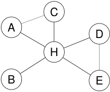

# Redes de transporte 

Ejemplo 

Una red aérea puede modelarse con vértices que representan aeropuertos y aristas que representan vuelos directos. 

Si sólo importa que haya conexión directa: grafo no dirigido. Si importa el sentido del vuelo: digrafo. Los hubs aparecen como vértices con muchas aristas incidentes. 

<!-- Start of picture text -->
C A D H B E <!-- End of picture text -->

vértices: aeropuertos aristas: vuelos directos 

2_do_ Cuatrimestre de 2026 

(DC, FCEyN, UBA) 

DC - FCEyN - UBA 

4 / 67 

Caminos, ciclos y conexidad 

Grafos bipartitos 

Definiciones básicas y notación 

Noción de isomorfismo 

Los grafos como modelos 

