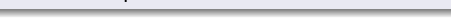
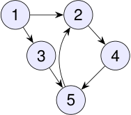

## Red física o virtual 

Computadoras, servidores, páginas web o proveedores pueden ser vértices. 

Una conexión física puede modelarse como arista. 

Un enlace web es naturalmente dirigido. La dirección cambia las preguntas: no es lo mismo llegar de _u_ a _v_ que de _v_ a _u_ . 

<!-- Start of picture text -->
1 2 3 4 5 <!-- End of picture text -->

páginas web y enlaces: un digrafo 

2_do_ Cuatrimestre de 2026 

(DC, FCEyN, UBA) 

DC - FCEyN - UBA 

5 / 67 

Caminos, ciclos y conexidad 

Grafos bipartitos 

Definiciones básicas y notación 

Noción de isomorfismo 

Los grafos como modelos 

