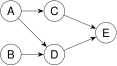

## Cuando una cosa debe venir antes que otra 

Un digrafo permite representar dependencias. 

Cursos y correlativas. 

Módulos de un programa y llamadas a funciones. 

Tareas de un proyecto y prerrequisitos. 

<!-- Start of picture text -->
A C E B D <!-- End of picture text -->

un orden parcial representado por flechas 

Una arista _u → v_ se lee: “ _u_ es necesario antes de _v_ ”. 

2_do_ Cuatrimestre de 2026 

(DC, FCEyN, UBA) 

DC - FCEyN - UBA 

7 / 67 

Caminos, ciclos y conexidad 

Grafos bipartitos 

Definiciones básicas y notación 

Noción de isomorfismo 

Los grafos como modelos 

