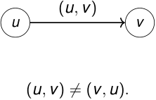

## Definición 

Un digrafo es un grafo donde las aristas tienen dirección. Escribimos 

_D_ = ( _V , A_ ) _._ 

Cada arco es un par ordenado: 

( _u, v_ ) _∈ A_ ( _D_ ) _._ 

<!-- Start of picture text -->
( u, v ) u v ( u, v ) ̸  = ( v , u ) . <!-- End of picture text -->

2_do_ Cuatrimestre de 2026 

(DC, FCEyN, UBA) 

DC - FCEyN - UBA 

14 / 67 

Caminos, ciclos y conexidad 

Grafos bipartitos 

Definiciones básicas y notación 

Noción de isomorfismo 

Los grafos como modelos 

