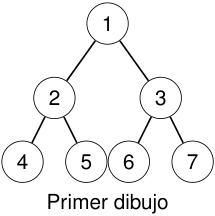
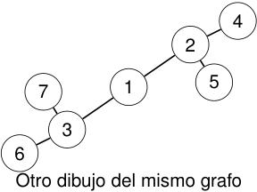

# El dibujo no es el grafo 

<!-- Start of picture text -->
1 2 3 4 5 6 7 Primer dibujo <!-- End of picture text -->

<!-- Start of picture text -->
4 2 7 1 5 3 6 Otro dibujo del mismo grafo <!-- End of picture text -->

### La posición de los vértices en el plano no forma parte de la definición. 

2_do_ Cuatrimestre de 2026 

(DC, FCEyN, UBA) 

DC - FCEyN - UBA 

15 / 67 

Caminos, ciclos y conexidad 

Grafos bipartitos 

Definiciones básicas y notación 

Noción de isomorfismo 

Los grafos como modelos 

