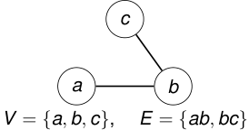

## Grafos iguales 

Dos grafos _G_ y _H_ son iguales si tienen exactamente los mismos vértices y las mismas aristas: 

_V_ ( _G_ ) = _V_ ( _H_ ) y _E_ ( _G_ ) = _E_ ( _H_ ) _._ 

<!-- Start of picture text -->
c a b V =  {a, b, c} , E =  {ab, bc} <!-- End of picture text -->

Cambiar el dibujo no cambia el grafo. Cambiar los nombres de los vértices sí puede cambiarlo. 

2_do_ Cuatrimestre de 2026 

(DC, FCEyN, UBA) 

DC - FCEyN - UBA 

16 / 67 

Caminos, ciclos y conexidad 

Grafos bipartitos 

Definiciones básicas y notación 

Noción de isomorfismo 

Los grafos como modelos 

