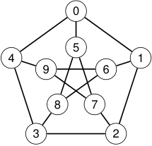
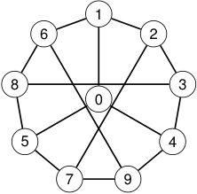

# Ejemplo: dos dibujos del grafo de Petersen 

<!-- Start of picture text -->
0 5 4 1 9 6 8 7 3 2 <!-- End of picture text -->

<!-- Start of picture text -->
1 6 2 8 3 0 5 4 7 9 <!-- End of picture text -->

#### Dibujo clásico 

#### Dibujo con un 9-ciclo 

En ambos casos el conjunto de vértices es _{_ 0 _,_ 1 _, . . . ,_ 9 _}_ , y las adyacencias son las mismas. 

_f_ ( _i_ ) = _i_ (0 _≤ i ≤_ 9) 

es un isomorfismo entre los dos dibujos. 

2_do_ Cuatrimestre de 2026 

(DC, FCEyN, UBA) 

DC - FCEyN - UBA 

18 / 67 

Caminos, ciclos y conexidad 

Grafos bipartitos 

Definiciones básicas y notación 

Noción de isomorfismo 

Los grafos como modelos 

