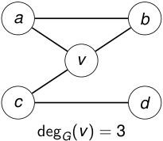

## Definición 

El grado de un vértice _v_ en un grafo _G_ es 

deg _G_ ( _v_ ) = _|{e ∈ E_ ( _G_ ) : _e_ incide en _v }| ._ 

deg _G_ ( _v_ ) = cantidad de aristas que tienen a _v_ como extremo. 

<!-- Start of picture text -->
a b v c d deg G ( v ) = 3 <!-- End of picture text -->

2_do_ Cuatrimestre de 2026 

(DC, FCEyN, UBA) 

DC - FCEyN - UBA 

19 / 67 

Caminos, ciclos y conexidad 

Grafos bipartitos 

Definiciones básicas y notación 

Noción de isomorfismo 

Los grafos como modelos 

