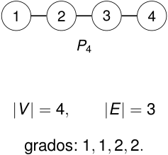
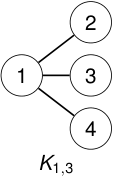
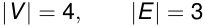

# Ejemplo: mismo _n_ y mismo _m_ , pero no isomorfos 

<!-- Start of picture text -->
1 2 3 4 P 4 |V |  = 4 , |E|  = 3 grados: 1 ,  1 ,  2 ,  2 . <!-- End of picture text -->

<!-- Start of picture text -->
2 1 3 4 K 1 , 3 <!-- End of picture text -->

<!-- Start of picture text -->
|V |  = 4 , |E|  = 3 <!-- End of picture text -->

grados: 1 _,_ 1 _,_ 1 _,_ 3 _._ 

No son isomorfos porque sus secuencias de grados son distintas. 

2_do_ Cuatrimestre de 2026 

(DC, FCEyN, UBA) 

DC - FCEyN - UBA 

21 / 67 

Caminos, ciclos y conexidad 

Grafos bipartitos 

Definiciones básicas y notación 

Noción de isomorfismo 

Los grafos como modelos 

