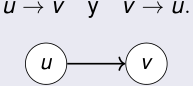

## Grafo orientado 

Para cada par _u, v_ , no pueden aparecer ambos arcos: 

<!-- Start of picture text -->
u → v y v → u. u v <!-- End of picture text -->

2_do_ Cuatrimestre de 2026 

(DC, FCEyN, UBA) 

DC - FCEyN - UBA 

29 / 67 

Caminos, ciclos y conexidad 

Grafos bipartitos 

Definiciones básicas y notación 

Noción de isomorfismo 

Los grafos como modelos 

